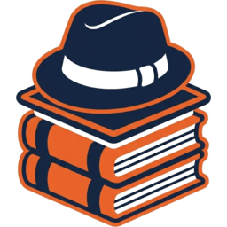

<p align="center">
  
</p>

<h1 align="center">ai-hats</h1>

<p align="center">
  <strong>Role-based multi-harness framework with behavior feedback.</strong>
</p>

<p align="center">
  <em>Configure any agent CLI for a job once, run as many agents as the work needs, and let every session leave evidence behind.</em><br>
  <sub>Do. Reflect. Repeat.</sub>
</p>

<p align="center">
  <a href="https://github.com/muratovv/ai-hats/actions/workflows/ci.yml"></a>
  <a href="LICENSE"></a>
  <a href="https://docs.astral.sh/uv/"></a>
  <a href="#project-status"></a>
  <a href="https://github.com/muratovv/ai-hats/commits/master"></a>
  <a href="https://github.com/muratovv/ai-hats/issues"></a>
</p>

<p align="center">
  
</p>

<p align="center">
  <sub>Reading in another language? Chrome / Edge / Safari Reader Mode translate this site cleanly — no separate translations are maintained.</sub>
</p>

## Why ai-hats?

Have you ever watched the same AI agent step on the same rakes across projects? Forgetting your conventions, skipping the planning step, falling back to the same anti-pattern. Copy-pasting `CLAUDE.md` doesn't scale: edits drift across projects, and a fix in one rarely makes it back to the others. And when a lesson *is* learned, nothing decides whether it was worth keeping — memory files grow until nobody reads them.

ai-hats answers this in four parts.

- **Role-based.** A role is one uniform way to configure a harness for a job — an SRE, a technical writer, a Go developer. It sets more than the opening context: the runtime comes with it. Hooks that fire on the agent's tool calls, consent gates that turn a destructive command into a question, the skills it may reach for. Terms and the composition model — [glossary](docs/glossary.md), [architecture](docs/ARCHITECTURE.md).
- **Multi-harness.** ai-hats levels the role systems of different agent CLIs into a single set. You stop asking how a job is expressed in harness X: describe it once, and it is delivered in each harness's own dialect. See [harnesses](#harnesses) below.
- **Framework, multi-scale out of the box.** Want five Claude developers, two SREs and a technical writer running at once? No problem — the agents don't collide, they compound. Each works in an isolated git worktree, they share context through the `rack` backlog instead of over each other's heads, and the feedback below improves the roles all of them run on. Worktree workflow — [how-to-advanced §2](docs/how-to-advanced.md); backlog — [how-to-hatrack](docs/how-to-hatrack.md).
- **Behavior feedback.** A session is not a black box: it is scored, measured, and can be behavior-tested. An edit to a role is settled by an A/B experiment rather than by argument, and what the agent learns reaches the next prompt only after it is proven — not when it is guessed. The loop — [how-to-feedback-loop](docs/how-to-feedback-loop.md); experiments — [how-to-experiments](docs/how-to-experiments.md).

The first three are the runtime; the fourth is the loop that changes it.

<!-- TODO(HATS-1950 S2): встроить композитную диаграмму assets/diagrams/runtime-and-loop.svg — runtime (роль-композиция · пять поверхностей · обвязка) | feedback loop -->

## Quick start

**Prerequisite:** [uv](https://docs.astral.sh/uv/) is the single host requirement — the env engine that also provisions Python. The one-command install auto-installs it if absent.

```bash
cd ~/dev/my-project     # run this from the project you want to wire

curl -LsSf https://github.com/muratovv/ai-hats/raw/master/scripts/bootstrap.sh | bash -s -- -r assistant -p claude
```

One command, three steps: it installs the `ai-hats` launcher into `~/.local/bin/`, creates the managed venv, and initializes this project. If it warns that `~/.local/bin` is not on your `$PATH`, add it and reopen the shell — otherwise the next command won't resolve:

```bash
ai-hats                 # start a session with the composed role
```

No uv yet and just want a look? `uvx ai-hats self init` wires a single project from the published release without installing anything permanent. Other install paths, overlay recipes, and out-of-band repair — [how-to](docs/how-to.md); the full setup walkthrough, including the interactive wizard — [how-to-configure](docs/how-to-configure.md).

## Harnesses

Harnesses are discovered through the `ai_hats.providers` entry point — an open registry, so a package outside this repo can add one. These ship in-tree:

| Harness    | Agent CLI            |
| ---------- | -------------------- |
| `claude`   | Claude Code          |
| `agy`      | Antigravity / Gemini |
| `cline`    | Cline                |
| `codex`    | Codex                |
| `opencode` | opencode             |

`gemini` is an accepted alias for `agy`. Support is not uniform: runtime hooks, transcript-backed observability, sub-agents and the consent gate each land differently per harness.

<!-- TODO(HATS-1950 S3): ссылка на матрицу статуса поддержки docs/surfaces.md — «per-capability support matrix» -->

Ask your own host what it has: `ai-hats list providers`.

## Roles

A role is picked at init and switched any time with `ai-hats config set -r <role>`. The ones you are most likely to start from:

| Role                                | Takes the job of                      |
| ----------------------------------- | ------------------------------------- |
| `assistant`                         | a general-purpose default             |
| `dev-python` · `go-dev` · `dev-web` | development in one language           |
| `architect`                         | design and interface decisions        |
| `sre`                               | operations, incidents, infrastructure |
| `tech-writer`                       | documentation and prose               |
| `maintainer`                        | repo upkeep, reviews, releases        |

`ai-hats list roles` prints the full set, including the ones the engine runs for itself — the session reviewer and the judges behind the feedback loop. Composing your own, or overriding a shipped one — [how-to-extend](docs/how-to-extend.md).

## CLI

```bash
ai-hats self init                  # wire a project — interactive wizard
ai-hats self update                # update the tool, self-healing
ai-hats                            # session with current settings
ai-hats -p claude -r sre           # override harness and role for one run
```

Everything else is discoverable from the tool itself: `ai-hats --tree` prints the whole command tree, `ai-hats --tree wt` one subtree of it. The backlog is a separate CLI — `rack`.

## Customization

The shipped library splits into `core/` (engine fundament) and `usage/` (curated content). You change behavior by composing or replacing roles rather than editing core code — add your own role, override a built-in like `session-reviewer`, point ai-hats at an external library repo, or ship a role as a one-liner shell alias. Recipes and the override-precedence chain — [how-to-extend](docs/how-to-extend.md).

Every document in the repo is cataloged in [docs/INDEX.md](docs/INDEX.md).

## Project status

**Beta.** Until `v1.0.0` the version reads `0.MAJOR.MINOR`: a breaking change lands on a MAJOR bump and ships with a migration guide; MINOR is additive or fix-only. See [Releases](https://github.com/muratovv/ai-hats/releases) and [CHANGELOG.md](CHANGELOG.md).

## Contributing

See [CONTRIBUTING.md](CONTRIBUTING.md) — development setup, library layout, diagram house style. Security policy: [SECURITY.md](SECURITY.md). License: [MIT](LICENSE).
