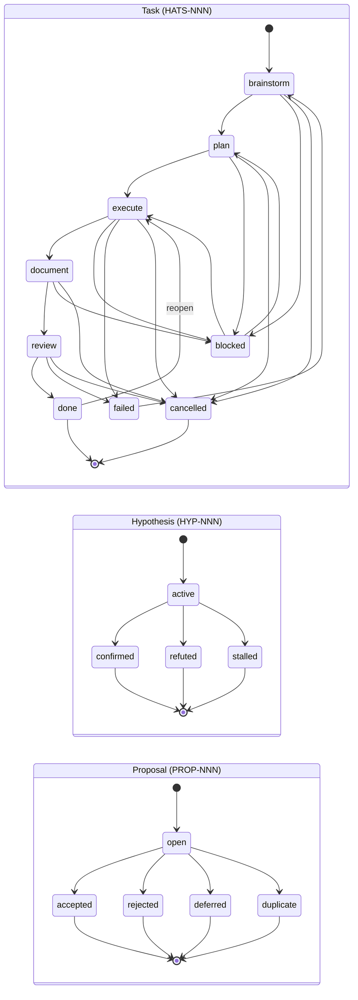
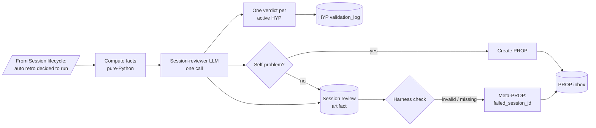
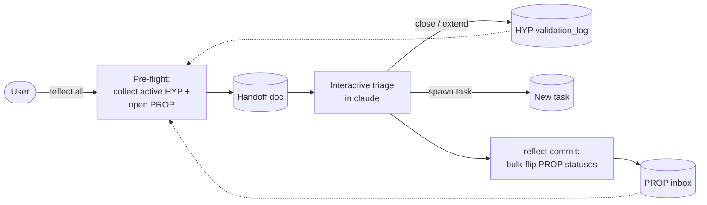

# Architecture

Internal model of ai-hats: components, composition rules, project layout, library structure.

## Component model

| Компонент | Описание | Формат |
|-----------|----------|--------|
| **Rules** | Поведенческие директивы | `rule.md` + `metadata.yaml` |
| **Skills** | Навыки с реализацией | `SKILL.md` + `metadata.yaml` + `scripts/` + `references/` |
| **Traits** | Составные компоненты | `config.yaml` (composition + injection) |
| **Roles** | Корневые конфигурации | `config.yaml` (traits + priorities + injection) |

### Кастомизация ролей

Можно добавлять/убирать трейты, правила и скиллы из библиотечной роли без модификации исходного конфига. Кастомизации хранятся в `ai-hats.yaml` и переживают `ai-hats self update` и `ai-hats self bump`.

> Подборка типовых сценариев с готовыми примерами `ai-hats.yaml` — см. [how-to.md](how-to.md).

```bash
# Добавить трейт к роли sre
ai-hats config customize sre --add-trait dev::python

# Убрать ненужный скилл
ai-hats config customize sre --remove-skill network-documentation

# Добавить инжекцию
ai-hats config customize sre --injection-append "Always use k9s for K8s."

# Посмотреть кастомизации
ai-hats config customize sre --show

# Применить
ai-hats self bump
```

Формат в `ai-hats.yaml`:

```yaml
customizations:
  sre:
    add:
      traits: [dev::python]
      skills: [my-debug-tool]
    remove:
      skills: [network-documentation]
    injection_append: |
      Always use k9s for K8s.
```

Кастомизации применяются при каждом `config set`, `self bump` и `--role` override. Если `remove` ссылается на компонент, которого нет в базовой роли — выводится warning, ошибки не будет.

### Композиция

- Non-commutative — порядок определяет приоритет (поздний > ранний)
- Плоская — трейты не включают другие трейты (flat model)
- Дедупликация — одинаковые injection/rules не повторяются
- Пространства имён — `dev::python` → `dev/python` на FS
- Приоритеты — только из корневой роли

#### Composition flow

От роли до материализованного prompt'а — единый pipeline, развилка только на последнем шаге (куда уходит результат):

```mermaid
flowchart LR
  Role[Role config] --> OverlayPre{Overlay:<br/>add / remove?}
  OverlayPre -->|patch traits / rules /<br/>skills lists| Augment[Augmented<br/>role config]
  OverlayPre -->|none| Augment
  Augment --> ResolveT[Resolve traits<br/>depth-first, pre-order]
  ResolveT --> Dedup[Collect rules + skills +<br/>injections, dedup by name]
  Augment --> ResolveR[Resolve role's own<br/>rules + skills]
  ResolveR --> Dedup
  Dedup --> InjectRole[Append role injection<br/>highest priority]
  InjectRole --> OverlayPost{Overlay:<br/>injection_append?}
  OverlayPost -->|append text| Final[Final composition]
  OverlayPost -->|none| Final
  Final --> Mat{Materialize}
  Mat -->|persistent| Disk[(CLAUDE.md / GEMINI.md<br/>on disk)]
  Mat -->|ephemeral| Inline[--system-prompt-file<br/>sub-agent / override]
  Disk -.read on launch.-> CLI[Provider CLI]
  Inline -.passed as flag.-> CLI
```



Overlay из `ai-hats.yaml.customizations` влияет на pipeline в двух точках: `add` / `remove` патчит списки компонентов до резолва, а `injection_append` дописывается последним — после собственной инжекции роли. Дедупликация идёт во время резолва: трейты собираются первыми (depth-first), правила и скиллы роли добавляются поверх, повторы по имени игнорируются.

- **Disk materialization** — основной путь: `ai-hats self bump` пишет `CLAUDE.md` / `GEMINI.md` в корень проекта, провайдер-CLI подхватывает автоматически на старте сессии.
- **In-prompt materialization** — для sub-agents и одноразовых ролей: та же композиция идёт во временный файл и передаётся через `--system-prompt-file`, не оседая в репо.

### Провайдеры

- **Gemini** — `GEMINI.md` + `GEMINI_CLI_PROJECT_RULES_PATH`
- **Claude** — `CLAUDE.md`

Переключение между провайдерами: `ai-hats config set -p claude`. При запуске сессии prompt автоматически пересобирается если провайдер изменился.

## Session lifecycle

Когда пользователь запускает `ai-hats agent <role>`, runtime открывает интерактивную сессию провайдер-CLI, пишет инкрементальный trace всех request/response и закрывает её finalizer'ом. Ключевая мысль — **сессия неявно завершается ретроспективой** (если включён auto-retro и достигнут порог): это и есть мост к judge cycle, описанному в [Reflection loop](#reflection-loop).

<p align="center">
  
</p>

<!-- Source: docs/assets/diagrams/session-lifecycle.d2 — render: d2 --sketch --theme=200 -->


Узел `Bridge` — переход в auto reflect-session (см. следующую секцию). При `policy=off` или невзятом пороге сессия завершается без LLM-вызова.

## Backlog state machines

Бэклог фреймворка живёт в трёх параллельных state-машинах: задачи (`HATS-NNN`), гипотезы (`HYP-NNN`) и предложения (`PROP-NNN`). Все три управляются через `ai-hats task` CLI и сериализуются в YAML под `.agent/`.



- **Task (`HATS-NNN`)** — единица планируемой работы. Happy path — фиксированный конвейер `brainstorm → plan → execute → document → review → done` без перепрыгивания состояний. Боковые маршруты: `blocked` (можно вернуть в `plan` или `execute`), `failed` (восстанавливается через `brainstorm`), `cancelled` (административное закрытие из любого нетерминального состояния), а из `done` доступен reopen в `execute` для дозакрытия скоупа эпика. При переходе в `plan` создаётся `plan.md` scaffold; work log пишется с session tracking; file-lock защищает от race conditions.
- **Hypothesis (`HYP-NNN`)** — гипотеза о поведении системы или процесса. Висит `active`, пока сессии копят вердикты в `validation_log`; закрывается в `confirmed`, `refuted` или `stalled` по `exit_criteria`. Вердикты пишет reflect-session (см. ниже).
- **Proposal (`PROP-NNN`)** — предложение об улучшении: либо от reflect-session при self-problem, либо вручную. Висит `open` до триажа в `reflect all` → `accepted` / `rejected` / `deferred` / `duplicate`.

### Поиск задач

`--search` принимает regex (case-insensitive) и ищет по id, title, description, tags, parent_task, depends_on:

```bash
ai-hats task list --search epic              # все эпики (по тегу или title)
ai-hats task list --search HATS-092          # эпик + дети (parent_task) + блокируемые им (depends_on)
ai-hats task list --search docs              # всё с упоминанием docs (id/title/desc/tags)
ai-hats task list --search "HATS-09[2-3]"   # regex: два эпика сразу
ai-hats task list --search worktree --all    # включая done/failed
```

## Reflection loop

Каждая сессия становится structured retrospective: pure-Python factual layer (метрики, файлы, коммиты, закрытые задачи) + LLM narrative с вердиктами по активным HYP и голосами по PROP. Auto-retro триггерится `session_end` хуком по политике `off | always | smart | hint`.

Цикл из двух частей: **auto reflect-session** (на каждую сессию) кормит HYP log и PROP inbox; **manual reflect-all** (по инициативе пользователя) триажит накопленное.

### Auto reflect-session (per session)

Запускается после `session_end` при `policy ∈ {always, smart}` и достигнутом пороге. Один LLM-вызов в роли session-reviewer; на выходе — verdicts на каждую active HYP и опц. self-problem PROP. Постоянные артефакты — HYP `validation_log` и PROP inbox — становятся входом для manual триажа.



### Manual reflect-all (triage)

Когда HYP'ов и PROP'ов накопилось — пользователь запускает `ai-hats reflect all`. Pre-flight собирает handoff из активных HYP и открытых PROP, дальше — интерактивный чат, в конце `reflect commit` массово переключает статусы.



Полный гайд (политики, session-reviewer, manual triage, hypothesis workflow) — см. **[how-to-feedback-loop.md](how-to-feedback-loop.md)**.

## Project structure

```
.agent/                                # Активные компоненты (генерируется)
  rules/                               # Физические копии правил из роли
  skills/                              # Физические копии навыков
  hooks/                               # Hook-скрипты
  backlog/
    tasks/<ID>/                        # Task card + plan.md + retrospective.md
    proposals/PROP-NNN.yaml            # Improvement proposals (см. task proposal)
  STATE.md                             # Табличный индекс + текущее состояние задач
  hypotheses/HYP-NNN.yaml              # Hypothesis backlog (см. task hyp)
  retrospectives/
    sessions/<id>.md                   # SessionReviewV1 (facts + narrative + HYP verdicts + PROP actions)
<ai_hats_dir>/sessions/runs/
  session_<ID>/                        # trace.log, audit.md, metrics.json, transcript.txt
ai-hats.yaml                           # Конфиг проекта + роль + feedback
GEMINI.md / CLAUDE.md                  # System prompt
```

## Library layout

```
src/ai_hats/libraries/
  rules/          global_rule_*, dev_rule_*, env_rule_*
  skills/         62 скилла (29 нативных + 33 vendored golang-* из samber/cc-skills-golang)
  traits/         trait-base, trait-agent, trait-se-mindset, skill-engineer, dev::go-*, dev::python, dev::shell, env::*
  roles/          assistant, test-agent, architect, sre, session-reviewer, go-dev, go-dev-full
```

Vendored golang-* skills хранят upstream commit SHA, LICENSE и atribution в `metadata.yaml.upstream.*` — фундамент для будущей плагинной системы (см. HATS-050).

### Шаблон скилла

Каждый скилл следует каноническому формату (см. `skill-template`):

```markdown
# Skill Name
One-line purpose.

## When to Use         ← триггеры активации
## <Main Section>      ← Procedure | Checklist | Workflow | Conventions
## Completion          ← критерии завершения
## Anti-Patterns       ← типичные ошибки
```

Паттерны: `protocol`, `checklist`, `orchestrator`, `reference`, `template`.
Метаданные: `metadata.yaml` (name, description, author, tags, pattern).

Скилл может опционально декларировать **git-хуки**, которые автоматически
устанавливаются в `.githooks/` при сборке роли (HATS-088):

```yaml
# <skill>/metadata.yaml
git_hooks:
  pre-commit:
    - git_hooks/check.sh   # путь относительно директории скилла
```

Сборщик копирует скрипты в `.githooks/<event>.d/<skill>-<basename>`,
генерирует диспетчер `.githooks/<event>` и выставляет
`core.hooksPath = .githooks` идемпотентно. Если у пользователя уже
настроен `core.hooksPath` или существует свой dispatcher без нашего
маркера — они не трогаются, выводится предупреждение с инструкцией.

### Пример config.yaml роли

```yaml
name: assistant
priorities:
  - Reliability
  - Cleanliness
  - Velocity
composition:
  traits:
    - trait-base
    - trait-agent
    - dev::python
  rules:
    - dev_rule_git_workflow
  skills:
    - backlog-manager
    - git-mastery
injection: |
  # ROLE: PRIMARY AUTOMATION ASSISTANT
  ...
```
