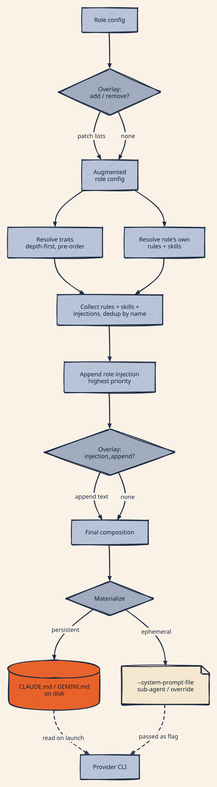
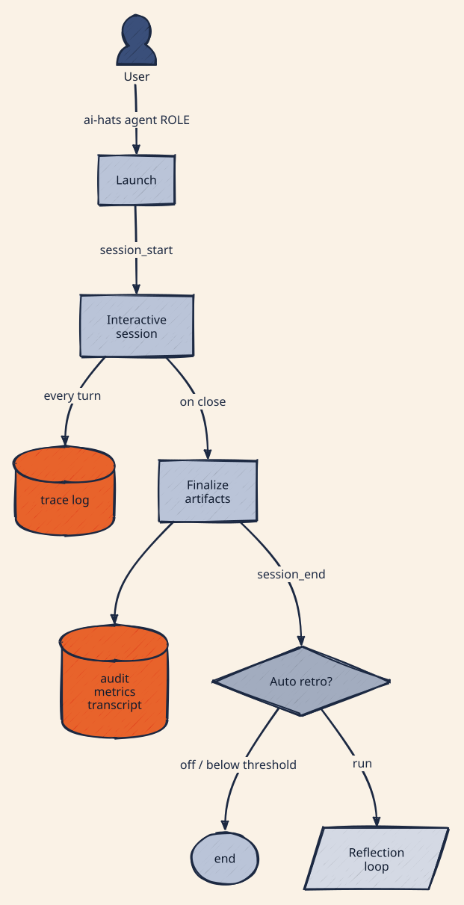
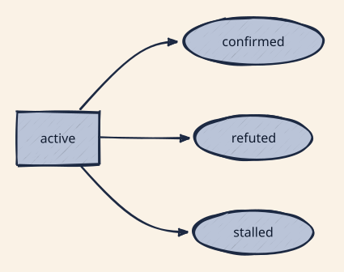
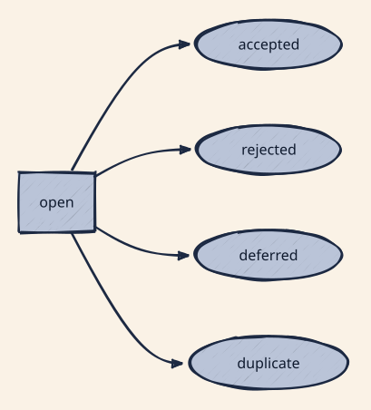
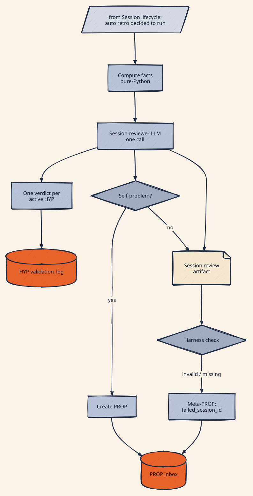
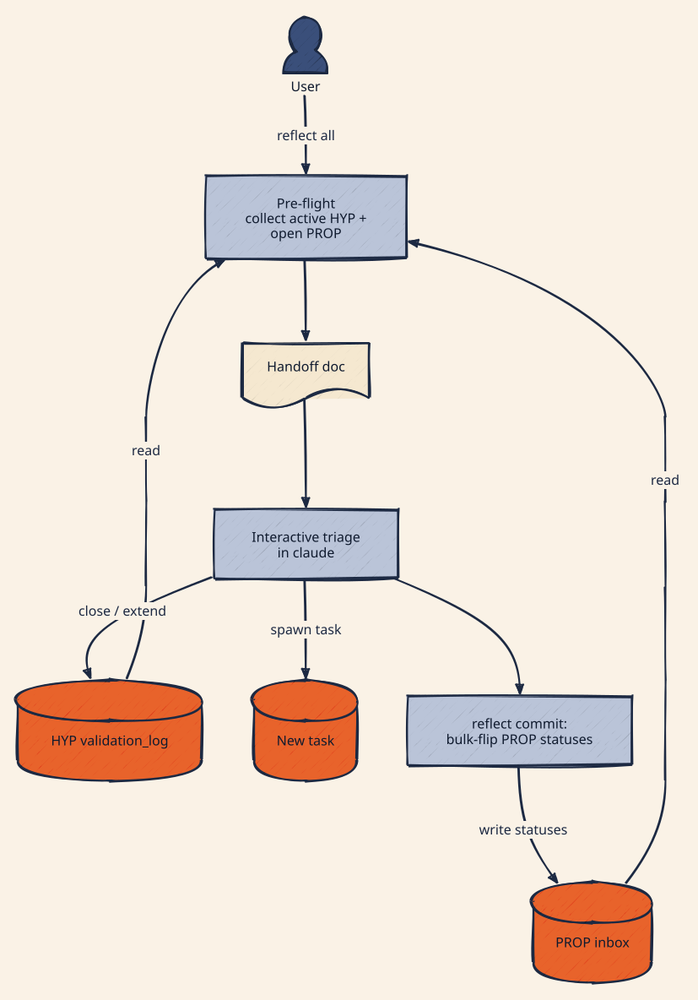
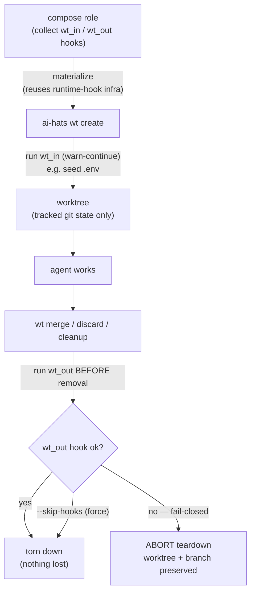

# Architecture

Internal model of ai-hats: components, composition rules, project layout, library structure.

## Component model

| Component  | Description                      | Format                                                    |
| ---------- | -------------------------------- | --------------------------------------------------------- |
| **Rules**  | Behavioral directives            | `rule.md`                                                 |
| **Skills** | Capabilities with implementation | `SKILL.md` + `metadata.yaml` + `scripts/` + `references/` |
| **Traits** | Composite components             | `config.yaml` (composition + injection)                   |
| **Roles**  | Root configurations              | `config.yaml` (traits + priorities + injection)           |

### Role customization

You can add or remove traits, rules, and skills from a library role without modifying the source config. Customizations live in `ai-hats.yaml` and survive `ai-hats self update` and `ai-hats self init`.

> A collection of common scenarios with ready-to-use `ai-hats.yaml` examples — see [1].

```bash
# Add a trait to the sre role
ai-hats config customize sre --add-trait dev::python

# Remove an unneeded skill
ai-hats config customize sre --remove-skill network-documentation

# Append an injection
ai-hats config customize sre --injection-append "Always use k9s for K8s."

# Inspect customizations
ai-hats config customize sre --show

# Apply
ai-hats self init
```

Format in `ai-hats.yaml`:

```yaml
customizations:
  sre:
    add:
      traits: [dev::python]
      skills: [my-debug-tool]
    remove:
      skills: [network-documentation]
    injection_append: |
      Always use k9s for K8s.
```

Customizations apply on every `config set`, `self init`, and `--role` override. If `remove` references a component not in the base role — a warning is printed; this is not an error.

### Composition

- Non-commutative — order determines priority (later > earlier)
- Flat — traits do not include other traits (flat model)
- Deduplication — identical injections/rules are not repeated
- Namespaces — `dev::python` → `dev/python` on the FS
- Priorities — only from the root role

#### Composition flow

From role to materialized prompt — a single pipeline; the split happens only at the last step (where the result is delivered):

<p align="center">
  
</p>

<!-- Source: docs/assets/diagrams/composition-flow.d2 — render: docs/assets/diagrams/render.sh -->

The overlays apply in order `[global, project, runtime]`: global customizations (`~/.ai-hats/customizations.yaml`) first, project customizations (`ai-hats.yaml`) second, and ephemeral runtime role specs (`-r "maintainer + leader"`, HATS-1456) last. Overlay `add` / `remove` patches component lists before resolution, and `injection_append` is appended last — after the role's own injection. Deduplication happens during resolution: traits are collected first (depth-first), then the role's own rules and skills are added on top; duplicates by name are ignored (first-wins).

<a id="materialization"></a>

### Materialization — where the composition actually goes

Two different moments, and conflating them is the usual source of confusion:

**1. Config → artifact, at `ai-hats self init` / `ai-hats config set`.** Validates
and delta-writes `ai-hats.yaml`, runs migrations, creates the `<ai_hats_dir>`
scaffold, manages `.gitignore`, and installs git hooks. It writes a project-root
prompt file for **agy only** — the AI-HATS-managed block in `./GEMINI.md`, which
the Antigravity CLI reads natively. Claude and cline write nothing to the project
root (ADR-0018 / HATS-1170).

**2. Session launch.** The role is composed **in memory, per session** — framework
rules and skills are never materialized into the canonical tree — and the
artifacts are written to a per-session dir **outside the project**:
`<cache_root>/sessions/<sid>/`, then handed to the surface by flag (`<cache>` in
the table below is that dir):

| Surface    | Context                                       | Skills                          | Hooks                                         |
| ---------- | --------------------------------------------- | ------------------------------- | --------------------------------------------- |
| **claude** | `--system-prompt-file <cache>/prompt.md`      | `--plugin-dir <cache>/plugin`   | `--settings <cache>/settings.json` (additive) |
| **agy**    | `--add-dir <cache>/rules` (`rules/GEMINI.md`) | `<cache>/rules/.agents/skills/` | `<cache>/hooks.json` + global dispatcher      |
| **cline**  | `--config <cache>`                            | `<cache>/skills`                | `<cache>`                                     |

**The cache is not in the workspace** (HATS-1398). `<cache_root>` resolves to
`$AI_HATS_CACHE_HOME` → `$XDG_CACHE_HOME/ai-hats` → `~/.cache/ai-hats`, plus a
per-project subdir keyed `<dirname>-<sha256(abs path)[:8]>` — so two checkouts
sharing a basename never collide. It also holds the update-check probe mirror
and `update-check.json`. Everything under it is machine-only, regenerable and
never versioned; keeping it out of the project spares the watchers, `git status`
runs, greps and indexers that a project tree pays for. Resolvers: `cache_home()`
/ `project_key()` / `cache_root()` in `src/ai_hats/paths/_dirs.py`.

**What this means in practice.** Nothing about a composition change needs a
command. `ai-hats.yaml` is re-read and the role re-composed at every launch, so
editing a `SKILL.md` body, swapping a role, or adding a customization all land
on the next session by themselves. `self init` is for step 1 above — validating
the config and refreshing the project scaffold — not for making composition
changes take effect. There is no permanent skill mirror at
`.claude/skills/` (retired in HATS-294) and none at
`<ai_hats_dir>/library/skills/` — that directory is the landing spot for
components **you** author locally, not an export of the installed library.

Design record: [ADR-0018](adr/0018-unified-artifact-builder.md). The consolidated surface-materialization map — storage roots, write points, hooks integration, cache, cleanup — lives in [ADR-0021](adr/0021-surface-materialization.md).

Switching providers: `ai-hats config set -p claude`.

## Session lifecycle

When a user runs `ai-hats agent <role>`, the runtime opens an interactive provider-CLI session, writes an incremental trace of every request/response, and closes it via a finalizer. The key idea — **a session implicitly ends with a retrospective** (if auto-retro is enabled and the threshold is met): that's the bridge to the judge cycle described in [Reflection loop](#reflection-loop).

<p align="center">
  
</p>

<!-- Source: docs/assets/diagrams/session-lifecycle.d2 — render: d2 --sketch --theme=200 -->

The `Bridge` node — entry into auto reflect-session (see the next section). When `policy=off` or the threshold is not met, the session ends without an LLM call.

**Sample artifacts** (synthetic, realistic shape): the per-session disk layout after `session_end` — audit log [2], metrics [3], and transcript [4]. Field reference — [5].

## Backlog state machines

The framework's backlog lives in three parallel state machines: tasks (`HATS-NNN`), hypotheses (`HYP-NNN`), and proposals (`PROP-NNN`). All three are managed through the `rack` CLI and serialized as YAML under `.agent/`.

<p align="center">
  
  <br><sub><b>Task (HATS-NNN)</b></sub>
</p>

<p align="center">
  
  <br><sub><b>Hypothesis (HYP-NNN)</b></sub>
</p>

<p align="center">
  
  <br><sub><b>Proposal (PROP-NNN)</b></sub>
</p>

<!-- Sources: docs/assets/diagrams/backlog-{task,hyp,prop}-fsm.d2 -->

- **Task (`HATS-NNN`)** — a unit of planned work. Happy path — the fixed pipeline `brainstorm → plan → execute → document → review → done` without skipping states. Side routes: `blocked` (returnable to `plan` or `execute`), `failed` (recoverable via `brainstorm`), `cancelled` (administrative close from any non-terminal state), from `review` a rework path back to `execute` for addressing review comments (no worktree merge, unlike `review → done`), and from `done` a reopen path to `execute` is available for finishing epic scope. Shortcut: `rack transition <id> --state done --force --reason "..."` fast-closes a `brainstorm`/`plan` task straight to `done` when the work shipped on master (no worktree theatre). `--force` relaxes the FSM arrow **only**, requires a reason, and journals it; it does not relax the `->done` gate, which covers every road into `done`. Cross-references between cards are typed links — `parent_task`, `depends_on`, `related`, `see_also`, `folded_into`, and the derived `children` and `blocks` — managed via `rack transition <id> --link <kind>:<id>`. On the transition to `plan` a `plan.md` scaffold is created. Consent is not part of rack: a HITL session compiles its role's `apps.consent_gate` operations and selectors into session-local wrappers for the canonical `rack` and `ai-hats` commands (ADR-0030). The runtime guard asks the user and blocks self-grant; the wrapper consumes a grant, legacy launch acknowledgement or one-shot ticket before spawning the original executable. One wrapper decision covers the complete top-level command, including nested worktree effects, and records its use in the bypass journal. `--force` cannot evade this external match. Unsupported provider surfaces fail before the agent starts rather than exposing an unwrapped command.
- **Hypothesis (`HYP-NNN`)** — a claim about system or process behavior. Stays `active` while sessions accumulate verdicts in `validation_log`; closes into `confirmed`, `refuted`, or `stalled` per `exit_criteria`.
- **Proposal (`PROP-NNN`)** — an improvement suggestion: either from reflect-session on self-problem, or filed by hand. Stays `open` until triaged in `reflect hypothesis` → `accepted` / `rejected` / `deferred` / `duplicate`.

### Searching tasks

Finding cards and explaining one are different verbs. `rack ls` filters a flat scan; `rack ls <ID> --deep N` walks the link graph out from a card; `rack context <ID>` returns the full package for one.

Reach for an exact filter first — `--tag`, `--state`, `--parent` match a field outright. `--grep` is the fallback for when all you have is a word, and it is the least precise of the set.

```bash
rack ls --tag epic                    # all epics (by tag)
rack ls --state execute               # exact state match
rack ls --parent HATS-092             # direct children of an epic
rack ls --grep docs                   # case-insensitive SUBSTRING over title + description
rack ls --grep id:HATS-092            # …or over ONE field: id, title, description
rack ls --state done --all            # terminal cards too, without the 30-row cap
rack ls HATS-092 --deep 1             # epic + children + cards depending on it
rack ls HATS-092 --deep 1 --link parent_task   # follow one edge kind only
```

`--grep` is a literal substring, not a regex. Bare, it searches title + description — so an id-shaped needle finds the cards that *mention* an id, not the ones that *have* it; `id:` picks the haystack instead. An unknown prefix stays literal, so a `path.py:42` needle still works. Filters are read-tolerant: a card lacking the field is excluded rather than erroring.

## Reflection loop

Every session becomes a structured retrospective: a pure-Python factual layer (metrics, files, commits, closed tasks) plus an LLM narrative with verdicts on active HYPs and votes on PROPs. Auto-retro is triggered by the `session_end` hook per the `off | always | smart | hint` policy.

The cycle has two parts: **auto reflect-session** (per session) feeds the HYP log and PROP inbox; **manual reflect hypothesis** (user-initiated, two-phase) triages the accumulated backlog.

**Sample artifacts** (synthetic, realistic shape): one `hats-session-review/v1` markdown [6], one hypothesis with an append-only `validation_log` [7], and one proposal with co-sign `votes[]` [8]. Field reference for both fixture trees — [9].

### Auto reflect-session (per session)

Triggered after `session_end` when `policy ∈ {always, smart}` and the threshold is met. One LLM call in the session-reviewer role; the output is verdicts on every active HYP and an optional self-problem PROP. The persistent artifacts — HYP `validation_log` and PROP inbox — become inputs to manual triage.

<p align="center">
  
</p>

<!-- Source: docs/assets/diagrams/auto-reflect-session.d2 -->

### Manual reflect hypothesis (triage)

When HYPs and PROPs have piled up — the user runs `ai-hats reflect hypothesis`. Triage runs in two phases (ADR-0007 / HATS-513): Phase 1 (`judge-auditor`, read-only audit) produces a draft report with proposed verdicts and mutations, and Phase 2 (`judge`, HITL) discusses the draft with the supervisor, ack's mutations, and bulk-commits status updates.

<p align="center">
  
</p>

<!-- Source: docs/assets/diagrams/manual-reflect-all.d2 -->

Full guide (policies, session-reviewer, manual triage, hypothesis workflow) — see [10].

## Project structure

```
.agent/                                # Active components (generated)
  rules/                               # Physical copies of rules from the role
  skills/                              # Physical copies of skills
  hooks/                               # Hook scripts
  backlog/
    tasks/<ID>/                        # Task card + plan.md + retrospective.md
    proposals/PROP-NNN.yaml            # Improvement proposals (see `rack proposal`)
  STATE.md                             # Tabular index + current task state
  hypotheses/HYP-NNN.yaml              # Hypothesis backlog (see `rack hyp`)
  retrospectives/
    sessions/<id>.md                   # SessionReviewV1 (facts + narrative + HYP verdicts + PROP actions)
<ai_hats_dir>/sessions/runs/
  session_<ID>/                        # trace.log, audit.md, metrics.json, transcript.txt, meta_prompt.txt
ai-hats.yaml                           # Project config + role + feedback
GEMINI.md                              # agy only — managed block; see Materialization
```

## Library layout

The shipped library is split into two layers, both shipped as the installed `ai_hats_library` package (sourced from `packages/ai-hats-library/src/ai_hats_library/`):

```
ai_hats_library/
  core/                              # engine fundament — required at runtime
    roles/          initial-wizard, session-reviewer, judge-auditor, judge, role-judge, role-auditor, hypothesis-intake, test-agent
    traits/         trait-base, trait-agent, trait-analyst-base, base-judge, base-auditor, trait-reflect-mode
    rules/          global_rule_*, rule_backlog_discipline, dev_rule_comment_discipline, dev_rule_tool_call_hygiene
    skills/         hatrack, backlog-create, context-*, review-*, judge-*, role-coherence-protocol, request-supervisor, ...
    pipelines/      execute, human, reflect-{session,role,all,hypothesis-phase1,hypothesis-phase2,issue}
    initial_injections/   initial-wizard, reflect-all, reflect-role, reflect-hypothesis, reflect-hypothesis-interactive
    templates/      githooks/ (dispatcher + managed hook scripts)
  usage/                             # curated content catalog — opt-in
    roles/          assistant, dev-python, dev-web, maintainer, architect, sre, go-dev, go-dev-full, tech-writer
    traits/         trait-se-mindset, trait-researcher-mindset, skill-engineer, dev::python, dev::shell, dev::go-*, env::proxmox
    rules/          dev_rule_secure_coding, env_rule_proxmox_infra
    skills/         55+ skills (golang-*, terraform, ansible, observability, system-design, ...)
```

The `core/` vs `usage/` split is informational; both are loaded by `Assembler._build_library_paths`. User overrides layer on top via `~/.ai-hats/`, `~/.ai-hats/library_paths.yaml`, `ai-hats.yaml: library_paths`, and `<project>/libraries/` — see [11].

Vendored golang-* skills carry the upstream commit SHA, LICENSE, and attribution in `metadata.yaml.upstream.*` — the foundation for a future plugin system (see HATS-050).

### Skill template

Every skill follows the canonical format (see `skill-template`):

```markdown
# Skill Name

One-line purpose.

## When to Use ← activation triggers

## <Main Section> ← Procedure | Checklist | Workflow | Conventions

## Completion ← completion criteria

## Anti-Patterns ← common mistakes
```

Patterns: `protocol`, `checklist`, `orchestrator`, `reference`, `template`.
Metadata: `metadata.yaml` (name, description, author, tags, pattern).

A skill may optionally declare **git hooks** in its `SKILL.md` frontmatter
(under the top-level `ai_hats:` key, alongside `runtime_hooks` and `worktree`),
installed automatically into `.githooks/` when the role is built (HATS-088):

```yaml
# <skill>/SKILL.md frontmatter
ai_hats:
  git_hooks:
    pre-commit:
      - git_hooks/check.sh   # path relative to the skill directory
```

`ai-hats init` generates a dispatcher at `.githooks/<event>` and sets
`core.hooksPath` to that directory's **absolute** path, idempotently — a
relative value would be resolved against whichever working tree git runs in,
leaving every linked worktree ungated. Nothing is copied: the dispatcher asks
the composition for the event's gates at commit time and runs them in place
(ADR-0020 D3), so a `self update` needs no re-materialization step. If the user
has already configured a `core.hooksPath` or has their own dispatcher without
our marker — those are not touched; a warning with instructions is printed.

### Skill ↔ tool dependencies (`requires`, ADR-0016)

A skill is portable content that *uses* a tool, so the dependency arrow points
from the skill to the tool — never the reverse. A skill declares the tools it
needs in the same `ai_hats:` frontmatter block, provider-neutral:

```yaml
# <skill>/SKILL.md frontmatter
ai_hats:
  requires:
    cli:
      - name: ai-hats-rack
        check: "rack --help"                 # presence probe
        hint: "pip install ai-hats-rack"     # actionable install guidance
    mcp: []                                   # neutral command/args/env/transport
```

ai-hats verifies `requires` at compose/session time and **warns** with the
`hint` — it never auto-installs. The engine that satisfies a `requires.cli` is a
*provided tool*, installed on `PATH` as an ordinary console entry (e.g.
`ai-hats-rack` exposes a `rack` `[project.scripts]` entry). Engine-owned skills bind
to their engine via `requires`, **not** by physical co-location inside the engine
package: `hatrack` stays in the library content layer and declares
`requires.cli: ai-hats-rack`; `ai-hats-rack` ships no skill. The
`ai_hats.skills` entry-point registry remains the discovery seam for out-of-tree
skill sources (third-party skill packages).

### Shared-state guard (HATS-437)

Some operations write shared state with no undo path — `gh pr merge` and
`git push --force` chief among them. The framework defends against
autonomous invocations in two layers:

1. **Rule** `rule_pause_before_shared_state_write` — injected
   via `trait-agent` into every agent role so it ships inline in the provider system prompt
   on every session. Requires the agent to pause and name the command
   before any shared-state write (PR/issue/release/push/TaskCreate), and
   forbids chaining such commands with other Bash calls in one
   invocation.

2. **Deterministic hooks** on the irreversible subset:
   - `pre_bash_shared_state_guard.sh` — Claude Code PreToolUse hook (in session tree plugin skills).
     Wired into session settings.json by `ClaudeSurface.build_session_artifacts()`.
     Blocks `gh pr merge` and `git push --force` when run without a controlling TTY
     (i.e. agent context).
   - `packages/ai-hats-library/src/ai_hats_library/core/skills/git-mastery/git_hooks/pre-push-shared-state.sh`
     — git pre-push hook installed via the HATS-088 mechanism. Detects
     non-fast-forward pushes and blocks them; branch creations and
     deletions short-circuit so benign cleanup is not affected.

   `AI_HATS_SHARED_STATE_ACK=1` overrides both, but it does NOT reach them the
   same way. The git hook runs inside the `git push` process, so a per-command
   prefix works: `AI_HATS_SHARED_STATE_ACK=1 git push ...`. The PreToolUse hook
   runs *before* the command it judges is a process, so a prefix never reaches
   it (HATS-1294) — it reads the ack from its own environment, set where the
   agent is launched, which pre-approves the whole session. That export stops at
   the session it was given in: a sub-agent is a different session and the launch
   blanks the flag for it (HATS-1743, `constants.BYPASS_FLAGS_NOT_INHERITED`).

**Provider asymmetry.** Gemini CLI has no PreToolUse equivalent, so
Gemini sessions get the rule + the git pre-push hook only — the
`gh pr merge` deterministic block is Claude-only. `ClaudeSurface`
overrides `Surface.ensure_runtime_hooks()` to perform the auto-wire;
`GeminiProvider` keeps the default no-op.

**Skill-declared runtime hooks.** Beyond the built-in guard, any skill can
declare its own `PreToolUse` / `PostToolUse` hooks via `runtime_hooks:` in its
`SKILL.md` frontmatter (`ai_hats:` key); `ensure_runtime_hooks()` materializes
and wires them through the same path (HATS-597/601). See
[how-to-extend.md](how-to-extend.md).

### Worktree lifecycle hooks (HATS-823)

The third hook kind runs at the boundary of an `ai-hats wt` worktree rather than
on git events or tool use. A skill declares `wt_in` / `wt_out` scripts under
`ai_hats.worktree` in its `SKILL.md` frontmatter; they are collected and
materialized exactly like `runtime_hooks` (ADR-0012). `wt_in` seeds gitignored
data *into* a fresh worktree (warn-and-continue); `wt_out` drains it *out* before
any teardown route and is **fail-closed** — a failing drain aborts the teardown so
gitignored data is never silently destroyed, with `--skip-hooks` as the conscious
escape. Credentials are copied *in* freely (same-user co-location) but **never
harvested out** into a persistent backup by construction (creds boundary: ADR-0012 D5). Author-facing contract: [how-to-extend.md](how-to-extend.md#worktree-lifecycle-hooks). Engine architecture & overview: [docs/wt/](wt/README.md).


```mermaid
flowchart TD
    compose["compose role<br/>(collect wt_in / wt_out hooks)"]
    create["ai-hats wt create"]
    wt["worktree<br/>(tracked git state only)"]
    work["agent works"]
    teardown["wt merge / discard / cleanup"]
    drained{"wt_out hook ok?"}
    done["torn down<br/>(nothing lost)"]
    abort["ABORT teardown<br/>worktree + branch preserved"]

    compose -->|"materialize<br/>(reuses runtime-hook infra)"| create
    create -->|"run wt_in (warn-continue)<br/>e.g. seed .env"| wt
    wt --> work --> teardown
    teardown -->|"run wt_out BEFORE removal"| drained
    drained -->|yes| done
    drained -->|"no — fail-closed"| abort
    drained -->|"--skip-hooks (force)"| done
```

### Sample role config.yaml

```yaml
name: assistant
priorities:
  - Reliability
  - Cleanliness
  - Velocity
composition:
  traits:
    - trait-base
    - trait-agent
    - dev::python
  rules:
    - dev_rule_git_workflow
  skills:
    - hatrack
    - git-mastery
injection: |
  # ROLE: PRIMARY AUTOMATION ASSISTANT
  ...
```

## References

**[1]** — [`docs/how-to.md`](how-to.md) — `ai-hats.yaml` overlay recipes (add a skill, change provider, customizations).

**[2]** — [`tests/fixtures/real_session/audit.md`](../tests/fixtures/real_session/audit.md) — synthetic per-session audit log.

**[3]** — [`tests/fixtures/real_session/metrics.json`](../tests/fixtures/real_session/metrics.json) — synthetic per-session metrics file.

**[4]** — [`tests/fixtures/real_session/transcript.txt`](../tests/fixtures/real_session/transcript.txt) — synthetic per-session transcript.

**[5]** — [`tests/fixtures/real_session/README.md`](../tests/fixtures/real_session/README.md) — field reference for the per-session fixture tree.

**[6]** — [`tests/fixtures/real_session/session-review.md`](../tests/fixtures/real_session/session-review.md) — synthetic `hats-session-review/v1` artifact (`hypothesis_verdicts[]`, `proposal_actions[]`, `self_problems[]`).

**[7]** — [`tests/fixtures/real_backlog/HYP-001-sample.yaml`](../tests/fixtures/real_backlog/HYP-001-sample.yaml) — synthetic hypothesis with `validation_log`.

**[8]** — [`tests/fixtures/real_backlog/PROP-001-sample.yaml`](../tests/fixtures/real_backlog/PROP-001-sample.yaml) — synthetic proposal with co-sign `votes[]`.

**[9]** — [`tests/fixtures/real_backlog/README.md`](../tests/fixtures/real_backlog/README.md) — field reference for the backlog fixture tree.

**[10]** — [`docs/how-to-feedback-loop.md`](how-to-feedback-loop.md) — policies, session-reviewer, manual triage, hypothesis workflow.

**[11]** — [`docs/how-to-extend.md`](how-to-extend.md) — library layout, override precedence, recipes for your own roles / traits / rules / skills.
