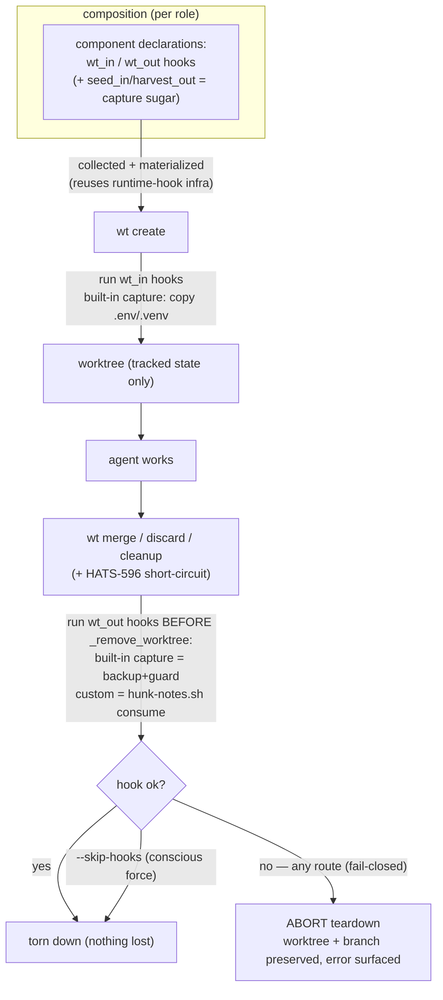

# ADR-0012: Worktree data-transfer — component-declared lifecycle hooks

## Status

Proposed (HATS-821, 2026-06-24). Gates HATS-775 (carry-in) and HATS-818
(carry-out), which become consumers of the single mechanism-implementation task
this ADR names in [Consequences](#consequences). Revised twice: after a
triple-lens internal review (architect / security / quality), then restructured
to **hooks-first** per supervisor review — a worktree lifecycle hook is the
primitive; declarative path-lists are sugar over a built-in capture hook — then
hardened after a failure-mode review (bounded timeout, fail-closed on every
teardown with a single `--skip-hooks` escape, `IsolationMode.NONE` skip), see
D4 + D7.

## Revisions

Two corrections landed at the HATS-823 implementation plan-gate (2026-06-24),
approved by the supervisor. They amend — do not re-litigate — the decisions
below:

1. **`wt_in` / seed run AFTER `git worktree add`, not before (corrects D2/D7).**
   The original "after `mkdtemp()`, before `git worktree add`" sequencing is
   infeasible: `git worktree add` refuses a non-empty target directory (verified,
   git 2.50; even `--force`), so any pre-add seed breaks worktree creation. The
   hook therefore runs once the checkout exists; gitignored seed paths do not
   collide with tracked files. The `wt_in` env contract is unchanged (read
   sources from `$AI_HATS_PROJECT_DIR`, write into `$AI_HATS_WORKTREE_PATH`).
2. **Mechanism task ships the hook primitive only; the built-in `capture` hook
   moves to HATS-775 (revises Consequences "one mechanism task").** The single
   day-one consumer (HATS-818) is a pure custom `wt_out` hook; the built-in
   `capture` (declarative `seed_in` / `harvest_out`, copy/reference, backup+guard,
   merge-time tracked-seed recheck, creds-exclusion) has **no** confirmed consumer
   in the mechanism task — HATS-775 is the first task that needs declarative seed.
   By design-minimalism, HATS-823 ships `wt_in`/`wt_out` custom-script hooks +
   threading + fail-closed teardown + the execution contract (D7) + the trust
   model (D5 for scripts); HATS-775 introduces the built-in `capture` (and decides
   whether the path-list sugar is worth it vs a custom seed hook). `mode: reference`
   is dropped from v1 (no consumer; the tracker shared-read need is already served
   by HATS-524, row 6) and is reconsidered when a real read-only-shared case
   appears. The schema in this ADR (`SeedRule`/`HarvestRule`, the path-list form)
   is therefore HATS-775's deliverable; HATS-823 ships only the `WorktreeHook`
   (custom-script) leaf + the `worktree` container.
3. **Forward-compat of the carry frontmatter (refines the schema spec).** Leaf
   records (`WorktreeHook`, and HATS-775's `SeedRule`/`HarvestRule`) use
   `extra="forbid"` (fail-loud, mirroring `RuntimeHook`); the top-level
   `worktree:` *container* uses `extra="ignore"` + a WARN on unknown keys, so a
   newer skill declaring a future carry kind does not hard-fail composition on an
   older engine (precedent: `HarnessConfig`). The sidecar leak-check
   (`LeftoverSidecarHooksError`) is extended to catch `worktree` in a leftover
   `metadata.yaml`.
4. **Creds reconciliation — `.env` is owned by a secret-aware `wt_in` hook, not
   the dep-seed (HATS-776, 2026-06-25).** The original Resolution map straddled
   `.env*` across row 2 (seeded via the built-in `capture` like any dep) and row 5
   (creds, handled out-of-band) with no reconciliation. HATS-776 settles it: a
   `.env` that carries secrets is owned by a **secret-aware `wt_in` hook**
   (copy-in by default — co-location with the same-user main checkout means a
   worktree copy adds no exfil surface the agent lacks; never harvested out), NOT
   the declarative `seed_in` dep-copy. HATS-775's declarative `seed_in` is
   therefore scoped to **non-secret** deps (`.venv` / `node_modules` / `target`).
   The concrete cred hook lives **downstream** (per D5: "a custom hook handling
   creds owns its policy") — HATS-776 ships only the documentation + the
   never-harvest-secrets constraint D5 binds onto HATS-775's future `harvest_out`.
   Amends D5 + Resolution map rows 2/5 below.
5. **Declarative `capture` shelved — HATS-775 cancelled (2026-06-25).** HATS-775
   (which this ADR named as the owner of the built-in `capture` hook — the
   declarative `seed_in` / `harvest_out` path-lists + the `SeedRule` / `HarvestRule`
   schema) was **cancelled**: after the HATS-776 reconciliation (#4) the declarative
   sugar has **no confirmed consumer** the shipped primitive does not already serve —
   `.env`/secrets go through a custom secret-aware `wt_in` hook (HATS-776, downstream);
   the `.hunk` sidecar through a custom `wt_out` hook (HATS-818); dep dirs
   (`.venv` / `node_modules`) are better seeded by a `wt_in` hook that runs the
   project's install (`uv sync` / `npm ci`) than copied (copy is path-fragile,
   symlink-mutable is rejected, D2/C2); `*.log` harvest is a candidate with no
   confirmed incident (row 4). By design-minimalism (and the over-abstraction caution
   in Alternatives D), the path-list sugar is **shelved, not built** — the `wt_in` /
   `wt_out` **primitive** (HATS-823) plus documented hook patterns
   (`docs/how-to-extend.md`) cover the real cases. **Read every "HATS-775 builds /
   owns `capture`" statement throughout this ADR — the Revisions #2 record above,
   D2, D3, D5, Consequences, the declaration-schema spec, Resolution map rows 1/4,
   Alternatives D — as describing a *shelved design*, not committed work.** The never-harvest-secrets constraint (#4 / D5) is now a
   standing invariant on whoever ever builds `harvest_out`, not a binding on a live
   task. Revive only when a real consumer for declarative seed/harvest appears.

## Context

`ai-hats wt` gives each task or sub-agent its own branch + filesystem working
copy (`ai-hats wt create / merge / discard`, plus the auto-create path in
`ai-hats task transition <id> execute`). `WorktreeManager.create()` populates
that copy with **one thing only**: the base branch's *tracked* git state (via
`git worktree add`, `src/ai_hats/worktree.py`). Anything **gitignored** is, by
construction, absent when the worktree is born and destroyed when it is torn
down.

This is a one-way boundary with a leak in both directions. The class surfaced as
three independent point-tasks, one with *irreversible* loss:

- **carry-OUT, confirmed data loss.** A supervisor reviewed a worktree via hunk,
  left two comments in `<worktree>/.hunk/notes.json`, said "reviewed". The agent
  ran `ai-hats wt merge`; teardown removed the worktree **and** the gitignored
  sidecar. The comments were unrecoverable — recovered only from the
  supervisor's memory (HATS-818). The existing merge guards do not catch this:
  `_check_clean` inspects only *tracked* changes (`git status --porcelain`,
  `worktree.py:1246`), so a gitignored sidecar is invisible to it. Note: the
  hunk tooling *already* has a `consume` step that backs the sidecar up to
  `/tmp/review/<wtid>` (`~/.config/hunk/scripts/hunk-notes.sh`, DOTS-157) — it
  simply never ran before teardown.
- **carry-IN.** A fresh worktree inherits no `.venv` / `node_modules` / `target`
  and no `.env*` — the agent reinstalls and re-configures from scratch
  (HATS-775); credentials / kubeconfig / tokens are likewise absent (HATS-776).

Three tasks each patching one slice invites three subtly-different
implementations. An independent multi-agent sweep of the backlog, code, and
retrospectives (HATS-821 plan, Step 2) enumerated the **full** class and — after
an adversarial completeness pass — found that **three** instances genuinely need
a new mechanism (a fourth is a candidate, not a confirmed incident); the rest are
already solved, owned by another design, or doc-fixes. The complete enumeration
is the [Resolution map](#resolution-map) below.

## Decision

A single, **component-declared, tool-agnostic** worktree data-transfer mechanism
whose primitive is a **worktree lifecycle hook**, built on the existing
composition/materialization infrastructure.

### D1 — Components declare; core stays tool-agnostic

Carry rules are declared by **components** (skill / trait / role) in `SKILL.md`
frontmatter `ai_hats:`, exactly mirroring the `runtime_hooks` / `git_hooks`
pattern (`RuntimeHook`, `src/ai_hats/models.py`, HATS-597 / HATS-814). ai-hats
core hardcodes **no** tool-specific path — there is no `.hunk` string anywhere in
the engine. The skill that owns a concern owns its declaration: the
`hunk-review-comments` skill declares the hook that drains `.hunk/notes.json`.

Declaration home: skills ship `SKILL.md` frontmatter today, so carry rules live
there first. Trait/role-level declarations (e.g. a Python-project trait seeding
`.venv`) are added via a `config.yaml` carry block by the implementation task,
with a documented merge order for conflicting rules; until then the schema is
skill-scoped.

### D2 — The primitive is a worktree lifecycle hook (hooks-first)

A component declares **scripts to run at worktree lifecycle events**:

- `wt_in` — runs **after** `git worktree add` (the checked-out worktree exists;
  gitignored seeds do not collide with tracked files). *(Corrected — see
  [Revisions](#revisions); the original "before `git worktree add`" is infeasible:
  git refuses a non-empty target dir.)*
- `wt_out` — runs before `_remove_worktree()` on every teardown route: `merge()`,
  `discard()`, `cleanup()` (all `IsolationMode`s, incl. `BRANCH`), **and** the
  HATS-596 already-merged short-circuit.

Each hook is invoked with `AI_HATS_WORKTREE_PATH`, `AI_HATS_PROJECT_DIR`,
`AI_HATS_BRANCH_NAME`, `AI_HATS_EVENT` in env, materialized to an inspectable
managed location and logged like a runtime hook (D5 trust model). This is the
mechanism; everything else is convenience over it.

**Built-in `capture` hook — path-lists are sugar over a function** (resolves
review comment #2: yes, it is a hook-function). The engine ships one built-in hook
implementation — conceptually `capture(paths, disposition, on)` — that the
declarative `seed_in` / `harvest_out` forms compile into. A component never writes
a script for the common case; it passes paths + a disposition to the built-in:

- **seed dispositions** (resolves review comment #1: a shared/reference file *is*
  supported — we are not foreclosing it):
  - `copy` (default) — a per-worktree **isolated** copy; for data the worktree
    mutates independently (`.env`, a writable `.venv`).
  - `reference` — a **read-only shared** path (symlink) for "I need the *same*
    file, not a fork" — e.g. an immutable shared cache. The canonical
    shared-state need, reading a backlog task from inside a worktree, is already
    served *without a seed* by the HATS-524 tracker redirect (`ai-hats task` from
    a worktree resolves to the main tracker), so `reference` ships only when a
    non-tracker read-only-shared case appears.
  - **Rejected:** copy/symlink of shared **mutable** state the worktree writes
    through (e.g. a shared writable `.venv` across concurrent worktrees) — a data
    race that defeats isolation (security review, BLOCKING). The rule is: share by
    reference only when read-only; otherwise copy.
- **harvest disposition** — `backup` (unconditional) + optional `guard` (see D4).

So `.env` / `.venv` are declared as `seed_in` *paths* (built-in `capture`); the
hunk review sidecar is drained by a **custom `wt_out` hook** running the existing
`hunk-notes.sh consume` (tool-specific logic the engine must not own). Same
primitive.

The [Resolution map](#resolution-map) also records two **non-mechanism**
resolution kinds for completeness — `redirect-or-none` (shared mutable state read
in place via HATS-524, never copied) and `doc/convention-fix` — so the map is
honest about what the mechanism does *not* own.

### D3 — Reuse the composition/materialize infra; greenfield the application point + threading

Declaration *collection* + *materialization* already exist and are reused in
shape: `SkillMetadata` frontmatter parse → `composer.collect_*` →
`assembler.materialize_*` (the same path that turns `runtime_hooks` into
materialized, logged scripts — `src/ai_hats/composer.py`,
`src/ai_hats/materialize.py`, `src/ai_hats/assembler.py`). wt hooks are a new hook
*kind* on that path, not a new system.

What is genuinely new (architect review, BLOCKING): there is no hook invocation in
the worktree lifecycle today, and collected declarations do not reach it.
`StateManager._setup_worktree()` constructs `WorktreeManager(...).create()` with
**no composition context** (`src/ai_hats/state.py`). So the mechanism owns:

1. **Application points** — the `wt_in` / `wt_out` invocation sites in `create()`
   and all teardown routes (D2).
2. **Threading** — the worktree's role declarations must be composed (or handed
   in) at create time (the same role the session runs under) and the collected
   hooks passed into `create()` and the teardown paths. Whether `create()`
   composes internally or the caller passes a `CompositionResult` is an
   implementation decision; the invariant is that **no hook is silently dropped
   because composition was unavailable at create time**.

`wt_in` failure semantics: a missing built-in `seed_in` source is skipped with a
WARNING (a missing dep is friction, not data loss); a failing `seed_in`
copy/symlink logs and continues. A failing **custom** `wt_in` hook defaults to
warn-and-continue (create-time failure is not data loss).

### D4 — `wt_out` safety: fail-closed on every teardown, one conscious escape

The invariant: **no teardown destroys unharvested gitignored data.** A teardown is
destructive whether it is called `merge`, `discard`, or `cleanup` — `discard` means
"I don't want to *merge* this work", **not** "I accept losing the review notes the
supervisor just left" (HATS-818 could have happened via `discard` just as easily).
So the default is uniform:

- **Fail-closed on ALL teardown routes.** If a `wt_out` hook exits non-zero, times
  out (D7), or is missing/unrunnable, the teardown **aborts** — the worktree +
  branch are preserved, nothing gitignored is destroyed, and the failure is
  surfaced. This holds for `merge`, `discard`, `cleanup`, and the HATS-596
  already-merged short-circuit alike.
- **One conscious escape: `--skip-hooks`.** The deadlock the failure-mode review
  feared (a permanently broken hook wedging *both* `merge` and `discard` forever)
  is resolved by the escape, **not** by failing open. `--skip-hooks` is the
  explicit "force this teardown, I accept the loss" — which is what genuinely
  discarding un-backed-up data should require: a deliberate flag, not an inference
  from the word `discard`. Built-in `harvest_out` keeps its parallel
  `--accept-harvest-loss`. Every use is logged loudly (route, path, reason).
- **Built-in `harvest_out`** backs the path up **unconditionally and first**, then
  refuses a non-empty teardown unless overridden — so the override bypasses the
  *refusal*, never the *backup*, and HATS-818 cannot recur via a reflexive
  override. Empty (absent / 0-byte) path = no-op.

Two contexts need care so fail-closed does not backfire (failure-mode review):

- **`cleanup()` during exception unwinding** preserves-and-logs; it MUST NOT raise
  a *new* exception over the agent's original error. Fail-closed here means "leave
  the worktree, let the original exception propagate" — both the error and the data
  survive. (Auto-cleanup has no CLI flag; the operator's escape is a later manual
  `wt discard --skip-hooks`.)
- **HATS-596 short-circuit** is already-merged, but the worktree's gitignored data
  (review notes) may still matter, so it is fail-closed too; `--skip-hooks` is the
  exit if the hook is permanently broken.

A single `_run_wt_out_hooks(event)` helper is called from every teardown route so
none is missed (quality review, BLOCKING — covers the HATS-596 short-circuit at
`worktree.py` ~line 663 and `cleanup()` BRANCH mode). Hooks **must be idempotent**:
a retry (after a failed `merge`, or after `--skip-hooks` was *not* used) re-runs
them, and `hunk-notes.sh consume` on an already-cleared sidecar is a no-op.
`_check_clean` is irrelevant: it sees only *tracked* changes, so a gitignored
sidecar is invisible to it (the HATS-818 root cause).

### D5 — Security & trust model (central, because the primitive runs scripts)

Hooks-first means **arbitrary component-declared scripts run at lifecycle
boundaries** — so the trust model is a core decision, not a footnote:

- **Same trust as `runtime_hooks` / `git_hooks`.** Hook scripts come only from
  composed components (reviewed like any skill code), are materialized to an
  inspectable managed location, and every invocation is logged (event, args, exit
  code, stdout/stderr). They run with **full agent capability — not sandboxed**;
  stated, not assumed.
- **Built-in `seed_in` seeds only gitignored paths, re-checked at merge.** A
  tracked seed could be committed by `wt merge`. The create-time check is
  necessary but not sufficient — an agent can `git add -f` or edit `.gitignore`
  mid-worktree (security review, BLOCKING) — so the merge ALSO refuses if any
  `seed_in` path became tracked on the branch.
- **Credentials are never harvested into a persistent backup (binding on HATS-775).**
  Backing a credential file up anywhere creates a *new* copy that outlives the
  worktree, accumulates across teardowns, and may leak into logs/diagnostics — so
  a secret-bearing path is **never** eligible for the built-in `harvest_out`
  backup. This is the load-bearing invariant of the creds story: by the IN/OUT
  asymmetry, copying a secret *in* adds no exfil surface (the agent shares the
  same OS user as the main checkout and can already read it), but a secret flowing
  *out* into a backup is the actual leak. HATS-775 builds `harvest_out`; it MUST
  honor this exclusion when it does. The carry-**in** side is owned by a
  **secret-aware `wt_in` hook** (HATS-776 documents the pattern): copy `.env` in by
  default, customizable to filter / redact / inject. The concrete hook lives
  **downstream** — a custom hook handling creds owns its policy and is reviewed as
  such; ai-hats core ships the primitive (HATS-823), the documented pattern, and
  this constraint, not a secret-handling skill. Out of this layer: ambient OS creds
  (`~/.aws`, `~/.ssh`, the OS keychain) live outside the repo, are never seeded, and
  are used in place; a broker-proxy / short-lived-token tier (wardn as reference
  design, never a runtime dep, MCP integration excluded) is deferred (HATS-776 §
  out-of-scope).
- **Built-in backups are gitignored, project-local, collision-free.** Under the
  already-gitignored `.agent/` tree (e.g.
  `<ai_hats_dir>/sessions/worktrees/<_state_key>.harvest/<timestamp>/`), never a
  tracked path, never `/tmp`. (Custom hooks own their backup location — the hunk
  hook uses `/tmp/review/<wtid>` per DOTS-157, set via `HUNK_NOTES_BACKUP_DIR`.)
  `_state_key` + timestamp avoids collision on repeat merge/discard.

### D6 — Unification is justified (kill criterion not triggered)

The HATS-821 kill criterion: abandon the unifying abstraction if it costs more
than independent point-fixes. The sweep settled this empirically — **three** cases
genuinely need the mechanism, and a single hook primitive serves all three (a
built-in `capture` for deps/env, a custom hook for hunk). Two point-fixes
(HATS-775 + HATS-818) would duplicate the collection + invocation wiring and ship
two unrelated mechanisms. One hook primitive + threading layer, reusing existing
collection infra, is cheaper than two. **Proceed.**

### D7 — Hook execution contract (failure-mode review)

Because the primitive runs arbitrary scripts, the runtime contract is a design
decision, not an implementation detail (two adversarial reviews returned
NEEDS-REWORK on its absence). Each hook runs with:

- **Bounded timeout.** No hook runs unbounded (precedent: `SUBAGENT_SUBPROCESS_TIMEOUT_S`,
  the git-fetch timeout). A timeout is treated as a non-zero exit: `wt_in` →
  warn-continue; `wt_out` → fail-closed (abort teardown) on every route, per D4.
  Because teardown holds the per-branch lifecycle lock (`_acquire_lifecycle_lock`)
  across the hook, the timeout is what bounds the lock hold — without it a hung hook
  starves every peer `wt` op on the branch. Default value + override land in the
  implementation task.
- **`stdin` closed** (`DEVNULL`) and **`cwd = $AI_HATS_PROJECT_DIR`.** An
  interactive `read` fails fast instead of hanging; scripts use the `AI_HATS_*`
  env paths, not ambient cwd. At `wt_in` time the worktree holds the checked-out
  tracked state (post-`git worktree add` — see [Revisions](#revisions)), so a
  `wt_in` script reads sources from `$AI_HATS_PROJECT_DIR` and writes the
  gitignored seed into `$AI_HATS_WORKTREE_PATH`.
- **Bounded, captured output.** stdout/stderr stream to a size-capped managed log
  (`<ai_hats_dir>/sessions/worktrees/<_state_key>.logs/`); a runaway producer is
  terminated (counts as non-zero), never slurped into memory.
- **Missing / unrunnable script** (absent file, `chmod -x`, dead shebang, skill
  dropped from composition) is **not** a silent skip: it counts as a non-zero exit,
  so a missing `wt_out` drain is fail-closed on every teardown route (D4) — never a
  silent teardown.
- **Wrapped invocation.** `subprocess` errors (`FileNotFoundError`, `OSError`,
  decode errors) are caught and surfaced as a clean refusal/warning, never a raw
  traceback. SIGINT during a `wt_out` hook aborts the teardown (worktree preserved),
  consistent with the HATS-679 escape.
- **Skipped entirely for `IsolationMode.NONE`.** No worktree exists (the agent runs
  in `project_dir`); `wt_in`/`wt_out` MUST NOT run, so a hook never operates on the
  main repo as if it were a worktree.
- **Built-in `seed_in` failure** distinguishes *missing source* (warn + skip — a
  missing dep is friction) from a partial copy (copy atomically — temp + rename —
  so a concurrent or interrupted create never yields a half-seeded path).

The ADR does not enforce hook *correctness* (exit 0 but no-op): a drain hook
exiting 0 is trusted. The implementation ships author guidance (`set -e`; verify
the backup exists and the sidecar is empty before `exit 0`).

### Lifecycle



### Declaration schema (concrete spec)

Declared under the top-level `ai_hats:` key in `SKILL.md` frontmatter. The
primitive is the hook form; the path-list form is sugar over the built-in
`capture` hook.

**Hook form (the primitive):**

```yaml
ai_hats:
  worktree:
    wt_out:
      - script: scripts/drain-review.sh # relative to skill dir; runs hunk-notes.sh consume
        on: [merge, discard, cleanup]   # teardown events (all also cover the HATS-596 path)
    wt_in:
      - script: scripts/seed-fixtures.sh # runs after create, before checkout completes
```

Engine runs each with `AI_HATS_WORKTREE_PATH` / `AI_HATS_PROJECT_DIR` /
`AI_HATS_BRANCH_NAME` / `AI_HATS_EVENT` in env; materialized + logged; `wt_out` is
fail-closed (D4).

**Path-list form (sugar over the built-in `capture` hook):**

```yaml
ai_hats:
  worktree:
    seed_in:
      - path: .venv # relative to project root; must be gitignored (D5)
        mode: copy # copy (default, isolated) | reference (read-only shared) | symlink alias of reference
      - path: .env
        mode: copy
    harvest_out:
      - path: .hunk/notes.json # relative to worktree root; must be gitignored
        on: [merge, discard, cleanup]
        guard: true # refuse non-empty teardown until drained or --accept-harvest-loss; backup always taken
```

Field semantics:

| Field    | Form          | Meaning                                                                                                         |
| -------- | ------------- | --------------------------------------------------------------------------------------------------------------- |
| `script` | hook          | script under the skill dir, run at the event with `AI_HATS_*` env; `wt_out` is fail-closed.                     |
| `on`     | both          | teardown events the rule fires on; subset of `[merge, discard, cleanup]` (all also cover HATS-596).             |
| `path`   | path-list     | seed: source under project root; harvest: target under worktree root. Must be gitignored (D5).                  |
| `mode`   | `seed_in`     | `copy` (default, isolated) or `reference` (read-only shared); write-through to mutable shared is rejected (D2). |
| `guard`  | `harvest_out` | `true` → refuse non-empty teardown until drained / overridden; backup taken regardless (D4).                    |

> This is a *spec*, not a typed model. A Pydantic schema (validators, migrations)
> is deferred to the implementation task once the shape is proven — see
> [Alternatives](#alternatives-considered) D.

## Resolution map

Every instance the sweep found, with its resolution and whether it needs the new
mechanism. `Mechanism? = N` rows are recorded so the map is exhaustive, not so the
mechanism owns them.

| #  | Instance                                                       | Dir | Resolution kind                                             | Mechanism? | Notes                                                                                                                                                                                                             |
| -- | -------------------------------------------------------------- | --- | ----------------------------------------------------------- | ---------- | ----------------------------------------------------------------------------------------------------------------------------------------------------------------------------------------------------------------- |
| 1  | deps `.venv` / `node_modules` / `target` (HATS-775, cancelled) | IN  | custom `wt_in` install hook (`capture` shelved)             | shelved    | Rev #5: `capture` not built; seed via a `wt_in` hook running the project install (`uv sync` / `npm ci`) — copy is path-fragile, symlink-mutable rejected (D2)                                                     |
| 2  | `.env*` secret-bearing config (HATS-776)                       | IN  | **secret-aware `wt_in` hook** (downstream; copy-in default) | **Y**      | uses the `wt_in` primitive; pattern owned by HATS-776, concrete hook downstream — **not** the dep-seed; copy-in safe (co-location), never harvested out (D5)                                                      |
| 3  | review sidecar `.hunk/notes.json` (HATS-818)                   | OUT | **custom `wt_out` hook** (`hunk-notes.sh consume`)          | **Y**      | hook guarantees the existing consume runs before teardown — the step that never ran in the incident                                                                                                               |
| 4  | agent `*.log` born in worktree                                 | OUT | custom `wt_out` hook if needed (`harvest_out` shelved)      | shelved    | Rev #5: no confirmed incident + `capture` shelved; a `wt_out` hook if a real need surfaces                                                                                                                        |
| 5  | file creds: kubeconfig / SSH / TLS / tokens (HATS-776)         | IN  | ambient (in-place) / deferred broker                        | N          | outside-repo OS creds used in place, never seeded; broker / short-lived = deferred tier (wardn = reference, not MCP). `.env` secrets → row 2. Never-harvest-into-backup (D5) applies to any secret a hook touches |
| 6  | tracker `.agent/` read access (HATS-492 session)               | IN  | redirect-or-none                                            | N          | **already solved** by HATS-524: `_project_dir()` (`cli/_helpers.py`) hops to `main_worktree_root()` (`worktree.py`). The shared-file-by-reference need (review #1) is met here — read live, never copied/forked   |
| 7  | `.githooks/` generated tree                                    | IN  | re-compose (existing)                                       | N          | regenerated by composition; HATS-088 / HATS-593                                                                                                                                                                   |
| 8  | editable-venv tests main checkout, not worktree (HATS-641)     | —   | doc/convention-fix                                          | N          | test-correctness, not data carry; throwaway venv                                                                                                                                                                  |
| 9  | main-path Read then worktree-path Edit fails (HYP-015)         | —   | doc/convention-fix                                          | N          | tool/UX; document "edit via main-repo path"                                                                                                                                                                       |
| 10 | `build/` artifact collision                                    | OUT | already-handled                                             | N          | swept by `maintainer-quality-gate` (HATS-568)                                                                                                                                                                     |
| 11 | `.claude/plans/` not in worktree                               | IN  | already-handled                                             | N          | `plan-discipline` keeps plans in the tracker                                                                                                                                                                      |

**Net: 3 confirmed mechanism cases** (rows 1–3), all served by the `wt_in` / `wt_out`
**primitive** (the declarative `capture` sugar is shelved — Rev #5): a `wt_in` hook
for deps (row 1), a secret-aware `wt_in` hook for `.env` (row 2, downstream), a custom
`wt_out` hook for the review sidecar (row 3) — plus 1 shelved candidate (row 4). Rows 5–11
resolve by redirect, existing infra, another design, or documentation; several
(8, 9) point at a **separate** doc-fix to `worktree-isolation` SKILL.md, which
today omits the `.agent/`-is-main-repo-only rule (a gap the sweep confirmed).

## Consequences

- **Mechanism task ships the hook primitive; built-in `capture` ships with its
  first consumer** (revised — see [Revisions](#revisions) #2). HATS-823 (the
  mechanism task) owns: the `WorktreeHook` frontmatter parse, the
  `composer`/`assembler` collection of the new hook kind, the declaration→`create()`
  threading (D3), the `wt_in`/`wt_out` invocation sites on all routes (D2/D4), the
  execution contract (D7), the trust model for scripts (D5), and the fail-closed
  teardown. **HATS-775** then introduces the built-in `capture` hook (declarative
  `seed_in`/`harvest_out`, copy seed, backup+guard harvest, merge-time tracked-seed
  recheck, creds-exclusion) **and** its first `seed_in` declarations — i.e. it owns
  the `SeedRule`/`HarvestRule` schema. **HATS-818** ships a **custom `wt_out` hook**
  (run `hunk-notes.sh consume`) in `hunk-review-comments`. Both consumers depend on
  the mechanism task; HATS-818 needs only the primitive, HATS-775 needs the
  primitive + builds `capture` on it. The `worktree-isolation` doc-fix (rows 8/9)
  and the creds design (HATS-776) stay independent.
- **The hook executor ships from day one** (not deferred): the motivating HATS-818
  case *requires* the custom-hook path, so it is exercised end-to-end by the first
  consumer — which is why hooks-first passes design-minimalism (a concrete current
  case needs it), where the earlier "paths-first, hooks deferred" framing wrongly
  claimed none did.
- **`dev_rule_e2e_gate` applies to the implementation, not this ADR.** This ADR is
  docs-only. The mechanism task touches `src/ai_hats/cli/worktree.py` and MUST name
  a `tests/e2e/` test (precedent: `tests/e2e/test_wt_merge_head_wandered.py`)
  covering at least: a failing `wt_out` hook **aborting every teardown route**
  (`merge`, `discard`, `cleanup`) fail-closed; `--skip-hooks` forcing the teardown
  through; a **hanging** hook hitting the timeout and releasing the lifecycle lock
  (D7); a **missing/non-executable** `wt_out` script fail-closing; `cleanup()`
  during exception unwinding preserving the worktree **without** masking the
  original error; the built-in harvest backup landing gitignored; the merge-time
  tracked-seed refusal; and hooks **skipped** under `IsolationMode.NONE`.
- **New failure surface, bounded.** Arbitrary scripts run at boundaries; D5 bounds
  *trust* (component-only + reviewed + materialized + logged; gitignored-only
  built-in seeds re-checked at merge; creds excluded; copy-not-shared for mutable
  state) and D7 bounds *runtime* (timeout, closed stdin, fixed cwd, bounded output,
  missing-script = fail-closed-on-merge, `IsolationMode.NONE` skip, idempotency,
  `--skip-hooks` escape).
- **Tracker myth retired.** `.agent/` is redirect/main-repo-only (HATS-524), so
  future work does not re-propose seeding the tracker into a worktree.

## Alternatives considered

- **A — N independent point-fixes.** Resolve HATS-775 and HATS-818 standalone, no
  shared mechanism. *Rejected:* they share the collection + lifecycle-invocation
  wiring; two point-fixes duplicate it — the kill criterion that did *not* trigger
  (D6).
- **A2 — paths-first, hooks deferred.** The mechanism is declarative `seed_in` /
  `harvest_out` paths; custom hooks an unimplemented escape hatch. *Rejected
  (supervisor):* it contradicted the stated requirement (hooks were asked for as a
  co-equal mode) and, decisively, the motivating HATS-818 recovery *is* a script
  (`hunk-notes.sh consume`) — modelling it as a generic engine backup would
  reimplement tool-specific logic the engine must not own and break the
  tool-agnostic boundary. Hooks-first makes the engine run the tool's own script;
  the path-list is sugar over a built-in `capture` hook (review comment #2).
- **B — project-config manifest (`ai-hats.yaml`).** Declare carry paths centrally.
  *Rejected:* couples config to specific paths, not tool-agnostic, inherits the
  HATS-721 extras round-trip risk. Component frontmatter (D1) avoids all three.
- **C — seed the tracker `.agent/` into the worktree (and harvest it back).**
  *Rejected:* `.agent/` is shared mutable state; copying forks the backlog, and it
  is already resolved by HATS-524's redirect routing (row 6). The legitimate
  shared-file-by-reference need (review comment #1) is served by that redirect for
  the tracker, and by `mode: reference` for any read-only shared file — not by
  copying mutable state.
- **C2 — symlink mutable dep dirs into the worktree.** HATS-775's original framing.
  *Rejected for mutable dirs* (security review): concurrent worktrees would share
  one writable `.venv` and corrupt each other. Copy-per-worktree default;
  `reference` only for read-only shared (D2).
- **D — typed Pydantic schema now (rung 6).** *Deferred:* the declaration shape is
  unproven; locking it into the model layer now repeats the HATS-527
  over-abstraction. Spec now; types with the implementation once a consumer
  exercises it.

## References

- HATS-821 — this design task; `tracker/backlog/tasks/HATS-821/plan.md` carries
  the requirements, the devil's-advocate counter, and the Step-2 sweep.
- HATS-818 — carry-out incident (review-notes loss); ships the custom `wt_out`
  hook.
- HATS-775 — **cancelled (Revisions #5).** Would have built the declarative `capture`
  (`seed_in` / `harvest_out` + `SeedRule` / `HarvestRule`); shelved for want of a
  confirmed consumer. Dep carry-in, if pursued, is a `wt_in` install hook on the
  shipped primitive, not declarative sugar.
- HATS-776 — documents the secret-aware `wt_in` hook pattern (`.env` carry-in, row 2)
  in `how-to-extend.md`, and formalizes the never-harvest-secrets constraint (D5);
  the concrete cred hook lives downstream. Docs-only — ships no skill.
- HATS-524 — worktree-aware tracker routing (`_project_dir` →
  `main_worktree_root`); the redirect resolution for row 6 + the shared-reference
  need.
- HATS-641 — editable-venv test trap; the doc-fix for row 8.
- HYP-015 — main-path Read / worktree-path Edit mismatch; row 9.
- DOTS-157 — the user's hunk/wtr setup; `~/.config/hunk/scripts/hunk-notes.sh`
  (`consume` / `restore`), which the `wt_out` hook invokes.
- HATS-597 / HATS-814 — `runtime_hooks` frontmatter declaration + materialization
  pattern this mechanism mirrors (`src/ai_hats/models.py` `RuntimeHook`,
  `SkillMetadata`).
- `src/ai_hats/worktree.py` — `create()` (`wt_in` site), `merge()` / `discard()` /
  `cleanup()` + the HATS-596 short-circuit (`wt_out` sites), `_check_clean` (the
  tracked-only guard that misses gitignored sidecars).
- `src/ai_hats/state.py` — `_setup_worktree()`, the `create()` call site that must
  thread carry declarations (D3).
- `src/ai_hats/composer.py` / `materialize.py` / `assembler.py` — the
  collection / materialization infra reused by D3.
- `docs/glossary.md` — "Worktree data-transfer" entry.
