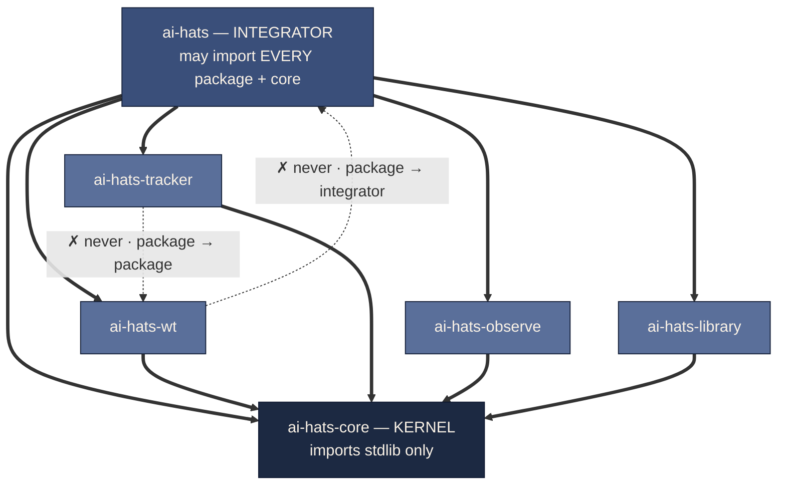
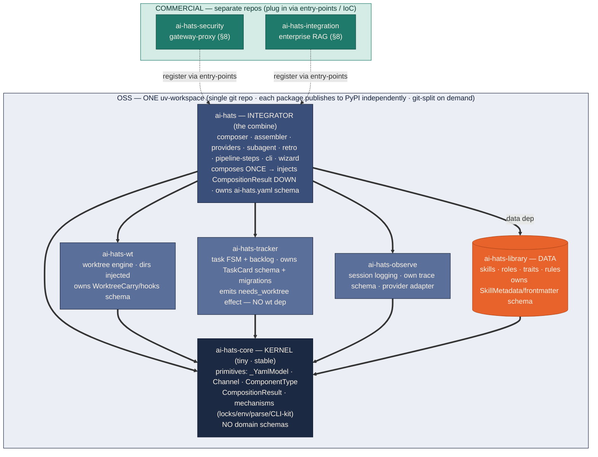
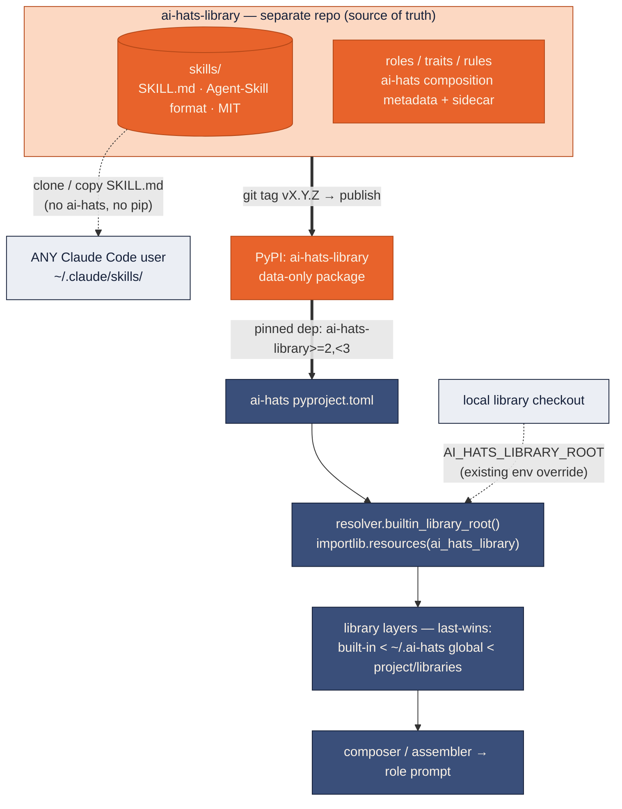
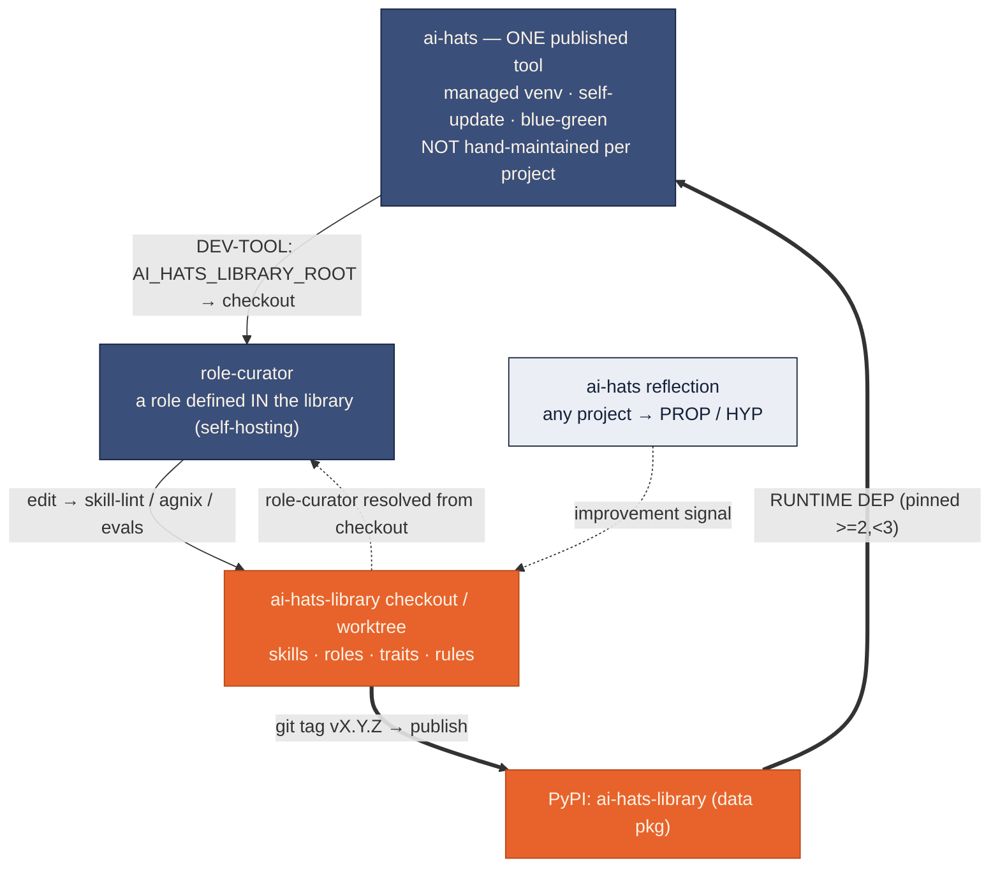
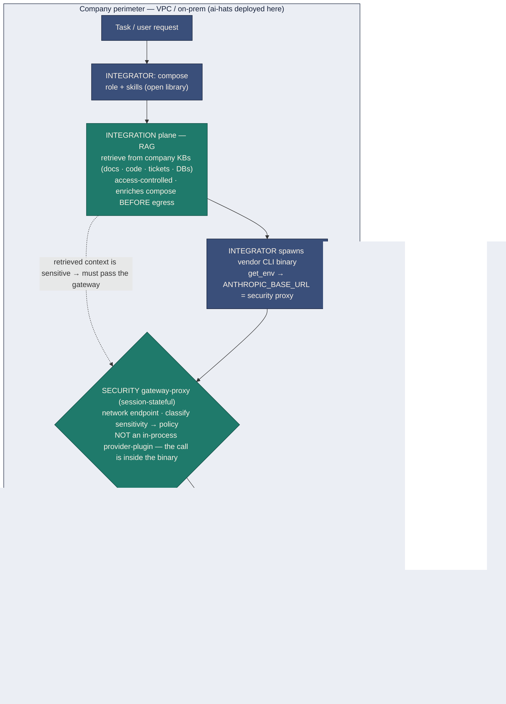

# ADR-0014: Composable decomposition — packages, the core, the integrator, repository topology & enterprise planes

## Status

Accepted — **decided model finalized** (HATS-854 + HATS-855 research → HATS-858
review gate, 2026-06-30). Design only; no code lands with this ADR. The
**decomposition + repository topology (§1–§7) are finalized** by the HATS-858 review
gate. The **enterprise planes (§8) remain a future HATS-855 epic** — their *shape*
(gateway-proxy + RAG ingress) is fixed, but the deployment decisions in §8's "Open
forks" stay open.

It **supersedes its own earlier Option A / Option B framing**: per supervisor
decision (with a 4-reviewer panel) the OSS surface becomes
**independently-publishable packages in one uv-workspace** (`ai-hats-core` / `-wt` /
`-tracker` / `-observe` / **`-library`** / the `ai-hats` integrator);
`ai-hats-library` is **symmetric with the engines** (a workspace package, not an
own-repo now); each package `git filter-repo`s to its own repo **on demand**. The
repo map, the `ai-hats-core` contract, and the enterprise planes are now recorded in
this doc — see §2 (Repository topology) and §8 (Enterprise deployment planes).

Complements ADR-0013 (the first module), reconciles the composition-inversion with
[ADR-0005](0005-composition-and-pipeline-value-contract.md)'s compose-once contract,
and is disciplined by HATS-801 (a shared FSM = mirage → deferred). Realized by epic
**HATS-860** (children HATS-861…877, filed after the HATS-858 gate).

## Context

ai-hats today is a **combine**: one repo, one pip package (`python -m ai_hats`),
bundling ~9 logical subsystems — agent library, role-model + provider
materialization, pipelines (HITL / no-HITL), worktree, backlog / task-tracking,
sub-agents, session logging, reflection feedback, and init / wizard.

The supervisor's goal (interview, HATS-854) is **not open-core monetization**.
It is **visibility and external reuse**: people who do *not* use ai-hats should be
able to pick up individual components — especially skills — into their own
projects, and ai-hats should keep a **stable, independently-consumable subset**
that can be embedded elsewhere. ai-hats itself remains the *integrator* that
composes these components into a system.

ADR-0013 already answered a scaled-down version of this question for the worktree
engine and chose **Option B (in-place isolation)** over **Option A (separate
repo)**: coupling was concentrated, there was *no external consumer*, and a
separate repo pays a distributed-system / de-facto co-release cost. Crucially,
**Option B is the correct first phase of Option A** — once a brick sits behind a
clean one-directional import boundary, a later repo-split is a near-mechanical
`git filter-repo`.

This ADR defines the dependency topology that makes the components
**non-overlapping building blocks** and records the per-component placement. The
B→A-on-demand reasoning above is retained as background only: the supervisor's
decision (§3) made the OSS engines **packages in one uv-workspace** (each
independently publishable, git-split on demand), so the live model is
workspace-packages + `ai-hats-core`, not in-place isolation.

**The enterprise payoff.** The commercial / enterprise payoff of this decomposition
is the ability to deploy powerful **public** models (Claude API, …) into the
perimeter of enterprises that cannot send raw sensitive data outside their boundary,
and to ground agents in company knowledge. The open foundation (kernel / engine /
brick / integrator + library) stays OSS for visibility and reuse; two new
**enterprise planes** — `security` and `integration` — attach via stable extension
points and deploy inside the company VPC / on-prem (§8). These planes are **NOT two
more dependency tiers**: the tiers of §1 are the *code-dependency* axis (who imports
whom), whereas security and integration are the **runtime request-path axis** (two
interception points in the agent's request lifecycle). Code-wise they are bricks
(depend on kernel/engines like any brick); their defining role is **where they sit in
the request path** and the fact that they are **proprietary and separately deployed**.
The OSS / COMMERCIAL line is the open-core boundary.

## Decision

### 1. The model — three tiers, one uv-workspace

Decomposition is by **packages in one uv-workspace**, each a pinned pip package that
`ai-hats` composes (a package `git filter-repo`s to its own repo on demand). The repo
map + per-node schema ownership is canonical in §2 (Repository topology); the two
load-bearing **rules** are:

> **Dependency rule:** `ai-hats (integrator) → modules → ai-hats-core`. A module
> depends only on `ai-hats-core` — **never on another module, never up on the
> integrator**. Enforced by a **full-AST import-lint** (the wt-core
> `test_wt_core_imports` pattern; a module-level check misses the deferred
> function-body imports that carry most coupling today).

> **Composition rule (the inversion):** `ai-hats-core` exposes `CompositionResult`
> as a value-type; the integrator composes **once** and injects it **down** into
> modules. No module imports `composer` / `assembler` / `materialize` — reconciling
> the dependency rule with
> [ADR-0005](0005-composition-and-pipeline-value-contract.md)'s compose-once
> contract (the collision the review surfaced).

| Tier                        | What                                                                                                                                                                                                                               | Repos                                                                 |
| --------------------------- | ---------------------------------------------------------------------------------------------------------------------------------------------------------------------------------------------------------------------------------- | --------------------------------------------------------------------- |
| **`ai-hats-core`** (kernel) | tiny, stable: primitives + `CompositionResult` + domain-agnostic shared *mechanisms* (file-locks, env-access, parse/`_YamlModel`, base `Error`+logging, **CLI-kit**); **no domain schemas**; FSM-primitive **deferred** (HATS-801) | `ai-hats-core`                                                        |
| **Modules**                 | independent engines, each owns its schema + migrations, depend only on core                                                                                                                                                        | `ai-hats-wt`, `ai-hats-tracker`, `ai-hats-observe`, `ai-hats-library` |
| **Integrator**              | *the combine*: composer/assembler/providers, subagent, retro, pipeline-steps, **CLI commands + aggregation**, init/wizard, hooks — composes & pins every module                                                                    | `ai-hats`                                                             |
| **Surfaces** (HATS-956)     | in-tree entry-point plugins that dogfood the IoC seam — depend UP on the integrator (`Provider` ABC is integrator-bound, P0#4) + core; register via `ai_hats.providers`. The first consumer tier above the integrator              | `packages/surfaces/*` (e.g. `ai-hats-cline`)                          |

The **role-model + provider-materialization** and **init/wizard** are integrator, not
modules — the layer that "takes different projects into itself." Full `ai-hats-core`
contract (in/out tables + open-field boundary rule + shared-mechanism litmus):
§2 (Repository topology).

**Amendment (HATS-956) — the in-tree surface tier.** The COMMERCIAL/IoC box (§below)
reserved entry-point plugins for *separate repos* because the **module** tier forbids
depending *up* on the integrator. HATS-956 adds an in-tree **surface** tier
(`packages/surfaces/*`) that MAY depend on `ai-hats` + core: a surface is an
entry-point provider plugin (integrator-bound `Provider`, P0#4) kept in the workspace
to dogfood the seam. The dependency-rule import-lint
(`tests/test_workspace_boundaries.py`) blesses `packages/surfaces/* -> ai-hats` and
nothing else new — modules still depend only on core.

**The dependency rule as a picture — who may import what from whom:**



**Read it top-down.** A solid `⇒` is an allowed import and only ever points **down**
(integrator → packages → core); a dotted `✗` is a forbidden edge. So *who may take
what from whom*: the **integrator** may use any package + core; **every package** may
use **only core**; **core** depends on nothing but the stdlib. No package imports
another package, and none imports up into the integrator. Cross-package data that must
travel (e.g. a wt-carry inside `SkillMetadata`) rides as an **opaque field**, never a
typed import — and the integrator does the wiring: it composes once and injects
`CompositionResult`, the observe-writer handle, and the `needs_worktree` effect **down**
into the packages (the composition-inversion rule above). The full-AST import-lint
mechanically enforces every arrow in this picture.

### 2. Repository topology — the workspace, the core contract, module anatomy

> **Workspace model (finalized — HATS-858).** The whole OSS surface —
> `ai-hats-core`, `-wt`, `-tracker`, `-observe`, `ai-hats-library`, and the `ai-hats`
> integrator — lives as **independently-publishable packages in ONE uv-workspace git
> repo** (diagram below). `ai-hats-library` is **symmetric with the engines** (a
> workspace package + independent PyPI publish, **not** an own-repo now); security /
> integration are commercial. Any package `git filter-repo`s to its own repo **on
> demand**, when a real external consumer needs an independent cadence.



**Workspace packages (finalized — HATS-858; supersedes the interim "polyrepo now"
framing).** `core`, `wt`, `backlog` (tracker), `logging` (observe), `library`, and the
`ai-hats` integrator are **packages in one uv-workspace**, each independently
publishable to PyPI and consumed by `ai-hats` as a pinned dependency. None is its own
git repo yet; any package `git filter-repo`s out **on demand**. The package boundaries
below are identical to a polyrepo — only the git-repo count differs — so the choice
stays reversible.

- **`ai-hats-core`** — the kernel: true shared primitives only (`_YamlModel`,
  `Channel`, `CompositionResult`, `atomic_io`). Every other package pins it. The
  *prerequisite* package — it exists so the rest can split (today these primitives are
  tangled inside a god-`models.py`).
- **`ai-hats-wt`** — worktree engine. Owns its schema (`WorktreeCarry` / hooks),
  takes dirs injected, exposes lifecycle extension-points (ADR-0013 already did ~80%).
- **`ai-hats-tracker`** — task FSM + backlog. Owns `TaskCard` schema + its own
  migrations. **Decoupled from wt** (the FSM emits a `needs_worktree` effect; the
  integrator calls wt) → installs standalone with no wt dependency.
- **`ai-hats-observe`** — session logging. Owns its versioned trace/audit schema; the
  provider-specific JSONL parser sits behind an adapter.
- **`ai-hats-library`** — data only (skills / roles / traits / rules + role-curator);
  drop-in for non-ai-hats users.
- **`ai-hats`** — the integrator: composition (composer / assembler / providers),
  subagent, retro, pipeline-steps, cli, wizard. Pins and composes all modules; the
  only place that imports the composer.
- **`ai-hats-security` / `-integration`** — commercial planes, plug in via extension
  points.

**`ai-hats-core` contract (LOCKED — the Phase −1 anchor).** Base = primitives + the
composition contract **only**; every domain schema lives in its own module. The base
is the most-depended-on package, so it must stay tiny and stable (a base MAJOR bump
ripples to every module — that pressure is *why* domain schemas must NOT live here).

| In `ai-hats-core` (base)                                  | Owned by its module — NOT in core                                                                |
| --------------------------------------------------------- | ------------------------------------------------------------------------------------------------ |
| `_YamlModel` base + schema-version / migration primitives | `TaskCard` / `TaskState` → `ai-hats-tracker`                                                     |
| `Channel`, `ComponentType` (cross-cutting enums)          | `WorktreeCarry` / hooks → `ai-hats-wt`                                                           |
| `CompositionResult` (composition contract, injected down) | `SkillMetadata` / frontmatter → `ai-hats-library`                                                |
| `atomic_io`                                               | trace schema → `ai-hats-observe`; `ProjectConfig` / `HarnessConfig` (`ai-hats.yaml`) → `ai-hats` |

**Boundary rule:** a module never imports another module's schema type. Cross-module
payloads (e.g. wt-carry carried inside `SkillMetadata`) are **open / opaque fields**,
never typed imports — so `ai-hats-library` never depends on `ai-hats-wt`. Matches the
"open registries > closed central schemas" default and fixes the review's
`SkillMetadata` embeds `WorktreeCarry` finding.

**Shared *mechanisms* in core — same litmus as schemas.** Core also carries
domain-agnostic *mechanisms* used by ≥2 modules — but **only** if pure, domain-blind,
and low-churn; otherwise they stay in a module (this litmus is what keeps core from
re-becoming a god-module).

| In `ai-hats-core` (shared mechanism)                                                                                                                                                                                                                                    | Stays in module / integrator                                                                          |
| ----------------------------------------------------------------------------------------------------------------------------------------------------------------------------------------------------------------------------------------------------------------------- | ----------------------------------------------------------------------------------------------------- |
| file-lock wrapper (consolidates `version_lock` + the ad-hoc `FileLock` uses in `state.py` / `plugin_dir.py`)                                                                                                                                                            | —                                                                                                     |
| env-access helper + `ENV_*` naming convention                                                                                                                                                                                                                           | the var *names* (`AI_HATS_LIBRARY_ROOT` → library, `AI_HATS_VENV` → installer)                        |
| generic parse / `_YamlModel` load helpers                                                                                                                                                                                                                               | domain parsers: provider-JSONL → observe, `SKILL.md` → library, task-card md → tracker                |
| base `Error` hierarchy + logging setup                                                                                                                                                                                                                                  | —                                                                                                     |
| **CLI-kit** — the `cli/_helpers` plumbing (resolver, shared decorators, error/output rendering, group registration)                                                                                                                                                     | the **commands** (`task` → tracker, `wt` → wt, …); aggregation into the `ai-hats` binary → integrator |
| generic `StateMachine[S]` transition-guard primitive — **DEFERRED** (HATS-801 researched a shared FSM → "mirage": the generic part is tiny and does **not** unify domain FSMs, whose git/file side-effects stay per-module). Add only if ≥2 modules genuinely share it. | the Task transition table (`valid_transitions`, `models.py:56`) → tracker; `WT_TEARDOWN_EVENTS` → wt  |

**How the repos connect — a pip-dependency DAG (`ai-hats → modules → core`)** (§1's
dependency rule, in pip terms):

1. `ai-hats` depends on every OSS module (`-wt`, `-tracker`, `-observe`, `-library`,
   `-core`), each pinned — the modules ARE "used as modules in ai-hats".
2. Every code module depends **only on `ai-hats-core`**, never on each other (no
   `wt ↔ tracker`, no sideways edges) — so each is independently installable (§1's
   dependency rule).
3. Commercial planes depend on `ai-hats` (the extension-point API) and register via
   entry-points; ai-hats dispatches into them at runtime via the registry **without
   importing them** (IoC).

**The prerequisite — why this isn't free.** A separate repo cannot be
`pip install`-ed while its schema lives in the shared god-`models.py` and another
module imports it. So the split converts this ADR's review P0s (see "Review findings"
below) into **hard, ordered prerequisites**: *Phase −1* splits `models` per-module +
inverts composition (`CompositionResult` pushed down) + cuts `tracker → wt`; only then
does each module extract cleanly. The module boundaries are identical to a
monorepo-workspace, so the choice stays reversible if the multi-repo
release/version-matrix overhead bites.

The **OSS / COMMERCIAL group line is the open-core boundary**: proprietary planes
attach through stable extension points, so they plug in **without forking** the open
core — which is exactly what the decomposition (and its Phase −1 provider-adapter open
registry) exists to enable.

#### Dev-time conventions live at the workspace root (no `devkit`)

"Unified style + documentation" is a **dev-time** concern, not runtime code — you do
not `import` a ruff config. In a single workspace it needs no home of its own: ruff /
dprint config, the **privacy pre-commit hook + secret-scan CI**, the CI workflows, the
`CONTRIBUTING` + doc-style + ADR/diagram conventions, and the `LICENSE` / `NOTICE` /
`THIRD_PARTY_NOTICES` templates all live at the **repo root**, shared by every package
by virtue of being one repo.

There is deliberately **no `ai-hats-devkit`** package or template: a config-sync
template only earns its keep across *multiple* repos, and there is exactly one. If a
package is ever `git filter-repo`'d out on demand, that split task copies the root
config it then needs — a future concern, not designed now (YAGNI).

**Two homes + root config — do not conflate them:**

| "Shared across packages" means…                                         | Home              | Mechanism                     |
| ----------------------------------------------------------------------- | ----------------- | ----------------------------- |
| runtime code util (locks, env, parse, FSM-primitive)                    | `ai-hats-core`    | pip dependency                |
| dev-time style / config / CI / hooks / doc-style / license templates    | workspace root    | shared by the single repo     |
| agent dev-*behaviour* guidance (SE-mindset, doc-protocol, commit-style) | `ai-hats-library` | composed into the role prompt |

#### Workspace layout, module anatomy & consistency

The whole OSS surface is **one git repo — the uv-workspace**. The refactored tree:

```
ai-hats/                             # ONE git repo = the uv-workspace
├─ pyproject.toml                    # [tool.uv.workspace] members = ["packages/*"]
├─ ruff.toml · dprint.json · .pre-commit-config.yaml · .github/   # dev config at the ROOT (no devkit)
├─ docs/                             # ADRs + guides (shared, repo-root)
├─ packages/
│  ├─ ai-hats-core/                  # KERNEL — depended on by all; deps = (none)
│  │  └─ src/ai_hats_core/
│  ├─ ai-hats-wt/                    # deps = ["ai-hats-core"]
│  │  ├─ src/ai_hats_wt/
│  │  └─ skills/                     # engine-owned: worktree-isolation
│  ├─ ai-hats-tracker/               # deps = ["ai-hats-core"];  skills/ = backlog-manager
│  │  └─ src/ai_hats_tracker/
│  ├─ ai-hats-observe/               # deps = ["ai-hats-core"]
│  │  └─ src/ai_hats_observe/
│  ├─ ai-hats-library/               # DATA — no src/;  skills/ roles/ traits/ rules/
│  └─ ai-hats/                       # INTEGRATOR — deps = every package above
│     └─ src/ai_hats/                # composer/assembler/providers · subagent · cli · wizard
└─ .agent/                           # gitignored tracker (backlog, sessions)
```

Each package is a **self-describing, independently-publishable unit** — its README /
CONTRIBUTING / docs travel with it and become its GitHub front if it is ever extracted.
A standard **scaffold** every package follows (kept consistent by the workspace's
shared CI + import-lint, not a template engine):

```
packages/ai-hats-<x>/
  README.md         # STANDALONE: what it is · pip install · quickstart · the schema/API it owns · its skills · deps (core only) · semver
  CONTRIBUTING.md   # package-scoped: gates (skill-lint, import-lint), schema-migration discipline, release/semver flow
  CHANGELOG.md
  pyproject.toml    # name + version + deps (ai-hats-core, …)
  src/ai_hats_<x>/  # the engine
  skills/<s>/SKILL.md   # engine-owned skills (open-registry source — below)
  tests/
```

The README is **standalone-readable** — the module ships via `pip install
ai-hats-<x>` and gets its own GitHub front on extraction, so it cannot assume the
umbrella repo's context.

**Engine-owned skills.** A skill that drives a specific engine lives in that module's
`skills/` (versions + ships with the engine); cross-cutting skills stay in
`ai-hats-library`. ai-hats discovers skills from **all** sources (library + each
installed module + `~/.ai-hats` global + project) via the resolver's multi-source
mechanism — an **open registry of skill sources**, declared per module (entry-point
`ai_hats.skills`). Litmus: documents/depends on a specific engine's interface → that
engine; general agent behaviour → library.

**Consistency is contract-enforced, not co-location-enforced** — today's single repo
already carries 61/94 unlicensed skills, so proximity never gave consistency. Three
layers replace it:

| Layer         | Where                                                                                                                             | Catches                                           |
| ------------- | --------------------------------------------------------------------------------------------------------------------------------- | ------------------------------------------------- |
| **Local**     | skill-lint / agnix + README-section + import-lint in each package's CI (shared from the workspace root)                           | format, license, layout                           |
| **Aggregate** | the integrator's CI composes all sources + validates cross-skill `→ See` refs + dedup/overlap (skill-optimization across sources) | the cross-cutting checks no single module can run |
| **Curation**  | shared `skill-template` + skill-engineer guidance + owner / role-curator review                                                   | voice, quality, semantic overlap                  |

Full stylistic uniformity is **not** a goal (open-registry philosophy: autonomous
owners within a shared contract); contract-consistency (format + composability) **is**,
and is enforced.

### 3. Per-component placement

This supersedes both the earlier "Option B in-place" framing **and** the interim
"polyrepo-now" one — a 4-reviewer panel found polyrepo-now front-loads a
co-release / version-matrix tax and breaks the single-repo enforcement pillars
(import-lint, blue-green `versions/`, migration runner), with no external consumer yet
for the engines. Decided model: **one uv-workspace repo of independently-publishable
packages**. `ai-hats-library` is **symmetric with the engines** (HATS-858): a workspace
package that **publishes to PyPI independently** — `pip install ai-hats-library` plus a
zero-dep `git clone` drop-in deliver the visibility win **without** a separate git repo,
so it stays in the workspace like every engine. Each OSS package (`pip install
ai-hats-wt` works) gets its own git repo **on demand** — a near-mechanical
`git filter-repo` of an already-isolated `packages/<x>/` folder.

| Component                               | Placement                                 | Notes                                                                                             |
| --------------------------------------- | ----------------------------------------- | ------------------------------------------------------------------------------------------------- |
| Agent library                           | **`ai-hats-library`** — workspace package | data; independent PyPI publish + drop-in clone; own-repo on-demand (symmetric with engines); §4–7 |
| Kernel                                  | **`ai-hats-core`** — workspace package    | primitives + `CompositionResult` + shared mechanisms incl. CLI-kit; **no domain schemas**         |
| Worktree                                | **`ai-hats-wt`** — workspace package      | ADR-0013 did ~80%; owns `WorktreeCarry`/hooks schema                                              |
| Backlog / tracker                       | **`ai-hats-tracker`** — workspace package | owns `TaskCard` schema + migrations; **decoupled from wt** via a `needs_worktree` event           |
| Session logging                         | **`ai-hats-observe`** — workspace package | owns versioned trace schema; provider-JSONL behind an adapter                                     |
| Pipelines                               | **integrator** (`ai-hats` package)        | `Step`/`StepIO` ABC + runner may later be a package; concrete `steps/*` are integrator glue       |
| Sub-agents                              | **integrator** (`ai-hats` package)        | composition-root; only PTY/runtime primitives are core-able                                       |
| Reflection / retro                      | **integrator** (`ai-hats` package)        | orchestrates tracker + observe + subagent + pipeline                                              |
| Role-model + provider-mat.; init/wizard | **integrator** (`ai-hats` package)        | the combine itself                                                                                |
| Dev-time style / config                 | **workspace root** (no package)           | ruff / hooks / CI / license templates shared by the single repo — no `devkit`                     |
| Enterprise: security, integration       | **commercial repos**                      | plug in via extension points; §8 (Enterprise deployment planes)                                   |

> **Phase −1 is the hard prerequisite (independent of the topology choice).** A package
> cannot be cleanly published or extracted while its schema lives in a shared god-module
> another package imports. So first: split god-`models` per-package, **invert
> composition** (`CompositionResult` injected down), cut `tracker → wt`, and land the
> **full-AST import-lint over the workspace** (the panel flagged a per-repo lint cannot
> replace it). **Locked:** `ai-hats-core` = primitives + `CompositionResult` only; each
> package owns its domain schema; cross-package payloads are open / opaque fields. Full
> contract: §2 (Repository topology).

> **Why workspace, not polyrepo-now:** the package boundaries are identical either way
> (they *are* the decomposition); a workspace keeps the import-lint, the `versions/`
> machinery, and atomic cross-package PRs working in one repo, and a package extracts to
> its own repo trivially once a real external consumer needs an independent cadence.
> Polyrepo-now pays that tax up front for engines whose only consumer is `ai-hats` itself.

### 4. The library pilot — portable content vs composition metadata

The library is already **two layers**, which makes the split a *packaging* problem,
not a re-architecture:

- **Portable content** — skills are already in the **standard Claude-Code
  Agent-Skill format** (`SKILL.md` frontmatter: `name` / `description` /
  `user-invocable` / `license: MIT` / `compatibility` / `allowed-tools`). 93 of
  them. → publish as a **standalone skills repo**, drop-in for *anyone* with
  Claude Code (or a similar agent), **zero ai-hats dependency**. This is the
  visibility / reuse win.
- **ai-hats composition metadata** — traits, rules-as-composition-nodes, the role
  `composition:` graph, and injection assembly. → **stays in ai-hats**, consumes
  the portable content.

The one load-bearing design contract: **keep `SKILL.md` files pure** (so they stay
drop-in for non-ai-hats users); attach ai-hats composition metadata via a
**sidecar** (build on the existing `skill_sidecar.py`), never by polluting the
skill file. ai-hats then consumes the skills repo as a versioned dependency.

### 5. How ai-hats consumes the library — dependency, versioning, maintenance

This is the load-bearing part, and the codebase already has the seam for it.
ai-hats does **not** hard-wire the library: `resolver` resolves the *built-in*
layer through `paths.builtin_library_root()`, which today reads the bundled
`ai_hats.library` package-data via `importlib.resources`, and then searches
**multiple sources, last-wins**: `built-in < ~/.ai-hats (global) <
<project>/libraries` (HATS-445). Extraction changes **only where the built-in
layer comes from** — the layering and the composer above it are untouched.



**Is it a dependency for us?** Yes — for ai-hats the library becomes a normal
**pinned pip dependency** (`ai-hats-library>=2,<3`), a *data-only* package (YAML +
markdown shipped as package-data, no runtime Python). For **external** users it is
**not** a dependency at all: it is just a repo of `SKILL.md` files they
`git clone` / copy into `~/.claude/skills/` — no pip, no ai-hats.

**How do we include it?** Repoint `builtin_library_root()`'s `importlib.resources`
call from `ai_hats.library` to the installed `ai_hats_library` package — a
localized change, because the resolver already treats the built-in library as one
resolved *source*. The existing precedence (`built-in < global < project`,
last-wins) keeps user/project overrides working unchanged. Local development uses
the **already-existing** `AI_HATS_LIBRARY_ROOT` env override pointed at a library
checkout — iterate without publishing.

**How do we version it?** Semver on the library package, **decoupled from
ai-hats's own version**. The versioned contract is the **format schema** (skill
frontmatter + composition schema + the resolver's expectations), not a Python API:
MAJOR = breaking schema change, MINOR = skills/roles added, PATCH = content fix.
ai-hats pins a compatible MAJOR range; the existing `migrations.py` already carries
composition/library migrations across versions, and `version_lock` already does
crash-safe versioned installs.

**How do we maintain it?** Two repos, but the seam is a **stable schema, not
code** — so the co-release tax applies only to breaking schema changes (rare).
Library-repo CI validates the format (agnix / skill-lint, already in this project).
Routine skill authoring happens in the library repo, tested locally against ai-hats
via the env override; the one case needing a coordinated bump is an ai-hats
behavior change that introduces a new schema field (→ MAJOR on both).

**Open sub-decision (Phase 1):** one repo (`ai-hats-library/` with a portable
`skills/` subdir + composition metadata) vs two (a pure `skills` repo + a separate
composition repo). Recommendation: **one repo, `skills/` as the portable slice** —
the composition metadata is small, and a single repo keeps a skill and its
sidecar/trait wiring co-located. Split only if an external consumer ever wants the
skills repo with zero ai-hats-specific files.

### 6. Improving the library — a dogfooding loop



**No dependency cycle — two different *kinds* of dependency.** ai-hats depends on
`ai-hats-library` at **runtime** (pinned data dep); the library repo depends on
ai-hats only as a **dev tool** (like an editor or linter). A published tool used to
edit data is not a build cycle — same as a compiler written in its own language.

**`role-curator` is library content (self-hosting).** It lives at
`library/usage/roles/role-curator/` and composes `skill-engineer` +
`library-curator` + `review-role` — all library content. So "we need ai-hats with
role-curator" = the ai-hats *tool* + a library checkout (which *contains*
role-curator). During curation, role-curator resolves from the working checkout
(via the existing `AI_HATS_LIBRARY_ROOT` override), so improvements to the curator
take effect immediately. The library curates itself.

**One harness, not one-per-project.** ai-hats is a single published tool in a
*managed* venv (`self update`, blue-green `versions/current`) — you bump it with
`ai-hats self update`, you do not hand-maintain it. Per project you keep only
**generated config** (`ai-hats.yaml` + composed `CLAUDE.md`) and a pinned version,
never a copy of the engine. The library repo is *just another ai-hats-managed
project*: its `ai-hats.yaml` selects role-curator and declares ai-hats as a **dev
dependency**, exactly like any repo declares its linter.

**The loop:** clone / worktree the library → run ai-hats + role-curator against the
checkout → edit + validate (skill-lint / agnix / evals, [ADR-0011](0011-feedback-loop-validation.md))
→ tag + publish → ai-hats picks up the new version via its pinned range. Improvement
*signal* arrives from `ai-hats reflection` in **any** project (a separate brick) as
PROP / HYP and is actioned in the library repo.

**Genuine considerations (Phase 1):**

- **Bootstrap safety** — if a checkout breaks role-curator or core composition,
  ai-hats cannot compose it. Mitigation: fall back to the published / built-in
  library to repair; gate core composition (e.g. `trait-base`) in library-repo CI
  before it can land broken.
- **Schema / version skew** — curate with an ai-hats whose *schema* matches the
  library's target; the library repo's CI pins which ai-hats validates it.
- **Source-detection gap (concrete task)** — today's auto-detect keys on
  `library/core` **and** `src/ai_hats` being co-present; a standalone library repo
  has no `src/ai_hats`, so auto-detect will not fire. Phase 1 must add a
  "library-only checkout" detection (or standardize on the env override) so curation
  works out of the box.

### 7. Selecting library version(s) — the `library:` block

**Today this is impossible** — the library is bundled package-data inside
`ai_hats`, so its version *is* the ai-hats version. Extraction is exactly what
unlocks an independently-pinnable library. The mechanism mirrors an existing
precedent: the `harness:` block (HATS-764), which already lets `ai-hats.yaml`
select *where ai-hats itself comes from* (`channel: local | edge | stable` +
`repo` + `path`). The library gets a parallel block:

```yaml
# ai-hats.yaml
library:
  channel: stable          # stable | edge | local  (same semantics as harness:)
  version: "2.7"           # pin a release within the ai-hats-supported schema range
  # path: ../ai-hats-library   # local-only editable checkout (== AI_HATS_LIBRARY_ROOT)

library_paths:             # EXISTING field — last-wins overlay sources
  - ./libraries            # project-local components layered on top of the pinned base
```

"Two versions" means three different things; the mechanism differs per sense:

| Sense                                       | How                                                                                                                                                                                                                               | Status                                                                                                                  |
| ------------------------------------------- | --------------------------------------------------------------------------------------------------------------------------------------------------------------------------------------------------------------------------------- | ----------------------------------------------------------------------------------------------------------------------- |
| **Different version per project**           | each project's `library:` pins its own `version`; the managed venv installs it                                                                                                                                                    | ✅ clean — the common case                                                                                              |
| **Two versions at once in one composition** | a role composes *one* resolved set, so "two full versions" is not meaningful — but `library_paths` (last-wins) **overlays at component granularity**: base v3 + a project layer overriding specific skills/roles from a v2 source | ✅ for *mixing components*, ❌ for two whole versions                                                                   |
| **Switch / A-B compare (eval, dogfood)**    | per-invocation `AI_HATS_LIBRARY_ROOT` (exists), or two managed installs **side-by-side** (the `versions/` blue-green pattern generalized), each session selecting one                                                             | ✅ — and it powers the [ADR-0011](0011-feedback-loop-validation.md) eval loop (run the same task on old vs new library) |

**One config resolves to one version.** There is no `library: [2.7, 3.1]` — a
single `ai-hats.yaml` produces exactly one resolved library composition. Version is
resolved **per composition (per session / sub-agent)**, never as a list in the
config. So "two versions" is always one of:

```yaml
# (A) two versions = two projects — projectA/ai-hats.yaml
library: { channel: stable, version: "2.7" }
#                            projectB/ai-hats.yaml
library: { channel: stable, version: "3.1" }
```

```yaml
# (B) ONE project: base 3.1 + local component overrides (NOT two full versions)
library: { channel: stable, version: "3.1" }
library_paths: [./libraries] # last-wins overlay at component granularity
```

```bash
# (C) two versions live at once via per-spawn override — no new config field:
#     main session on 3.1, a sub-agent on 2.7
AI_HATS_LIBRARY_ROOT=~/installs/lib-2.7 ai-hats agent --role <r> ...
```

The unit that carries a version is the **session/agent**: the `library:` block is
the project default, `library_paths` overlays components into that one composition,
and a per-spawn `AI_HATS_LIBRARY_ROOT` lets the main session and a sub-agent run
different versions at the same time.

**The one hard constraint — schema compatibility.** A library version is usable
only by an ai-hats whose schema understands it. ai-hats already enforces this for
its *own* yaml (`KNOWN_SCHEMA_VERSION = 4` + the `migrations.py` chain +
fail-loud-when-newer). The library needs the analogous contract: each release
declares a **library-schema version**; ai-hats declares the **range it supports**;
pinning outside it fails loud with `ai-hats self update`. So you can freely pin two
*content* versions under the same schema-major (2.3 vs 2.7); crossing a
schema-major boundary requires the matching ai-hats. The residual coupling is
bounded to schema-majors (rare) — which is the whole point of versioning on the
*format*, not on incidental content.

**Recommendation:** treat the library like the harness — a managed,
multi-version-capable install selected by the `library:` block, reusing the
`versions/` blue-green machinery + the existing `library_paths` overlay. That
delivers per-project pinning (sense 1) and side-by-side switching (sense 3) without
new infrastructure.

### 8. Enterprise deployment planes (security + integration) — HATS-855 epic

This section is the **scope of the HATS-855 enterprise epic**: the runtime request
path (deployment view) — where the security and integration planes intercept. Its
*shape* is fixed by the HATS-858 gate; the deployment decisions in "Open forks" below
are resolved in the HATS-855 epic.

> **Reframe (HATS-858): the security plane is a network gateway-proxy, NOT a
> provider-registry plugin.** ai-hats does not make the model HTTP call itself — it
> **spawns the vendor CLI binary** (`claude` / `gemini`), and the call to the API
> happens *inside that binary*, so an in-process Python provider-adapter has no
> interception point. Instead the integrator points the binary at the gateway by
> injecting `ANTHROPIC_BASE_URL` (through the existing `provider.get_env()` seam);
> every model request then physically flows through a **session-stateful proxy** that
> classifies → redacts/tokenizes → routes (public-with-anonymization vs on-prem) and
> de-anonymizes the round-trip locally. The proxy is a **separate deployed endpoint**,
> optionally coupled to the integration (RAG) plane.



- **INTEGRATION** = ingress of company knowledge (RAG, connectors, access-control),
  enriches composition **before** the model call; retrieved context is sensitive by
  default → it must pass the gateway before any public model sees it.
- **SECURITY** = a network **gateway-proxy** the vendor binary reaches via
  `ANTHROPIC_BASE_URL`; egress control that classifies → redacts/tokenizes → routes
  (public-with-anonymization vs on-prem), session-stateful for the de-anonymize
  round-trip. A **separate deployed endpoint**, not an in-process provider adapter.
- At deploy, all packages + both planes run **together inside** the perimeter; only
  anonymized text crosses out to the public model.

#### Open forks (resolve in HATS-855 before planning)

> **Partly resolved by HATS-858.** Fork **#4** is decided — plugins register via
> `[project.entry-points]` (IoC), the same open-registry seam this ADR's resolution #4
> adds (`register_provider()` + entry-point groups); ai-hats dispatches without
> importing them. Fork **#5** is decided — the enterprise planes ride on Phase −1
> (the provider open-registry + compose-once inversion), not current code. The
> **security shape** is now fixed as a gateway-proxy (the gateway-proxy reframe above).
> The remaining forks (#1 open-core boundary, #2 de-anonymization semantics, #3
> per-request vs deployment-mode) stay for the enterprise epic under HATS-855.

1. **Open-core boundary** — exactly {commercial: security + integration; open:
   everything else}, or ship thin OSS reference-implementations of each with
   enterprise-grade versions commercial?
2. **De-anonymization semantics** — confirm the round-trip: anonymize outbound →
   public model sees only tokens → de-anonymize on return locally.
3. **Security unit** — per-request routing, or a deployment-mode (whole install
   public vs private), or both?
4. **Plugin attach mechanism** — plugins depend on ai-hats + register via
   entry-points (IoC, recommended) vs ai-hats optional-extras.
5. **Dependency on Phase −1** — does a PoC gate on the provider-adapter
   becoming a true open registry + compose-once inversion, or can it ride current
   code?

## Consequences

**Phased rollout — epic HATS-860 (children filed after the HATS-858 gate; T-labels → IDs):**

- **Phase −1 (prerequisite) — de-god the kernel + invert composition.** Sliced into
  independently-mergeable, lint-guarded steps: **T1** workspace skeleton (HATS-861),
  **T2** extract `ai-hats-core` (HATS-862), **T3** split god-`models` per domain
  (HATS-863), **T4** de-layout `paths` — layout injected (HATS-864), **T5** invert
  composition — `CompositionResult` down (HATS-865), **T6** cut `tracker → wt` via a
  `needs_worktree` effect (HATS-866), **T6b** cut `subagent → observe` via an injected
  writer handle (HATS-867), **T7** generic `Migration[Ctx]` into core (HATS-868), **T8**
  full-AST workspace import-lint, enforcing (HATS-869) — the gate. **Tier model = option
  A** (cut every package↔package edge; the integrator mediates; no mid-tier). **Nothing
  else lands cleanly until this is done.**
- **Phase 0 — registries:** **T10** provider open-registry
  - `[project.entry-points]` (HATS-870), **T11** open-registry skill sources + aggregate
    skill-consistency check (HATS-871).
- **Phase 1 — first packages:** **T14** `ai-hats-wt` (ADR-0013 ~done; HATS-872) and
  **T15** `ai-hats-observe` (lowest coupling; HATS-873) as workspace packages + standalone
  smoke (ADR-0013 D9 pattern).
- **Phase 2 — T16 `ai-hats-tracker`** (HATS-874) once its schema + migrations are
  self-contained and the wt decoupling holds.
- **Phase 3 — `ai-hats-library` as a workspace package** (the visibility win, **not** an
  own-repo now): **T17** licensing small-fix — `license:` backfill + attribution +
  `THIRD_PARTY_NOTICES` (HATS-875), **T18** library packaging — sidecar +
  `importlib.resources.as_file` + repoint `builtin_library_root` (HATS-876), **T19**
  skill-lint license regression-guard (HATS-877 — shrunk 2026-07-10: the legal P0 #6
  is closed by T17, so T19 keeps only the always-on license/provenance guard; the
  whole-library agnix CI job defers to T18/publish and the provenance scrub moves to
  the on-demand bucket below, same publish/split-time shape as P0 #8).
- **Phase 4 — enterprise planes** (`ai-hats-security`, `ai-hats-integration`) =
  **separate epic under HATS-855** on the now-stable extension points
  (§8, Enterprise deployment planes).
- **On demand (unscheduled):** per-package PyPI publish · `git filter-repo` any
  `packages/<x>/` to its own repo (the split task copies the root dev-config it needs) ·
  full-history secret-scan before any extracted-repo publish (P0 #8) · provenance
  scrub of `HATS-###`/`HYP`/`PROP`/`ADR` internal refs at filter-repo/publish (P0 #7 —
  moved here 2026-07-10; same publish/split-time transform as the secret-scan) — when a
  real external consumer needs an independent cadence.

**Positive:**

- Bricks become independently reasoned-about, testable, and (for the library)
  externally consumable.
- The B→A staging preserves a single-repo developer experience until a real
  external consumer justifies the polyrepo tax.
- The import-lint makes "non-overlapping dependencies" a mechanically-enforced
  invariant, not a convention.

**Negative / risks:**

- A separate skills repo introduces a sync/version contract between two repos
  (mitigated: data, not code → loose coupling; semver on the skill format).
- Per-component non-uniformity is more nuanced to communicate than "split
  everything" — this ADR + diagram is the canonical reference.
- The kernel boundary must be drawn carefully to avoid a "god kernel" (anti-goal:
  HATS-801's mirage — keep the kernel to genuine shared primitives).

**Related backlog:** epic **HATS-860** (implementation; the full finalized plan +
task DAG + parallelization waves are attached as `plan.md`), **HATS-858** (the review
gate that finalized this ADR), HATS-841 / HATS-852 / HATS-830 (worktree extraction —
the first brick, Phase 1 precedent), HATS-801 (over-abstraction discipline).

## Review findings & open questions (HATS-854 reviewer pass)

> **Resolution status — HATS-858 review gate (2026-06-30).** All P0 blockers are
> resolved and carded under epic HATS-860; the findings below are retained as the
> rationale trail.
>
> | Finding                                    | Resolution                                                                                                                                                                               | Task                                             |
> | ------------------------------------------ | ---------------------------------------------------------------------------------------------------------------------------------------------------------------------------------------- | ------------------------------------------------ |
> | P0 #1 god-`models` + kernel back-edges     | split per domain; sever `models→skill_sidecar`/`providers`; cross-module = open fields                                                                                                   | HATS-863 (T3)                                    |
> | P0 #2 `paths` hard-codes layout            | layout = integrator policy, injected (ADR-0013 D4 generalized)                                                                                                                           | HATS-864 (T4)                                    |
> | P0 #3 `tracker → wt` hard import           | FSM emits `needs_worktree`; integrator calls wt                                                                                                                                          | HATS-866 (T6)                                    |
> | P0 #4 `subagent` mislabeled a brick        | reclassified integrator; `subagent → observe` cut via injected handle                                                                                                                    | HATS-867 (T6b)                                   |
> | P0 #5 import rule vs ADR-0005 compose-once | `CompositionResult` = core value-type, injected **down**                                                                                                                                 | HATS-865 (T5)                                    |
> | P0 #6 licensing                            | `license:` backfill + attribution + `THIRD_PARTY_NOTICES`; hard-gate phased. *Panel's "relicensed under muratovv" claim is **stale** — 0 matches; golang-\* already attribute upstream.* | HATS-875 (T17), HATS-877 (T19)                   |
> | P0 #7 provenance leak (`HATS-###`)         | scrub at filter-repo/publish                                                                                                                                                             | on-demand bucket (moved off HATS-877 2026-07-10) |
> | P0 #8 secret-scan on history               | full-history gitleaks/trufflehog — on-demand, at the actual git-split                                                                                                                    | on-demand bucket                                 |
> | P1 #9 phasing circular                     | Phase −1 sliced (T1–T8)                                                                                                                                                                  | HATS-861…869                                     |
> | P1 #10 mid-tier for wt/observe             | **rejected** — tier option A (cut edges; integrator mediates); no mid-tier                                                                                                               | HATS-866/867/869                                 |
> | P1 #11 import-lint deferred-import policy  | full-AST workspace lint                                                                                                                                                                  | HATS-869 (T8)                                    |
> | #9 (open) migration runner                 | generic `Migration[Ctx]` into core                                                                                                                                                       | HATS-868 (T7)                                    |
> | provider open-registry                     | `register_provider()` + `[project.entry-points]`                                                                                                                                         | HATS-870 (T10)                                   |
> | devkit                                     | **removed** — dev config lives at the workspace root; a config-sync template only earns its keep across multiple repos                                                                   | —                                                |
> | library = own repo now                     | **superseded** — symmetric workspace package                                                                                                                                             | HATS-876 (T18)                                   |

Three adversarial reviewers (architecture-coupling, per-component matrix,
ops/governance/legal) audited this ADR against the code. **Headline: the clean
`integrator → brick → kernel` DAG above is aspirational — the real graph flows up
and sideways, and both proposed kernels are god-modules.** The decomposition is
blocked less by repo-topology (A vs B, which this ADR over-focuses) than by an
unstated, mandatory **inversion of who-composes-whom**. Several Decision verdicts
are contradicted below and must be revised before this ADR is accepted.

### The meta-finding — three structural blockers the Decision missed

1. **Composition flows UP, not down.** `subagent_runner` (`:15/25/27`), three
   `pipeline/steps/*`, and `wt_carry.py:46` all import `composer` / `assembler` /
   `materialize` / `providers` — bricks reaching *up* into the integrator. To obey
   both this ADR (brick ↛ integrator) **and** [ADR-0005](0005-composition-and-pipeline-value-contract.md)
   (compose once, immutable `CompositionResult`), the integrator must compose once
   and inject the value **down**; `CompositionResult` becomes a **kernel value-type**
   bricks accept as a parameter. The ADR never specifies this inversion — it is the
   real precondition, not repo choice. *(Resolved by HATS-865: the integrator
   compose seam builds a `CompositionPayload` injected into runners / seeded into
   the pipeline funnel; deny-by-default import-lint enforces the direction. See
   ADR-0005 Phase 5.)*
2. **Two god-kernels.** `models.py` is the union of all five domains' schemas (wt
   `WorktreeCarry`/`WorktreeHook`, tracker `TaskCard`/`TaskState`, retro
   `FeedbackConfig`, library `SkillMetadata` — which *embeds* `WorktreeCarry` — and
   integrator `ProjectConfig`) **and** imports a brick (`models.py:28 →
   skill_sidecar`; `:847 → providers`). `paths/_dirs.py` hard-codes every brick's
   on-disk layout (`worktrees_dir`, `tasks_dir`, `sessions_dir`, …), contradicting
   ADR-0013 D4 (wt takes its state-dir *injected* precisely so it never imports
   `paths`). Both violate the project's own "open registries > closed central
   schemas" default. → split `models` per-brick; make layout integrator policy
   injected into bricks (generalize D4); kernel keeps only true primitives
   (`_YamlModel`, `ComponentType`, `Channel`).
3. **Three "bricks" are actually integrator.** `subagent` (composition-root),
   `retro` (orchestrates tracker + hypothesis + subagent + pipeline + observe), and
   `pipeline/steps/*` (every concrete step reaches up/sideways) are not peer bricks
   — only their leaf cores are (`runtime_common` PTY primitives; `Step`/`StepIO`
   ABC + funnel runner). The Decision table and the diagram disagree with each other
   on `subagent` already.

→ **Consequence: insert a Phase −1 "de-god the kernel + invert composition"** before
Phase 0 — the current phasing is circular (kernel-first is impossible while
`models` contains/imports library + wt schema). Also: the 3-tier model needs a
**mid-tier** for "depended-on-by-many" engines (`wt`, `observe`), which it cannot
currently express; and the import-lint's **deferred-import policy** (module-level
vs full-AST-walk) decides everything, since nearly all coupling is via
function-body imports.

### Critical gaps & unconsidered forks (prioritized)

| #  | Pri    | Gap / fork                                                                                                                             | Recommended default                                                                                                                       |
| -- | ------ | -------------------------------------------------------------------------------------------------------------------------------------- | ----------------------------------------------------------------------------------------------------------------------------------------- |
| 1  | **P0** | `models` god-schema + imports a brick (kernel→brick/integrator back-edges)                                                             | Split models per-brick; sever `models→skill_sidecar`/`providers`; kernel = primitives only                                                |
| 2  | **P0** | `paths` hard-codes every brick's layout (2nd god-kernel; contradicts ADR-0013 D4)                                                      | Layout = integrator policy injected into bricks; `paths` is integrator, not kernel                                                        |
| 3  | **P0** | `tracker → wt` is a hard import today; FSM auto-creates worktrees; `wt_carry → composer`                                               | FSM emits `needs_worktree` effect; integrator (not brick) calls wt                                                                        |
| 4  | **P0** | `subagent` mislabeled a brick — module-level imports of `assembler`/`materialize`/`providers`                                          | Reclassify as integrator; only `runtime_common` PTY primitives are leaf-extractable                                                       |
| 5  | **P0** | Import rule collides with ADR-0005 compose-once (bricks call `compose_for_role` up)                                                    | `CompositionResult` → kernel value-type; bricks receive it as a param; only integrator imports composer                                   |
| 6  | **P0** | **Licensing**: 60/93 skills carry no license; derived skills (samber/obra/parry) relicensed under "Copyright muratovv" — MIT violation | Mandate `license`+`attribution` frontmatter; `THIRD_PARTY_NOTICES`; skill-lint hard-fail on missing license before publish                |
| 7  | **P0** | **Provenance leak**: 59 library files embed `HATS-###`/`HYP`/`PROP`/`ADR` refs; privacy hook doesn't catch them                        | Add internal-ref pattern to privacy hook; decide scrub-vs-keep at filter-repo time                                                        |
| 8  | **P0** | **Secret scan doesn't survive the split**: hook scans only new staged diffs; full-history extraction smuggles historical secrets       | Run gitleaks/trufflehog over entire extracted history pre-publish; ship hook + GitHub secret-scanning/push-protection in the library repo |
| 9  | P1     | Phase ordering circular — no "de-god kernel" phase; kernel-first impossible as drawn                                                   | Add Phase −1 (split models, de-layout paths, invert composition)                                                                          |
| 10 | P1     | 3-tier DAG can't express "depended-on-by-many" engines (`wt`, `observe`)                                                               | Add a mid-tier (engine) between kernel and brick, or push `wt`/`observe` to kernel                                                        |
| 11 | P1     | Import-lint deferred-import policy unspecified (module-level misses ~all real edges)                                                   | Adopt full-AST-walk (the wt-core `test_wt_core_imports_no_accretions` pattern) as the generic gate                                        |
| 12 | P1     | `retro` undercounted ("library+tracker") — actually 4–5 brick edges → integrator-tier                                                  | Reclassify retro as integrator orchestration over other bricks' read-models                                                               |
| 13 | P1     | `pipeline`: steps are integrator glue; `subagent↔pipeline` cycle; ctx-key namespace is an unversioned public API                       | Split `pipeline` = {Step/StepIO ABC + funnel runner} brick vs `steps/` integrator; version the ctx-key vocabulary                         |
| 14 | P1     | ADR-0004 plugin-dir assumes a real-filesystem library root — breaks under a data-only/zipimport wheel (`copytree(skill.source_path)`)  | Route all library reads through `importlib.resources.as_file` now (one seam)                                                              |
| 15 | P1     | No cross-repo schema-compat gate pre-publish (agnix validates SKILL.md spec only, not composition/eval)                                | Library-repo CI installs pinned ai-hats, runs compose + smoke eval vs `KNOWN_SCHEMA_VERSION`; publish blocked unless green                |
| 16 | P1     | Distribution omits the Claude Code **marketplace** channel; PyPI/GitHub names not reserved                                             | Git repo = source of truth; marketplace manifest = discovery; reserve `ai-hats`/`ai-hats-library` now                                     |
| 17 | P1     | Governance: no DCO/CLA; no community-skill intake/provenance checklist                                                                 | Add DCO + third-party-skill provenance checklist; role-curator owns library PRs, maintainer owns engine                                   |
| 18 | P1     | Reflection→public-library is a new privacy boundary crossing (session logs → public repo)                                              | Reflection emits sanitized/abstracted signal only; scan PROP/HYP before they land                                                         |
| 19 | P2     | `observe` provider-coupled (`claude` JSONL) + unversioned session-log schema                                                           | Stamp `schema_version` + isolate the JSONL parser behind a provider adapter before promoting observe                                      |
| 20 | P2     | `tracker` extraction blocked by migration entanglement (TaskCard migrations live with integrator config migration)                     | Give tracker its own self-contained schema+migration before calling it A-eligible                                                         |
| 21 | P2     | monorepo→polyrepo mechanics (history preserve-vs-scrub, deprecation window, pin auto-migration) underspecified                         | filter-repo preserving history but scrub internal refs; ship a bundled→PyPI shim for ≥1 minor; wizard migrates the pin                    |
| 22 | P2     | Trademark / name-use policy + SECURITY.md scope (engine-only; no malicious-skill/injection reports)                                    | Add a name-use note; extend SECURITY.md to cover the library repo + injection-in-skill reports                                            |

### Per-component open questions

Axes: (a) extract-or-not + A/B/workspace, (b) kernel-vs-brick boundary, (c) coupling
to cut, (d) public contract/schema, (e) versioning model, (f) standalone value.

**Role-model + provider-materialization (composer / assembler / providers).**
Is this one integrator unit, or is `composer` (near-pure: `resolver`+`models`) a
*brick* (a "compose Agent-Skills + traits → prompt" engine with standalone value)
while `assembler`/`providers` stay integrator? Is the intra-integrator graph
(composer←assembler←materialize←hooks_manager←providers←role_catalog) acyclic, and
does the brick→kernel rule need an intra-integrator ordering rule too? Is `providers`
an OPEN registry (third-party providers register) or a closed enum? Is the stable
contract the `CompositionResult` dataclass + role `composition:` schema — and is that
the *same* artifact the `library:` block versions, or a separate code-side contract?

**Pipelines (runtime + step contract).** Is `pipeline` a brick at all, or only
`step.py`+`registry.py`+`pipeline.py`+`trace.py` (typed-DAG runner), with `steps/*`
reclassified as integrator glue? How is the `subagent↔pipeline` cycle
(`steps/launch.py → runtime`; `runtime_common → pipeline.run`) broken — which moves
tier? Is the stable contract the `StepIO(requires/optional/produces)` + `Step` ABC +
open `register()` + pipeline-YAML schema, and is the **ctx-key vocabulary** a
versioned public API? What structurally distinguishes HITL from no-HITL — only the
`SpawnSessionReview` step, or a deeper gate — and does the split keep HITL a swapped
step rather than a forked runtime? Would anyone use the bare step-runner without
ai-hats (every built-in step is ai-hats-specific)?

**Worktree (`wt`) — net-new beyond ADR-0013.** With both `tracker` and `wt` as
bricks, `state.py:1011-1017` and `subagent_runner.py:28` are brick→brick violations:
does `wt` drop to **kernel/mid-tier** (so bricks may legally depend on it), or must
FSM auto-create route through the integrator? Is "depended-on-by-many" (FSM +
subagent + hooks) proof `wt` is mis-tiered? Does the `wt` sub-package (ADR-0013 P3,
not yet formed) gate the lint generalization? Does `wt` own a state-schema version +
migration independent of `KNOWN_SCHEMA_VERSION`? Should ADR-0013 D9's standalone
smoke become the **generic B→A promotion gate** for every brick?

**Backlog / tracker.** Is `hypothesis/` part of the tracker brick or its **own
brick** (retro + pipeline import it independently of `state.py`)? Is worktree
auto-create a tracker concern or a pluggable integrator lifecycle hook? Does the
brick **own its schema** (`TaskCard`/`TaskState` currently in god-`models.py`), and
is the stable contract the task-card markdown + transition graph? Are
`attachments.py`/`safe_delete.py`/`plan_extract.py`/`linked_context.py`
tracker-internal or shared kernel utils? Is "has its own CLI" enough to justify
A-eligibility per demand×coupling, given the on-disk artifacts are *user* data (the
`library:` data-versioning model doesn't transfer)?

**Sub-agents.** Resolve the diagram-vs-table contradiction: brick or integrator?
Can the composition coupling be **inverted** so the runner is provider-only (caller
passes an already-composed prompt; runner imports neither `assembler`/`materialize`/
`providers`)? Which of `worktree`/`observe`/`pipeline.harness_policy` survive as
kernel-tier deps vs violations? Is there a hook-agnostic "launch + audit a provider
session under isolation" primitive (like wt's engine), or is the path definitionally
the combine? Is the **provider adapter interface** the OPEN-registry seam for
non-Claude providers? Standalone value — low? (→ integrator/B).

**Session logging (`observe`).** Promote brick→**kernel** to legalize
`subagent→observe` + `pipeline→observe` at a stroke — or is its schema
(AuditWriter/Session/TraceTag/Turn) too big for kernel? Why does the logger import
`environment_recovery` (→ version-GC/blue-green machinery) — is orphan-session-sweep
a logging or an install concern? Is the **trace/audit JSONL schema** a versioned
cross-brick contract (consumed by retro + reflection) or an incidental format? Is
observe provider-agnostic or `claude`-bound?

**Reflection / feedback (`retro`).** Is reflection a **brick** at all, or
integrator-tier orchestration (5+ brick deps: hypothesis, state, runtime, pipeline,
observe)? Which brick→brick edges dissolve if `hypothesis`/`observe` become kernel,
and which prove it isn't a brick? Is the stable surface the typed
`reflect_session_schema` / `session_review_schema` + hypothesis-intake format? Does
reflection output need to be **tagged with the library-schema version** it reflects
against (so a v2 PROP isn't misapplied to a v3 library)? Standalone value ≈ zero →
should it be classified integrator, never an extraction candidate?

**init / wizard.** Is `_bootstrap.py` (pure-stdlib installer shim) a separable
**standalone managed-venv installer**? Is the config-schema+migration machinery
(`ProjectConfig` + `migrations.py` + `version_lock`) a kernel-tier "config
management" unit the wizard *uses*? Should prompt-materialization be a stable API the
wizard calls rather than assembling steps by hand (`cli/assembly.py:956`)? Does the
new `library:` block (§7) sit in the wizard's config schema parallel to
`harness:`, validated by the same migration chain — and do the config-schema version
and library-schema version share one migration mechanism or two? Where does the
library-schema-range check live — wizard config validation or the resolver?

**Library — net-new only.** `models.py:28 → skill_sidecar` is a kernel→library
back-edge: does `skill_sidecar` move to kernel, or does this break "library is a
leaf brick" before extraction starts? Which tier do `resolver.py` /
`paths/library.py` (the consumption seam) sit in — library brick or integrator
consumer? On the pip-dep cutover, can a v2-schema project `library_paths` overlay sit
on a v3-schema pinned base without the resolver failing loud (last-wins is
component-granular)?

## Amendments

- **2026-07-03 (HATS-862, T2 execution).** The kernel primitive list in §"Decision"
  named `_YamlModel · Channel · ComponentType` as core primitives. Implementation
  narrowed this by the evidence standard "core carries only what composition
  consumes":
  - `ComponentType` (rule/skill/trait/role) **stays in the integrator** — the
    composition value-types only ever carry RULE/SKILL (`composer.py`
    construction sites); core got the narrow `ComponentKind(RULE, SKILL)` instead.
    TRAIT/ROLE remain resolver/catalog vocabulary.
  - `Channel` **stays in the integrator** — all its importers are
    distribution-domain (channel, cli/maintenance, cli/assembly, update_check);
    zero package-side consumers.
  - `_YamlModel` moved as `ai_hats_core.YamlModel` and pulled **pydantic** into
    core — the first sanctioned dep; core's charter text changed from
    "dependency-free" to "minimal deps, each load-bearing" (F2, HATS-862 plan).

## References

- [ADR-0013](0013-wt-core-extraction-boundary.md) — the worktree engine (the first
  module; the B→A precedent this decomposition generalizes).
- [ADR-0005](0005-composition-and-pipeline-value-contract.md) — the compose-once /
  immutable `CompositionResult` contract the composition-inversion reconciles with.
- [ADR-0011](0011-feedback-loop-validation.md) — feedback-loop validation
  (skill-lint / agnix / evals) powering the dogfooding + eval loop.
- HATS-855 (the enterprise-planes epic card — full vision + component breakdown),
  related to HATS-854 (the decomposition research) and HATS-858 (the review gate that
  finalized this ADR).
