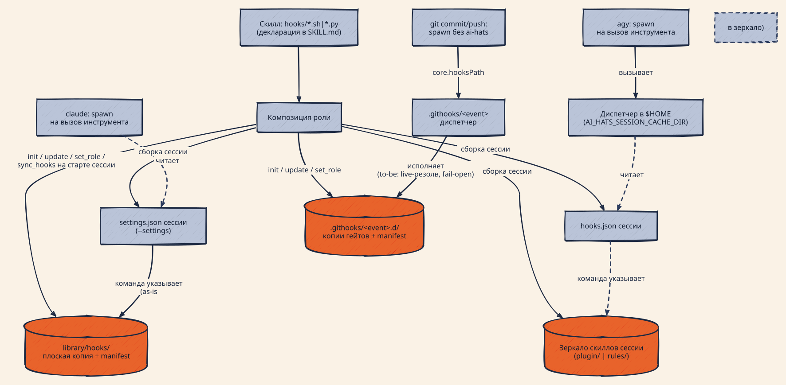

# ADR-0021: Материализация поверхностей — роль, хуки, сессии, кэш, очистка

## Статус

Предложен (HATS-1465, 2026-08-02). Консолидирующий документ по материализации
для эпика HATS-1266: собирает в одно место то, что было распределено по
ADR-0018 [1] (artifact builder, сессионные деревья), ADR-0019 [2]
(checks-снапшот), ADR-0020 [3] (hook-подложка: таксономия, примитив,
git-оркестратор) и карточкам эпика.

Разделение ответственности: **ADR-0020 владеет hook-подложкой** (D1–D4: где
живут скрипты, как исполняются, git-оркестратор, миграция каналов). **Этот
ADR владеет картиной материализации целиком**: сборка роли (композиция и
слои поиска компонентов), подготовка роли на каждой поверхности, интеграция
хуков в неё, install-time установка, параллельные сессии, кэш и очистка. Карта чокпойнтов/ярусов и требования Mx, добавленные
2026-08-02 в ADR-0020 как D5/D6, в тот же день перенесены сюда.

As-is факты замерены на коммите `c533d868` (метод HATS-1465: каждая стрелка —
file:line либо замер; недоказанное помечено `unverified`, не опущено). Каждая
to-be дельта называет карточку-владельца из эпика HATS-1266.

## Контекст

Эпик HATS-1266 потерял четыре посылки, которые в плане стояли как факты
(«живой double-fire», «свип едет на трёх чокпойнтах», «код корень не трогает»,
«диспетчер регистрируется на init»), — и каждую опровергал только замер.
Общая причина: порядок шагов и владельцы записей не были изображены нигде
целиком — каждый читал свой фрагмент и достраивал остальное по памяти.

Вопросы, на которые этот документ обязан отвечать без чтения кода: как
собирается роль для запуска (где ищутся компоненты, какие фильтры
применяются); как она материализуется на каждой поверхности; как в неё
интегрируются хуки; что
именно ставится на `self init`; как несколько сессий материализуются
параллельно; кто и когда чистит устаревшие файлы; как устроен и используется
кэш.

## Решение

### S1 — Карта хранения: пять корней, четыре чокпойнта

Два определения, на которых стоит весь документ, — вводим явно:

- **Корень хранения** — каталог верхнего уровня, у которого один
  писатель-владелец и одно время жизни. Их пять: установленный пакет,
  `<ai_hats_dir>` внутри проекта, корень проекта, `$HOME` и дерево сессии.
  Каждый материализованный файл принадлежит ровно одному корню и наследует
  его правила записи и очистки — поэтому дальше все секции (S2–S8)
  адресуются к этим пяти именам.
- **Чокпойнт** — место в коде, из которого корень разрешено менять. Их
  четыре: install-time `_refresh` (init/update), `set_role`, сборка сессии,
  spawn. Запись в корень мимо его чокпойнта — дефект (M2).

Таблица корней — кто пишет, сколько живёт, что меняет эпик:

| корень                      | пути                                                                                                                                                                                                                        | writer / чокпойнт                                                                                                      | лайфтайм                                                         | to-be дельта (владелец)                                                                                                                                                                                                                                                                                                                                                                                  |
| --------------------------- | --------------------------------------------------------------------------------------------------------------------------------------------------------------------------------------------------------------------------- | ---------------------------------------------------------------------------------------------------------------------- | ---------------------------------------------------------------- | -------------------------------------------------------------------------------------------------------------------------------------------------------------------------------------------------------------------------------------------------------------------------------------------------------------------------------------------------------------------------------------------------------- |
| **package**                 | версионированный venv + указатель `versions/current`                                                                                                                                                                        | `self update` (managed-арм, под `versions_lock`)                                                                       | до следующего update; недособранные/осиротевшие версии сметаются | без изменений                                                                                                                                                                                                                                                                                                                                                                                            |
| **проект, `<ai_hats_dir>`** | каноническая композиция + `user-rules/`, `library/{rules,skills}`, трекер, `sessions/runs/`                                                                                                                                 | install-time `_refresh` и `set_role` (`write_canonical`); rack (трекер); observe (`runs/`)                             | проект                                                           | `library/hooks/` + `.manifest` — **исчезает** (HATS-1268); `library/wt-hooks/` + `.manifest` — **исчезает** (HATS-1269); `tracker/lifecycle-hooks/` — снесён (HATS-1147, done); `sessions/runs/` ограничен GC (HATS-1339)                                                                                                                                                                                |
| **корень проекта**          | диспетчеры `.githooks/<event>` + `core.hooksPath`; managed-строка `.gitignore`                                                                                                                                              | только `ai-hats init`                                                                                                  | переживает `self update` по содержимому                          | копии гейтов `<event>.d/` + `.ai-hats-manifest` — **исчезают**; статический диспетчер, live-резолв, fail-open (HATS-1337). Других корневых файлов нет: проводка в корневом `.claude/settings.json` выметена, со сторожем (HATS-1336, done); `./GEMINI.md` — последняя живая корневая запись (`assembler.py:772-776`) — ретайр либо документированное gitignored-исключение, решается замером (HATS-1338) |
| **`$HOME` (глобальный)**    | `~/.gemini/antigravity-cli/settings.json` (запись agy-диспетчера); `<cache_home>/<project-key>/` (дефолт `~/.cache/ai-hats/`)                                                                                               | сборка agy-сессии — **каждая**, не init (`agy/provider.py:206`, вопреки ADR-0018 §5.1); сборка сессии + recovery-свипы | пользователь / машина                                            | read-modify-write получает лок или CAS (HATS-1338); каждый класс кэша ограничен liveness-aware GC (HATS-1339)                                                                                                                                                                                                                                                                                            |
| **дерево сессии**           | `<cache_root>/sessions/<sid>/` — `prompt.md`; зеркало скиллов (`plugin/skills/` claude, `rules/.agents/skills/` agy, `skills/` cline); `settings.json` (claude) / `hooks.json` (agy); `checks/` (будущее — ADR-0019 [2] D9) | сборка сессии; единственный writer = сессия-владелец (id сессий уникальны на процесс, HATS-1248)                       | сессия; удаляется на выходе; сироты после падения — по TTL       | проводка хуков claude перенацеливается с `library/hooks/<skill>-<basename>` (`surfaces/claude/provider.py:442`) на `<sid>/plugin/skills/<skill>/<script>` (HATS-1268); wt-хуки резолвятся из директорий скиллов через carry (HATS-1269)                                                                                                                                                                  |

Материализованное состояние трогают четыре чокпойнта — и только они:

| чокпойнт                    | триггер                                        | что делает сегодня                                                                                                                                                                                                                                                                                                                                                                                                                        |
| --------------------------- | ---------------------------------------------- | ----------------------------------------------------------------------------------------------------------------------------------------------------------------------------------------------------------------------------------------------------------------------------------------------------------------------------------------------------------------------------------------------------------------------------------------- |
| **install-time `_refresh`** | `self init`, `self update` (bump)              | `_refresh(install_time=True)` — `assembler.py:842-860`; ровно три call-site: `Assembler.init` (`assembler.py:511`), `do_bump` (`cli/assembly.py:1026`), in-process update (`cli/maintenance.py:1867`). Порядок: реестр миграций → свип unclaimed-маркеров → `write_canonical` → `hooks.materialize`. Миграции срабатывают **один раз на проект на шаг** (гейт `migration_step`, `ai_hats_core/migrations.py:75-92`) — *не* на каждом bump |
| **`set_role`**              | первая интерактивная сессия / смена провайдера | `_refresh(install_time=False)` (`assembler.py:770`; единственный вызыватель `composition_seam.py:132`): **без** миграций, **без** unclaimed-свипа — но `write_canonical` и `hooks.materialize` выполняются, а agy пишет `./GEMINI.md` (`assembler.py:772-776`)                                                                                                                                                                            |
| **сборка сессии**           | каждая сессия (HITL и automate)                | recovery-свипы эфемерного состояния (TTL кэшей-сирот, недособранные версии — `environment_recovery.py:122-166`); артефакты по поверхностям в дерево сессии; затем drift-heal `sync_hooks` (`wrap_runner.py:558` → `hooks_manager.py:343-381`), перематериализующий **общие** `library/hooks/`, `library/wt-hooks/` и `.githooks/` из композиции *этой* сессии — вектор разоружения HATS-1439                                              |
| **spawn**                   | вызов инструмента / `git commit` / wt-событие  | claude порождает свои хуки сам из сессионного `settings.json`; agy — через `$HOME`-диспетчер, читающий `AI_HATS_SESSION_CACHE_DIR` (`hook_dispatcher.py:21-34`); wt-хуки порождает ai-hats (`worktree_hooks.py`; примитив ADR-0020 D2 после мержа HATS-1151); git-хуки порождает git через `.githooks/`                                                                                                                                   |

To-be меняет ровно одну строку: **сборка сессии пишет только дерево сессии**
(M2). Drift-heal общих копий исчезает вместе с копиями (HATS-1268/1269), а
установка git-арма целиком уходит за init/update (механизм — plan-развилка
HATS-1337).

### S2 — Сборка роли для запуска: логика до материализации

Что происходит между «пользователь запустил `ai-hats`» и появлением
композиции, которую S3 раскладывает на диск. Всё as-is, file:line — на базе
worktree.

**Имя роли и единственность композиции.** Прецеденс имени — одна цепочка:
`role_override (CLI) → cfg.active_role → cfg.default_role`
(`composition_seam.py:65`); провайдер — `override → cfg.provider`.
Композиция выполняется **один раз на запуск** —
`build_composition_payload` (`composition_seam.py:137`, контракт ADR-0005) —
и едет во все раннеры замороженным `CompositionPayload`; ретраи сабагента
переиспользуют её, `set_role` принимает готовый `result`, второй compose на
запуск — дефект. Кэша композиции **нет**: каждый запуск перечитывает
библиотеку с диска; дисциплина «раз на запуск» держится тредингом payload,
не мемоизацией.

**Где ищем компоненты (слои, последний выигрывает).**
`Assembler._build_library_paths` (`assembler.py:145-191`) собирает
упорядоченную цепочку корней библиотек: (1) встроенная `core/` → (2)
встроенная `usage/` → (3) пакеты через entry-point `ai_hats.skills`
(`skill_sources.py:51`) → (4) пользовательская `~/.ai-hats/` → (5) пути из
`ai-hats.yaml: library_paths:` → (6) проектная `<project>/libraries/` → (7)
явные extra. Резолв компонента — **last-wins**: `LibraryResolver.resolve`
возвращает последнее совпадение (`resolver.py:30-43`), т.е. проектный слой
переопределяет встроенный тем же именем. `<ai_hats_dir>/library/{rules,skills}`
— **не** слой поиска (авторское зеркало). Отдельного ключа для
`ai-hats-custom` не существует — такая библиотека монтируется слоями
(4)/(5)/(6) или через entry-point.

  

<!-- Source: docs/assets/diagrams/component-resolution.d2 — render: docs/assets/diagrams/render.sh -->

**Как складывается композиция.** Единственный вход — фасад
`compose_for_role` (`materialize.py:50-74`; прямой `composer.compose` вне
фасада гейтится тестом `test_no_direct_compose_outside_facade`). Внутри
`Composer.compose` (`composer.py:27`): загрузка конфига роли → **оверлеи**
по слоям — глобальный `~/.ai-hats/customizations.yaml`, затем проектный
`ai-hats.yaml: customizations:` (проектный выигрывает; в каждом слое
`remove` → `append`; `_apply_overlay`, `composer.py:179`) → **развёртка
трейтов** (плоская модель: суб-трейт — ошибка композиции; каждый трейт даёт
rules → skills → checks → инжекцию; `_resolve_traits`, `composer.py:211`) →
собственные rules/skills/checks роли → **дедуп по имени, первый
выигрывает** → инжекции в порядке трейты → роль → overlay-append. Тела
компонентов **не читаются** — резолвится только `(имя, source_path)`;
тумбстоуны (`lifecycle_hooks:`, `plan_sections:`) роняют загрузку метаданных
громко (`libraries/models.py:437-446`). `checks:`-биндинги резолвятся на
композиции с проверками containment / существования / shebang / exec-бита
(`resolve_checks`, `check_points.py:58`).

  

<!-- Source: docs/assets/diagrams/composition-flow.d2 — render: docs/assets/diagrams/render.sh -->

**Результат.** Замороженный `CompositionResult` — rules, skills (списки
`ResolvedComponent` с `source_path`), инжекции (+ views по провенансу),
`checks`, `errors` (`ai_hats_core/composition.py:59-105`). Hook-наборы — не
поля, а чистые деривации над ним (`hook_collection.py`: runtime / wt;
git — `hooks_manager.py:648`). Дальше физика — S3.

**Фильтры на пути к поверхности** (композицию не меняют): в системный
промпт попадают только always-on правила (`providers.py:286`); индекс
скиллов в промпт не включает ни одна из трёх поверхностей — у каждой свой
нативный реестр; `SessionPolicy(context/hooks/settings)` — фильтр
**доставки** на билдере (`providers.py:202-211`), не композиции.

### S3 — Подготовка роли на каждой поверхности

  

<!-- Source: docs/assets/diagrams/session-materialization.d2 — render: docs/assets/diagrams/render.sh -->

**Общая машинерия (as-is).** Единый шов сборки — artifact builder ADR-0018:
категории `CONTEXT / SKILLS / HOOKS / SETTINGS` × режимы `HITL / AUTOMATE`
(`session_artifacts.py:12-44`). Поверхность реализует по методу на пару
`_build_<категория>_<режим>`; базовый класс диспетчит
(`providers.py:147-169`, цикл `:184-212`); отсутствующая пара = доставки нет,
и это видно по телу класса. Каждая запись идёт через порт `Materializer`
(`session_artifacts.py:77-93`) — подставив `PlanMaterializer`, вызыватель
превращает всю сборку в dry-run (план вместо байтов, `dry_run.py:60-71`,
`:123-134`). Вызыватели: HITL — `wrap_runner.py:462-489` (легаси-фолбэк на
`build_session_prompt` для поверхностей до этого шва, `:476-489`); automate —
`subagent_runner.py:192-199`.

Всё складывается в **дерево сессии** `<cache_root>/sessions/<sid>/` (далее
`<sc>`) — вне воркспейса (HATS-1398, S7).

**claude** (`surfaces/claude/provider.py`) — референсная поверхность:

| категория | артефакт                                                               | writer                                                   | доставка HITL                     | доставка AUTOMATE                                   |
| --------- | ---------------------------------------------------------------------- | -------------------------------------------------------- | --------------------------------- | --------------------------------------------------- |
| context   | `<sc>/prompt.md`                                                       | `_write_prompt_file` `:182-191`                          | `--system-prompt-file` `:193-196` | SDK `system_prompt={preset, append}` `:198-211`     |
| skills    | `<sc>/plugin/` — `.claude-plugin/plugin.json` + `skills/<skill>/…`     | `_materialize_plugin` `:215-225` → `plugin_dir.py:28-84` | `--plugin-dir` `:227-229`         | `plugins=[{type: local, path}]` `:231-235`          |
| hooks     | `<sc>/settings.json` (записи из `_desired_runtime_entries` `:391-450`) | `_write_cache_settings` `:239-249`                       | `--settings` `:251-254`           | `settings=<path>` + `setting_sources=[]` `:256-259` |
| settings  | —                                                                      | хендлера нет (`:173`) — категория не доставляется        | —                                 | —                                                   |

**agy** (`packages/surfaces/agy/src/ai_hats_agy/provider.py`):

| категория | артефакт                                                | writer                                                      | доставка                                                                                                           |
| --------- | ------------------------------------------------------- | ----------------------------------------------------------- | ------------------------------------------------------------------------------------------------------------------ |
| context   | HITL: `<sc>/rules/GEMINI.md`; automate: ничего на диске | `:129-145` / инлайн в мета-промпт `:147-155`                | `--add-dir <sc>/rules` `:145`                                                                                      |
| skills    | `<sc>/rules/.agents/skills/<skill>/…`                   | `_materialize_skills` `:159-169` → `materialize_skills_dir` | неявно — agy сам сканирует дерево из `--add-dir`                                                                   |
| hooks     | `<sc>/hooks.json` + запись диспетчера в `$HOME`         | `_deliver_hooks` `:198-211`, манифест `:179-196`            | глобальный диспетчер читает манифест по `AI_HATS_SESSION_CACHE_DIR` `:205`; HITL и automate одинаково (`:213-217`) |

**cline** (`packages/surfaces/cline/src/ai_hats_cline/provider.py`):

| категория      | артефакт                       | writer                          | доставка                                                   |
| -------------- | ------------------------------ | ------------------------------- | ---------------------------------------------------------- |
| context        | ничего на диске                | `:106-117` / `:119-128`         | инлайн: `-s <промпт>` `:117`; automate — мета-промпт       |
| skills         | `<sc>/skills/<skill>/…`        | `_deliver_skills` `:132-144`    | `--config <sc>` (cline сканирует `<config>/skills`) `:142` |
| hooks/settings | **нет по решению** (HATS-1083) | явная пометка в коде (`:85-87`) | гардинг — на уровне харнесса, `SurfaceGuard` (ADR-0018 §4) |

`CLINE_DATA_DIR` пиннит auth/сессии/БД cline обратно в его настоящий дом
(`:211-214`) — конфиг-дерево сессии не утаскивает пользовательский стейт.

**Семантика зеркала скиллов** (общая для трёх поверхностей): wipe-and-rebuild
целиком на каждую сборку — `remove_tree` → `mkdir` → по-скилловый
`copy_tree(skill.source_path, …)` (`plugin_dir.py:49-84`,
`skills_dir.py:113-148`; конвергенция копира — HATS-1271, done, пути
назначения остались по-поверхностными). `SKILL.md` ре-рендерится из
**истока** (плейсхолдеры путей + `{{backlog_fsm_edges}}`), копия никогда не
перечитывается. Зеркало копирует и `hooks/` каждого скилла — сессионное
дерево всегда несёт исполняемую копию каждого задекларированного
hook-скрипта. `scripts/` и `bin/` скиллов из зеркала попадают в PATH сессии
(`skills_dir.py:79-110`), с предупреждениями о коллизиях. У claude рядом с
деревом лежит `plugin.lock` (`plugin_dir.py:40-45`).

Помимо эфемерного дерева пишется **долговечная запись сессии**
`<ai_hats_dir>/sessions/runs/session_<sid>/` (мета-промпт, audit,
`role_materialization.json` — `wrap_runner.py:490-536`): это
observability-данные, их читают retro/reflect, GC на них — политика
HATS-1339, не TTL.

**To-be.** Подготовка роли эпиком не меняется, за одним исключением:
hook-проводка claude перенацеливается в собственное зеркало сессии
(HATS-1268) — см. S4.

### S4 — Интеграция хуков в поверхность

Таксономия каналов и контракт исполнения — ADR-0020 [3] D1/D2/D4. Здесь —
как каналы встроены в материализацию поверхности.

  

<!-- Source: docs/assets/diagrams/hooks-integration.d2 — render: docs/assets/diagrams/render.sh -->

**claude, as-is — платит за две копии.** Зеркало сессии уже несёт каждый
hook-скрипт (S2), но `_desired_runtime_entries` прописывает команды в
`$CLAUDE_PROJECT_DIR/.agent/ai-hats/library/hooks/<skill>-<basename>` —
вторую, плоскую, отдельно управляемую копию (`surfaces/claude/provider.py:442`;
имя — `paths/_dirs.py:424-435`; хук, чей скрипт не резолвится, молча
пропускается `:440-441`). Флэттен теряет соседние файлы данных (живой пример:
`wt_gate.py` читает `code_extensions.json` рядом с собой — в зеркале сосед
есть, в `library/hooks/` его нет, скрипт тихо падает на встроенный дефолт).
**To-be (HATS-1268):** команды указывают в `<sid>/plugin/skills/<skill>/<script>`
— как agy; плоская копия и её полиция исчезают. Гейт против residue:
расхождение написаний корень-vs-сессия взводит double-fire (дедуп claude
2.1.220 держится только на побайтовой идентичности — замер 2026-08-01),
поэтому корень вычищен заранее (HATS-1336, done, со сторожем).

**agy, as-is — уже целевая форма.** `hooks.json` указывает абсолютными
путями в зеркало сессии (`agy/provider.py:182,193`); исполняет глобальный
диспетчер из `$HOME`, который находит манифест по `AI_HATS_SESSION_CACHE_DIR`
(`hook_dispatcher.py:21-34`), без импорта ai-hats на hot path; standalone-agy
без `AI_HATS_SESSION_ID` — no-op. Регистрация диспетчера в
`~/.gemini/antigravity-cli/settings.json` — на **каждой** сборке сессии
(`agy/provider.py:206`), незалоченный read-modify-write — хардening
HATS-1338.

**cline** — хуков нет по решению (HATS-1083), гардинг у `SurfaceGuard`;
вердикт «маппится ли runtime_hooks на cline вообще» — research-карточка
HATS-1340.

**worktree-канал, as-is:** плоские копии в `library/wt-hooks/<skill>-<basename>`
(`hooks_manager.py:264-298`), спавн из `wt_lifecycle.py` (`wt_in`
warn-continue `:65-91`, `wt_out` fail-closed `:93-139`), carry `{skill,
script, on}` персистится в состояние worktree (`wt_carry.py:29-127`).
**To-be (HATS-1269):** исполнение in place из директорий скиллов через
carry, containment-чек сохраняется, compat-шим для существующих worktree.

**git_hooks** — единственный `detached`; контракт оркестратора целиком в
ADR-0020 D3 (реализация HATS-1337).

### S5 — Что ставится на `self init` / `self update`

**`self init`, as-is** (пайплайн `init.yaml`: `select_provider` →
`bootstrap_project` → `prepare_execute_session`; `Assembler.init` —
`assembler.py:315-511`): конфиг + каталоги + на greenfield
`migration_step = latest_step()` → `_refresh(install_time=True)`
(`assembler.py:511`). Хуковая часть `hooks.materialize`
(`hooks_manager.py:164-191`) ставит **три managed-поверхности**, замер на
этом репозитории:

1. **`<ai_hats_dir>/library/hooks/`** + `.manifest`: 4 пакетных гарда
   (`pre_bash_shared_state_guard.sh`, `shared_state_classifier.sh`,
   `bypass_journal.py`, `bypass_journal.sh` — `_write_runtime_guards`
   `hooks_manager.py:222-238`) ∪ по-скилловые флэттен-копии
   (`<skill>-<basename>`, mode `0o755` — `:240-261`); в этом репо — 8
   скилловых скриптов.
2. **`<ai_hats_dir>/library/wt-hooks/`** + `.manifest`: 2 скрипта
   (`hooks_manager.py:264-298`).
3. **`.githooks/`**: по-событийный диспетчер + `<event>.d/` с копиями гейтов
   - `bypass_journal.sh` + `.ai-hats-manifest` + `core.hooksPath=.githooks`
     (`install_git_hooks` `hooks_manager.py:557-645`). В этом репо: `pre-commit.d/`
     ×6 гейтов, `pre-push.d/` ×4, `commit-msg.d/` ×1, `post-commit.d/` ×1.

Сессионная проводка на init **не** пишется (корневой `.claude/settings.json`
не пишется с HATS-1170 и выметается с HATS-1336); agy-диспетчер в `$HOME` на
init **не** регистрируется (только на сборке сессии — S4). Re-init
дополнительно гейтится `assert_runtime_hooks_resolve`
(`migration_assert.py:214-267`; `init_steps.py:220-231`): нерезолвящаяся
команда в настройках — громкий отказ, не тихая поломка.

**`self update`, as-is:** triage → heal → канальный арм (managed blue-green:
установка нового venv под `versions_lock`, флип `versions/current` —
`cli/maintenance.py:455-719`) → авто-bump (`_bump_internal` → `do_bump`,
`cli/assembly.py:971-1060`): snapshot → миграции → композиция →
`_refresh(install_time=True)` → диагностика → тот же гейт резолва. Свип
unclaimed-маркеров на этом чокпойнте выметает residue мёртвых механизмов
(мёртвый owner ⇒ метёт; живой `git-hooks` ⇒ поверхность защищена —
`sweeper.py:228`, `hooks_manager.py:57`).

**To-be:** `init` ставит **только** git-оркестратор (статический диспетчер +
`core.hooksPath`, без ролевой логики и venv-путей) и managed-строку
`.gitignore`; пункты 1–2 исчезают вместе с каналами копий (HATS-1268/1269),
`<event>.d/`-копии и `.ai-hats-manifest` — с HATS-1337. `self update`
перестаёт быть событием перематериализации: оркестратор переживает его по
содержимому, следующий коммит исполняет гейты новой версии без какого-либо
шага (M12); bump-гейт резолва остаётся.

### S6 — Параллельные сессии

**Изоляция по конструкции, as-is.** Один процесс — один session id
(`<YYYYMMDD-HHMMSS>-<counter>-<pid>`, уникальность на процесс — HATS-1248,
`ai_hats_observe/session.py:75-83`); одна сессия составляет ровно одну роль
и запускает ровно одну поверхность, поэтому деревья `<sc>` не пересекаются
по ключу. Межсессионной reconciliation у зеркала нет — её удалили вместе с
ref-counted-локом, когда id стали уникальными (ADR-0018 §2.2); у claude
остался один лок рядом с деревом (`plugin.lock`, `plugin_dir.py:40-45`).

**Что сегодня НЕ изолировано (оба пункта — измеренные инциденты):**

1. **Общие managed-директории.** Session-start drift-heal (`sync_hooks`)
   перематериализует `library/hooks/`, `library/wt-hooks/`, `.githooks/` из
   композиции **своей** роли — сессия с более узкой (или пустой, `result=None`)
   композицией молча разоружает хуки всех остальных живых сессий проекта.
   Измерено дважды: HATS-1439 (7 скилловых runtime-хуков + 2 wt-хука исчезли
   mid-session; кросс-ролевое сужение подтверждено и на wt/git-поверхностях).
   **To-be:** класс растворяется — общих копий не остаётся (M2;
   HATS-1268/1269/1337).
2. **`$HOME`-мерж agy** — незалоченный read-modify-write на каждой сборке
   (`global_hook.py:19-75`); конкурентные сборки могут потерять чужие ключи.
   **To-be:** лок или CAS с ретраем (HATS-1338).

Worktree-параллельность: карточные worktree живут в `$TMPDIR` (вне
воркспейса), их hook-carry — по-worktree'ное состояние; сессия внутри
worktree прыгает к `<ai_hats_dir>` основного чекаута через
`main_worktree_root` (`ai_hats_wt/manager.py:1675-1692`; сквозной путь —
`unverified`, см. ниже).

### S7 — Кэш: структура и использование

**Резолв корня** (`paths/_dirs.py:326-381`): `cache_home()` =
`AI_HATS_CACHE_HOME` → `XDG_CACHE_HOME/ai-hats` → `~/.cache/ai-hats`;
`project_key()` = `<имя-каталога>-<sha256(abs path)[:8]>`; `cache_root()` =
`cache_home()/project_key()`. Env-переменные задают **базу**, не финальный
корень: утёкшая в чужой шелл переменная не может слить кэши двух проектов
(урок HATS-897). Переименование проекта ключ не переживает — кэш
регенерируемый, осиротевший корень достаётся GC.

**Классы содержимого** (все — машинные, регенерируемые; HATS-1398 вынес их
из воркспейса):

- `sessions/<sid>/` — дерево сессии (S3): его читают лончер-флаги
  (`--settings`, `--plugin-dir`, `--system-prompt-file`, `--add-dir`,
  `--config`), SDK-опции automate-пути и agy-диспетчер (по
  `AI_HATS_SESSION_CACHE_DIR`).
- `probe-mirror/` — зеркало проб (основной вес класса на момент переноса,
  202 MB).
- `update-check.json` — кэш проверки апстрима.

Внутри воркспейса кэш-класса не остаётся: e2e-сторож
`tests/e2e/test_session_cache_out_of_tree.py` держит инвариант «за сессию в
воркспейсе не появился ни один файл класса `.cache`».

### S8 — Очистка

**Штатный выход сессии:** её дерево удаляется целиком
(`_cleanup_session_cache`, `runtime_common.py:221-235`; вызовы
`wrap_runner.py:703`, `subagent_runner.py:458`).

**Старт каждой сессии** (`EnvironmentRecovery.run`,
`environment_recovery.py:122-166`) — порядок значим: сначала
`write_current_run_ref` (пин своей версии от reclaim'а), затем TTL-свип
сирот — каталоги `sessions/` старше 24 ч (`SESSION_CACHE_TTL_HOURS = 24`,
`environment_recovery.py:52`) плюс дренаж легаси in-tree `.cache`; под
version-локом — `sweep_incomplete_versions` / `reclaim_orphan_versions` /
`reclaim_legacy_venv`.

**Незакрытые классы (as-is, замерено; владелец — HATS-1339):**

- `sessions/runs/` — долговечные записи: 1069 каталогов / 201 MB, GC
  отсутствует. Это observability-данные (их читают retro/reflect) — нужна
  политика удержания по классам, не TTL.
- TTL-свип **слеп к живости**: сессии дольше 24 ч реальны (наблюдался agy-PID
  с аптаймом 25:50) — свип может снести кэш живой сессии. Цель M9:
  liveness-aware (id несёт pid), недостижимость живого — по конструкции.
- **Межпроектные ключи `cache_home` никто не метёт.** Замер 2026-08-02:
  `~/.cache/ai-hats` — **3330 ключей / 14 ГБ**, подавляющее большинство —
  `bootstrap-*` / `test_*` / `proj-*` от e2e-прогонов; свежайшие датированы
  тем же днём — течь текущая, не историческая. TTL-свип ходит только внутрь
  `sessions/` **текущего** проекта; чужие/осиротевшие ключи вне его
  досягаемости.
- `worktrees/`, `audits/`, `retros/`, `probe-mirror/` — без GC.

### S9 — Требования к материализации

R1–R16 эпика — по-карточные критерии выхода; **Mx** ниже — постоянные
инварианты, которые материализация держит *после* эпика: против них
ревьюится любое будущее изменение этой подсистемы. Статус: **держится** =
верно на `c533d868`; **цель (карточка)** = устанавливается этой карточкой.

- **M1 — Один владелец, заявленный in-band.** Каждый managed-байт несёт своё
  владение in-band (тег `_ai_hats_managed`, префикс `ai-hats:`, owner-keyed
  маркер), и именно эта метка — истина, с которой сверяется любой свип и
  heal, — никогда не побочный whitelist. *Цель (HATS-1463: healer сверяется
  с whitelist базовых имён и мисклассифицирует помеченные записи при
  отсутствующем `library/hooks/.manifest`); сами метки — держится.*
- **M2 — Дисциплина ярус–чокпойнт.** Состояние, разделяемое за пределами
  одной сессии, меняется только на install-time чокпойнтах (init/update).
  Сборка сессии пишет только собственное дерево; сессия никогда не сужает
  общее состояние, от которого зависит другая живая сессия. *Цель — вектор
  разоружения HATS-1439 растворяется вместе с общими копиями
  (HATS-1268/1269); git-арм уходит за init (HATS-1337).*
- **M3 — Идемпотентно, сходяще, хирургично.** Повторный init/update сходится
  к тому же состоянию на диске; миграции срабатывают раз на проект на шаг
  (*держится* — `ai_hats_core/migrations.py:75-92`); residue отставленных
  схем выметается хирургично — только managed-метки, пользовательские байты
  байт-в-байт (*держится* для корневого settings с HATS-1336, включая
  тест-сторож).
- **M4 — Чистый корень.** Ни одна запись провайдера или сессии не попадает в
  корень проекта, кроме `.githooks/`-оркестратора и managed-строки
  `.gitignore`; чистый `git status` необходим, но недостаточен
  (ADR-0018 [1]). *Один нарушитель остался: `./GEMINI.md` — цель
  (HATS-1338).*
- **M5 — Ролевая нейтральность стейта проекта** (супервизор, 2026-08-02).
  Запуск роли не переписывает стейт проекта: менять
  проектное/разделяемое состояние можно на `self init` / `self update`, но
  по содержимому проекта нельзя определить, какая роль запущена или
  запускалась. Явные исключения: `ai-hats.yaml`
  (`active_role`/`default_role` — конфигурация, которую задаёт
  пользователь) и `sessions/runs/` (журнал наблюдаемости — он существует
  ровно затем, чтобы фиксировать запуски). *As-is нарушители: `./GEMINI.md`
  (ролевая инжекция в корне — HATS-1338); ролево-составленные
  `library/hooks/` и `library/wt-hooks/` (HATS-1268/1269);
  ролево-составленные копии `.githooks/<event>.d/` (HATS-1337). To-be:
  git-диспетчер статичен и ролево-независим (набор гейтов резолвится на
  spawn) — стейт проекта перестаёт нести ролевой след.*
- **M6 — Неизменность сессии.** Сессия исполняет одни и те же байты от
  старта до конца: её скрипты и проводка живут в её собственном дереве,
  поэтому ни mid-session `self update` (venv-на-версию), ни конкурентная
  сессия не меняют то, что она запускает. *Держится для промпта, скиллов и
  agy-хуков; цель для hook-скриптов claude (HATS-1268) и wt-хуков
  (HATS-1269).*
- **M7 — Конкурентная безопасность.** Конкурентные сессии с разными ролями
  не загрязняют друг друга (*держится* для per-sid деревьев — HATS-1248);
  каждая оставшаяся межсессионная запись защищена — единственный
  незалоченный read-modify-write это мерж agy-настроек в `$HOME`. *Цель
  (HATS-1338).*
- **M8 — Нет второй managed-копии hook-скрипта** (уточнено по ревью: речь
  именно о **hook-скриптах**, не о прочих артефактах). Три канала копий —
  `library/hooks/`, `library/wt-hooks/`, `.githooks/<event>.d/` — держат
  скилловый hook-скрипт во второй, отдельно управляемой копии с собственным
  манифестом и полицией (drift-арм, детектор утечек); требование — таких
  копий нет, а то, что не может дрейфовать, не нуждается в полиции.
  **Зеркало скиллов сессии — не вторая копия в этом смысле**: у него одна
  сессия-владелец, оно умирает вместе с ней и не может разойтись с
  композицией, которая его построила, — дрейфовать нечему, полицию вешать
  не на что. Карточка, удаляющая копию, в себе же удаляет её сторожей.
  *Цель (HATS-1268/1269/1337; четверть `lifecycle_hooks` — done,
  HATS-1147).*
- **M9 — Ограниченный диск.** У каждого класса материализованных артефактов
  есть владелец и политика удержания; новый запуск убирает мусор
  предыдущего; свипы логируют, что снесли; состояние ЖИВОЙ сессии
  недостижимо для GC **по конструкции**, не по удаче. *Цель (HATS-1339 —
  TTL-свип слеп к живости, `runs/` и межпроектные ключи cache_home без GC
  вовсе; замеры в S8).*
- **M10 — Поведение при отказе следует таксономии.** `in_process`-проводка,
  которая не резолвится, отказывает **громко на этапе сборки** (*держится* —
  гейт bump/init, `migration_assert.py:214-267`) и никогда не деградирует в
  тихий рантайм-промах; `detached` фейлится **открыто на spawn** с одной
  строкой предупреждения (*цель — HATS-1337; сегодняшний backstop диспетчера
  fail-closed*). Выключенный гейт видим человеку, а не только строчкой в
  stderr (*цель — HATS-1439 §4 называет дыру*).
- **M11 — Containment при резолве.** Каждый путь, разрешённый из
  персистентного или композиционного состояния, до spawn проходит
  containment-проверку против корня своего скилла — carry-строки и резолв
  диспетчера одинаково. *Держится сегодня за счёт `Path(...).name` при
  флэттене; свойство обязано пережить удаление флэттена (HATS-1269,
  HATS-1337, HATS-1443).*
- **M12 — Долговечные артефакты переживают `self update`** (сужено по
  ревью). Требование касается ТОЛЬКО артефактов, живущих дольше сессии и
  исполняемых без ai-hats-процесса, — сегодня это ровно git-оркестратор.
  Довод «копируем нужное на старте сессии / настраиваем состояние на
  старте» здесь не работает: человеческий `git commit` случается **между**
  сессиями, и между `self update` и следующим коммитом старта сессии может
  не быть вовсе. Поэтому оркестратор не содержит путей в версионированный
  venv и после update исполняет гейты новой версии без шага
  перематериализации. *Цель (HATS-1337).* Для сессионного состояния такого
  требования **нет** — оно перестраивается на каждом старте (M6, S3), ровно
  как предлагает ревью.
- **M13 — Наблюдаемость.** Материализация, свипы и heal отчитываются о
  сделанном там, где это читает человек (и reflect-контур), — в сессионной
  записи/audit trail, а не только в stderr. *Цель (HATS-1439 §4).*
- **M14 — Расхождение HITL/automate объявлено и компенсировано**
  (супервизор, 2026-08-02). Обе ветки собираются одним билдером — парами
  `_build_<категория>_<режим>` (ADR-0018 [1]); расхождение материализации
  между HITL и automate существует только как явно объявленная пара
  (отсутствующий метод виден по телу класса), никогда как молчаливый
  `else`. Там, где сама поверхность в headless не исполняет хуки,
  компенсация обязана жить на уровне харнесса (`SurfaceGuard`,
  ADR-0018 §4) и быть названа в доке поверхности. *Форма — держится (по
  конструкции билдера); полнота по-поверхностных компенсаций — S3-таблицы и
  surfaces-док (HATS-1341).*
- **M15 — Регистрация хуков декларативна и идёт каналом на его чокпойнте**
  (супервизор, 2026-08-02). Скилл декларирует хук; композиция роли решает,
  что входит в набор; регистрацию выполняет механизм канала на своём
  чокпойнте: runtime — сессионная проводка на сборке сессии
  (`settings.json` claude / `hooks.json` + глобальный диспетчер agy), git —
  установка оркестратора на init, wt — carry в состоянии worktree.
  Регистрация идемпотентна, помечена владельцем (M1) и никогда не
  редактирует пользовательские записи. Нюансы по-канально — S4/S5.
  *Форма — держится; открытые нюансы: лок `$HOME`-мержа (HATS-1338),
  механизм live-резолва git (HATS-1337).*

### unverified — названо, не опущено

- Резолвит ли сессия, запущенная *внутри* task-worktree, `<ai_hats_dir>` в
  основной чекаут на всём пути материализации (хоп существует —
  `ai_hats_wt/manager.py:1675-1692` — сквозной путь не оттрассирован).
- «`./GEMINI.md` — единственная оставшаяся корневая запись всех трёх
  поверхностей»: hook-проводка в корне под сторожем с HATS-1336, goldens
  поверхностей держат `escapes: []`, но единого сторожа «в корень не пишется
  вообще ничего» сегодня нет.
- Производитель свежих (2026-08-02) фикстурных ключей в `~/.cache/ai-hats`
  не установлен: HATS-1398 закрывал течи тестового env
  (`AI_HATS_CACHE_HOME` в denylist/пиннинг `Project`), однако ключи
  продолжают появляться — либо непокрытый тестовый путь, либо параллельные
  прогоны на старой базе.

## Последствия

**Приобретено.** Один документ отвечает на «кто, что, куда, когда пишет и
кто убирает» — класс ошибок «каждый достраивает картину по памяти», съевший
четыре посылки эпика, лишается почвы. Требования Mx дают ревью будущих
изменений подсистемы проверяемый чеклист вместо племенного знания.

**Цена.** Ещё один документ, который обязан не протухать: любая карточка,
меняющая чокпойнт, корень или политику очистки, правит S-секцию здесь — иначе
документ повторит судьбу посылок, ради которых написан. Якорь as-is —
`c533d868`; после посадки карточек эпика as-is-колонки пересматриваются.

**Риск.** Замеры одного репозитория (набор гейтов `.githooks/`, состав
`library/hooks/`) — иллюстрации, не контракт: у другого проекта состав
другой. Контрактные утверждения всегда сопровождены file:line кода, а не
листингом диска.

## Ссылки

- [1] `docs/adr/0018-unified-artifact-builder.md` — artifact builder:
  категории × режимы, clean-root инвариант, референсная реализация claude,
  agy global dispatcher (с поправками HATS-1465).
- [2] `docs/adr/0019-declarative-lifecycle-extension-model.md` — будущий
  `checks:`-канал и его снапшот-корень (D9) — четвёртый класс содержимого
  дерева сессии.
- [3] `docs/adr/0020-hook-execution-and-materialization-substrate.md` —
  hook-подложка: таксономия `in_process`/`detached` (D1), примитив
  исполнения (D2), git-оркестратор (D3), миграция каналов (D4).
