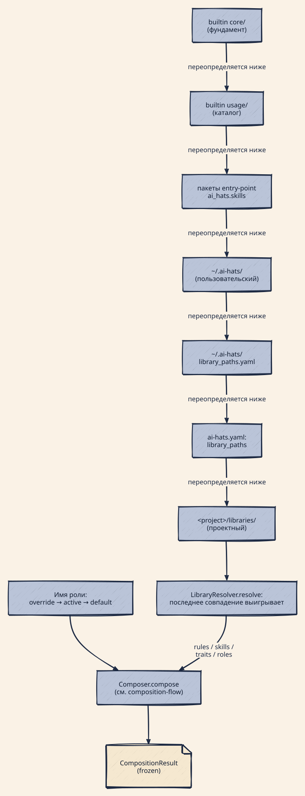
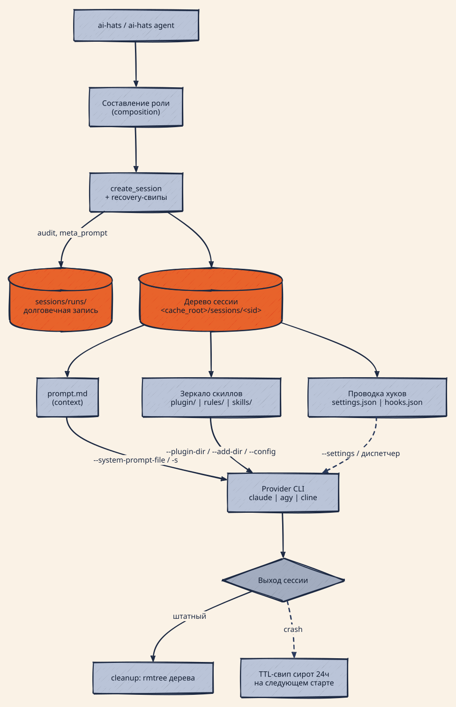
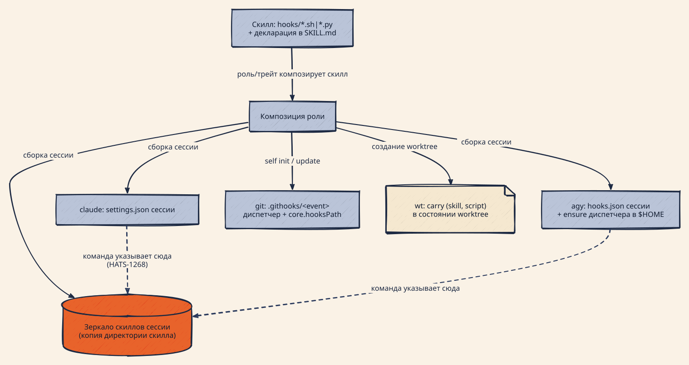
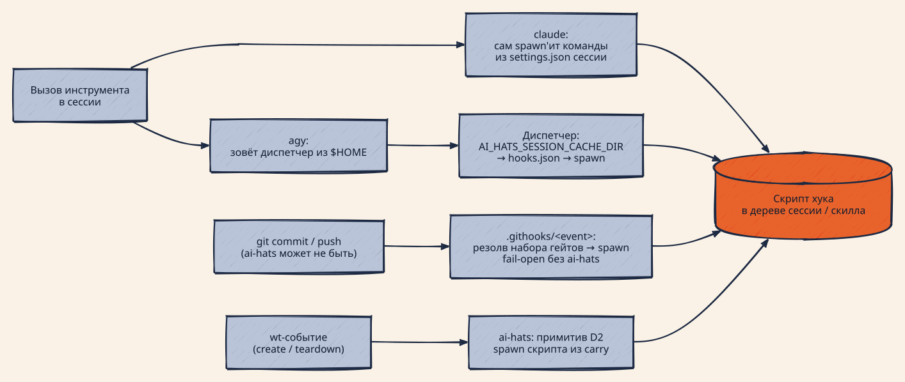

# ADR-0021: Материализация поверхностей — роль, хуки, сессии, кэш, очистка

## Статус

Предложен (HATS-1465, 2026-08-02). Консолидирующий документ по материализации
для эпика HATS-1266: собирает в одно место то, что было распределено по
ADR-0018 [1] (artifact builder, сессионные деревья), ADR-0019 [2]
(корень исполнения bound-чеков), ADR-0020 [3] (hook-подложка: таксономия, примитив,
git-оркестратор) и карточкам эпика.

Разделение ответственности: **ADR-0020 владеет hook-подложкой** (D1–D4: где
живут скрипты, как исполняются, git-оркестратор, миграция каналов). **Этот
ADR владеет картиной материализации целиком**: что такое роль и как она
собирается, как материализуется на каждой поверхности, как интегрируются
хуки, что ставится на install, параллельные сессии, кэш и очистка.

**Голос документа — to-be** (ревью 2026-08-03): описывается система по
завершении эпика; там, где сегодня иначе, стоит врезка «Сегодня (до
HATS-NNNN)» с замеренным фактом и карточкой, которая это правит. Замеры и
file:line сняты на базе `c533d868`; недоказанное помечено `unverified`, не
опущено.

## Контекст

Эпик HATS-1266 потерял четыре посылки, которые в плане стояли как факты
(«живой double-fire», «свип отрабатывает на трёх точках», «код корень не трогает»,
«диспетчер регистрируется на init»), — и каждую опровергал только замер.
Общая причина: порядок шагов и владельцы записей не были изображены нигде
целиком — каждый читал свой фрагмент и достраивал остальное по памяти.

Вопросы, на которые этот документ обязан отвечать без чтения кода: что такое
роль и как она собирается (логика, дерево переопределений, что получает
материализатор); как роль материализуется на каждой поверхности; как
интегрируются хуки; что именно ставится на `self init`; как несколько сессий
материализуются параллельно; кто и когда чистит устаревшие файлы; зачем
нужен кэш и как он устроен.

## Решение

### S1 — Роль: что это и как она собирается

**Что такое роль.** Роль — именованный компонент библиотеки
(`roles/<name>/config.yaml`), декларирующий состав агента: **трейты**
(плоские бандлы: правила + скиллы + checks + текст инжекции; суб-трейтов
нет — трейт в трейте роняет композицию), собственные **правила** и
**скиллы**, собственную **инжекцию** (текст в системный промпт) и
**priorities**. Роль — это декларация; всё исполняемое (скрипты хуков,
тела скиллов) живёт в директориях скиллов и правил, на которые роль лишь
ссылается по имени.

**Дерево переопределений** — что откуда берётся при запуске:

| параметр           | CLI                        | проект (`ai-hats.yaml`)                                   | глобал (`~/.ai-hats/`)         |
| ------------------ | -------------------------- | --------------------------------------------------------- | ------------------------------ |
| имя роли           | `role_override` (1-й)      | `active_role` (2-й) → `default_role` (3-й)                | —                              |
| провайдер          | override (1-й)             | `provider` (2-й)                                          | —                              |
| оверлеи композиции | —                          | `customizations:` (применяется **последним**, выигрывает) | `customizations.yaml` (первым) |
| слои библиотек     | `--library` extra (высший) | `library_paths:`, `<project>/libraries/`                  | `~/.ai-hats/`                  |

Прецеденс имени роли — одна цепочка в одном месте
(`composition_seam.py:65`); композиция выполняется **один раз на запуск**
(`build_composition_payload`, `composition_seam.py:137`, контракт ADR-0005)
и едет во все раннеры замороженным `CompositionPayload`; ретраи сабагента
переиспользуют её. Кэша композиции **нет** — каждый запуск перечитывает
библиотеку с диска; «раз на запуск» держится тредингом payload, не
мемоизацией.

**Где ищутся компоненты (слои, последний выигрывает).**
`Assembler._build_library_paths` (`assembler.py:145-191`) собирает
упорядоченную цепочку: (1) встроенная `core/` → (2) встроенная `usage/` →
(3) пакеты через entry-point `ai_hats.skills` → (4) пользовательская
`~/.ai-hats/` → (5) пути из `ai-hats.yaml: library_paths:` → (6) проектная
`<project>/libraries/` → (7) явные extra. Резолв компонента —
**last-wins**: возвращается последнее совпадение (`resolver.py:30-43`),
т.е. проектный слой переопределяет встроенный тем же именем.
`<ai_hats_dir>/library/{rules,skills}` — **не** слой поиска (авторское
зеркало). Отдельного ключа для внешней библиотеки (ai-hats-custom) нет —
она монтируется слоями (4)/(5)/(6) или через entry-point.

  

<!-- Source: docs/assets/diagrams/component-resolution.d2 — render: docs/assets/diagrams/render.sh -->

**Логика композиции.** Единственный вход — фасад `compose_for_role`
(`materialize.py:50-74`; прямой compose вне фасада гейтится тестом). Внутри
`Composer.compose` (`composer.py:27`): загрузка конфига роли → **оверлеи**
по слоям (глобальный, затем проектный; в каждом слое `remove` → `append`) →
**развёртка трейтов** (каждый даёт правила → скиллы → checks → инжекцию) →
собственные правила/скиллы/checks роли → **дедуп по имени, первый
выигрывает** (у checks ключ другой — `(skill, script, point)`, и выигрывает
не первый, а строжайший `on_error`) → инжекции в порядке трейты → роль →
overlay-append. Тела
компонентов не читаются — резолвится только `(имя, source_path)`;
тумбстоуны ретайрнутых деклараций (`lifecycle_hooks:`) роняют композицию
громко (`libraries/models.py:437-446`).

  

<!-- Source: docs/assets/diagrams/composition-flow.d2 — render: docs/assets/diagrams/render.sh -->

**Что получает материализатор на вход** — замороженный `CompositionResult`
(`ai_hats_core/composition.py:59-105`). Его артефакты, по группам:

#### Промпт-артефакты

Из них собирается системный промпт, секциями в этом порядке:
`## PRIORITIES` → инжекции → `## RULES` → `## USER RULES`
(`providers.py:260-319`).

- **`priorities`** — ранжированный список приоритетов из конфига корневой
  роли. Отдельного механизма доставки не имеет — это просто первая секция
  промпта; отдельным артефактом материализации не является (по ревью
  2026-08-03), поэтому дальше в документе не упоминается.
- **`[injections]`** — тексты инжекций трейтов, роли и оверлеев, склеенные
  в `merged_injection`. Главный носитель поведения роли: то, что роль
  «говорит» агенту.
- **`[rules]`** — резолвленные правила `(имя, source_path)`. В тело промпта
  попадают только **always-on** правила (фиксированный короткий набор
  `ALWAYS_ON_RULES` в `constants.py` или правила с `delivery: always_on` в
  `metadata.yaml`, HATS-1511). Не-always-on правило до агента доводит инжекция
  его трейта: выжимка + указатель «see rule X»; pre-commit гейт rule-delivery
  (`rule_delivery.py:56-67`) запрещает инжекции указывать на правило,
  которое агент прочитать не сможет.
- **`[user_rules]`** — файлы `user-rules/` проекта; в промпт целиком, без
  фильтра.

Отличие трёх текстовых групп: `[rules]` — переиспользуемые компоненты
**библиотеки** (тело в директории правила, композируются по имени);
`[injections]` — тексты **композиции** (пишутся в конфиге трейта/роли, не
существуют вне её); `[user_rules]` — локальные файлы **проекта**, вне
библиотеки и композиции вообще.

#### Скиллы

- **`[skills]`** — резолвленные скиллы `(имя, source_path)`; копируются в
  зеркало сессии директориями целиком — тело, `hooks/`, `scripts/`,
  файлы данных.

#### Хуки — деривации над `[skills]`

Наборы хуков — не поля результата: они вычисляются из деклараций
композированных скиллов (`hook_collection.py`, git —
`hooks_manager.py:648`). Что это по каналам:

- **`[runtime_hooks]`** — скрипты, которые **поверхность** вызывает на
  события сессии (PreToolUse/PostToolUse и т.п.): гейты инструментов агента
  — safety-guard, tool-call-hygiene, линтеры. Уходят в проводку сессии
  (`settings.json` claude / `hooks.json` agy).
- **`[wt_hooks]`** — скрипты жизненного цикла task-worktree: `wt_in` на
  создании (например provision venv), `wt_out` на teardown (например дренаж
  ревью-заметок перед мержем). Уходят в carry состояния worktree.
- **`[git_hooks]`** — гейты git-событий (pre-commit/pre-push/…),
  исполняются git'ом даже когда ai-hats на машине нет. Регистрируются
  git-оркестратором на install (S6).
- **`[checks]`** — проверки на рёбрах FSM бэклога и wt-точках («нельзя
  `review→done` с неразобранными ревью-заметками»), ADR-0019 [2]. Декларация,
  каталог точек и валидация — *реализовано (HATS-1140)*; исполнение на рёбрах
  `edge:` — *реализовано (HATS-1141)*; резолвинг из зеркала скиллов сессии —
  *реализовано (HATS-1540)*, собственного снапшота `checks/` у канала больше нет.
  Точка `wt:pre-merge` срабатывает внутри `merge()` — *реализовано (HATS-1540)*;
  `card:` и остальные `wt:` в каталоге объявлены, но вызывающего у них нет
  (ADR-0019 [2] D3).

Сводно — куда что раскладывается:

| артефакт          | куда идёт при материализации                             |
| ----------------- | -------------------------------------------------------- |
| промпт-артефакты  | системный промпт (`prompt.md` / `-s` / SDK)              |
| `[skills]`        | зеркало скиллов сессии, директориями целиком             |
| `[runtime_hooks]` | проводка хуков сессии (`settings.json` / `hooks.json`)   |
| `[wt_hooks]`      | carry в состоянии worktree                               |
| `[git_hooks]`     | git-оркестратор (install-time)                           |
| `[checks]`        | резолв из композиции; зеркало скиллов сессии (HATS-1540) |

Материализатор ничего не изобретает — он раскладывает эти артефакты по
корням из S3.

### S2 — Требования к материализации

Постоянные инварианты, против которых ревьюится любое изменение этой
подсистемы. Статус: **держится** = верно сегодня; **цель** = устанавливается
названной карточкой (техдолг-таблица ниже). Ссылок на код здесь нет
намеренно — только требования, карточки и **сторожа**: чем требование
проверяется сегодня (тест/гейт) либо честное «сторожа нет». Фактура — в
S3–S9.

- **M1 — Записи в чужих файлах помечены.** Всё, что ai-hats пишет в файлы,
  которыми владеет не он один (пользовательские settings, `$HOME`,
  `.gitignore`), несёт метку владения, и любая чистка или миграция доверяет
  только метке — никогда спискам имён. Метка нужна ровно потому, что такие
  записи живут дольше сессий: их надо уметь снять и через год, не гадая,
  что здесь наше, а что пользовательское. *Метки — держится; сверка по
  метке — цель (HATS-1463). Сторож: `tests/e2e/test_root_residue_swept.py`
  (пользовательские записи байт-в-байт); ветка healer'а с отсутствующим
  манифестом — теста нет (названо в HATS-1463).*
- **M2 — Проект меняется только на init/update.** Всё, что переживает
  сессию (директории проекта, git-хуки, глобальные настройки), пишется
  только из `self init` / `self update`. Сборка сессии пишет только
  собственное дерево сессии и никогда не трогает то, от чего зависят другие
  живые сессии. *Держится: claude-runtime — HATS-1268 + HATS-1480 (общей
  директории больше нет), wt — HATS-1269, git — HATS-1337. HATS-1439
  растворён вместе с копией, а не пропатчен. Сторож:
  `tests/e2e/test_session_wiring_survives_later_materialization.py`
  (GREEN-пин).*
- **M3 — Идемпотентный init/update.** Повторный запуск сходится к тому же
  состоянию на диске; миграции срабатывают один раз на проект; чистка
  residue отставленных схем хирургична — снимаются только помеченные записи
  (M1), пользовательские байты нетронуты. *Держится. Сторож:
  `tests/e2e/test_self_bump_unclaimed_sweep.py` +
  `tests/e2e/test_root_residue_swept.py` (прецедент HATS-1336).*
- **M4 — В корне проекта ai-hats владеет двумя вещами.** `.githooks/` и
  одна managed-строка `.gitignore` — больше ни одного файла ai-hats,
  провайдера или сессии в корне. Чистый `git status` необходим, но
  недостаточен: gitignored-остатки — тоже нарушение (ADR-0018 [1]). *Один
  нарушитель — цель (HATS-1338). Сторожи: `tests/e2e/test_clean_root_sentinel.py`
  (GREEN claude, RED-xfail agy HATS-1338),
  `test_root_carries_no_ai_hats_hook_commands_after_sweep` (только hook-проводка)
  и goldens поверхностей (`escapes: []`).*
- **M5 — Ролевая нейтральность стейта проекта.** Запуск роли не переписывает
  стейт проекта: менять проектное/разделяемое состояние можно на
  `self init` / `self update`, но по содержимому проекта нельзя определить,
  какая роль запущена или запускалась. Явные исключения: `ai-hats.yaml`
  (конфигурация, которую задаёт пользователь) и `sessions/runs/` (журнал
  наблюдаемости). *Один нарушитель — цель (HATS-1338); hook-поверхности
  закрыты (HATS-1268/1480, wt — HATS-1269, git — HATS-1337). Сторож на
  отсутствие общей директории:
  `tests/e2e/test_retired_hooks_dir_never_recreated.py`. Сторожа на само
  свойство «узкая роль не сужает поверхность» **сейчас нет**: прежний
  `test_role_switch_does_not_narrow_hooks` стоял на предусловии, которое
  снятие копии сделало неудовлетворимым — долг HATS-1500.*
- **M6 — Неизменность сессии.** Сессия исполняет одни и те же байты от
  старта до конца: её скрипты и проводка живут в её собственном дереве,
  поэтому ни mid-session `self update`, ни конкурентная сессия не меняют то,
  что она запускает. *Держится для промпта/скиллов/agy-хуков и для
  hook-скриптов claude (HATS-1268 перенацелил проводку, HATS-1480 снял
  общую директорию). **Для wt-хуков неприменимо по
  построению**: канал межсессионный (create в одной сессии, teardown в
  другой), так что per-session инвариант к нему не сводится, а `in_process`
  резолвит их свежим на spawn намеренно (ADR-0020 [4] D1) — mid-session
  `self update` меняет то, что запустится на teardown. HATS-1269 закрыл
  здесь только половину про конкурентную сессию: общей копии, которую
  композиция соседа перезаписывала и свипала из-под живого worktree, больше
  нет. Сторож:
  `tests/e2e/test_session_wiring_survives_later_materialization.py`
  (GREEN-пин с HATS-1268).*
- **M7 — Конкурентная безопасность.** Конкурентные сессии с разными ролями
  не загрязняют друг друга (*держится* для per-sid деревьев); каждая
  оставшаяся межсессионная запись защищена локом или CAS. *Цель
  (HATS-1338). Сторожа нет; стресс на `$HOME`-мерж — план HATS-1338.*
- **M8 — Нет второй managed-копии hook-скрипта.** Речь именно о
  hook-скриптах: скилловый скрипт не существует во второй, отдельно
  управляемой копии с собственным манифестом и полицией. Зеркало скиллов
  сессии — не вторая копия в этом смысле: один владелец, умирает с сессией,
  разойтись с композицией не может. Карточка, удаляющая копию, в себе же
  удаляет её сторожей. *Держится: `lifecycle_hooks` — HATS-1147,
  `wt-hooks` — HATS-1269, `library/hooks` — HATS-1480, git — HATS-1337.
  Второй managed-копии hook-скрипта в системе не осталось. Сторожа:
  `tests/e2e/test_lifecycle_hooks_retired.py` (тумбстоун снесённого канала) и
  `tests/e2e/test_retired_hooks_dir_never_recreated.py` (копия не воскресает
  ни на init, ни на смене роли).*
- **M9 — Ограниченный диск.** У каждого класса материализованных артефактов
  есть владелец и политика удержания; новый запуск убирает мусор
  предыдущего; свипы логируют, что снесли; состояние живой сессии
  недостижимо для GC по конструкции, не по удаче. *Частично держится
  (HATS-1473): межпроектные ключи `cache_home` метёт TTL-свип на старте
  сессии; удержание ВНУТРИ ключа (`runs/`, `probe-mirror/`) — цель
  HATS-1339. Сторожа: `tests/e2e/test_session_cache_out_of_tree.py` (кэш
  вне воркспейса), `tests/e2e/test_cache_key_gc.py` (свип соседних ключей),
  `_real_cache_home_tripwire` в корневом `conftest.py` (тесты не пишут в
  реальный `cache_home`).*
- **M10 — Поведение при отказе следует таксономии.** `in_process`-проводка,
  которая не резолвится, отказывает громко на этапе сборки (*держится* —
  гейт bump/init) и никогда не деградирует в тихий рантайм-промах;
  `detached` фейлится открыто на spawn с одной строкой предупреждения
  (*держится — HATS-1337*). Выключенный гейт видим человеку, а не только
  строчкой в stderr (*цель — HATS-1439 называет дыру*). *Сторож: сам гейт
  резолва — отказ громкий по построению; на detached-половину —
  `tests/e2e/test_githooks_orchestrator.py::test_a_commit_lands_when_ai_hats_is_gone`.*
- **M11 — Containment при резолве.** Каждый путь, разрешённый из
  персистентного или композиционного состояния, до spawn проходит
  containment-проверку против корня своего скилла — carry-строки и резолв
  диспетчера одинаково. *Для worktree-канала держится намеренно — флэттен
  снят, containment на месте (HATS-1269, done): имя скилла обязано быть
  простым именем, а резолвнутый путь — лежать под корнем своего скилла. Для
  claude-runtime — **цель**: команда строится от объявления скилла
  (`provider.py`, с HATS-1268), а `resolve_skill_script` containment не
  проверяет — дыру закрывает HATS-1443. Снятие флэттена в HATS-1480 её не
  расширило: на копию проводка перестала смотреть ещё в HATS-1268. Для git —
  цель (HATS-1337, HATS-1443). Сторож wt-половины:
  `tests/test_wt_hook_inplace_resolution.py`.*
- **M12 — Git-гейты переживают `self update` без переустановки.**
  Поставленный на init диспетчер не привязан к версии ai-hats (никаких
  путей в конкретный venv): после обновления следующий `git commit` —
  который может случиться раньше любого старта сессии — сам исполняет гейты
  уже новой версии, без шага переустановки. Для сессионного состояния
  такого требования нет — оно перестраивается на каждом старте (M6).
  *Держится (HATS-1337). Сторож:
  `tests/e2e/test_githooks_orchestrator.py::test_the_next_commit_after_an_update_runs_the_new_gates`
  — коммит после подмены гейта видит новую версию, а байты диспетчера не
  меняются.*
- **M13 — Наблюдаемость.** Материализация, свипы и heal отчитываются о
  сделанном там, где это увидит человек, — в сессионной записи/audit trail,
  а не только строчкой в stderr. *Цель (HATS-1439). Сторожа нет.*
- **M14 — Расхождение HITL/automate объявлено и компенсировано.**
  Материализация HITL и automate различается только явно объявленными
  местами и никогда — молча; где поверхность в headless не исполняет хуки,
  принуждение берёт на себя харнесс. Подробно — блок «HITL против
  automate» в S4. *Форма — держится; полнота компенсаций — HATS-1341.
  Сторож: goldens поверхностей + сама конструкция билдера (отсутствующая
  пара видна по телу класса).*
- **M15 — Регистрация хуков декларативна и идёт своим каналом.** Скилл
  декларирует хук; композиция роли решает, что входит в набор; регистрацию
  выполняет механизм канала в своей точке записи: runtime — на сборке
  сессии, git — на init, wt — на создании worktree. Регистрация
  идемпотентна, помечена владельцем (M1) и никогда не редактирует
  пользовательские записи. **Исключение — `checks`: точки записи у канала нет
  по устройству**, набор заморожен в композиции и резолвится на spawn (S5), так
  что регистрировать нечего и рассинхронизироваться нечему. *Форма — держится; открытые нюансы —
  HATS-1337/1338. Сторож: chain-тесты
  `tests/e2e/test_hook_chain_permissions.py` и
  `tests/e2e/test_hook_chain_fail_open_recorded.py` — проверяют составленную
  проводку целиком.*

**Техдолг** — карточки-баги/долги и требования, которые они закрывают:

| карточка      | дефект                                                                                                                                                                                                                             | закрывает        |
| ------------- | ---------------------------------------------------------------------------------------------------------------------------------------------------------------------------------------------------------------------------------- | ---------------- |
| HATS-1268     | ~~проводка claude смотрит в плоскую копию~~ — снято: команды резолвятся в зеркало сессии                                                                                                                                           | M2, M6           |
| ~~HATS-1480~~ | ~~плоская копия `library/hooks/` + манифест + drift-арм ещё живы~~ — **закрыт**: копия `library/hooks/` + `.manifest` снесена, drift-net ретайрен, residue выметен миграцией step 10                                               | M5, M8           |
| ~~HATS-1269~~ | ~~wt-хуки исполняются из копии `library/wt-hooks/`~~ — **закрыт**: спавн in place из директории скилла, копии/манифеста/свипа/drift-арма нет, residue снесён миграцией step 9                                                      | M2, M8, M11      |
| ~~HATS-1337~~ | ~~git-гейты — копии + манифест + fail-closed бэкстоп; относительный `core.hooksPath` глушит гейты в worktree~~ — **закрыт**: в `.githooks/` только диспетчер, набор гейтов резолвится live, fail-open, `core.hooksPath` абсолютный | M5, M8, M10, M12 |
| HATS-1338     | `./GEMINI.md` в корне проекта; незалоченный `$HOME`-мерж agy                                                                                                                                                                       | M4, M5, M7       |
| HATS-1439     | сессия сужает общие hook-директории под другими живыми сессиями (растворяется удалением копий)                                                                                                                                     | M2, M7, M10, M13 |
| HATS-1463     | healer классифицирует hook-записи по whitelist вместо тега владения                                                                                                                                                                | M1               |
| HATS-1339     | GC: `runs/` без политики удержания; TTL-свип слеп к живости сессий                                                                                                                                                                 | M9               |
| ~~HATS-1473~~ | ~~e2e течёт фикстурными ключами в реальный `cache_home`; межпроектные ключи не метёт никто~~ — закрыто                                                                                                                             | M9               |
| HATS-1443     | `resolve_skill_script` не проверяет, что путь остался внутри директории скилла                                                                                                                                                     | M11              |
| HATS-1474     | `set_role` остаётся точкой записи (`write_canonical`); потребитель канонического зеркала не установлен                                                                                                                             | M2, M5           |
| HATS-1475     | automate: `extra_env` не доезжает до процесса сабагента — agy-хуки мертвы, `SessionReport.env` лжёт                                                                                                                                | M14, M15         |

### S3 — Карта хранения: пять корней, четыре точки записи

Два определения, на которых стоит физика документа:

- **Корень хранения** — каталог верхнего уровня, у которого один
  писатель-владелец и одно время жизни. Их пять: установленный пакет,
  `<ai_hats_dir>` внутри проекта, корень проекта, `$HOME` и дерево сессии.
  Каждый материализованный файл принадлежит ровно одному корню и наследует
  его правила записи и очистки.
- **Точка записи** — место в коде, из которого корень разрешено менять.
  Сегодня их четыре: install-time `_refresh` (init/update), `set_role`,
  сборка сессии, spawn. Запись в корень мимо его точки записи — дефект (M2).

> **Рулинг супервизора (2026-08-03): `set_role` как точка записи —
> пережиток.** В to-be точек записи три: init/update, сборка сессии, spawn.
> Из set_role хуковая материализация уходит с HATS-1268/1337 (wt-половина
> ушла с HATS-1269),
> `./GEMINI.md` — с HATS-1338; остаётся `write_canonical`, чей потребитель
> не установлен, а ролево-зависимое содержимое конфликтует с буквой M5.
> Судьбу канонического зеркала и перенос записи на init/update решает
> **HATS-1474**; до неё set_role числится в таблице как as-is. Сам
> `set_role` в любом исходе остаётся конфигурационной операцией
> (`active_role` в `ai-hats.yaml`).

Таблица корней — кто пишет, сколько живёт, что меняет эпик:

| корень                      | пути                                                                                                                                                                                                                                                                                                         | кто пишет / когда                                                                                                      | лайфтайм                                                         | to-be дельта (владелец)                                                                                                                                                                                                                                                                                                                                                                                                                              |
| --------------------------- | ------------------------------------------------------------------------------------------------------------------------------------------------------------------------------------------------------------------------------------------------------------------------------------------------------------ | ---------------------------------------------------------------------------------------------------------------------- | ---------------------------------------------------------------- | ---------------------------------------------------------------------------------------------------------------------------------------------------------------------------------------------------------------------------------------------------------------------------------------------------------------------------------------------------------------------------------------------------------------------------------------------------- |
| **package**                 | версионированный venv + указатель `versions/current`                                                                                                                                                                                                                                                         | `self update` (managed-арм, под `versions_lock`)                                                                       | до следующего update; недособранные/осиротевшие версии сметаются | без изменений                                                                                                                                                                                                                                                                                                                                                                                                                                        |
| **проект, `<ai_hats_dir>`** | каноническая композиция + `user-rules/`, `library/{rules,skills}`, трекер, `sessions/runs/`                                                                                                                                                                                                                  | install-time `_refresh` и `set_role` (`write_canonical`); rack (трекер); observe (`runs/`)                             | проект                                                           | `library/hooks/` + `.manifest` — снесён (HATS-1480, done — миграция step 10; проводка отцеплена от неё в HATS-1268); `library/wt-hooks/` + `.manifest` — снесён (HATS-1269, done — миграция step 9); `tracker/lifecycle-hooks/` — снесён (HATS-1147, done); `sessions/runs/` ограничен GC (HATS-1339)                                                                                                                                                |
| **корень проекта**          | диспетчеры `.githooks/<event>` + `core.hooksPath`; managed-строка `.gitignore`                                                                                                                                                                                                                               | только `ai-hats init`                                                                                                  | переживает `self update` по содержимому                          | копии гейтов `<event>.d/` и `.ai-hats-manifest` **исчезли**; остался статический диспетчер с live-резолвом и fail-open, `core.hooksPath` абсолютный (HATS-1337, done). Других корневых файлов нет: проводка в корневом `.claude/settings.json` выметена, со сторожем (HATS-1336, done); `./GEMINI.md` — последняя живая корневая запись (`assembler.py:772-776`) — ретайр либо документированное gitignored-исключение, решается замером (HATS-1338) |
| **`$HOME` (глобальный)**    | `~/.gemini/antigravity-cli/settings.json` (запись agy-диспетчера); `<cache_home>/<project-key>/` (дефолт `~/.cache/ai-hats/`)                                                                                                                                                                                | сборка agy-сессии — **каждая**, не init (`agy/provider.py:206`, вопреки ADR-0018 §5.1); сборка сессии + recovery-свипы | пользователь / машина                                            | read-modify-write получает лок или CAS (HATS-1338); каждый класс кэша ограничен liveness-aware GC (HATS-1339)                                                                                                                                                                                                                                                                                                                                        |
| **дерево сессии**           | `<cache_root>/sessions/<sid>/` — `prompt.md`; зеркало скиллов (`plugin/skills/` claude, `rules/.agents/skills/` agy, `skills/` cline); `settings.json` (claude) / `hooks.json` (agy). Зеркало скиллов — оно же корень исполнения bound-чеков (*HATS-1540*, ADR-0019 [2] D9); отдельного `checks/` больше нет | сборка сессии; единственный writer = сессия-владелец (id сессий уникальны на процесс, HATS-1248)                       | сессия; удаляется на выходе; сироты после падения — по TTL       | проводка хуков claude перенацеливается с `library/hooks/<skill>-<basename>` (`surfaces/claude/provider.py:442`) на `<sid>/plugin/skills/<skill>/<script>` (HATS-1268); wt-хуки резолвятся из директорий скиллов через carry (HATS-1269, done)                                                                                                                                                                                                        |

Материализованное состояние трогают четыре точки записи — и только они:

| точка записи                | триггер                                        | что делает                                                                                                                                                                                                                                                                                                                                                                                                                                |
| --------------------------- | ---------------------------------------------- | ----------------------------------------------------------------------------------------------------------------------------------------------------------------------------------------------------------------------------------------------------------------------------------------------------------------------------------------------------------------------------------------------------------------------------------------- |
| **install-time `_refresh`** | `self init`, `self update` (bump)              | `_refresh(install_time=True)` — `assembler.py:842-860`; ровно три call-site: `Assembler.init` (`assembler.py:511`), `do_bump` (`cli/assembly.py:1026`), in-process update (`cli/maintenance.py:1867`). Порядок: реестр миграций → свип unclaimed-маркеров → `write_canonical` → `hooks.materialize`. Миграции срабатывают **один раз на проект на шаг** (гейт `migration_step`, `ai_hats_core/migrations.py:75-92`) — *не* на каждом bump |
| **`set_role`**              | первая интерактивная сессия / смена провайдера | `_refresh(install_time=False)` (`assembler.py:770`; единственный вызыватель `composition_seam.py:132`): **без** миграций, **без** unclaimed-свипа — но `write_canonical` и `hooks.materialize` выполняются. Сегодня (до HATS-1338) agy здесь же пишет `./GEMINI.md` (`assembler.py:772-776`)                                                                                                                                              |
| **сборка сессии**           | каждая сессия (HITL и automate)                | recovery-свипы эфемерного состояния (TTL кэшей-сирот, недособранные версии — `environment_recovery.py:122-166`); артефакты по поверхностям в дерево сессии. Общих hook-директорий больше нет, поэтому session-start drift-heal `sync_hooks` ретайрен целиком (HATS-1480) — вектор HATS-1439 растворён, а не пропатчен                                                                                                                     |
| **spawn**                   | вызов инструмента / `git commit` / wt-событие  | claude порождает свои хуки сам из сессионного `settings.json`; agy — через `$HOME`-диспетчер, читающий `AI_HATS_SESSION_CACHE_DIR` (`hook_dispatcher.py:21-34`); wt-хуки порождает ai-hats (примитив ADR-0020 D2); git-хуки порождает git через `.githooks/`                                                                                                                                                                              |

### S4 — Материализация роли на поверхности

#### Сквозной прогон запуска

Полный путь от команды до убранного за собой каталога; каждый шаг называет
участников и секцию с деталями:

1. **Запуск**: `ai-hats` (HITL) или `ai-hats agent <role>` (automate).
2. **Композиция — один раз** (`build_composition_payload`,
   `composition_seam.py:137`; S1): имя роли по дереву переопределений,
   компоненты по слоям, на выходе — замороженный `CompositionResult` внутри
   `CompositionPayload`. `--dry-run` здесь же сворачивает всё дальнейшее в
   план (`PlanMaterializer`) — байты не пишутся.
3. **`create_session`** (`wrap_runner.py:457` / `subagent_runner.py:170`):
   минтится id `<YYYYMMDD-HHMMSS>-<counter>-<pid>`, открывается долговечная
   запись `sessions/runs/session_<sid>/`; тут же recovery-свипы (S9): пин
   своей версии → TTL-свип кэшей-сирот → свипы версий.
4. **Сборка артефактов** билдером по категориям (эта секция): промпт →
   зеркало скиллов → проводка хуков — всё в `<cache_root>/sessions/<sid>/`
   (S8). Общих hook-директорий нет, поэтому drift-heal на старте сессии
   не выполняется — он ретайрен вместе с последней копией (HATS-1480).
5. **Запуск CLI поверхности** с флагами/SDK-опциями, указывающими в дерево
   сессии (таблицы ниже). Настройки поверхность читает **на старте** —
   правка проводки mid-session не действует; проверка хук-изменения требует
   свежей сессии (замер HATS-1266 findings §4).
6. **Работа**: spawn хуков — S5. Runtime-хуки порождает сама поверхность,
   wt-хуки и checks (*реализовано (HATS-1141)*) — процесс ai-hats, git-хуки —
   git через `.githooks/`.
7. **Выход**: `_cleanup_session_cache` сносит дерево сессии
   (`wrap_runner.py:703`); crash оставляет сироту до TTL-свипа на следующем
   старте (S9). Долговечная запись `sessions/runs/` остаётся — это журнал,
   не кэш.

  

<!-- Source: docs/assets/diagrams/session-materialization.d2 — render: docs/assets/diagrams/render.sh -->

**Общая машинерия.** Единый шов сборки — artifact builder ADR-0018:
категории `CONTEXT / SKILLS / HOOKS / SETTINGS` × режимы `HITL / AUTOMATE`
(`session_artifacts.py:12-44`). Поверхность реализует по методу на пару
`_build_<категория>_<режим>`; базовый класс диспетчит
(`providers.py:147-169`); отсутствующая пара = доставки нет, и это видно по
телу класса (M14). Каждая запись идёт через порт `Materializer` — подставив
`PlanMaterializer`, вызыватель превращает всю сборку в dry-run (план вместо
байтов). Вызыватели: HITL — `wrap_runner.py:462-489`; automate —
`subagent_runner.py:192-199`.

Всё складывается в **дерево сессии** `<cache_root>/sessions/<sid>/` (далее
`<sc>`) — вне воркспейса (S8).

**claude** (`surfaces/claude/provider.py`) — референсная поверхность:

| категория | артефакт                                                               | writer                                                   | доставка HITL                     | доставка AUTOMATE                                   |
| --------- | ---------------------------------------------------------------------- | -------------------------------------------------------- | --------------------------------- | --------------------------------------------------- |
| context   | `<sc>/prompt.md`                                                       | `_write_prompt_file` `:182-191`                          | `--system-prompt-file` `:193-196` | SDK `system_prompt={preset, append}` `:198-211`     |
| skills    | `<sc>/plugin/` — `.claude-plugin/plugin.json` + `skills/<skill>/…`     | `_materialize_plugin` `:215-225` → `plugin_dir.py:28-84` | `--plugin-dir` `:227-229`         | `plugins=[{type: local, path}]` `:231-235`          |
| hooks     | `<sc>/settings.json` (записи из `_desired_runtime_entries` `:391-450`) | `_write_cache_settings` `:239-249`                       | `--settings` `:251-254`           | `settings=<path>` + `setting_sources=[]` `:256-259` |
| settings  | —                                                                      | хендлера нет (`:173`) — категория не доставляется        | —                                 | —                                                   |

**agy** (`packages/surfaces/agy/src/ai_hats_agy/provider.py`):

| категория | артефакт                                                | writer                                                      | доставка                                                                                                           |
| --------- | ------------------------------------------------------- | ----------------------------------------------------------- | ------------------------------------------------------------------------------------------------------------------ |
| context   | HITL: `<sc>/rules/GEMINI.md`; automate: ничего на диске | `:129-145` / инлайн в мета-промпт `:147-155`                | `--add-dir <sc>/rules` `:145`                                                                                      |
| skills    | `<sc>/rules/.agents/skills/<skill>/…`                   | `_materialize_skills` `:159-169` → `materialize_skills_dir` | неявно — agy сам сканирует дерево из `--add-dir`                                                                   |
| hooks     | `<sc>/hooks.json` + запись диспетчера в `$HOME`         | `_deliver_hooks` `:198-211`, манифест `:179-196`            | глобальный диспетчер читает манифест по `AI_HATS_SESSION_CACHE_DIR` `:205`; HITL и automate одинаково (`:213-217`) |

**cline** (`packages/surfaces/cline/src/ai_hats_cline/provider.py`):

| категория      | артефакт                       | writer                          | доставка                                                   |
| -------------- | ------------------------------ | ------------------------------- | ---------------------------------------------------------- |
| context        | ничего на диске                | `:106-117` / `:119-128`         | инлайн: `-s <промпт>` `:117`; automate — мета-промпт       |
| skills         | `<sc>/skills/<skill>/…`        | `_deliver_skills` `:132-144`    | `--config <sc>` (cline сканирует `<config>/skills`) `:142` |
| hooks/settings | **нет по решению** (HATS-1083) | явная пометка в коде (`:85-87`) | гардинг — на уровне харнесса, `SurfaceGuard` (ADR-0018 §4) |

`CLINE_DATA_DIR` пиннит auth/сессии/БД cline обратно в его настоящий дом
(`:211-214`) — конфиг-дерево сессии не утаскивает пользовательский стейт.

**Семантика зеркала скиллов** (общая для трёх поверхностей): wipe-and-rebuild
целиком на каждую сборку — `remove_tree` → `mkdir` → по-скилловый
`copy_tree(skill.source_path, …)` (`plugin_dir.py:49-84`,
`skills_dir.py:113-148`). `SKILL.md` ре-рендерится из **истока**
(плейсхолдеры путей + `{{backlog_fsm_edges}}`), копия никогда не
перечитывается. Зеркало копирует и `hooks/` каждого скилла — сессионное
дерево всегда несёт исполняемую копию каждого задекларированного
hook-скрипта. `scripts/` и `bin/` скиллов из зеркала попадают в PATH сессии
(`skills_dir.py:79-110`). У claude рядом с деревом лежит `plugin.lock`
(`plugin_dir.py:40-45`).

Помимо эфемерного дерева пишется **долговечная запись сессии**
`<ai_hats_dir>/sessions/runs/session_<sid>/` (мета-промпт, audit,
`role_materialization.json` — `wrap_runner.py:490-536`): это
observability-данные, их читают retro/reflect; GC на них — политика
HATS-1339, не TTL.

#### HITL против automate

Одна роль, один билдер — но два режима доставки, и различия объявлены явно
(M14). Что различается по поверхностям:

| поверхность | HITL                                                              | automate                                                                                 | содержательное расхождение                                                                                                                                           |
| ----------- | ----------------------------------------------------------------- | ---------------------------------------------------------------------------------------- | -------------------------------------------------------------------------------------------------------------------------------------------------------------------- |
| claude      | флаги: `--system-prompt-file`, `--plugin-dir`, `--settings`       | SDK-опции: `system_prompt` (preset+append), `plugins`, `settings` + `setting_sources=[]` | automate подавляет пользовательскую цепочку настроек (`setting_sources=[]`): живут только managed-хуки; HITL-`--settings` мержится аддитивно поверх пользовательских |
| agy         | `rules/GEMINI.md` на диске + `--add-dir`; скиллы и хуки из дерева | контекст инлайн в мета-промпте; скиллы и хуки — как в HITL                               | контекст-файл не пишется                                                                                                                                             |
| cline       | промпт инлайн (`-s`), скиллы через `--config`                     | промпт в мета-промпте                                                                    | хуков нет в обоих режимах (HATS-1083)                                                                                                                                |

Ключевое системное расхождение — **хуки в headless**: нижележащий CLI в
headless-режиме может вообще не вызывать tool-хуки; тогда граница
принуждения — `SurfaceGuard` на уровне харнесса (ADR-0018 [1] §4,
HATS-1105): гейты, обязанные сработать, проверяются вне поверхности.
*Сегодня компенсация тоньше формулировки (замер 2026-08-03): pre-flight
реально проверяет только изоляцию worktree, post-flight — заглушка
(`harness/surface_guard.py:80-97`); полнота — вопрос surfaces-дока
HATS-1341.* Механика честности: отсутствующая пара
`_build_<категория>_<режим>` — это объявленное «не доставляем», видимое по
телу класса провайдера, а не тихий `else`.

#### Automate: механика сабагента

Что у `ai-hats agent <role>` устроено иначе, чем у HITL, — сверх таблицы
выше (всё as-is, разведка 2026-08-03):

- **Одна композиция — много попыток.** Ретраи по таймауту переиспользуют
  один `CompositionResult`, но каждая попытка минтит **новый** session id и
  пересобирает дерево сессии заново (`subagent_runner.py:96-139`, `:170`);
  у HITL ретраев нет.
- **Изоляция.** `--isolation discard|squash|branch` создаёт worktree
  (ветка `agent/<role>/<sid>`), но worktree — только **cwd** процесса:
  вся материализация (дерево сессии, долговечная запись) остаётся под
  ключом **основного** проекта (`cli/_helpers.py:243-265` — хоп к main
  root). Сабагентский worktree создаётся **без** hook-carry — `wt_in`/
  `wt_out` для него не бегут (`manager.py:1245-1246` → пустой набор);
  `compose_for_carry` — путь карточных worktree, не сабагентов. Pre-flight
  guard отказывает, когда изоляция запрошена, а `work_dir == project_dir`
  (`harness/surface_guard.py:71-78`).
- **Канал подмены промпта** — только automate: `with_injection_override`
  (`ai_hats_core/composition.py:91-97`) **целиком заменяет** инжекции
  композиции до сборки артефактов; HITL такого канала не имеет намеренно
  (ловушка HATS-452, ADR-0005). Продакшен-вызывателей сегодня ноль — канал
  зарезервирован под API.
- **Старт без обслуживания.** Automate не выполняет ничего из
  HITL-стартового набора: ни линтов
  настроек/env, ни проверок коллизий скиллов, ни `diagnostics.json`
  (список — `wrap_runner.py:558-563`); сборка сессии — и сразу запуск.
- **Уборка.** Кэш сессии сносится **до** teardown worktree
  (`subagent_runner.py:452-458`), ownership-холд снимается там же; каждая
  попытка ретрая оставляет свой каталог уборке своей попытки.
- **Env-паритет — с дырой.** Automate собирает две env-карты (полную для
  legacy-subprocess и overlay для SDK, `subagent_runner.py:255-268`), но
  `artifacts.extra_env` не попадает ни в одну — agy-сабагент теряет
  `AI_HATS_SESSION_CACHE_DIR` (его хуки фактически мертвы), а
  `SessionReport.env` описывает env, которого процесс не получает — баг
  **HATS-1475**.
- **Dry-run automate** (`dry_run.py:98-158`): preview-payload (без
  `set_role` и хук-менеджера), синтетический sid `dry-run`, реальная сборка
  за `PlanMaterializer` + инвариант «файловая система байт-в-байт»
  (детектор escapes). Недорисовка: `TICKET_CONTEXT`/`LINKED_CONTEXT` в
  отчётный промпт не попадают, хотя раннер их рендерит.

### S5 — Интеграция хуков в поверхность

Таксономия каналов и контракт исполнения — ADR-0020 [3] D1/D2/D4. Здесь —
два процесса, которые нельзя смешивать: **регистрация** (как хук из скилла
попадает в проводку) и **вызов** (кто и откуда его исполняет в рантайме).

**Регистрация.** Скилл декларирует хук; композиция решает, что входит в
набор; канал прописывает набор в своей точке записи (M15):

  

<!-- Source: docs/assets/diagrams/hook-registration.d2 — render: docs/assets/diagrams/render.sh -->

**Вызов в рантайме.** Ни один runtime-хук не исполняется процессом ai-hats
— их порождает сама поверхность; сам ai-hats порождает wt-хуки и checks на
рёбрах `edge:` (HATS-1141); git-хуки порождает git, возможно вообще без
ai-hats на машине:

  

<!-- Source: docs/assets/diagrams/hook-runtime.d2 — render: docs/assets/diagrams/render.sh -->

По каналам (to-be; «Сегодня» — замеренные отступления с карточкой):

- **runtime, claude:** проводка сессии (`settings.json`) указывает в зеркало
  скиллов `<sid>/plugin/skills/<skill>/<script>` — те же байты, что и у
  agy-модели; соседние файлы данных скилла на месте по конструкции.
  Достигнуто в два шага: HATS-1268 перенацелил проводку на зеркало сессии,
  HATS-1480 снёс саму копию `library/hooks/<skill>-<basename>` вместе с
  манифестом, свипом и drift-армом. Флэттен терял соседей — `wt_gate.py` не
  находил `code_extensions.json` и тихо падал на встроенный дефолт. Порядок
  против double-fire: корень
  проекта вычищен заранее (HATS-1336, done) — дедуп claude 2.1.220 держится
  только на побайтовой идентичности написаний (замер 2026-08-01), и
  перенацеливание 1268 её разрушает.
- **runtime, agy — уже целевая форма:** `hooks.json` указывает абсолютными
  путями в зеркало сессии (`agy/provider.py:182,193`); исполняет глобальный
  диспетчер из `$HOME` по `AI_HATS_SESSION_CACHE_DIR`
  (`hook_dispatcher.py:21-34`), без импорта ai-hats на hot path;
  standalone-agy без `AI_HATS_SESSION_ID` — no-op. *Сегодня (до
  HATS-1338):* регистрация диспетчера — незалоченный read-modify-write на
  каждой сборке (`agy/provider.py:206`).
- **runtime, cline:** хуков нет по решению (HATS-1083), гардинг у
  `SurfaceGuard`; вердикт «маппится ли канал на cline вообще» —
  research-карточка HATS-1340.
- **worktree — уже целевая форма (HATS-1337 и HATS-1269 сходятся в одном
  приёме):** скрипты исполняются in place из директорий скиллов по carry
  `{skill, script}`, резолв свежим на каждом spawn через общий сборщик
  library-путей (`wt_lifecycle.resolve_hook_script`), containment обязателен
  (M11 — имя скилла обязано быть простым именем, путь обязан лежать под
  корнем своего скилла), примитив ADR-0020 D2. Шим не понадобился: шейп
  carry не менялся, поэтому worktree, созданные до перехода, резолвятся так
  же. Политика прежняя: `wt_in` warn-continue, `wt_out` fail-closed.
- **checks — *реализовано* на рёбрах `edge:` (HATS-1141) и в точке
  `wt:pre-merge` внутри `merge()` (HATS-1540); канал без
  регистрации по устройству:** биндинг живёт в трейте/роли и приезжает уже
  разрешённым в `CompositionResult.checks` — абсолютный `script_path`,
  собранный из `source_path` объявившего скилла, плюс `on_error` и имя места
  объявления (*реализовано (HATS-1140)*). Логи чеков — единственное, что канал
  пишет: на `edge:` — `<tasks_dir>/<ID>/.checks/<точка>~<skill>~<script>.log`,
  то есть под тем tasks-каталогом, ПРОТИВ которого идёт переход (при
  `--tasks-dir` вне проекта — вне проекта); на `wt:pre-merge` —
  `<state_dir>/<branch>.logs/pre-merge~<skill>~<script>.log` рядом с
  состоянием воркдерева. Имя в обоих случаях строится из обратимо
  экранированной идентичности `(skill, script)` (`check_points.check_log_token`):
  `run_hook` усекает выданный ему лог, поэтому более грубое имя даёт второму
  биндингу затереть файл первого (дефект HATS-1137, повторённый и исправленный
  на новой точке в HATS-1540). Поэтому точки записи у канала нет:
  писать нечего, набор заморожен в композиции. Containment и здоровье скрипта
  проверяются на композиции, а не на spawn (`check_points`: путь обязан
  остаться под директорией скилла, файл — существовать, быть непустым, нести
  шебанг и exec-бит). Корень исполнения: в сессии — зеркало скиллов той
  поверхности, под которой сессия идёт (`Provider.session_skills_root`,
  *реализовано (HATS-1540)* — своего снапшота у канала больше нет),
  вне сессии — живая компоновка активной роли; воркдерево корнем не бывает
  никогда (ADR-0019 [2] D9). Исполняет примитив ADR-0020 [3] D2, политику
  (`refuse`/`warn`) держит вызывающий, полный вывод — в
  `tasks/<ID>/.checks/<event>~<skill>~<script>.log` (один файл на привязку:
  несколько привязок на одном ребре иначе затирали бы лог друг друга,
  HATS-1137).
- **git — уже целевая форма (HATS-1337):** статический по-событийный
  диспетчер, поставленный `init`-ом; набор гейтов резолвится на spawn через
  `python -m ai_hats.cli.githooks_hook` (интерпретатор берётся по цепочке
  лаунчера: `AI_HATS_VENV` → `venv_path` → `versions/current` → `.venv`);
  скрипты исполняются in place из директорий скиллов с containment-чеком (M11)
  и в прежнем порядке `<skill>-<basename>`; `core.hooksPath` абсолютный, так
  что гейтятся все worktree репозитория; деградация — fail-open с одной
  строкой. Спавнится **модуль**, а не подкоманда: незарегистрированная
  подкоманда трактуется как промпт и поднимает провайдерскую сессию
  (`_PassthroughGroup`), что под версионным скью переписывало бы исполняющийся
  хук. Копий, манифеста и GIT drift-арма больше нет.

### S6 — Что ставится на `self init` / `self update`

**To-be.** `self init` ставит из hook-каналов **только** git-оркестратор
(статический по-событийный диспетчер + `core.hooksPath`, без ролевой логики
и venv-путей) и managed-строку `.gitignore`. Никаких копий скриптов,
никаких манифестов. `self update` (blue-green venv, флип `versions/current`)
ничего не перематериализует — оркестратор переживает его по содержимому
(M12); гейт, отказывающий bump при нерезолвящейся проводке, остаётся.

**Общая механика (уже так).** Оба пути — init и update — сходятся в
`_refresh(install_time=True)`: реестр миграций (раз на проект на шаг) →
свип unclaimed-маркеров (residue мёртвых механизмов; мёртвый owner ⇒ метёт,
живой ⇒ поверхность защищена — `sweeper.py:228`) → `write_canonical` →
`hooks.materialize`. Сессионная проводка на init не пишется (корневой
`.claude/settings.json` не пишется с HATS-1170 и выметен с HATS-1336);
agy-диспетчер в `$HOME` на init не регистрируется (только на сборке сессии
— S5). Re-init гейтится `assert_runtime_hooks_resolve`
(`migration_assert.py:214-267`): нерезолвящаяся команда — громкий отказ.

`hooks.materialize` больше не ставит managed-копий hook-скриптов: обе
директории с манифестами ретайрнуты (`library/hooks/` — HATS-1480,
`library/wt-hooks/` — HATS-1269), residue снимается миграциями step 10 и
step 9. Остаётся одна поверхность:

1. `.githooks/` — **уже целевая форма (HATS-1337)**: только по-событийные
   диспетчеры + абсолютный `core.hooksPath` (`install_git_hooks`). Ни копий,
   ни `.ai-hats-manifest`, ни `bypass_journal.sh`; на этом репозитории —
   `pre-commit`, `pre-push`, `commit-msg`, `post-commit`, четыре файла.

### S7 — Параллельные сессии

**To-be: изоляция по конструкции, без общих изменяемых поверхностей.** Один
процесс — один session id (`<YYYYMMDD-HHMMSS>-<counter>-<pid>`, HATS-1248);
одна сессия = одна роль = одна поверхность, деревья `<sc>` не пересекаются
по ключу; межсессионной reconciliation у зеркала нет — нечего примирять;
единственный лок — `plugin.lock` claude рядом с деревом. Всё разделяемое
меняется только на install-time (M2), единственная глобальная запись
(`$HOME`-мерж agy) — под локом/CAS (HATS-1338).

**Сегодня — два измеренных пробоя изоляции:**

1. **Общие hook-директории** (баг-карточка **HATS-1439**) — **растворён**
   удалением копий (HATS-1268/1269/1337/1480), а не пропатчен. Пока
   session-start drift-heal (`sync_hooks`) перематериализовывал
   `library/hooks/`, `library/wt-hooks/` и `.githooks/` из композиции
   **своей** роли, сессия с более узкой композицией молча разоружала хуки
   всех остальных живых сессий проекта. Было измерено дважды: 7 скилловых
   runtime-хуков + 2 wt-хука исчезли mid-session. Полицировать больше нечего,
   поэтому сам drift-net снят (HATS-1480).
2. **`$HOME`-мерж agy** (HATS-1338) — незалоченный read-modify-write на
   каждой сборке (`global_hook.py:19-75`); конкурентные сборки могут
   потерять чужие ключи.

**Worktree-параллельность** (замерено 2026-08-03, из этой самой сессии):
карточные worktree живут в `$TMPDIR` (вне воркспейса), их hook-carry —
по-worktree'ное состояние. Сессия **из** worktree не запускается вовсе:
лончер распознаёт унаследованные пины (`AI_HATS_VENV`, `AI_HATS_DIR`) как
чужие для worktree-каталога, сбрасывает их (pair-pinning HATS-897 работает)
и требует собственный `self init` — тихого «прыжка» к основному чекауту на
пути запуска нет; `main_worktree_root`
(`ai_hats_wt/manager.py:1675-1692`) — внутренний механизм wt-тулинга, не
лончера. Worktree обслуживает **сессия основного чекаута** (агент заходит
внутрь через `cd`): её материализация живёт под ключом основного проекта, а
уже прописанная hook-проводка продолжает резолвиться против основного
проекта и при релокации permission-корня в worktree (замер HATS-1266
findings §3).

### S8 — Кэш: зачем он и как устроен

**Зачем кэш и почему без него нельзя.** Сторонние CLI (claude, agy, cline)
читают **настоящие файлы и флаги** — промпт, дерево скиллов, настройки
хуков нельзя передать «из памяти», их обязан кто-то материализовать на
диск. При этом писать их некуда, кроме отдельного корня: в корень проекта
нельзя (M4/M5; плюс измеренная петля fs-наблюдателей agy на собственные
записи — мотивация HATS-1398); исполнять из установленного пакета нельзя
(venv-на-версию протухает под mid-session `self update` — M6, а библиотека
мутабельна при правке); сессии конкурентны — каждой нужен собственный
неизменный снимок (M6/M7). Отсюда кэш: **регенерируемое машинное
состояние, вне воркспейса, по ключу проекта, по каталогу на сессию** —
потерять его безопасно, пересоздать дёшево.

**Резолв корня** (`paths/_dirs.py:326-381`): `cache_home()` =
`AI_HATS_CACHE_HOME` → `XDG_CACHE_HOME/ai-hats` → `~/.cache/ai-hats`;
`project_key()` = `<имя-каталога>-<sha256(abs path)[:8]>`; `cache_root()` =
`cache_home()/project_key()`. Env-переменные задают **базу**, не финальный
корень: утёкшая переменная не может слить кэши двух проектов (урок
HATS-897). Переименование проекта ключ не переживает — осиротевший корень
достаётся GC (HATS-1473).

**Классы содержимого** (все — машинные, регенерируемые; вынесены из
воркспейса HATS-1398):

- `sessions/<sid>/` — дерево сессии (S4): читают лончер-флаги
  (`--settings`, `--plugin-dir`, `--system-prompt-file`, `--add-dir`,
  `--config`), SDK-опции automate-пути и agy-диспетчер (по
  `AI_HATS_SESSION_CACHE_DIR`).
- `probe-mirror/` — зеркало проб (основной вес класса на момент переноса,
  202 MB).
- `update-check.json` — кэш проверки апстрима.

Внутри воркспейса кэш-класса не остаётся: e2e-сторож
`tests/e2e/test_session_cache_out_of_tree.py` держит инвариант «за сессию в
воркспейсе не появился ни один файл класса `.cache`».

### S9 — Очистка

**To-be (M9):** у каждого класса — владелец и политика удержания; новый
запуск убирает мусор предыдущего; свипы логируют снесённое; живая сессия
недостижима для GC по конструкции.

**Уже так:** штатный выход сессии удаляет её дерево целиком
(`_cleanup_session_cache`, `runtime_common.py:221-235`). Старт каждой
сессии (`EnvironmentRecovery.run`, `environment_recovery.py:122-166`):
сначала `write_current_run_ref` (пин своей версии от reclaim'а), затем
TTL-свип сирот — каталоги `sessions/` старше 24 ч
(`SESSION_CACHE_TTL_HOURS = 24`) — и, под version-локом, свипы
недособранных/осиротевших версий.

**Закрыто HATS-1473.** Межпроектные ключи `cache_home` метёт TTL-свип
(`_sweep_orphan_project_keys`, 9 суток) на старте сессии рядом с
session-свипом; собственный ключ проекта не трогается, живость считается по
mtime непосредственных детей — mtime самого каталога не двигается, когда
запись идёт вглубь. Течь из тестов закрыта пином `AI_HATS_CACHE_HOME` в
корневом `conftest.py` (все восемь `testpaths`, включая `packages/*/tests`,
куда `tests/conftest.py` не доставал) и снятием переменной с `ENV_DENYLIST`:
вырезание переменной и было тем, что отправляло записи в реальный кэш.
Замер до фикса: 3939 ключей / 16.9 ГБ, +123 ключа за один полный e2e-прогон.

**Сегодня не закрыто** (владелец — HATS-1339):

- `sessions/runs/` — долговечные записи: 1069 каталогов / 201 MB, GC
  отсутствует; это observability-данные — нужна политика удержания по
  классам, не TTL (HATS-1339).
- TTL-свип слеп к живости: сессии дольше 24 ч реальны (замерен agy-PID с
  аптаймом 25:50) — свип может снести кэш живой сессии (HATS-1339).
- `worktrees/`, `audits/`, `retros/`, `probe-mirror/` — без GC (HATS-1339).
  `probe-mirror` — крупнейший класс: bare-клон репозитория, среднее 10.8 МБ
  на ключ при максимуме 34.4 МБ (замер 2026-08-03), а не «a few hundred KB»,
  как утверждал docstring `_fetch_into_mirror` до HATS-1473.

### unverified — названо, не опущено

- «`./GEMINI.md` — единственная оставшаяся корневая запись всех трёх
  поверхностей»: hook-проводка в корне под сторожем с HATS-1336, goldens
  поверхностей держат `escapes: []`, но единого сторожа «в корень не пишется
  вообще ничего» сегодня нет.
- ~~Производитель свежих фикстурных ключей в `~/.cache/ai-hats` не
  установлен~~ — установлен (HATS-1473): не один сайт, а класс — 56 файлов
  e2e и все семь `packages/*/tests`; общий корень — `clean_env`, вырезавший
  `AI_HATS_CACHE_HOME`, и изоляция, жившая в `tests/conftest.py`.

## Последствия

**Приобретено.** Один документ отвечает на «кто, что, куда, когда пишет и
кто убирает» — класс ошибок «каждый достраивает картину по памяти», съевший
четыре посылки эпика, лишается почвы. Требования Mx дают ревью будущих
изменений подсистемы проверяемый чеклист вместо племенного знания, а
техдолг-таблица связывает каждую известную дыру с требованием, которое она
закрывает.

**Актуальность — процессом.** Документ привязывается к эпикам, меняющим
материализацию: карточка такого эпика правит соответствующую S-секцию (и
строку техдолга) в том же изменении — как ADR-0020 привязан к HATS-1266.
Якорь замеров — `c533d868`; после посадки карточек эпика врезки «Сегодня»
снимаются вместе со своими карточками.

**Риск.** Замеры одного репозитория (набор гейтов `.githooks/`, состав
`library/hooks/`) — иллюстрации, не контракт: у другого проекта состав
другой. Контрактные утверждения всегда сопровождены file:line кода, а не
листингом диска.

## Ссылки

- [1] `docs/adr/0018-unified-artifact-builder.md` — artifact builder:
  категории × режимы, clean-root инвариант, референсная реализация claude,
  agy global dispatcher (с поправками HATS-1465).
- [2] `docs/adr/0019-declarative-lifecycle-extension-model.md` — `checks:`-канал
  и его корень исполнения (D9) — с HATS-1540 это само зеркало скиллов, поэтому
  отдельного класса содержимого дерева сессии у канала больше нет.
- [3] `docs/adr/0020-hook-execution-and-materialization-substrate.md` —
  hook-подложка: таксономия `in_process`/`detached` (D1), примитив
  исполнения (D2), git-оркестратор (D3), миграция каналов (D4).
