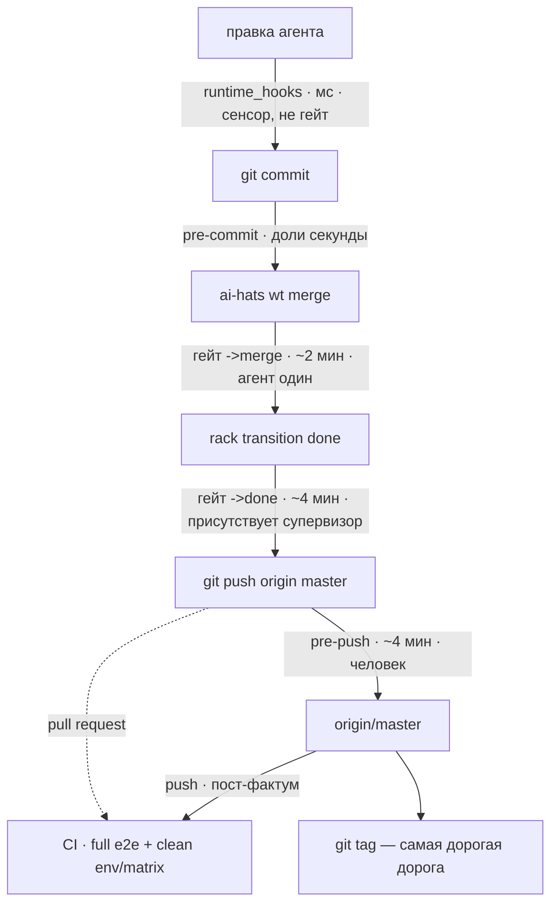

# ADR-0023: Quality gate — дороги, гейты, содержание

## Статус

Принят (HATS-1579, 2026-08-12). D5, D6 и D7 исполнены в HATS-1604, D4 наполовину
— в HATS-1614; остаток D4 держит HATS-1615. D10 исполнен в HATS-1708.

**ADR-0019** [1] владеет каналом привязок (`composition.apps`: форма строки,
политика отказа, кто валидирует имя точки). **ADR-0020** [2] владеет
hook-подложкой и контрактом кодов возврата. **ADR-0021** [3] владеет
материализацией поверхностей. **Этот ADR владеет содержанием гейта**: какие
дороги существуют, какой гейт какое ребро сторожит, что он гоняет и чего это
стоит.

**Голос — to-be.** Где сегодня иначе, стоит врезка «Сегодня» с замером и
карточкой-владельцем зазора.

**Замеры сняты 2026-08-14** (HATS-1655), кроме отдельно помеченных. Полный e2e
перемерен 2026-08-17 в HATS-1708. Счётчики
тестов и доли слияний здесь — **срез на дату, а не константы**: за двое суток
между предыдущей сверкой и этой `unit` прошёл 4545 -> 4806 -> 4923, файлов с
flow-блоком стало 228 -> 233 -> 238. Число, расходящееся с деревом, значит
«пора перемерить», а не «дерево сломано».

**Указатели в код называют файл и символ, без номера строки** — правило и его
обоснование в `CONTRIBUTING.md`, «Never cite a line number»; сторожит
`tests/test_adr_references.py`. Предыдущая редакция заявляла `file:line`,
перепроверенные на `81b4a529`, и к моменту следующей ревизии 13 из 20 указывали
не туда — форма протухает от правок в чужих файлах, поэтому её здесь нет.

## Словарь

- **Ребро** — переход, который совершается: `->merge` (ветка вливается в
  master), `->done` (карточка закрывается). Именуются по входу; форма `X->`
  не используется.
- **Гейт** — то, что сторожит ребро: именованный набор стадий с одним вердиктом
  и одним маркером. Называется по ребру, которое сторожит.
- **Точка** — место, куда цепляется скрипт гейта (`at:` в строке
  `composition.apps`). Термин принадлежит ADR-0019 [1] и глоссарию; одно ребро
  может иметь несколько точек (D2).

### Стадии: что каждая проверяет и чего стоит

Гейт собирается из стадий `scripts/ci-local.sh` [5]. Времена замерены
последовательным прогоном на одном ядре без xdist, кроме явно помеченного e2e.

| стадия             | что проверяет                                                                         |              время |
| ------------------ | ------------------------------------------------------------------------------------- | -----------------: |
| `tmp-sweep`        | ничего — уборка `$TMPDIR` перед тяжёлыми стадиями (не гейт, см. ниже)                 |             ~0.5 с |
| `lint`             | `ruff check` по всему дереву + `ruff format --check` по `src/ tests/`                 |               <1 с |
| `dependency-floor` | что каждый пин на workspace-пакет отслеживает его версию                              |               <1 с |
| `silent-fallback`  | что широкий `except` не глотает отказ молча (`dev_rule_silent_fallback`)              |               <1 с |
| `test-isolation`   | что тест не патчит код, который сам же проверяет — ратчет к записанной базовой линии  |               <1 с |
| `e2e-catalog`      | что `tests/e2e/CATALOG.md` совпадает с flow-блоками в докстрингах тестов              |                7 с |
| `adr-integrity`    | что цитата вида `ADR-NNNN <маркер>` резолвится, а номер ADR именует один файл         |               <1 с |
| `merge-smoke`      | curated-подмножество e2e: 28 тестов с маркером `smoke`                                |               20 с |
| `integration`      | реально-подпроцессные тесты вне `tests/e2e`: 415 тестов                               |               98 с |
| `unit`             | всё, не помеченное `integration`: ~4900 тестов                                        |               95 с |
| `coverage`         | те же тесты вне `tests/e2e` одним процессом, с порогом 78%                            |              195 с |
| `e2e`              | полный тир: `(integration or smoke) and not quarantine` по `tests/e2e`, `tests/smoke` |  245–251 с, `-n 8` |
| `security`         | `bandit -ll` + `pip-audit`                                                            |        не измерено |
| `version-skew`     | что workspace-пакеты впереди опубликованных на PyPI                                   | не измерено (сеть) |

**e2e, замер 2026-08-17 (HATS-1708).** Два прогона одного дерева
`3b9580e9` на macOS 26.4.1 arm64, 14 logical CPU, Python 3.13.12: 245,47 и
250,38 с wall; оба дали 911 passed, 9 skipped, 3 xfailed. Команда —
`bash scripts/ci-local.sh e2e -n 8 --dist=loadgroup` с `.venv/bin` впереди
`PATH`, `AI_HATS_E2E_REQUIRE_VENV=1` и удалённым `PYTEST_ADDOPTS`. Июльские
1495/1498/1530 с на той же стадии больше не годятся для решения о размещении;
причина примерно шестикратного разрыва не установлена.

Добавление CI contract-теста изменило селекцию, поэтому правило R-E сработало
сразу: повторный прогон итогового tree `85529617` дал 912 passed, 9 skipped,
3 xfailed за 250,88 с wall. Диапазон в таблице включает этот перезамер.

Следующие за `tmp-sweep` пять — **тир линтинга**: вместе девять секунд (замер
2026-08-14, последовательно), все офлайновые. Ниже упоминаются одним словом.

Тир определяется свойством — **офлайновое и мгновенное**, — а не перечнем имён.
`test-isolation` (ратчет патчинга, HATS-1599) существовала на момент написания
этого ADR, стояла в наборе `all` и в CI, но не была здесь названа и не стояла ни
на одном гейте; строка добавлена в HATS-1614 по этому же признаку.
`adr-integrity` (HATS-1646) тому же свойству отвечает, но в тир не входит: по
решению супервизора она пока стоит только на пуше. Расхождение записано здесь
намеренно — иначе следующий читатель применит признак и решит, что строку забыли.

> **`tmp-sweep` — стадия, но не проверка, и потому вне тира (HATS-1624).** Она
> офлайновая и мгновенная, но признак тира — не только это: единственная в
> таблице, она ничего не может завалить. Отсюда и место: в бандле `all` и **ни в
> одной композиции гейта**. Гейт именует то, что обязано быть зелёным, а уборка
> зелёной быть не может — у неё нет отказа, есть лишь «не смогла удалить», и это
> уходит в stderr, не в вердикт. Стоит первой: смысл в том, чтобы место получили
> тяжёлые стадии ниже, а не в том, чтобы прибраться после них. До этого свип
> висел только на `run_mode` master-гейта — на самой редкой операции в
> репозитории, тогда как мусор рождается на каждом убитом прогоне (HATS-1663).

> **Сегодня.** `security` **красная, и её вердикт зависит от venv** (замер
> 2026-08-14, HATS-1655). В свежепровизленном `.[dev]` оба инструмента есть
> (bandit 1.9.4, pip-audit 2.10.1), стадия запускается и падает: два High —
> `sha1` без `usedforsecurity=False` в `check_points.py` и `shell=True` в
> `cli/wait.py`. В долгоживущем venv проекта их нет вовсе, и стадия падает
> раньше, на отсутствии модуля. То есть это тот же класс, что закрыла HATS-1607
> для ruff: **вердикт как свойство даты создания venv**, а не дерева. Стадия
> исключена из набора `all`, поэтому локально её не ловит ничто. Владелец —
> **HATS-1591**; её посылка «инструменты объявлены, но отсутствуют» верна лишь
> для половины случаев и не главная.

## Контекст

Четыре замера **на состоянии 2026-08-11/12, до этого документа**. Раздел
описывает прошлое и в настоящем времени не читается: три из четырёх с тех пор
закрыты, и закрыты решениями этого же ADR. Отметки «закрыто» стоят прямо в
пунктах — пункт, который выглядит как жалоба на сегодняшний день, вводит в
заблуждение сильнее, чем отсутствующий.

**Три списка стадий разъехались.** Набор `all` нёс семь стадий, `done-gate` —
пять, преамбула master-пуша — три; ни один не был надмножеством другого.
`dependency-floor` и `silent-fallback` — обе офлайновые, обе меньше секунды — не
стояли ни на одной дороге в master. Обе существовали 2026-07-31, `done-gate`
собран 2026-08-07 без них, причина не записана ни в одной карточке.
**Закрыто** (D6, HATS-1604 и HATS-1614): состав объявляется один раз в
`gate_composition` (`scripts/ci-local.sh`), преамбула пуша не называет стадий
вовсе — она объявляет имя гейта и спрашивает диспетчер, — а обе офлайновые
стадии вошли в тир линтинга обоих карточных гейтов.

**Состав не охранял ничто.** `tests/test_gate_entrypoint_parity.py` охранял
способ вызова, а не состав; полная селекция e2e-тира жила в двух копиях —
в `ci_e2e` (`ci-local.sh`) и в прогонном режиме `pre-push-e2e-master.sh`, — и
теста на их равенство не было. Сам состав был записан прозой в пяти местах при
двух исполняемых. **Закрыто** (D6/D7): копия одна, исполняемое одно, а вложенность
составов теперь под ратчетом — `test_the_merge_gate_is_a_subset_of_the_done_gate`.
Не закрыта одна половина: скан этого теста по-прежнему смотрит только `Makefile`
и `ci.yml`, скрипты хуков в него не входят.

**Половина гейта холостая.** По транскриптам в `<ID>/.checks/`: **17
срабатываний `review->done`, 13 ответили «has no worktree — nothing to
gate. Passing», и 11 из этих 13 — карточки, чей воркtree был влит в master.**
Причина в порядке: в 8 случаях из 9 `wt:pre-merge` стреляет раньше ребра
(`ai-hats wt merge`, через секунды `rack transition done`), и к ребру дерева уже
нет. **Открыто** — это и есть предмет HATS-1615 (D2, врезка «Сегодня»).
Наблюдение подтвердилось на самой HATS-1614: её ребро тоже прошло вхолостую.

**Один гейт отвечал по-разному.** `ruff format --check` на одном дереве давал
rc=0 из venv основного чекаута и rc=1 из свежего venv воркtree — версии
инструмента разошлись при пине без потолка. **Закрыто** HATS-1607 (точный пин
плюс явная область, D4). Тот же класс, однако, живёт в стадии `security`, и это
показывает, что лечится он не разово, а признаком: любая стадия, чей инструмент
приходит из venv, обязана пинать версию и объявлять область.

## Решение

### D1 — Дороги

Дорог шесть, и они не сводятся к выбору «стадия `ci-local.sh` или строка
`composition.apps`»: `git_hooks` — единственный канал, доходящий до чужого
проекта (стадия проектная по построению, а точки коммита в модели привязок нет),
CI и тегирование не выражаются ни тем, ни другим.

1. **Отказ дешевеет тем раньше, чем раньше дорога.** На `->merge` он бесплатен —
   не тронуто ничего. После слияния он уже не размёрдживает (D2).
2. **agent-time не заменяет гейт.** `py-security-lint` и `comment-length-lint`
   видят только файлы, которые агент правил в этой сессии, они советующие по
   построению и при коммите человеком не срабатывают.
3. **CI — единственная общая server-side дорога.** На pull request она даёт
   предмержевый сигнал, на прямом push срабатывает пост-фактум, когда master уже
   красный. Пока status checks не required, обе формы можно обойти; enforcement
   принадлежит HATS-927, содержание — D10.
4. **Release-time здесь только объявляется.** Тегирование не ограничено временем
   и происходит при человеке, поэтому может нести то, чего не несёт пуш.
   Содержание — **HATS-1609**; сегодня на теге не стоит ни одного гейта, а
   процедура живёт ручным чеклистом в `docs/RELEASING.md`.

### D2 — Ребро может иметь две точки

**Rack объявляет на ребро две точки:** до собственных эффектов и после них.
Автор строки `composition.apps` пишет имя точки и не видит чисел — движок владеет
точками, роль содержанием (D7).

> **Сегодня.** Точка одна. Подписчик checks прибит к `CHECK_PRIORITY = 15`
> (`checks.py`), слияние делает воркtree-подписчик на 30 (`setup_priority` /
> `teardown_priority` в `rack_wiring.py`), поэтому гейт, судящий результат
> слияния, невыразим. Механика второй точки уже на месте:
> `CheckSubscriber.__init__` принимает `priority=`, а благословлённый
> конструктор `check_subscriber()` (оба — `checks.py`) его не передаёт.
>
> **Рулинг 2026-08-14 закрыл вопрос иначе, чем предполагал этот абзац.** Второй
> точки не будет: ребро судит **предсказанное** дерево слияния — `git -C <wt>
> merge-tree --write-tree master HEAD`, 13 мс, без чекаута — на существующей
> точке 15. Это строго лучше второй точки по D1 §1: отказ на 15 бесплатен, тогда
> как вторая точка отказывала бы уже **после** слияния на локальном master (см.
> следующий абзац — отказ не размёрдживает). Владелец — **HATS-1615**; HATS-1602
> снята с пути.

**Почему не декларативный хэндлер.** Форма доказана — `plan-gate`,
`plan-consent`, `hyp-quorum-gate`, `frozen-integrity` отказывают переходу из
декларации, приоритет автор задаёт сам, обе линии сливаются в один
отсортированный список (`Dispatcher._subscribers_for_event` в `dispatch.py`).
Для checks-канала закрыто двумя вещами: канал намеренно не объявляется в
`backlog.yaml` — «канал, в который бэклог может забыть заопт-иниться, есть то
молчаливое отсутствие, ради устранения которого эпик существует» (комментарий в
`ai_hats_rack/workspace.py`, он же ADR-0017 [4]); и чтение `priority:` из строки
заставило бы резолвить
`composition.apps` на сборке кернела, то есть на каждом `rack ls` и `rack
context` — форма, уронившая чтения в HATS-1538.

**Отказ на второй точке не размёрдживает.** Откат кернела разматывает только
staged-транзакцию докстора; слияние уходит через
`self._effects.teardown(..., merge=True)` в `_on_teardown` (`rack_wiring.py`). Отказ
отказывает смене состояния, оставляя слияние на локальном непушнутом master.

### D3 — Что решает, какая проверка на каком гейте: кто присутствует при отказе

Ось не только стоимость и предмет, но и **кто окажется перед красным гейтом и
сможет ли разрулить в одиночку.**

- На **`->merge`** агент один: сюда идут проверки, чей отказ указывает на его
  собственную ветку и чинится без чужого участия.
- На **`->done`** присутствует супервизор — ребро `review → done` выписывает
  ревьюер. Сюда идут проверки, чей отказ может потребовать координации между
  агентами, прежде всего поломка от совмещения двух независимо зелёных веток.

Второе — условие сходимости: тяжёлый гейт на `->merge` при параллельной работе
двух агентов над одним файлом даёт обоим красный на общей поломке, оба чинят её
одновременно и без арбитра, ломая правки друг друга.

### D4 — Гейты и их содержание

| гейт          | момент               | кто перед отказом | предмет                   | содержание                                                                                              |         время |
| ------------- | -------------------- | ----------------- | ------------------------- | ------------------------------------------------------------------------------------------------------- | ------------: |
| **commit**    | `git commit`         | агент или человек | staged-диф                | privacy, docs-index, no-raw-destructive, skill-lint, rule-delivery; `smoke` — условно, по тегу карточки |  доли секунды |
| **`->merge`** | `wt:pre-merge`       | агент, один       | дерево ветки              | тир линтинга + `unit`                                                                                   |        ~2 мин |
| **`->done`**  | ребро `review--done` | супервизор        | дерево результата слияния | тир линтинга + `unit` + `integration` + `merge-smoke` + релевантные e2e                                 |        ~4 мин |
| **push**      | `pre-push` в master  | человек           | пушимый sha               | полный `e2e`-тир + `adr-integrity` (HATS-1646)                                                          |        ~4 мин |
| **release**   | тегирование          | человек           | тег и его дерево          | сверх пуша — **HATS-1609**                                                                              | не ограничено |
| **CI**        | PR и push в master   | никто             | репозиторий целиком       | clean install, матрица 3.11–3.13, security, version-skew, install-smoke, полный e2e                     |   не измерено |

**Типовая карточка стоит один прогон.** Содержание `->merge` входит в содержание
`->done`, поэтому прогон `->done` штампует и `->merge` (правило поглощения, D5);
маркер ключуется на дерево, а дерево слияния совпадает с деревом ветки в 26
случаях из 30 (замер 2026-08-14 по первым родителям master) — значит тот же
прогон засчитывается и после слияния. Второй прогон требуется только там, где
слияние что-то совместило.

**`->merge` спрашивает: годна ли ветка войти в master.** Тир линтинга плюс
`unit` — минимум, ловящий явно сломанное до общего ствола и чинимый агентом в
одиночку.

> **Сегодня.** `->merge` несёт сверх этого `integration`, то есть тир линтинга +
> `unit` + `integration` ≈ 3,4 мин вместо ~2 мин (рулинг супервизора
> 2026-08-13, HATS-1614). Причина — не предпочтение, а единственная оставшаяся
> дорога: пока `->done` не умеет судить результат слияния, на большинстве
> карточек он пасует (замер: 13 из 17 срабатываний ребра ответили «has no
> worktree», в 8 случаях из 9 `wt:pre-merge` стреляет раньше ребра), а
> **415 реально-подпроцессных тестов вне `tests/e2e`** (замер 2026-08-14,
> `pytest --ignore=tests/e2e -m integration`) push-гейт не селектит вовсе:
> стадия `e2e` берёт только `tests/e2e/` и `tests/smoke/`. Без `integration` на
> `->merge` их единственной дорогой осталась бы джоба `coverage` в CI — то есть
> после пуша и не блокируя. Возврат `integration` на `->done` — **HATS-1615**.

**`->done` спрашивает: зелен ли master после этой карточки.** Единственный
вопрос, который нельзя задать раньше: две независимо зелёные ветки дают красный
master, и маркер на кончике ветки удостоверяет дерево, которого на master не
существовало.

**Релевантные e2e** выбираются по объявлению теста: структурный блок докстринга
получает поле `covers:` рядом с `flow`/`cmds`/`expect`/`why`. Блок есть у 228
файлов и уже валидируется стадией `e2e-catalog`, поэтому исчезнувший путь ловится
тем же гейтом. **Тест, который ничего не объявил, гоняется всегда** — иначе
выборка молча сжимает гейт. Владелец — **HATS-1605**, там же база диффа: для
`->merge` ветка против master, для `->done` вклад карточки.

> **Сегодня этой половины в составе НЕТ.** `gate_composition` даёт
> `done-gate = <тир линтинга> unit integration merge-smoke` — выборки
> «релевантных e2e» в ней нет вовсе, потому что HATS-1605 не сделан. Что из
> `tests/e2e/` гейт всё-таки гоняет, так это `merge-smoke` — curated-подмножество
> по маркеру `smoke`, и только его; стадия `integration` каталог игнорирует по
> пути (`pytest --ignore=tests/e2e -m integration`). То есть зелёный `->done`
> НЕ означает зелёный e2e-тир: тир целиком стоит на push-гейте и в CI (D10). Строка
> таблицы выше описывает целевой состав, а не сегодняшний — читать её как
> сегодняшний значит принять гейт за более широкий, чем он есть (HATS-1682).

**Покрытие — измерение, а не гейт.** Порог `--cov-fail-under` отвечает на вопрос
«сколько измерено», оба гейта спрашивают «стабильно ли». Стадия `coverage` живёт
в CI.

**Эпик — открытая развилка.** У эпика нет своей ветки и своего слияния, а
`->done` наступает по детям и может сработать без агента. Содержание гейта
`->done` для эпика — **HATS-1610**.

Непомеченный файл в `tests/e2e/` не едет ни в один тир: стадия `integration`
игнорирует каталог по пути, тир `e2e` селектит по маркеру. Поэтому «что в
каталоге» и «что помечено» обязаны совпадать — HATS-1600 развёл 30 таких тестов
по двум причинам их появления: 2 реально-подпроцессных получили маркер, 28
in-process тестов самой обвязки уехали в `tests/e2e_harness/`, где остаются в
`unit`.

**Область гейта объявляется, а не наследуется от инструмента.** Иначе апгрейд
меняет не вердикт, а предмет проверки — молча. HATS-1607: ruff 0.16.0 вывел
форматирование markdown из preview и втянул в формат-чек 14 md-файлов под
`tests/`, среди них golden-фикстуры; на области `.` те же две версии давали
970 файлов при rc=0 и 1316 при rc=1. Закрыто двумя половинами: точный пин
(`ruff==0.16.2`, версия перестаёт быть свойством даты создания venv) и явный
предмет (`extend-exclude = ["*.md"]`, предмет перестаёт быть свойством версии).
Побочно это делает расширение области до `.` бесплатным — то, чего ждали
**HATS-1408** и **HATS-1415**.

### D5 — Маркер: ключ по дереву, дайджест состава, правило поглощения

**Ключ маркера — дерево (`HEAD^{tree}`), а не коммит.** `_fast_forward_merge`
вопреки имени мёрджит `--no-ff` (`manager.py`), поэтому sha мёрдж-коммита
всегда новый; дерево — нет: **у 26 из последних 30 слияний в master дерево
побайтово равно дереву ветки.** Ключ по дереву совпадает с границей
ответственности: агент отвечает за дерево, которое сам произвёл; положили сверху
чужой коммит — дерево другое, отвечает тот, кто его положил.

**Маркер несёт дайджест состава гейта.** Иначе изменение содержания не
обесценивает выданные маркеры, и гейт продолжает пропускать по старому правилу.

**Правило поглощения.** Прогон гейта штампует и все гейты, чьё содержание он
включает (`->done ⊃ ->merge`).

Исполнено в HATS-1604 (слитно с HATS-1601). `gate_marker_write` пишет `tree=`,
`timestamp=` и `stages=` — состав, который реально прогнан; `gate_marker_ok`
пропускает тогда и только тогда, когда требуемый состав ⊆ записанного.
Дайджеста нет намеренно: **список стадий даёт и сверку состава, и поглощение
одной операцией сравнения**.

**Поглощение заработало в HATS-1614, и потребовало второй половины.** Гейт
разделён на два имени — `merge-gate` ⊂ `done-gate`, — но одного вложения
составов оказалось мало: маркеры лежат по `<git-common-dir>/ai-hats/<gate>/<tree>`,
и чтение смотрело только в каталог спрашивающего гейта. Прогон `done-gate` по
дереву T писал надмножество стадий в `done-gate/T`, а `merge-gate` искал в
`merge-gate/T`, не находил ничего и отказывал — то есть поглощение не срабатывало
ни разу за всё время существования механизма. Починка: **пишем per-gate, читаем
по объединению** — подмножество берётся над тем, что записал по этому дереву
любой гейт (`gate_marker_covers`). Каталоги на месте, изменилось только чтение,
миграции накопленных маркеров не потребовалось.

### D6 — Примитив гейта

Гейт — примитив, а не скрипт. Общий код владеет двухрежимным диспатчем (прогон
против проверки), резолвом диспетчера стадий, прогоном списка с остановкой на
первой красной, правилом «зелено и дерево чистое → маркер; грязное дерево →
прогон был, маркера нет», lookup'ом маркера, текстом отказа с копипастной
командой и **отображением исхода в коды возврата своего канала** (git-хук: 0/1;
канал checks: 0/2/126/127, ADR-0020 [2] D2).

За конкретным гейтом остаются два решения: **какое дерево он судит** и **что на
нём гоняется**.

Исполнено в HATS-1604: `lib/gate.sh` несёт всё перечисленное, оба скрипта
гейта задают только имя гейта, состав, профиль канала и команду перезапуска.
Побочно снята вторая копия селекции e2e-тира: тир гоняется стадией диспетчера,
а флаги гейта едут через `PYTEST_ADDOPTS` — то есть селекция попала под рэтчет
`test_gate_entrypoint_parity.py`, который скрипты хуков раньше не покрывал.

### D7 — Граница: движок владеет точками, роль — содержанием

Движок владеет **точками, примитивом гейта и контрактом кодов возврата**. Роль
или проект владеет **тем, какой гейт стоит на каком ребре и что он гоняет**.
Библиотечный файл не утверждает содержания проектного гейта.

Исполнено в HATS-1604: литерал состава снят, текст отказа рендерится из ответа
диспетчера на `--stages <gate>` (флаг первым: диспетчер, не знающий его,
отказывает мгновенно вместо прогона — замер в HATS-1604). Проект, который на этот вопрос не отвечает,
получает отказ — раньше `pre-push` в этом случае откатывался на тир, который
называл сам, то есть библиотека утверждала проектное содержание молча.

### D8 — Обход гейта: явный, записанный, всплывающий

Небезопасен не обход, а бесшумный обход. Три свойства, все обязательны:

1. **Явность.** Только через переменную окружения, выставленную **снаружи**
   агента — в шелле, запустившем сессию, или в настройках харнесса. Префикс к
   собственной команде не работает: хук исполняется до того, как эта команда
   становится процессом (HATS-1294). Прецеденты формы: `AI_HATS_SHARED_STATE_ACK`,
   `AI_HATS_PLAN_ACK`, `AI_HATS_DOCS_INDEX_ACK`.
2. **Запись.** Каждый обход пишется в `<git-dir>/ai-hats/bypasses.jsonl` через
   `ai_hats_journal_bypass()` (`hooks/bypass_journal.sh`) — с гейтом, деревом и
   причиной; путь журнала собирает соседняя `ai_hats_journal_stamp_sha()`.
3. **Всплытие.** На следующем пуше `pre-push-bypass-report.sh` печатает
   человеку, сколько обходов проехало в этих коммитах.

На `->done` присутствует супервизор, поэтому обход там менее опасен и, возможно,
не нужен вовсе — решает **HATS-1611**.

> **Сегодня.** У гейтов `->merge` и `->done` обхода нет. Единственный способ —
> `git push --no-verify`, который снимает все хуки сразу, включая privacy, и к
> этим двум рёбрам не относится.

### D9 — Отвергнутое, с причинами

- **Тяжёлый гейт на `->merge`.** Отказ чинят два агента одновременно и без
  арбитра (D3). *Отвергнут как цель, но сегодня действует частично: `integration`
  стоит на `->merge` по рулингу 2026-08-13, потому что иначе он не стоит нигде на
  блокирующей дороге — см. врезку «Сегодня» в D4. Это отступление с владельцем
  (HATS-1615), а не пересмотр решения.*
- **Порог покрытия как гейт.** Отвечает не на тот вопрос (D4).
- **Перенос checks-канала на декларативные хэндлеры.** Записанное решение не
  объявлять канал в `backlog.yaml` плюс поломка ленивого резолва (D2).
- **Отказ, который размёрдживает.** Кернел не откатывает git (D2).
- **Полный e2e-тир на каждой карточке.** Четырёхминутный полный тир теперь
  исполняется на каждом PR/push в CI и на локальном push; карточный `->done`
  остаётся выборочным, его `covers:`-механизм принадлежит HATS-1605.
- **Реюз `pre-push-e2e-master.sh` телом чека.** Его дефолтный режим читает
  протокол git из stdin, а runner отдаёт детям `stdin=DEVNULL`: пустой stdin
  попадает в fast path «нет master-цели» и скрипт выходит нулём — гейт был бы
  вечнозелёным.

### D10 — Полный e2e на дороге CI

Workflow [10] запускает отдельную job `e2e` на каждом pull request в master и
каждом push в master. Job использует полную git history (она нужна
`e2e-catalog` для проверки pins), Python 3.13, тот же install-контур и git
identity, что `merge-smoke`, и делегирует единственному определению стадии [5]:
`bash scripts/ci-local.sh e2e -n 8 --dist=loadgroup`. Параллелизм передаётся
argv, а не наследуемым `PYTEST_ADDOPTS`; `AI_HATS_E2E_REQUIRE_VENV=1` превращает
невозможность собрать shared test venv из skip в явный отказ.

**Почему CI обязана это нести.** Только server-side дорога даёт чистую установку,
матрицу Python 3.11/3.12/3.13, сетевые `security` и `version-skew`, настоящий
`install-smoke` и один видимый вердикт полного e2e для каждого события. Локальный
push-гейт остаётся: при прямом push CI отвечает только после попадания дерева в
master, а HATS-927 ещё не сделал status checks обязательными. Поэтому job —
server-side сигнал, но до HATS-927 не неотключаемый предмержевый барьер.

**Карта системных требований HATS-1708:**

- **R-A, отсутствие отлично от прохождения — не закрыто здесь.** Холостой
  `->done` владеет HATS-1664, отсутствие привязок у ролей — HATS-1677. Контракты
  HATS-1708 ловят удаление самой CI job, но не меняют семантику checks-канала.
- **R-B, протухание громкое — закрыто для полного e2e на CI.** Каждый PR/push
  создаёт новую job; свежесть больше не выводится из локального маркера. Сделать
  этот статус обязательным для входа в master должен HATS-927.
- **R-C, вердикт не зависит от хоста — не закрыто здесь.** Герметичный unit
  владеет HATS-1700, security — HATS-1591, наследуемый `PYTEST_ADDOPTS` —
  HATS-1661. Чистый CI runner уменьшает разброс, но не доказывает инвариант.
- **R-D, сужение объявлено и оценено — закрыт server-side разрыв:** CI гоняет
  полный тир рядом с `merge-smoke`. Выбор релевантных e2e для карточного гейта
  остаётся в HATS-1605.
- **R-E, стоимость датирована — закрыто здесь.** Следующий обязательный
  перезамер — не позднее 2026-09-16. Раньше — сразу после изменения селекции,
  числа workers/`--dist`, venv/install-контура или топологии runner.

## Шесть способов гейту исчезнуть тихо

Первые три наследуются любой новой строкой; четвёртый не про строку, а про
дорогу; пятый — про роль, которая строку не несла; шестой закрыт, но записан,
потому что он единственный маскировался под законный пропуск:

1. **Снятие оверлеем** — если оверлей убирает скилл, строка выбывает, и весь
   след этого одна строка в stderr (HATS-1535). Частичное лекарство появилось
   после написания этого раздела: `rack doctor` классифицирует каждую несомую
   строку как ARMED / DEAD / UNADDRESSED (`classify_bindings` в `checks.py`,
   `diagnose_bindings` в `doctor.py`) и отдельно отказывается рисовать
   нечитаемый канал чистым. Строку, снятую оверлеем **до** композиции, он не
   видит — сам способ стоит.
2. **Порт старше протокола** — интегратор без `CheckPort.check_declarations`
   оставляет переходы негейчеными; это говорится в work_log
   (`_without_declarations` в `checks.py`).
3. **Зеркало сессии старше биндинга** — сессия, начатая до появления строки,
   резолвила скрипт из своего зеркала и отказывала на всём с формулировкой про
   отсутствующий файл (HATS-1572). **Сузилось** после HATS-1540: приватной копии
   канала больше нет, зеркало держит все композированные скиллы, и отказ теперь
   называет причину и лекарство («перезапусти сессию»), а не отсутствующий файл
   (`absent_bytes_notice` в `check_resolve.py`). Остаток способа — скилл,
   которого в зеркале нет вовсе.
4. **Дорога, на которой точки нет вовсе.** `cleanup(IsolationMode.SQUASH)` —
   teardown сабагента — делает `git merge --squash` и коммит
   `feat(agent): <branch>` в записанную базовую ветку (`_squash_merge`), не
   зажигая `wt:pre-merge`. Это записанное решение, а не пропуск: `cleanup`
   подавляет lifecycle-veto по построению (ADR-0013 D8 — чтобы собственная
   ошибка сабагента не была замаскирована), поэтому отказ был бы проглочен и
   гейт выглядел бы вооружённым, пропуская всё. Два коротких замыкания
   `merge()` точку тоже не зажигают, но они ничего и не публикуют — это
   единственная из трёх дорог, на которой контент входит в базу. Три возможные
   формы решения и цена каждой — ADR-0019 [1] § *Open questions* Q1; владельца
   нет (HATS-1595).

5. **Роль, которая строку не несла.** Блок `composition.apps` есть **только у
   роли `maintainer`**; остальные восемь ролей репозитория (`architect`,
   `assistant`, `dev-python`, `dev-web`, `go-dev`, `go-dev-full`, `role-curator`,
   `sre`) не несут ни одной привязки, поэтому карточка, которую ведёт любая из
   них, входит в master вообще без гейта. Область видимости здесь не дефект — D7
   отдаёт содержание роли осознанно. Дефект в **неотличимости**: подписчик
   `checks` не находит строк и пишет тот же `{"subscriber": "checks", "outcome":
   "ok"}`, что и настоящий зелёный гейт, не оставляя ни каталога `<ID>/.checks/`,
   ни маркера. Живой случай — HATS-1630: сделана под `role-curator`, уехала в
   master и оставила его красным на стадии `lint` и с протухшим каталогом e2e.
   Отличие от первых четырёх: там гейт **был** и пропал, здесь его никогда не
   было. Владельца нет; факт записан в work_log HATS-1615.

6. **Строка, адресованная не тому бэклогу — ЗАКРЫТ (HATS-1774).** Селектор, не
   совпавший ни с одним ребром бэклога, который строка адресует, но совпавший с
   топологией соседа, назывался `foreign` — «законный кросс-бэклоговый пропуск»,
   — и `rack doctor` оставался clean с rc=0, пока гейт не срабатывал нигде.
   Худшая форма из шести: единственная, где отчёт не молчал, а прямо отвечал
   «всё в порядке». Тернарник HATS-1584 задавал вопрос «совпало ли хоть
   где-нибудь» по всем смонтированным топологиям; теперь вопрос задаётся по
   адресуемому бэклогу, промах — всегда `dead` и находка, а совпадение у соседа
   выбирает только формулировку лекарства («перенеси строку под
   `apps.rack.<сосед>`» против «почини стрелку»). Рулинг записан в ADR-0019 [1]
   D11 clause 2, rev 11. Достижимость выросла после HATS-1719: `->done`
   совпадает с любой топологией, где есть `done`, а `ANY->ANY` — с любой вообще,
   тогда как точная стрелка совпадала у соседа редко.

## Открытые карточки

| карточка      | что решает                                                                          |
| ------------- | ----------------------------------------------------------------------------------- |
| **HATS-1589** | формат сообщения коммита: сначала конвенция, потом гейт                             |
| **HATS-1591** | security: стадия красная и зависит от venv, 87 находок ruff-S, сверка инструментов  |
| **HATS-1605** | `covers:` в flow-блоке для релевантных e2e                                          |
| **HATS-1609** | содержание дороги тегирования релиза                                                |
| **HATS-1615** | остаток D4: вернуть `integration` на `->done` и научить ребро судить дерево слияния |
| **HATS-927**  | branch protection и required CI status checks                                       |

**Закрыты с момента первой редакции.** HATS-1600 (непомеченные тесты в
`tests/e2e`), HATS-1607 (пин ruff и явная область), HATS-1604 (примитив, ключ
маркера по дереву, состав в теле маркера), HATS-1614 (гейт `->merge`, поглощение
между именами), HATS-1708 (полный e2e в CI). HATS-1603 (бюджет чека против лока) решена отдельно: бюджет 20 с
при локе 30 с, отношение проверяется на импорте.

**Сняты с пути рулингом 2026-08-14** — остаются в бэклоге, но D4 их больше не
ждёт: HATS-1602 (вторая точка не нужна — ребро предсказывает дерево слияния через
`git merge-tree --write-tree` на существующей точке), HATS-1610 (у эпика нет
своего кода, fail-open для него корректен), HATS-1611 (на `->done` присутствует
супервизор, штатный выход — прогнать гейт).

## References

- [1] ADR-0019 — декларативная модель расширения жизненного цикла:
  `docs/adr/0019-declarative-lifecycle-extension-model.md`
- [2] ADR-0020 — hook-подложка и контракт кодов возврата:
  `docs/adr/0020-hook-execution-and-materialization-substrate.md`
- [3] ADR-0021 — материализация поверхностей:
  `docs/adr/0021-surface-materialization.md`
- [4] ADR-0017 — `backlog.yaml` как единственное определение:
  `docs/adr/0017-backlog-yaml-single-definition.md`
- [5] Диспетчер стадий: `scripts/ci-local.sh`
- [6] Гейты и механизм маркера:
  `packages/ai-hats-library/src/ai_hats_library/ai-hats-dev/skills/maintainer-quality-gate/`
- [7] Журнал обходов:
  `packages/ai-hats-library/src/ai_hats_library/hooks/bypass_journal.sh`
- [8] Фактура ревизии, из которой выросла карточка:
  `.agent/ai-hats/tracker/backlog/tasks/HATS-1571/findings.md`
- [9] План и замеры этой карточки:
  `.agent/ai-hats/tracker/backlog/tasks/HATS-1579/plan.md`
- [10] Server-side CI workflow:
  `.github/workflows/ci.yml`
