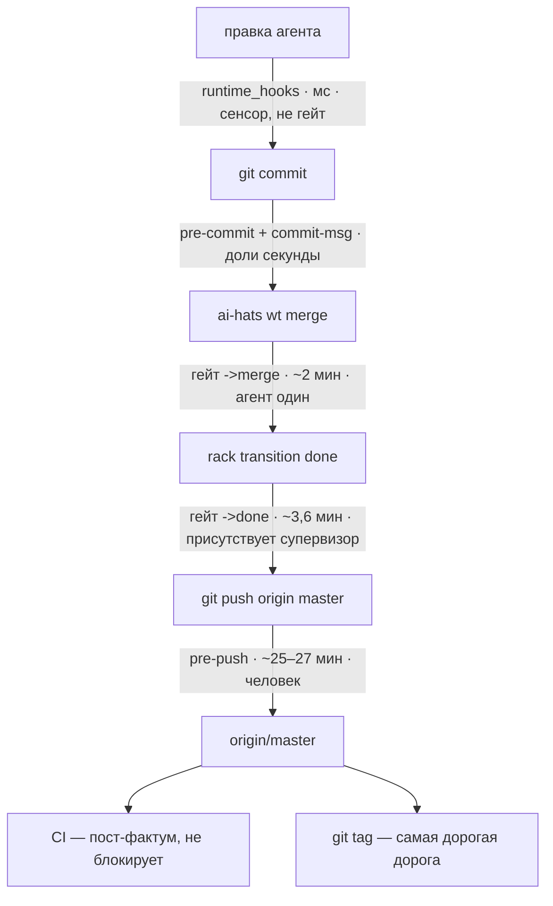

# ADR-0023: Quality gate — дороги, гейты, содержание

## Статус

Предложен (HATS-1579, 2026-08-12).

Разделение ответственности с соседями. **ADR-0019** [1] владеет каналом привязок
(`composition.apps`: форма строки, политика отказа, кто валидирует имя точки).
**ADR-0020** [2] владеет hook-подложкой и контрактом кодов возврата.
**ADR-0021** [3] владеет материализацией поверхностей. **Этот ADR владеет
содержанием гейта**: какие дороги существуют, какой гейт какое ребро сторожит,
что он гоняет и чего это стоит.

**Голос — to-be.** Где сегодня иначе, стоит врезка «Сегодня» с замером и
карточкой-владельцем зазора. Замеры сняты 2026-08-11/12, `file:line`
перепроверены на `81b4a529`.

## Словарь

Три слова, которые в обсуждениях склеивались:

- **Ребро** — переход, который совершается: `->merge` (ветка вливается в
  master), `->done` (карточка закрывается). Именуются по входу; форма `X->`
  сегодня не используется.
- **Гейт** — то, что сторожит ребро: именованный набор стадий с одним вердиктом
  и одним маркером. Гейт называется по ребру, которое сторожит.
- **Точка** — место, куда физически цепляется скрипт гейта (`at:` в строке
  `composition.apps`). Термин принадлежит ADR-0019 [1] и глоссарию; одно ребро
  может иметь несколько точек (D2).

### Стадии: что каждая проверяет и чего стоит

Гейт собирается из стадий `scripts/ci-local.sh` [5]. Времена замерены
последовательным прогоном на одном ядре без xdist.

| стадия             | что проверяет                                                                         |              время |
| ------------------ | ------------------------------------------------------------------------------------- | -----------------: |
| `lint`             | `ruff check` по всему дереву + `ruff format --check` по `src/ tests/`                 |               <1 с |
| `dependency-floor` | что каждый пин на workspace-пакет отслеживает его версию                              |               <1 с |
| `silent-fallback`  | что широкий `except` не глотает отказ молча (`dev_rule_silent_fallback`)              |               <1 с |
| `e2e-catalog`      | что `tests/e2e/CATALOG.md` совпадает с flow-блоками в докстрингах тестов              |                7 с |
| `merge-smoke`      | curated-подмножество e2e: 28 тестов с маркером `smoke`                                |               12 с |
| `integration`      | реально-подпроцессные тесты вне `tests/e2e`: 400 тестов                               |               90 с |
| `unit`             | всё, не помеченное `integration`: 4545 тестов                                         |              116 с |
| `coverage`         | те же тесты вне `tests/e2e` одним процессом, с порогом 78%                            |              195 с |
| `e2e`              | полный тир: `(integration or smoke) and not quarantine` по `tests/e2e`, `tests/smoke` |         ~25–27 мин |
| `security`         | `bandit -ll` + `pip-audit`                                                            |        не измерено |
| `version-skew`     | что workspace-пакеты впереди опубликованных на PyPI                                   | не измерено (сеть) |

**Первые четыре — «тир линтинга»**: вместе меньше восьми секунд, все офлайновые.
В документе они всюду упоминаются одним словом.

> **Сегодня.** `security` не измерена, потому что не запускается: `bandit` и
> `pip-audit` объявлены в dev-extras и в проектном venv отсутствуют — стадия
> молча недоступна локально. Владелец — **HATS-1591**.

## Контекст

Содержание гейта не имеет владельца. Это не фигура речи — это измеряется.

**Три списка стадий разъехались.** Локальный набор `all` несёт семь стадий,
`done-gate` — пять (`scripts/ci-local.sh:125`), преамбула master-пуша — три
(`pre-push-e2e-master.sh:149`). Ни один не является надмножеством другого.
`dependency-floor` и `silent-fallback` — обе офлайновые, обе меньше секунды — не
стоят **ни на одной** дороге в master. Обе существовали 2026-07-31, `done-gate`
собран 2026-08-07 без них, причина не записана ни в одной карточке.

**Состав не охраняет ничто.** `tests/test_gate_entrypoint_parity.py` охраняет
способ вызова — что гейт не выписан руками мимо диспетчера — и не охраняет
состав. Скрипты хуков его скан не покрывает, поэтому полная селекция e2e-тира
живёт в двух копиях: `ci-local.sh:112` и `pre-push-e2e-master.sh:220`, теста на
их равенство нет.

**Состав живёт прозой в шести местах, две копии уже неверны.** Исполняемых мест
два: `ci-local.sh:125` (состав `done-gate`) и `ci-local.sh:158-167` (состав
`all`). Прозаических пять: `ci-local.sh:123`, `done-gate.sh:111`,
`maintainer-quality-gate/SKILL.md:137`, `Makefile:52`, `CONTRIBUTING.md:104`.
Последние две говорят «lint, unit, coverage, merge-smoke» при семи стадиях.

**А главное — половина гейта холостая.** По записанным транскриптам в
`<ID>/.checks/`: **17 срабатываний `edge:review--done`, из них 13 ответили «has
no worktree — nothing to gate. Passing», и 11 из этих 13 — карточки, чей воркtree
был влит в master.** Секундные метки объясняют почему: в 8 случаях из 9
`wt:pre-merge` стреляет **раньше** ребра. Обычный порядок — `ai-hats wt merge`
(там гейт и срабатывает), а через секунды `rack transition done`, к которому
дерева уже нет. Скрипт не врёт; не совпадает точка с моментом решения.

**И один и тот же гейт отвечает по-разному.** `ruff format --check` на одном
дереве даёт rc=0 из venv основного чекаута и rc=1 из свежего venv воркtree —
разошлись версии инструмента при пине без потолка (D3, «Сегодня»). Состав гейта
это половина определения; вторая половина — чем он исполняется.

Вопрос, на который документ обязан отвечать без чтения кода: **какой гейт какое
ребро сторожит, что он гоняет, чего это стоит и куда приземляется новая
проверка.**

## Решение

### D1 — Дороги: шесть моментов, в порядке движения кода

| дорога                                                 | кто запускает                      | предмет                          | чем платит        |
| ------------------------------------------------------ | ---------------------------------- | -------------------------------- | ----------------- |
| **agent-time** — `runtime_hooks`                       | харнесс, на каждый tool call       | действие агента                  | миллисекунды      |
| **commit-time** — `git_hooks/pre-commit`, `commit-msg` | агент или человек, каждый коммит   | staged-диф, сообщение, авторство | доли секунды      |
| **`->merge`** — `wt:pre-merge`                         | `ai-hats wt merge` и FSM-автомёрдж | дерево ветки                     | маркер: мгновенно |
| **`->done`** — ребро `review--done`                    | переход карточки в `done`          | дерево результата слияния        | маркер: мгновенно |
| **push-time** — `git_hooks/pre-push`                   | `git push` в master                | пушимый sha                      | маркер: мгновенно |
| **release-time** — тегирование версии                  | человек                            | тег и его дерево                 | не ограничено     |
| **CI**                                                 | GitHub, после пуша                 | репозиторий целиком              | не блокирует      |

Дорог **шесть**, а не две. Дихотомия «стадия `ci-local.sh` или строка
`composition.apps`» роняет `git_hooks`, CI и тегирование — и именно `git_hooks`
есть единственный канал, доходящий до чужого проекта: стадия проектная по
построению, а точки коммита в модели привязок нет.

**Release-time существует и здесь только объявляется.** Тегирование может себе
позволить то, чего не может пуш: время не критично и присутствует человек. Что
именно туда отдать — **HATS-1609**; сегодня на теге не стоит ни одного гейта, а
процедура живёт ручным чеклистом в `docs/RELEASING.md`.

Три свойства, из которых выводится всё остальное:

1. **Отказ дешевеет тем раньше, чем раньше дорога.** На `->merge` он бесплатен —
   не тронуто ничего. После слияния он уже не размёрдживает (D2).
2. **agent-time не заменяет гейт.** `py-security-lint` и `comment-length-lint`
   видят только файлы, которые агент правил в этой сессии, они советующие по
   построению и при коммите человеком не срабатывают. Это сенсор, не гейт.
3. **CI — единственная неотключаемая дорога и единственная пост-фактум.** Когда
   джоба краснеет, master уже красный. Что обязана нести именно она —
   **HATS-1590**.

### D2 — Ребро может иметь две точки, и это словарь, а не приоритет

**Rack объявляет на ребро две точки:** до собственных эффектов и после них.
Автор строки `composition.apps` пишет имя точки и **не видит чисел**.

Это прямое следствие границы из D7: движок владеет точками, роль — содержанием.
«После моих эффектов» — это точка, а не приоритет.

> **Сегодня.** Точка одна. Подписчик checks прибит к `CHECK_PRIORITY = 15`
> (`checks.py:29`), слияние делает воркtree-подписчик на 30
> (`rack_wiring.py:263,313`) — значит гейт, судящий **результат** слияния,
> невыразим. Механика для второй точки уже на месте:
> `CheckSubscriber.__init__` принимает `priority=` (`checks.py:146`), а
> благословлённый конструктор `check_subscriber()` (`checks.py:284-303`) его
> просто не передаёт. Владелец зазора — **HATS-1602**, он же добавляет в
> окружение чека sha мёрдж-коммита карточки (сегодня подаётся
> `AI_HATS_WORKTREE_PATH`, которого на второй точке уже нет).

**Почему не декларативный хэндлер.** Форма доказана: `plan-gate`,
`plan-consent`, `hyp-quorum-gate` и `frozen-integrity` отказывают переходу прямо
из декларации, приоритет автор задаёт сам, а обе линии — декларативная и кодовая
— сливаются в один список, отсортированный по `(priority, registration_index)`
(`dispatch.py:307`). Для checks-канала это закрыто записанным решением: канал
намеренно не объявляется в `backlog.yaml`, потому что «канал, в который бэклог
может забыть заопт-иниться, есть то молчаливое отсутствие, ради устранения
которого эпик существует» (`ai_hats_rack/workspace.py:419-420`, повторено в
ADR-0017 [4]:516). Второе препятствие техническое: чтение `priority:` из строки
заставило бы резолвить `composition.apps` на сборке кернела, то есть на каждом
`rack ls` и `rack context` — форма, уронившая чтения в HATS-1538.

**Отказ на второй точке не размёрдживает.** Откат кернела разматывает только
staged-транзакцию докстора; слияние уходит наружу через
`self._effects.teardown(..., merge=True)` (`rack_wiring.py:313`). Отказ
отказывает **смене состояния**, оставляя слияние на локальном непушнутом master.

### D3 — Что решает, какая проверка на каком гейте: кто присутствует при отказе

Стоимость и предмет — не единственные оси. Решающая — **кто окажется перед
красным гейтом и сможет ли он это разрулить в одиночку.**

- На **`->merge`** агент один. Значит сюда идут проверки, чей отказ указывает на
  его собственную ветку и чинится без чужого участия.
- На **`->done`** присутствует супервизор: ребро `review → done` выписывает
  ревьюер, а не агент. Значит сюда идут проверки, чей отказ **может потребовать
  координации между агентами** — прежде всего поломка от совмещения двух
  независимо зелёных веток.

Второе — не удобство, а условие сходимости. Если тяжёлый гейт положить на
`->merge`, то при параллельной работе двух агентов над одним файлом оба получают
красный на общей поломке, оба начинают её чинить, и чинят одновременно, без
арбитра, ломая правки друг друга. Арбитр — то, что делает `->done` подходящим
местом.

### D4 — Гейты и их содержание

| гейт          | ребро / момент       | кто перед отказом | содержание                                                                                                         |         время |
| ------------- | -------------------- | ----------------- | ------------------------------------------------------------------------------------------------------------------ | ------------: |
| **commit**    | `git commit`         | агент или человек | privacy, docs-index, no-raw-destructive, skill-lint, rule-delivery, авторство; `smoke` — условно, по тегу карточки |  доли секунды |
| **`->merge`** | `wt:pre-merge`       | агент, один       | тир линтинга + `unit`                                                                                              |        ~2 мин |
| **`->done`**  | ребро `review--done` | супервизор        | тир линтинга + `unit` + `integration` + `merge-smoke` + релевантные e2e                                            |      ~3,6 мин |
| **push**      | `pre-push` в master  | человек           | полный `e2e`-тир                                                                                                   |    ~25–27 мин |
| **release**   | тегирование          | человек           | сверх пуша — **HATS-1609**                                                                                         | не ограничено |
| **CI**        | после пуша           | никто             | всё, включая матрицу интерпретаторов — **HATS-1590**                                                               |  не блокирует |

**Типовая карточка стоит один прогон, а не сумму строк.** Содержание `->merge`
целиком входит в содержание `->done`, поэтому прогон `->done` штампует и
`->merge` (правило поглощения, D5). А поскольку маркер ключуется на дерево, в 25
случаях из 30 дерево слияния совпадает с деревом ветки, и тот же прогон
засчитывается после слияния. Итого в типовом случае — **один прогон ~3,6 мин**;
второй требуется только там, где слияние действительно что-то совместило.

**`->merge` спрашивает: годна ли эта ветка войти в master.** Предмет — дерево
кончика ветки. Тир линтинга плюс `unit` — тот минимум, который ловит явно
сломанное до того, как оно окажется в общем стволе, и целиком чинится агентом в
одиночку.

**`->done` спрашивает: зелен ли master после этой карточки.** Предмет — дерево
результата слияния. Это единственный вопрос, который нельзя задать раньше: две
независимо зелёные ветки дают красный master, и маркер на кончике ветки
удостоверяет дерево, которого на master никогда не существовало.

**Релевантные e2e** выбираются по объявлению теста, а не по догадке: структурный
блок докстринга получает поле `covers:` рядом с `flow`/`cmds`/`expect`/`why`.
Блок уже есть у 228 файлов и уже валидируется стадией `e2e-catalog`, поэтому
путь, переставший существовать, ловится тем же гейтом — без новой машинерии.
**Тест, который ничего не объявил, гоняется всегда**: выборка, умеющая молча
сжать гейт, есть худшая форма его отсутствия — зелёный отчёт о непроведённой
проверке. Владелец — **HATS-1605**, там же зафиксирована база диффа: для
`->merge` это ветка против master, для `->done` — вклад карточки.

**Покрытие остаётся измерением, а не гейтом.** Порог `--cov-fail-under` отвечает
на вопрос «сколько измерено», тогда как оба гейта спрашивают «стабильно ли»; MR
из-за просевшего процента не переписывают. Стадия `coverage` живёт в CI.

**Эпик — открытая развилка, а не умолчание.** У эпика нет своей ветки и своего
слияния, а `->done` у него наступает по детям и может сработать вообще без
агента. Содержание гейта `->done` для эпика решается отдельно — **HATS-1610**.

> **Сегодня.** Наборы стадий пересекаются не так, как читаются: `unit` собирает
> 4545 тестов из 5625, `integration` — 400 из 4915, `coverage` — 4915. Причина в
> **30 тестах из 8 файлов `tests/e2e/`, не помеченных `integration`** вопреки
> `dev_rule_e2e_gate`: они едут в `unit` (то есть «юнит»-тир ставит venv'ы и
> гоняет установщик лаунчера) и невидимы `integration`. Пока это не починено,
> «unit + integration» не значит написанного. Владелец — **HATS-1600**.

> **Сегодня.** `ruff format --check` покрывает `src/ tests/` (`ci-local.sh:50`),
> и **вердикт тира линтинга зависит от версии инструмента**. Один и тот же замер
> 2026-08-12 на одном дереве: venv основного чекаута (ruff 0.15.22) — «956 files
> already formatted», rc=0; свежий venv воркtree (ruff 0.16.2) — «5 files would
> be reformatted, 1299 already formatted», rc=1, потому что 0.16.2 форматирует
> code-блоки в markdown. Пин `ruff>=0.4` не имеет потолка, поэтому ответ гейта
> определяется датой создания venv. Гейт, дающий два ответа на одном дереве, не
> является гейтом: **HATS-1607** — и он идёт раньше расширения области
> (**HATS-1408**, **HATS-1415**), потому что меняет его цену.

### D5 — Маркер: ключ по дереву, дайджест состава, правило поглощения

**Ключ маркера — дерево (`HEAD^{tree}`), а не коммит.**

`_fast_forward_merge` вопреки имени мёрджит `--no-ff` (`manager.py:2266`),
поэтому sha мёрдж-коммита всегда новый. Дерево — нет: **у 25 из последних 30
слияний в master дерево побайтово равно дереву ветки.** При ключе по дереву
прогон на ветке засчитывается гейту `->done` в этих 25 случаях, а второй прогон
требуется ровно там, где слияние действительно что-то совместило.

Ключ по дереву совпадает с границей ответственности: **агент отвечает за то
дерево, которое сам произвёл.** Положили сверху чужой коммит — дерево другое,
отвечает тот, кто его положил.

**Маркер несёт дайджест состава гейта.** Иначе изменение содержания не
обесценивает ранее выданные маркеры, и гейт молча продолжает пропускать по
старому правилу.

**Правило поглощения.** Прогон гейта штампует и все гейты, чьё содержание он
включает (`->done ⊃ ->merge`). Тогда типовая карточка стоит один прогон.

> **Сегодня.** `gate_marker_write` пишет `sha=`, `timestamp=` и литерал
> `stage=done-gate`; `gate_marker_ok` сверяет только `sha=`. Обещание SKILL.md
> «маркер не может протухнуть» верно по контенту и неверно по составу. Владелец
> — **HATS-1601**.

### D6 — Примитив гейта

Гейт — это примитив, а не скрипт. Общий код владеет двухрежимным диспатчем
(прогон против проверки), резолвом диспетчера стадий, прогоном списка с
остановкой на первой красной, правилом «зелено и дерево чистое → маркер; грязное
дерево → прогон был, маркера нет», lookup'ом маркера, текстом отказа с
копипастной командой и **отображением исхода в коды возврата своего канала**
(git-хук: 0/1; канал checks: 0/2/126/127, ADR-0020 [2] D2).

За конкретным гейтом остаются ровно два решения: **какое дерево он судит** и
**что на нём гоняется**.

> **Сегодня.** Общий — только `lib/gate-marker.sh` (четыре функции). Всё
> перечисленное выше написано руками дважды, в
> `git_hooks/pre-push-e2e-master.sh` и `hooks/done-gate.sh`, включая
> расходящийся контракт кодов возврата. Владелец — **HATS-1604**.

### D7 — Граница: движок владеет точками, роль — содержанием

Движок владеет **точками, примитивом гейта и контрактом кодов возврата**. Роль
или проект владеет **тем, какой гейт стоит на каком ребре и что он гоняет**.
Библиотечный файл не утверждает содержания проектного гейта.

> **Сегодня.** `done-gate.sh:111` — файл библиотеки — печатает в тексте отказа
> состав проектного гейта: «ai-hats composes it as e2e-catalog -> lint -> unit ->
> integration -> merge-smoke». Это одна из пяти прозаических копий состава и
> нарушение границы одновременно: текст отказа обязан рендериться из состава.
> Чинится вместе с примитивом, **HATS-1604**.

### D8 — Обход гейта: явный, записанный, всплывающий

Обход нужен — бывают ситуации, когда красный гейт не является причиной
остановиться. Небезопасен не обход, а **бесшумный** обход. Поэтому три свойства,
все три обязательны:

1. **Явность.** Только через переменную окружения, выставленную **снаружи**
   агента — в шелле, запустившем сессию, или в настройках харнесса. Агент не
   может выставить её себе сам префиксом к собственной команде: хук исполняется
   до того, как эта команда становится процессом, и присваивание до него не
   доезжает (урок HATS-1294 — на этом однажды потеряли ходы). Прецеденты формы:
   `AI_HATS_SHARED_STATE_ACK`, `AI_HATS_PLAN_ACK`, `AI_HATS_DOCS_INDEX_ACK`.
2. **Запись.** Каждый обход пишется в `<git-dir>/ai-hats/bypasses.jsonl` через
   `ai_hats_journal_bypass()` (`hooks/bypass_journal.sh:21,57`) — с гейтом,
   деревом и причиной.
3. **Всплытие.** На следующем пуше `pre-push-bypass-report.sh:39` печатает
   человеку, сколько обходов проехало в этих коммитах. Обход, о котором никто
   не узнает, неотличим от отсутствующего гейта.

Разница между гейтами: на `->done` присутствует супервизор, поэтому обход там
менее опасен и, возможно, вообще не нужен — решает **HATS-1611**.

> **Сегодня.** У гейтов `->merge` и `->done` обхода нет вовсе. Единственный
> способ — `git push --no-verify`, который снимает все хуки сразу, включая
> privacy, и к этим двум рёбрам не относится вообще.

### D9 — Отвергнутое, с причинами

- **Тяжёлый гейт на `->merge`.** Отказ там чинят два агента одновременно и без
  арбитра — это цикл, а не гейт (D3).
- **Порог покрытия как гейт.** Отвечает не на тот вопрос (D4).
- **Перенос checks-канала на декларативные хэндлеры.** Записанное решение не
  объявлять канал в `backlog.yaml` плюс поломка ленивого резолва (D2).
- **Симметрия двух срабатываний на ребре `->done`.** Удвоение прогона ради
  одинаковости двух точек, из которых одна структурно опаздывает; данные
  показывают, что опаздывающая ничего не держит (Контекст).
- **Отказ, который размёрдживает.** Кернел не откатывает git; попытка это
  изобразить дала бы гейт, чей отказ выглядит полным и таким не является (D2).
- **Полный e2e-тир на каждой карточке.** 25–27 минут против 3,6; тир остаётся на
  push-time.
- **Реюз `pre-push-e2e-master.sh` телом чека.** Его дефолтный режим читает
  протокол git из stdin, а runner отдаёт детям `stdin=DEVNULL` — пустой stdin
  попадает в fast path «нет master-цели» и скрипт выходит нулём. Гейт был бы
  вечнозелёным.

## Три способа гейту исчезнуть тихо

Наследуются **любой** новой строкой и потому записаны здесь, а не в карточках:

1. **Снятие оверлеем** — если оверлей убирает скилл, строка молча выбывает, и
   весь след этого — одна строка в stderr (HATS-1535).
2. **Порт старше протокола** — интегратор, не выставляющий
   `CheckPort.check_declarations`, оставляет переходы негейчеными; сегодня это
   хотя бы говорится в work_log (`checks.py:248-264`), а не проходит молча.
3. **Зеркало сессии старше биндинга** — сессия, начатая до появления строки,
   резолвит скрипт из своего зеркала и отказывает на всём с формулировкой про
   отсутствующий файл (HATS-1572).

## Последствия

**Что становится проще.** Ветка «нет воркtree — значит нечего гейтить», дающая
сегодня 11 холостых пропусков из 15, исчезает по построению: `->merge` смотрит
дерево ветки, которое в этой точке есть всегда, а `->done` — дерево слияния,
которое существует ровно тогда, когда карточка принесла код.

**Что становится дороже.** Появляется второй прогон — но только на слияниях,
которые действительно что-то совместили: 5 случаев из 30 по замеру.

## Открытые карточки

| карточка      | что решает                                                                           |
| ------------- | ------------------------------------------------------------------------------------ |
| **HATS-1589** | формат сообщения коммита: сначала конвенция, потом гейт                              |
| **HATS-1590** | содержание дороги CI                                                                 |
| **HATS-1591** | security: расщепить `bandit`/`pip-audit`, 87 находок ruff-S, сверка dev-инструментов |
| **HATS-1600** | 30 тестов в `tests/e2e/` без маркера `integration`                                   |
| **HATS-1601** | ключ маркера по дереву + дайджест состава                                            |
| **HATS-1602** | вторая точка на ребро + sha мёрдж-коммита в окружении чека                           |
| **HATS-1603** | бюджет чека 45 с исполняется внутри лока rack 30 с                                   |
| **HATS-1604** | примитив гейта из двух рукописных копий                                              |
| **HATS-1605** | `covers:` в flow-блоке для релевантных e2e                                           |
| **HATS-1607** | вердикт гейта зависит от версии ruff (пин без потолка)                               |
| **HATS-1609** | содержание дороги тегирования релиза                                                 |
| **HATS-1610** | гейт `->done` для эпика                                                              |
| **HATS-1611** | безопасный обход гейта                                                               |

## References

- [1] ADR-0019 — декларативная модель расширения жизненного цикла:
  `docs/adr/0019-declarative-lifecycle-extension-model.md`
- [2] ADR-0020 — hook-подложка и контракт кодов возврата:
  `docs/adr/0020-hook-execution-and-materialization-substrate.md`
- [3] ADR-0021 — материализация поверхностей:
  `docs/adr/0021-surface-materialization.md`
- [4] ADR-0017 — `backlog.yaml` как единственное определение:
  `docs/adr/0017-backlog-yaml-single-definition.md`
- [5] Диспетчер стадий: `scripts/ci-local.sh`
- [6] Гейты и механизм маркера:
  `packages/ai-hats-library/src/ai_hats_library/usage/skills/maintainer-quality-gate/`
- [7] Журнал обходов: `packages/ai-hats-library/src/ai_hats_library/hooks/bypass_journal.sh`
- [8] Фактура ревизии, из которой выросла карточка:
  `.agent/ai-hats/tracker/backlog/tasks/HATS-1571/findings.md`
- [9] План и замеры этой карточки:
  `.agent/ai-hats/tracker/backlog/tasks/HATS-1579/plan.md`
