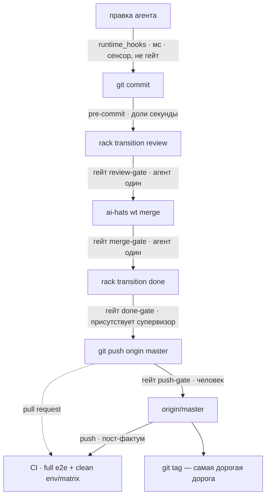

# ADR-0023: Quality gate — дороги, гейты, содержание

## Статус

Принят (HATS-1579, 2026-08-12). **Пересмотрен в HATS-1878 (2026-09-03):** гейт
стал **декларацией в несколько строк над одним примитивом**, маркер —
**постадийным**, стадии и примитив — одним скриптом (D6). Прежняя история исполнения — HATS-1604 (примитив), HATS-1614
(гейт `->merge`, поглощение), HATS-1664 (предмет ребра `->done` после слияния),
HATS-1708 (D10), HATS-1877 (гейт `->review`) — сохранена там, где она объясняет
решение; там, где она описывала механизм, механизм описан заново.

**ADR-0019** [1] владеет каналом привязок (`composition.apps`: форма строки,
политика отказа, кто валидирует имя точки). **ADR-0020** [2] владеет
hook-подложкой и контрактом кодов возврата. **ADR-0021** [3] владеет материализацией
поверхностей. **Этот ADR владеет содержанием гейта**: какие дороги существуют,
какой гейт какое ребро сторожит, что он требует и чего это стоит.

**Две таблицы ниже — рендер, не проза.** Таблица стадий и таблица гейтов
генерируются из `scripts/gates.sh list`, `--stages` каждого гейта и привязок
роли (`scripts/gen_gate_table.py` [5]); стадия `gate-table` отказывает
документу, отставшему от кода. Всё вокруг них
— решения, и их из кода не вывести. Прежняя редакция держала обе таблицы
рукописными: к 2026-09-02 семь из двадцати трёх стадий, которые знал диспетчер,
не были названы в ней вовсе, а дорога `->review` отсутствовала целиком.

**Голос — to-be.** Где сегодня иначе, стоит врезка «Сегодня» с замером и
карточкой-владельцем зазора.

**Указатели в код называют файл и символ, без номера строки** — правило и его
обоснование в `CONTRIBUTING.md`, «Never cite a line number».

## Словарь

- **Ребро** — переход, который совершается: `->review` (карточка передаётся
  ревьюеру), `->merge` (ветка вливается в master), `->done` (карточка
  закрывается). Именуются по входу; форма `X->` не используется.
- **Стадия** — одна именованная проверка, которую гоняет `scripts/gates.sh`:
  функция `ci_<stage>`. Стадия запускается **голой** — после её имени в pytest не
  проезжает ничего — и не знает ни гейтов, ни маркеров, ни git.
- **Гейт** — **скрипт в несколько строк**, объявляющий стадии, которые он
  требует, и передающий список в `scripts/gates.sh`: `hooks/<gate>.sh --stages`
  печатает его. Стрелки в гейте **нет**: где он применяется — строка
  `composition.apps` роли.
- **Примитив (`gates.sh check` / `run`)** — вторая половина `scripts/gates.sh`:
  принимает СПИСОК стадий и не знает имён гейтов. `check` — требование (какие
  стадии не отмечены для дерева-субъекта; ничего не запускает), `run` —
  исполнение (гоняет неотмеченные, штампует каждую зелёную).
- **Субъект** — коммит, который гейт судит; по умолчанию `HEAD`. Прогон идёт **в
  текущем чекауте** тогда и только тогда, когда он чист и его `HEAD` — субъект;
  иначе — в **scratch-чекауте**: одноразовой detached-воркtree на коммите,
  снесённой после прогона.
- **Маркер стадии** — файл `<git-common-dir>/ai-hats/stages/<tree>/<stage>`. По
  одному на стадию на дерево. Гейт пройден, когда есть файл для каждой стадии его
  множества.
- **Точка** — место, куда цепляется хук (`at:` в строке `composition.apps`).
  Термин принадлежит ADR-0019 [1] и глоссарию.

### Стадии

Что каждая проверяет и какие гейты её требуют — из `scripts/gates.sh` [5]:

<!-- gate-table:stages -->

| стадия             | требуют гейты                              | что проверяет                                                                |
| ------------------ | ------------------------------------------ | ---------------------------------------------------------------------------- |
| `e2e-catalog`      | review-gate done-gate merge-gate push-gate | tests/e2e/CATALOG.md matches the flow blocks in the tests' docstrings        |
| `lint`             | review-gate done-gate merge-gate push-gate | ruff check and ruff format --check, both over the whole tree                 |
| `shellcheck`       | review-gate done-gate merge-gate           | every tracked *.sh is clean at severity warning and above                    |
| `dependency-floor` | review-gate done-gate merge-gate           | every pin on a workspace package tracks that package's version               |
| `silent-fallback`  | review-gate done-gate merge-gate           | no broad except swallows a failure without reporting it                      |
| `test-isolation`   | review-gate done-gate merge-gate           | the suite patches its own units no more than the recorded baseline           |
| `prose-refs`       | review-gate done-gate merge-gate push-gate | paths, library prefixes, sections and symbols named in library prose resolve |
| `ticket-ids`       | review-gate done-gate merge-gate push-gate | no tracker id in shipped library prose                                       |
| `consumer-refs`    | review-gate done-gate merge-gate           | no library component names a component that composes it                      |
| `env-reference`    | review-gate done-gate merge-gate push-gate | docs/reference-env.md matches the env declarations the code reads            |
| `gate-table`       | review-gate done-gate merge-gate push-gate | ADR-0023's stage and gate tables match this file and the gates               |
| `adr-integrity`    | push-gate                                  | every ADR citation resolves and a number names exactly one file              |
| `bidi`             | push-gate                                  | no bidirectional control characters, which are invisible in review           |
| `wheel-contents`   | review-gate done-gate merge-gate           | every tracked src file reaches the wheel built through the sdist             |
| `master-ci`        | done-gate                                  | master's last CI verdict is green (network)                                  |
| `unit`             | review-gate done-gate merge-gate push-gate | every test not marked integration                                            |
| `integration`      | done-gate                                  | the real-subprocess tests outside tests/e2e                                  |
| `merge-smoke`      | done-gate                                  | the curated smoke subset of tests/e2e                                        |
| `e2e`              | push-gate                                  | the full tier: integration or smoke, quarantine and live agents excluded     |
| `coverage`         | -                                          | the tests outside tests/e2e in one process, at the coverage floor (CI)       |
| `security`         | -                                          | pip-audit over the interpreter's whole environment (CI-authoritative)        |
| `version-skew`     | -                                          | every workspace package is ahead of what PyPI has (network)                  |
| `python-pin`       | -                                          | every copy of the Python pin agrees and CI runs it                           |
| `tmp-sweep`        | -                                          | housekeeping: reap dead test cruft from TMPDIR; it can fail nothing          |
| `prepare`          | -                                          | precondition: a venv for this checkout; it asserts nothing                   |

<!-- /gate-table:stages -->

`-` — стадия, которую не требует ни один гейт: `coverage`, `security`,
`version-skew` живут в CI, `python-pin` — в бандле `all` и CI, `tmp-sweep` —
уборка, которая не может быть красной, `prepare` — предусловие, которое ничего
не утверждает. Строка с `-` стоит в таблице нарочно: «не названа ни одним
гейтом» должно быть решением, которое читатель видит, а не строкой, которую
кто-то забыл.

**Времена — замер, а не свойство таблицы, и потому проза с датой.**
Последовательный прогон на одном ядре без xdist, 2026-08-14 (HATS-1655): тир
линтинга (все офлайновые стадии до `unit`) — около девяти секунд вместе;
`merge-smoke` ~20 с; `integration` ~98 с; `unit` ~95 с; `coverage` ~195 с.
Полный `e2e` — 245–251 с при `-n 8` (2026-08-17, HATS-1708; два прогона одного
дерева, 911 passed). `wheel-contents` ~3 с на пять пакетов, `master-ci` — сеть
(HATS-1877). Следующий обязательный перезамер — не позднее 2026-09-16 или сразу
после изменения селекции, числа workers или venv-контура.

## Контекст

Четыре замера **на состоянии 2026-08-11/12, до этого документа**, и один — на
2026-09-02, породивший пересмотр. Раздел описывает прошлое; все пять с тех пор
закрыты решениями этого же ADR, отметки стоят прямо в пунктах.

**Три списка стадий разъехались.** Набор `all` нёс семь стадий, `done-gate` —
пять, преамбула master-пуша — три; ни один не был надмножеством другого.
**Закрыто** (D6): каждый состав объявляется один раз, строкой `STAGES=` в
скрипте своего гейта, а стадии живут в одном `scripts/gates.sh`.

**Состав не охранял ничто.** Селекция e2e-тира жила в двух копиях, теста на их
равенство не было. **Закрыто**: копия одна (`ci_e2e`), вложенность гейтов —
под ратчетом `tests/test_gates_table.py`.

**Половина гейта холостая.** 17 срабатываний `review->done`, 13 ответили «has
no worktree — nothing to gate. Passing», 11 из них — карточки, чей воркtree был
влит в master. **Закрыто** HATS-1664: у предмета появилось второе имя
(`AI_HATS_MERGED_SHA`).

**Один гейт отвечал по-разному.** `ruff format --check` на одном дереве давал
rc=0 из venv основного чекаута и rc=1 из свежего venv воркtree. **Закрыто**
HATS-1607 (точный пин плюс явная область).

**Гейт стоил шестидесяти строк, а таблица гнила (2026-09-02, HATS-1877 →
HATS-1878).** Третий гейт на канале checks стоил четвёртого почти одинакового
скрипта (`review-gate.sh`, отличавшегося от соседей двумя строками), правки трёх
рукописных списков имён внутри одного `ci-local.sh`, таргета в Makefile, строки
роли и — впустую — строки в этом ADR. При этом прогон `done-gate` после зелёного
`review-gate` перегонял tier и `unit` заново (~2 минуты из ~4), потому что маркер
писался на ГЕЙТ, всё или ничего, хотя читался уже постадийно. **Закрыто**
HATS-1878 — D5, D6, D7 ниже.

## Решение

### D1 — Дороги

Дорог семь, и они не сводятся к выбору «стадия `gates.sh` или строка
`composition.apps`»: `git_hooks` — единственный канал, доходящий до чужого
проекта, CI и тегирование не выражаются ни тем, ни другим.

1. **Отказ дешевеет тем раньше, чем раньше дорога.** На `->review` и `->merge`
   он бесплатен — не тронуто ничего. После слияния он уже не размёрдживает (D2).
2. **agent-time не заменяет гейт.** `py-security-lint` и `comment-length-lint`
   видят только файлы, которые агент правил в этой сессии, и при коммите
   человеком не срабатывают.
3. **CI — единственная общая server-side дорога.** На pull request она даёт
   предмержевый сигнал, на прямом push срабатывает пост-фактум. Пока status
   checks не required, обе формы можно обойти; enforcement принадлежит HATS-927,
   содержание — D10.
4. **Release-time здесь только объявляется.** Содержание — **HATS-1609**;
   сегодня на теге не стоит ни одного гейта, процедура живёт ручным чеклистом в
   `docs/RELEASING.md`.

### D2 — Ребро может иметь две точки

**Rack объявляет на ребро две точки:** до собственных эффектов и после них.

> **Сегодня, и, вероятно, навсегда.** Точка одна: подписчик checks прибит к
> `CHECK_PRIORITY = 15` (`checks.py`), слияние делает воркtree-подписчик на 30.
> **Гейт, судящий результат слияния, второй точки не требует** (HATS-1664): чек
> получает sha мёрдж-коммита (`AI_HATS_MERGED_SHA`), а отказ на приоритете 15
> бесплатен — что и требует D1 §1. **Отказ на второй точке не размёрдживал бы**:
> откат кернела разматывает только staged-транзакцию докстора, слияние уходит
> через teardown. Потребителя у второй точки не осталось.

### D3 — Что решает, какая проверка на каком гейте: кто присутствует при отказе

Ось не только стоимость и предмет, но и **кто окажется перед красным гейтом и
сможет ли разрулить в одиночку.**

- На **`->review`** и **`->merge`** агент один: сюда идут проверки, чей отказ
  указывает на его собственную ветку и чинится без чужого участия.
- На **`->done`** присутствует супервизор — ребро `review → done` выписывает
  ревьюер. Сюда идут проверки, чей отказ может потребовать координации между
  агентами, прежде всего поломка от совмещения двух независимо зелёных веток.

Второе — условие сходимости: тяжёлый гейт на `->merge` при параллельной работе
двух агентов над одним файлом даёт обоим красный на общей поломке, оба чинят её
одновременно и без арбитра, ломая правки друг друга.

### D4 — Гейты и их содержание

Что каждый гейт требует и где применяется — из `scripts/gates.sh` и привязок
роли `maintainer` (`composition.apps`, ключ `gate:` в строке) [5]:

<!-- gate-table:gates -->

| гейт          | где применяется          | стадии                                                                                                                                                                                         |
| ------------- | ------------------------ | ---------------------------------------------------------------------------------------------------------------------------------------------------------------------------------------------- |
| `review-gate` | `rack.tasks`: `->review` | e2e-catalog lint shellcheck dependency-floor silent-fallback test-isolation prose-refs ticket-ids consumer-refs env-reference gate-table wheel-contents unit                                   |
| `done-gate`   | `rack.tasks`: `->done`   | e2e-catalog lint shellcheck dependency-floor silent-fallback test-isolation prose-refs ticket-ids consumer-refs env-reference gate-table wheel-contents unit integration merge-smoke master-ci |
| `merge-gate`  | `wt`: `pre-merge`        | e2e-catalog lint shellcheck dependency-floor silent-fallback test-isolation prose-refs ticket-ids consumer-refs env-reference gate-table wheel-contents unit                                   |
| `push-gate`   | `git pre-push`           | e2e-catalog lint prose-refs ticket-ids env-reference gate-table adr-integrity bidi unit e2e                                                                                                    |

<!-- /gate-table:gates -->

Что каждый **спрашивает** — решение этого ADR, из кода не выводимое:

- **`review-gate` спрашивает: годна ли работа для того, чтобы человек потратил
  на неё время.** Ребро долго не спрашивало ничего, и карточка доходила до
  ревьюера на слове агента, что тесты зелёные; слово измерили и нашли
  ненадёжным пять раз за одну сессию (HATS-1877). Маркер снимает чтение: нет
  числа, которое можно прочесть неверно. Требует то же множество, что
  `merge-gate`, намеренно — гейты различаются моментом, а не требованием, и
  `unit` — та стадия, ради которой гейт существует.
- **`merge-gate` спрашивает: годна ли ветка войти в master.** Тир линтинга плюс
  `unit` плюс `wheel-contents` (HATS-1877) — минимум, ловящий явно сломанное до
  общего ствола и чинимый агентом в одиночку.
- **`done-gate` спрашивает: зелен ли master после этой карточки.** Сверх
  `merge-gate` — `integration`, `merge-smoke` и `master-ci` (последняя задаёт тот
  же вопрос о базе, на которую карточка ложится). Предмет — вклад карточки в
  master, и у него **два имени в окружении чека**: `AI_HATS_WORKTREE_PATH`
  (слияние ещё не произошло, судится дерево ветки) и `AI_HATS_MERGED_SHA`
  (воркtree уже нет, судится дерево мёрдж-коммита). Ни того, ни другого — карточка
  не приносила кода: doc, research, эпик — **пас**. Третья строка — не
  послабление, а сохранение F-11.
- **`push-gate` спрашивает: зелёно ли дерево, которое уходит в origin/master.**
  Полный `e2e`-тир плюс `adr-integrity` и `bidi`, которых нет на карточных
  гейтах.

Три дороги, которые гейтами в коде **не являются** и потому в таблице не стоят:
**commit** (`git commit`; privacy, docs-index, no-raw-destructive, skill-lint,
rule-delivery, ticket-ids; агент или человек; доли секунды — состав везёт
библиотека проекта, а на конкретной машине может быть шире: смотри
`.githooks/`, не этот документ), **release** (тегирование; **HATS-1609**) и
**CI** (clean install, матрица 3.11–3.13, `security`, `version-skew`,
`install-smoke`, полный e2e; D10).

**Типовая карточка платит за разницу.** Маркер постадийный (D5): прогон
`review-gate` штампует tier, `wheel-contents` и `unit`; `make done-gate` после
него гоняет только `master-ci`, `integration` и `merge-smoke`. Дерево слияния
совпадает с деревом ветки в 26 случаях из 30 (замер 2026-08-14 по первым
родителям master), так что те же штампы засчитываются и после слияния. Отказ
называет **только недостающие стадии** и команду `make <gate>` — и она стоит
ровно недостающего.

#### Субъект — коммит, и где его судят решает примитив

После `->merge` предмет карточки — мёрдж-коммит, а к ребру `review--done` оба
имени «здесь» уже испорчены: воркtree карточки снесён `wt:pre-merge` за секунды
до ребра, а главный чекаут — стол супервизора: его `HEAD` уехал под чужими
слияниями, и он почти всегда грязный. Прогон «здесь» гонял бы стадии по чужому
содержанию и потом отказывался бы записать результат — дверь без ключа
(HATS-1664).

HATS-1664 сделал прогон на коммите **исключением** (`--rev`); HATS-1878 сделал
его **правилом без флага**. `gates.sh run` берёт субъект (`HEAD` или
`--rev`), и прогон идёт в текущем чекауте **только** если тот чист и его
`HEAD` — субъект. Иначе примитив сам минтит одноразовую detached-воркtree на
коммите под `<git-common-dir>/ai-hats/gate-checkouts/` (не `$TMPDIR`: macOS
чистит его по atime, и venv, унаследовавший atime кэша uv, рождался просроченным
— HATS-1632), готовит её `gates.sh --prepare`, гоняет и сносит. В воркtree
карточки условие выполнено — быстрый путь; в главном чекауте оно не выполнено
никогда, и туда просто нет дороги. Инвариант: **то, на чём стадии бежали, и есть
то, что маркер называет**, и ничьё слияние в главный чекаут не сдвинет
судимое.

> **Дать чекаут — мало, в него надо ПОПАСТЬ** (дважды измерено в HATS-1664):
> диспетчер, названный по правильному пути, но с унаследованным cwd, судил дерево,
> в котором стоял агент; `PYTHON` вызывающего чекаута побивал локальный `.venv`.
> Примитив делает `cd` в чекаут перед каждой стадией и сбрасывает `PYTHON`,
> указывающий вне него. Проверять новую дорогу нужно вопросом «в каком дереве
> оказался процесс», а не «какой файл был назван».

**Требование — гейта, маркеры и стадии — судимого дерева.** На проверке гейт
зовёт `<дерево>/scripts/gates.sh check --rev <субъект> $STAGES` — из воркtree
карточки, пока она жива, из главного чекаута с мёрдж-sha, когда её нет. Список
стадий приходит из скрипта гейта (то есть из библиотеки, которой роль владеет),
раннер и хранилище маркеров — из судимого дерева. Дерево без `scripts/gates.sh`
не может заработать маркер и потому не проходит.

> **Одноразовая scratch-воркtree стоит времени, и это ещё не измерено.**
> Рулинг 2026-09-03: воркtree одноразовая и управляется скриптами CI; тёплый
> кэш допустим, долгоживущая воркtree — нет. Замер шагов (`worktree add`,
> `--prepare` с холодным и тёплым кэшем uv, снос) — **HATS-1879**. Предыдущая
> цифра, 2026-08-14: 3 мин 44 с на весь состав `done-gate` вместе со сборкой
> venv против 3 мин 32 с в готовом воркtree.

**Релевантные e2e** по объявлению `covers:` в flow-блоке — владелец **HATS-1605**,
не сделано: зелёный `->done` НЕ означает зелёный e2e-тир, тир целиком стоит на
`push-gate` и в CI (D10). **Покрытие — измерение, а не гейт.** **Эпик не платит**
— у него нет ни ветки, ни слияния, он попадает в третью строку резолва предмета.
**Область гейта объявляется, а не наследуется от инструмента** (HATS-1607:
точный пин `ruff` плюс `extend-exclude`).

### D5 — Маркер: по стадии, ключ по дереву, поглощение — включение множеств

**Маркер — на СТАДИЮ, не на гейт:** `<git-common-dir>/ai-hats/stages/<tree>/<stage>`,
с `tree=`, `stage=`, `commit=`, `timestamp=`, `ran=` (in-place или scratch).
Гейт пройден тогда и только тогда, когда для дерева отмечена каждая стадия его
множества. Из этого следуют все три прежних свойства и одно новое:

- **Ключ — дерево (`HEAD^{tree}`), а не коммит.** Слияние делает `--no-ff`, sha
  мёрдж-коммита всегда новый, дерево — нет: у 26 из 30 слияний в master дерево
  побайтово равно дереву ветки.
- **Поглощение — включение множеств, в обе стороны.** Прогон `done-gate`
  штампует всё, что требуют `review-gate` и `merge-gate`; прогон `review-gate`
  штампует то, что `done-gate` уже не перегоняет. Прежний маркер на гейт
  (`<gate>/<tree>` со списком `stages=`) читался по объединению, а писался «всё
  или ничего», и поглощение работало только вниз.
- **Красная стадия сохраняет штампы зелёных до неё.** Прогон останавливается на
  первой красной; что успело стать зелёным — факт о дереве и остаётся. Прежде
  поздняя красная стадия обнуляла весь прогон.
- **Пишется только из чистого чекаута субъекта.** Грязный стол не портит маркер
  и не блокирует его — субъект судится в scratch-чекауте (D4). Стадия, изменившая
  отслеживаемое содержание, маркера не получает, и прогон останавливается.
- **Файл, чья строка `tree=` не совпадает с путём, не удостоверяет ничего.**
- **`--git-common-dir`, никогда `--git-dir`** — так штамп из task- или
  scratch-воркtree виден из главного чекаута.

Прежний формат не читается: состояние локальное и восстановимое, цена — один
перепрогон на живую карточку после слияния HATS-1878. Свежая сессия читает новый
формат — доказано e2e на обоих дорогах (`tests/e2e/test_done_gate.py`).

### D6 — Два вида скриптов

| скрипт                                       | знает                                                                                       | **не знает**                                  |
| -------------------------------------------- | ------------------------------------------------------------------------------------------- | --------------------------------------------- |
| `scripts/gates.sh` — стадии и примитив       | какие виды проверок есть и как каждая запускается; субъект, маркеры, «прогнать недостающее» | имена гейтов, рёбра FSM, роли, код возврата 2 |
| `hooks/<gate>.sh` — гейт, по одному на ребро | стадии, которые он требует (`STAGES=`), и кому их передать                                  | как устроена стадия, где лежит маркер         |
| `lib/gate.sh` — общее тонких гейтов          | какое дерево кладёт в master этот переход; коды своего канала                               | ни одной стадии                               |
| `git_hooks/pre-push-e2e-master.sh`           | то же для git-канала: протокол pre-push из stdin, коды 0/1                                  | как устроена стадия                           |

Гейт — это пять строк: комментарий с вопросом ребра, `STAGES='…'`, `source`
общей части, `gate_main <gate> "$STAGES" "$@"`. Добавить гейт — добавить такой
файл, строку роли и таргет в Makefile; ни одного списка имён в `gates.sh`.

**Требование и исполнение — два глагола, и это структурная гарантия.**
`gates.sh check` не имеет пути к раннеру стадий — не «не должен», а не может;
тест доказывает это раннером, который завершается кодом 99 и достижим из `run`
той же фикстуры. Отказ на ребре поэтому всегда «недостают такие стадии, запусти
`make <gate>`», и никогда — тесты внутри лока.

**Стадия запускается голой.** `gates.sh` не пропускает argv после имени стадии:
маркер за `unit -k foo` был бы ложью. Параллелизм CI едет через
`PYTEST_ADDOPTS`. Фильтровать — вызывать `pytest` самому.

**Раннер инъектируется** (`GATES_STAGE_RUNNER`): без этого каждый тест примитива
стоил бы настоящего `unit`; с ним вся логика «пропустить/прогнать/штамповать/
остановиться» тестируется на фейковом раннере за миллисекунды, а настоящий — под
e2e.

**Адаптер git-канала — отдельный файл нарочно:** его дефолтный режим читает
протокол pre-push из stdin, а раннер checks отдаёт детям `stdin=DEVNULL` —
пустой stdin попал бы в fast path «нет master-цели» и гейт был бы вечнозелёным.

### D7 — Граница: гейт объявляет, проект исполняет

Движок владеет **точками, подложкой хука и контрактом кодов возврата**. Проект
владеет **стадиями и маркерами** (`scripts/gates.sh`). Роль владеет **гейтами**:
какой стоит на каком ребре (строка `composition.apps`) и что каждый требует
(`STAGES=` в его скрипте). Библиотечный скрипт гейта не запускает ни одной стадии
и не читает ни одного маркера сам — он передаёт список проектному `gates.sh`
судимого дерева. Проект, у которого нет `scripts/gates.sh`, получает отказ, а не
откат на состав, который библиотека прогнала бы сама.

### D8 — Обход гейта: явный, записанный, всплывающий

Небезопасен не обход, а бесшумный обход. Три свойства, все обязательны:

1. **Явность.** Только через переменную окружения, выставленную **снаружи**
   агента. Префикс к собственной команде не работает: хук исполняется до того,
   как эта команда становится процессом (HATS-1294).
2. **Запись.** Каждый обход пишется в `<git-dir>/ai-hats/bypasses.jsonl` через
   `ai_hats_journal_bypass()` (`hooks/bypass_journal.sh`) [7].
3. **Всплытие.** На следующем пуше `pre-push-bypass-report.sh` печатает
   человеку, сколько обходов проехало в этих коммитах.

> **Сегодня.** У карточных гейтов обхода нет. Единственный способ — `git push
> --no-verify`, который снимает все хуки сразу и к этим рёбрам не относится.
> Подделка маркера — `touch` под `.git/ai-hats/stages/` — осознанный локальный
> акт доверенного мейнтейнера, а не случайный пропуск.

### D9 — Отвергнутое, с причинами

- **Тяжёлый гейт на `->merge`.** Отказ чинят два агента одновременно и без
  арбитра (D3).
- **Порог покрытия как гейт.** Отвечает не на тот вопрос (D4).
- **Перенос checks-канала на декларативные хэндлеры.** Канал намеренно не
  объявляется в `backlog.yaml` (ADR-0017 [4]), а чтение `priority:` из строки
  заставило бы резолвить `composition.apps` на каждом `rack ls`.
- **Отказ, который размёрдживает.** Кернел не откатывает git (D2).
- **Полный e2e-тир на каждой карточке.** Тир исполняется в CI и на пуше; карточный
  `->done` остаётся выборочным (HATS-1605).
- **Реюз `pre-push-e2e-master.sh` телом чека.** Пустой stdin — вечнозелёный гейт
  (D6).
- **Предсказание дерева слияния** (`git merge-tree --write-tree`) и **вторая
  точка на ребро** — страж дрейфа уже держит содержание (D2, HATS-1615).
- **Таблица гейтов между хуком и примитивом** (HATS-1878, первая редакция
  карточки). Один общий `hooks/gate.sh`, выбирающий гейт по грузу строки роли
  (`gate: done-gate`, пробрасываемому движком в окружение), и `gates.sh` как
  таблица «стадия → гейты» над отдельным примитивом. Отвергнуто на ревью:
  зависимости перевёрнуты — таблица гейтов стояла НАД скриптом стадий, а
  скрипт про стадии (`ci-local.sh`) под ней; гейт должен быть декларацией над
  одним скриптом стадий, а не строкой в промежуточном слое. Проброс груза
  остался без потребителя и откатан.
- **Генерировать файл гейта из таблицы** (HATS-1878). Ноль правок движка — но
  генерируемый скрипт в пакете, ради шестидесяти строк, которые стали пятью.
- **Выбирать гейт по `AI_HATS_HOOK_POINT`** (HATS-1878). «Где применяется»
  жило бы в двух домах, и матчить пришлось бы `selector` внутри JSON-конверта.
- **Читать старый формат маркера рядом с новым.** Второй формат в коде навсегда
  ради одного перепрогона.
- **Переиспользуемая scratch-воркtree.** Тёплый venv против переживающего
  состояния; рулинг — одноразовая, кэш греть отдельно (HATS-1879).
- **Бандл `all`, зарабатывающий маркеры.** Все начали бы звать `all`, даже когда
  он не нужен; говорить, что хочешь получить — `make <gate>`.
- **Pattern rule в Makefile вместо таргета на гейт.** Поверхность `make
  done-gate` цитируется отказами и документами; таргеты остались рукописными,
  рецепт стал одной строкой.

### D10 — Полный e2e на дороге CI

Workflow [10] запускает отдельную job `e2e` на каждом pull request в master и
каждом push в master: полная git history, Python 3.13, тот же install-контур и
git identity, что `merge-smoke`, и единственное определение стадии —
`bash scripts/gates.sh e2e`. Параллелизм (`-n 8 --dist=loadgroup`) едет через
`PYTEST_ADDOPTS` в env шага — стадия запускается голой (D6);
`AI_HATS_E2E_REQUIRE_VENV=1` превращает невозможность собрать shared test venv из
skip в явный отказ.

**Почему CI обязана это нести.** Только server-side дорога даёт чистую установку,
матрицу Python 3.11/3.12/3.13, сетевые `security` и `version-skew`, настоящий
`install-smoke` и один видимый вердикт полного e2e для каждого события. Локальный
push-гейт остаётся: до HATS-927 CI — сигнал, но не неотключаемый барьер.

## Семь способов гейту исчезнуть тихо

Первые три наследуются любой новой строкой; четвёртый не про строку, а про
дорогу; пятый — про предмет; шестой — про роль, которая строку не несла;
седьмой закрыт, но записан, потому что он единственный маскировался под
законный пропуск.

1. **Снятие оверлеем** — если оверлей убирает скилл, строка выбывает (HATS-1535).
   `rack doctor` классифицирует несомые строки как ARMED / DEAD / UNADDRESSED;
   строку, снятую оверлеем **до** композиции, он не видит.
2. **Порт старше протокола** — интегратор без `CheckPort.check_declarations`
   оставляет переходы негейчеными (`_without_declarations` в `checks.py`).
3. **Зеркало сессии старше биндинга** — сузилось после HATS-1540; остаток —
   скилл, которого в зеркале нет вовсе.
4. **Дорога, на которой точки нет вовсе.** `cleanup(IsolationMode.SQUASH)` делает
   `git merge --squash` в базовую ветку, не зажигая `wt:pre-merge` (ADR-0013 D8);
   владельца нет (HATS-1595).
5. **Предмет, исчезнувший раньше срабатывания.** 13 срабатываний из 17 ответили
   «has no worktree» на карточках, чей воркtree был влит. Закрыто HATS-1664
   вторым именем предмета. **Общая форма для любого нового гейта:** переживает
   ли предмет момент срабатывания; и в каком дереве оказался процесс,
   исполняющий состав — с HATS-1878 второе держит примитив (субъект-коммит, D4).
6. **Роль, которая строку не несла.** Блок `composition.apps` с гейтами есть
   только у роли `maintainer`; карточка под любой другой ролью входит в master
   без гейта, а подписчик `checks` пишет тот же `"outcome": "ok"`, что и
   настоящий зелёный гейт. Живой случай — HATS-1630. Владельца нет.
7. **Строка, адресованная не тому бэклогу — ЗАКРЫТ (HATS-1774).** Промах по
   адресуемому бэклогу — всегда `dead` и находка (ADR-0019 [1] D11 clause 2).

**Восьмой, заведённый и закрытый HATS-1878 в одной карточке:** гейт, чьё имя —
имя файла, а требование — рукописный список в трёх копиях. Новый гейт стоил
файла, три копии гнили независимо (тест, перечислявший `merge/done/push`,
пропустил `review-gate` через два дня после его появления), а документ —
четвёртая копия — отставал на семь стадий. Закрыто гейтом-декларацией над
одним примитивом (D6), ратчетом «каждая стадия либо требуется гейтом, либо
исключена по имени» (`tests/test_gates_table.py`) и `gate-table`, который
отказывает отставшему документу.

## Открытые карточки

| карточка      | что решает                                              |
| ------------- | ------------------------------------------------------- |
| **HATS-1879** | стоимость одноразовой scratch-воркtree на прогон (D4)   |
| **HATS-1605** | `covers:` в flow-блоке для релевантных e2e              |
| **HATS-1609** | содержание дороги тегирования релиза                    |
| **HATS-927**  | branch protection и required CI status checks           |
| **HATS-1591** | security: стадия красная и зависит от venv              |
| **HATS-1589** | формат сообщения коммита: сначала конвенция, потом гейт |

**Не закрыто и HATS-1878 не берёт:** правка карточки, стоящей в `review`, молча
обесценивает её маркер, и это ловится следующим гейченым ребром, а не в момент
правки (work_log HATS-1877). Механизм другой — наблюдатель за воркtree или правило
повторного входа в `review`; заводить, когда протухший маркер поймается на `->done`
второй раз.

## References

- [1] ADR-0019 — декларативная модель расширения жизненного цикла:
  `docs/adr/0019-declarative-lifecycle-extension-model.md`
- [2] ADR-0020 — hook-подложка и контракт кодов возврата:
  `docs/adr/0020-hook-execution-and-materialization-substrate.md`
- [3] ADR-0021 — материализация поверхностей:
  `docs/adr/0021-surface-materialization.md`
- [4] ADR-0017 — `backlog.yaml` как единственное определение:
  `docs/adr/0017-backlog-yaml-single-definition.md`
- [5] Стадии и примитив: `scripts/gates.sh`; рендер таблиц этого документа:
  `scripts/gen_gate_table.py`
- [6] Адаптеры каналов:
  `packages/ai-hats-library/src/ai_hats_library/ai-hats-dev/skills/maintainer-quality-gate/`
- [7] Журнал обходов:
  `packages/ai-hats-library/src/ai_hats_library/hooks/bypass_journal.sh`
- [8] Фактура ревизии, из которой выросла карточка:
  `.agent/ai-hats/tracker/backlog/tasks/HATS-1571/findings.md`
- [9] План и замеры первой редакции:
  `.agent/ai-hats/tracker/backlog/tasks/HATS-1579/plan.md`
- [10] Server-side CI workflow:
  `.github/workflows/ci.yml`
- [11] План пересмотра:
  `.agent/ai-hats/tracker/backlog/tasks/HATS-1878/plan.md`
