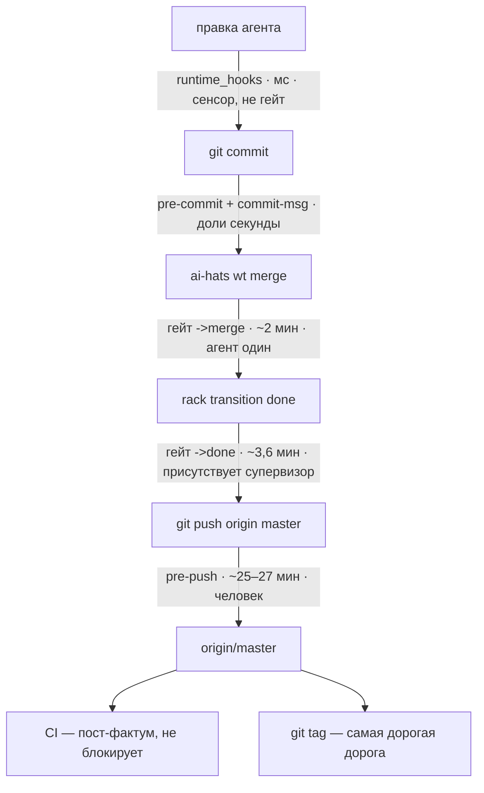

# ADR-0023: Quality gate — дороги, гейты, содержание

## Статус

Предложен (HATS-1579, 2026-08-12).

**ADR-0019** [1] владеет каналом привязок (`composition.apps`: форма строки,
политика отказа, кто валидирует имя точки). **ADR-0020** [2] владеет
hook-подложкой и контрактом кодов возврата. **ADR-0021** [3] владеет
материализацией поверхностей. **Этот ADR владеет содержанием гейта**: какие
дороги существуют, какой гейт какое ребро сторожит, что он гоняет и чего это
стоит.

**Голос — to-be.** Где сегодня иначе, стоит врезка «Сегодня» с замером и
карточкой-владельцем зазора. Замеры сняты 2026-08-11/12, `file:line`
перепроверены на `81b4a529`.

## Словарь

- **Ребро** — переход, который совершается: `->merge` (ветка вливается в
  master), `->done` (карточка закрывается). Именуются по входу; форма `X->`
  не используется.
- **Гейт** — то, что сторожит ребро: именованный набор стадий с одним вердиктом
  и одним маркером. Называется по ребру, которое сторожит.
- **Точка** — место, куда цепляется скрипт гейта (`at:` в строке
  `composition.apps`). Термин принадлежит ADR-0019 [1] и глоссарию; одно ребро
  может иметь несколько точек (D2).

### Стадии: что каждая проверяет и чего стоит

Гейт собирается из стадий `scripts/ci-local.sh` [5]. Времена замерены
последовательным прогоном на одном ядре без xdist.

| стадия             | что проверяет                                                                         |              время |
| ------------------ | ------------------------------------------------------------------------------------- | -----------------: |
| `lint`             | `ruff check` по всему дереву + `ruff format --check` по `src/ tests/`                 |               <1 с |
| `dependency-floor` | что каждый пин на workspace-пакет отслеживает его версию                              |               <1 с |
| `silent-fallback`  | что широкий `except` не глотает отказ молча (`dev_rule_silent_fallback`)              |               <1 с |
| `test-isolation`   | что тест не патчит код, который сам же проверяет — ратчет к записанной базовой линии  |               <1 с |
| `e2e-catalog`      | что `tests/e2e/CATALOG.md` совпадает с flow-блоками в докстрингах тестов              |                7 с |
| `merge-smoke`      | curated-подмножество e2e: 28 тестов с маркером `smoke`                                |               12 с |
| `integration`      | реально-подпроцессные тесты вне `tests/e2e`: 400 тестов                               |               90 с |
| `unit`             | всё, не помеченное `integration`: 4545 тестов                                         |              116 с |
| `coverage`         | те же тесты вне `tests/e2e` одним процессом, с порогом 78%                            |              195 с |
| `e2e`              | полный тир: `(integration or smoke) and not quarantine` по `tests/e2e`, `tests/smoke` |         ~25–27 мин |
| `security`         | `bandit -ll` + `pip-audit`                                                            |        не измерено |
| `version-skew`     | что workspace-пакеты впереди опубликованных на PyPI                                   | не измерено (сеть) |

Первые пять — **тир линтинга**: вместе девять секунд (замер 2026-08-14,
последовательно), все офлайновые. Ниже упоминаются одним словом.

Тир определяется свойством — **офлайновое и мгновенное**, — а не перечнем имён.
`test-isolation` (ратчет патчинга, HATS-1599) существовала на момент написания
этого ADR, стояла в наборе `all` и в CI, но не была здесь названа и не стояла ни
на одном гейте; строка добавлена в HATS-1614 по этому же признаку.

> **Сегодня.** `security` не измерена, потому что не запускается: `bandit` и
> `pip-audit` объявлены в dev-extras и в проектном venv отсутствуют. Владелец —
> **HATS-1591**.

## Контекст

Четыре замера на состоянии до этого документа.

**Три списка стадий разъехались.** Локальный набор `all` несёт семь стадий,
`done-gate` — пять (`scripts/ci-local.sh:125`), преамбула master-пуша — три
(`pre-push-e2e-master.sh:149`); ни один не надмножество другого.
`dependency-floor` и `silent-fallback` — обе офлайновые, обе меньше секунды — не
стоят ни на одной дороге в master. Обе существовали 2026-07-31, `done-gate`
собран 2026-08-07 без них, причина не записана ни в одной карточке.

**Состав не охраняет ничто.** `tests/test_gate_entrypoint_parity.py` охраняет
способ вызова, а не состав, и скрипты хуков его скан не покрывает: полная
селекция e2e-тира живёт в двух копиях, `ci-local.sh:112` и
`pre-push-e2e-master.sh:220`, теста на их равенство нет. Сам состав записан
прозой в пяти местах при двух исполняемых (`ci-local.sh:125` и `:158-167`);
прозаические — `ci-local.sh:123`, `done-gate.sh:111`,
`maintainer-quality-gate/SKILL.md:137`, `Makefile:52`, `CONTRIBUTING.md:104`, и
последние две уже неверны: говорят «lint, unit, coverage, merge-smoke» при семи
стадиях.

**Половина гейта холостая.** По транскриптам в `<ID>/.checks/`: **17
срабатываний `edge:review--done`, 13 ответили «has no worktree — nothing to
gate. Passing», и 11 из этих 13 — карточки, чей воркtree был влит в master.**
Причина в порядке: в 8 случаях из 9 `wt:pre-merge` стреляет раньше ребра
(`ai-hats wt merge`, через секунды `rack transition done`), и к ребру дерева уже
нет.

**Один гейт отвечает по-разному.** `ruff format --check` на одном дереве даёт
rc=0 из venv основного чекаута и rc=1 из свежего venv воркtree — версии
инструмента разошлись при пине без потолка (D4, «Сегодня»).

## Решение

### D1 — Дороги

Дорог шесть, и они не сводятся к выбору «стадия `ci-local.sh` или строка
`composition.apps`»: `git_hooks` — единственный канал, доходящий до чужого
проекта (стадия проектная по построению, а точки коммита в модели привязок нет),
CI и тегирование не выражаются ни тем, ни другим.

1. **Отказ дешевеет тем раньше, чем раньше дорога.** На `->merge` он бесплатен —
   не тронуто ничего. После слияния он уже не размёрдживает (D2).
2. **agent-time не заменяет гейт.** `py-security-lint` и `comment-length-lint`
   видят только файлы, которые агент правил в этой сессии, они советующие по
   построению и при коммите человеком не срабатывают.
3. **CI — единственная неотключаемая дорога и единственная пост-фактум.** Когда
   джоба краснеет, master уже красный. Её содержание — **HATS-1590**.
4. **Release-time здесь только объявляется.** Тегирование не ограничено временем
   и происходит при человеке, поэтому может нести то, чего не несёт пуш.
   Содержание — **HATS-1609**; сегодня на теге не стоит ни одного гейта, а
   процедура живёт ручным чеклистом в `docs/RELEASING.md`.

### D2 — Ребро может иметь две точки

**Rack объявляет на ребро две точки:** до собственных эффектов и после них.
Автор строки `composition.apps` пишет имя точки и не видит чисел — движок владеет
точками, роль содержанием (D7).

> **Сегодня.** Точка одна. Подписчик checks прибит к `CHECK_PRIORITY = 15`
> (`checks.py:29`), слияние делает воркtree-подписчик на 30
> (`rack_wiring.py:263,313`), поэтому гейт, судящий результат слияния,
> невыразим. Механика второй точки уже на месте:
> `CheckSubscriber.__init__` принимает `priority=` (`checks.py:146`), а
> благословлённый конструктор `check_subscriber()` (`checks.py:284-303`) его не
> передаёт. Владелец — **HATS-1602**, он же добавляет в окружение чека sha
> мёрдж-коммита карточки (сегодня подаётся `AI_HATS_WORKTREE_PATH`, которого на
> второй точке уже нет).

**Почему не декларативный хэндлер.** Форма доказана — `plan-gate`,
`plan-consent`, `hyp-quorum-gate`, `frozen-integrity` отказывают переходу из
декларации, приоритет автор задаёт сам, обе линии сливаются в один
отсортированный список (`dispatch.py:307`). Для checks-канала закрыто двумя
вещами: канал намеренно не объявляется в `backlog.yaml` — «канал, в который
бэклог может забыть заопт-иниться, есть то молчаливое отсутствие, ради
устранения которого эпик существует» (`ai_hats_rack/workspace.py:419-420`,
ADR-0017 [4]:516); и чтение `priority:` из строки заставило бы резолвить
`composition.apps` на сборке кернела, то есть на каждом `rack ls` и `rack
context` — форма, уронившая чтения в HATS-1538.

**Отказ на второй точке не размёрдживает.** Откат кернела разматывает только
staged-транзакцию докстора; слияние уходит через
`self._effects.teardown(..., merge=True)` (`rack_wiring.py:313`). Отказ
отказывает смене состояния, оставляя слияние на локальном непушнутом master.

### D3 — Что решает, какая проверка на каком гейте: кто присутствует при отказе

Ось не только стоимость и предмет, но и **кто окажется перед красным гейтом и
сможет ли разрулить в одиночку.**

- На **`->merge`** агент один: сюда идут проверки, чей отказ указывает на его
  собственную ветку и чинится без чужого участия.
- На **`->done`** присутствует супервизор — ребро `review → done` выписывает
  ревьюер. Сюда идут проверки, чей отказ может потребовать координации между
  агентами, прежде всего поломка от совмещения двух независимо зелёных веток.

Второе — условие сходимости: тяжёлый гейт на `->merge` при параллельной работе
двух агентов над одним файлом даёт обоим красный на общей поломке, оба чинят её
одновременно и без арбитра, ломая правки друг друга.

### D4 — Гейты и их содержание

| гейт          | момент               | кто перед отказом | предмет                   | содержание                                                                                                         |         время |
| ------------- | -------------------- | ----------------- | ------------------------- | ------------------------------------------------------------------------------------------------------------------ | ------------: |
| **commit**    | `git commit`         | агент или человек | staged-диф, сообщение     | privacy, docs-index, no-raw-destructive, skill-lint, rule-delivery, авторство; `smoke` — условно, по тегу карточки |  доли секунды |
| **`->merge`** | `wt:pre-merge`       | агент, один       | дерево ветки              | тир линтинга + `unit`                                                                                              |        ~2 мин |
| **`->done`**  | ребро `review--done` | супервизор        | дерево результата слияния | тир линтинга + `unit` + `integration` + `merge-smoke` + релевантные e2e                                            |      ~3,6 мин |
| **push**      | `pre-push` в master  | человек           | пушимый sha               | полный `e2e`-тир                                                                                                   |    ~25–27 мин |
| **release**   | тегирование          | человек           | тег и его дерево          | сверх пуша — **HATS-1609**                                                                                         | не ограничено |
| **CI**        | после пуша           | никто             | репозиторий целиком       | всё, включая матрицу интерпретаторов — **HATS-1590**                                                               |  не блокирует |

**Типовая карточка стоит один прогон.** Содержание `->merge` входит в содержание
`->done`, поэтому прогон `->done` штампует и `->merge` (правило поглощения, D5);
маркер ключуется на дерево, а дерево слияния совпадает с деревом ветки в 25
случаях из 30 — значит тот же прогон засчитывается и после слияния. Второй
прогон требуется только там, где слияние что-то совместило.

**`->merge` спрашивает: годна ли ветка войти в master.** Тир линтинга плюс
`unit` — минимум, ловящий явно сломанное до общего ствола и чинимый агентом в
одиночку.

> **Сегодня.** `->merge` несёт сверх этого `integration`, то есть тир линтинга +
> `unit` + `integration` ≈ 3,6 мин вместо ~2 мин (рулинг супервизора
> 2026-08-13, HATS-1614). Причина — не предпочтение, а единственная оставшаяся
> дорога: пока `->done` не умеет судить результат слияния, на большинстве
> карточек он пасует (замер: 13 из 17 срабатываний ребра ответили «has no
> worktree», в 8 случаях из 9 `wt:pre-merge` стреляет раньше ребра), а
> **415 реально-подпроцессных тестов вне `tests/e2e`** (замер 2026-08-14,
> `pytest --ignore=tests/e2e -m integration`) push-гейт не селектит вовсе:
> стадия `e2e` берёт только `tests/e2e/` и `tests/smoke/`. Без `integration` на
> `->merge` их единственной дорогой осталась бы джоба `coverage` в CI — то есть
> после пуша и не блокируя. Возврат `integration` на `->done` — **HATS-1615**.

**`->done` спрашивает: зелен ли master после этой карточки.** Единственный
вопрос, который нельзя задать раньше: две независимо зелёные ветки дают красный
master, и маркер на кончике ветки удостоверяет дерево, которого на master не
существовало.

**Релевантные e2e** выбираются по объявлению теста: структурный блок докстринга
получает поле `covers:` рядом с `flow`/`cmds`/`expect`/`why`. Блок есть у 228
файлов и уже валидируется стадией `e2e-catalog`, поэтому исчезнувший путь ловится
тем же гейтом. **Тест, который ничего не объявил, гоняется всегда** — иначе
выборка молча сжимает гейт. Владелец — **HATS-1605**, там же база диффа: для
`->merge` ветка против master, для `->done` вклад карточки.

**Покрытие — измерение, а не гейт.** Порог `--cov-fail-under` отвечает на вопрос
«сколько измерено», оба гейта спрашивают «стабильно ли». Стадия `coverage` живёт
в CI.

**Эпик — открытая развилка.** У эпика нет своей ветки и своего слияния, а
`->done` наступает по детям и может сработать без агента. Содержание гейта
`->done` для эпика — **HATS-1610**.

Непомеченный файл в `tests/e2e/` не едет ни в один тир: стадия `integration`
игнорирует каталог по пути, тир `e2e` селектит по маркеру. Поэтому «что в
каталоге» и «что помечено» обязаны совпадать — HATS-1600 развёл 30 таких тестов
по двум причинам их появления: 2 реально-подпроцессных получили маркер, 28
in-process тестов самой обвязки уехали в `tests/e2e_harness/`, где остаются в
`unit`.

**Область гейта объявляется, а не наследуется от инструмента.** Иначе апгрейд
меняет не вердикт, а предмет проверки — молча. HATS-1607: ruff 0.16.0 вывел
форматирование markdown из preview и втянул в формат-чек 14 md-файлов под
`tests/`, среди них golden-фикстуры; на области `.` те же две версии давали
970 файлов при rc=0 и 1316 при rc=1. Закрыто двумя половинами: точный пин
(`ruff==0.16.2`, версия перестаёт быть свойством даты создания venv) и явный
предмет (`extend-exclude = ["*.md"]`, предмет перестаёт быть свойством версии).
Побочно это делает расширение области до `.` бесплатным — то, чего ждали
**HATS-1408** и **HATS-1415**.

### D5 — Маркер: ключ по дереву, дайджест состава, правило поглощения

**Ключ маркера — дерево (`HEAD^{tree}`), а не коммит.** `_fast_forward_merge`
вопреки имени мёрджит `--no-ff` (`manager.py:2266`), поэтому sha мёрдж-коммита
всегда новый; дерево — нет: **у 25 из последних 30 слияний в master дерево
побайтово равно дереву ветки.** Ключ по дереву совпадает с границей
ответственности: агент отвечает за дерево, которое сам произвёл; положили сверху
чужой коммит — дерево другое, отвечает тот, кто его положил.

**Маркер несёт дайджест состава гейта.** Иначе изменение содержания не
обесценивает выданные маркеры, и гейт продолжает пропускать по старому правилу.

**Правило поглощения.** Прогон гейта штампует и все гейты, чьё содержание он
включает (`->done ⊃ ->merge`).

Исполнено в HATS-1604 (слитно с HATS-1601). `gate_marker_write` пишет `tree=`,
`timestamp=` и `stages=` — состав, который реально прогнан; `gate_marker_ok`
пропускает тогда и только тогда, когда требуемый состав ⊆ записанного.
Дайджеста нет намеренно: **список стадий даёт и сверку состава, и поглощение
одной операцией сравнения**.

**Поглощение заработало в HATS-1614, и потребовало второй половины.** Гейт
разделён на два имени — `merge-gate` ⊂ `done-gate`, — но одного вложения
составов оказалось мало: маркеры лежат по `<git-common-dir>/ai-hats/<gate>/<tree>`,
и чтение смотрело только в каталог спрашивающего гейта. Прогон `done-gate` по
дереву T писал надмножество стадий в `done-gate/T`, а `merge-gate` искал в
`merge-gate/T`, не находил ничего и отказывал — то есть поглощение не срабатывало
ни разу за всё время существования механизма. Починка: **пишем per-gate, читаем
по объединению** — подмножество берётся над тем, что записал по этому дереву
любой гейт (`gate_marker_covers`). Каталоги на месте, изменилось только чтение,
миграции накопленных маркеров не потребовалось.

### D6 — Примитив гейта

Гейт — примитив, а не скрипт. Общий код владеет двухрежимным диспатчем (прогон
против проверки), резолвом диспетчера стадий, прогоном списка с остановкой на
первой красной, правилом «зелено и дерево чистое → маркер; грязное дерево →
прогон был, маркера нет», lookup'ом маркера, текстом отказа с копипастной
командой и **отображением исхода в коды возврата своего канала** (git-хук: 0/1;
канал checks: 0/2/126/127, ADR-0020 [2] D2).

За конкретным гейтом остаются два решения: **какое дерево он судит** и **что на
нём гоняется**.

Исполнено в HATS-1604: `lib/gate.sh` несёт всё перечисленное, оба скрипта
гейта задают только имя гейта, состав, профиль канала и команду перезапуска.
Побочно снята вторая копия селекции e2e-тира: тир гоняется стадией диспетчера,
а флаги гейта едут через `PYTEST_ADDOPTS` — то есть селекция попала под рэтчет
`test_gate_entrypoint_parity.py`, который скрипты хуков раньше не покрывал.

### D7 — Граница: движок владеет точками, роль — содержанием

Движок владеет **точками, примитивом гейта и контрактом кодов возврата**. Роль
или проект владеет **тем, какой гейт стоит на каком ребре и что он гоняет**.
Библиотечный файл не утверждает содержания проектного гейта.

Исполнено в HATS-1604: литерал состава снят, текст отказа рендерится из ответа
диспетчера на `--stages <gate>` (флаг первым: диспетчер, не знающий его,
отказывает мгновенно вместо прогона — замер в HATS-1604). Проект, который на этот вопрос не отвечает,
получает отказ — раньше `pre-push` в этом случае откатывался на тир, который
называл сам, то есть библиотека утверждала проектное содержание молча.

### D8 — Обход гейта: явный, записанный, всплывающий

Небезопасен не обход, а бесшумный обход. Три свойства, все обязательны:

1. **Явность.** Только через переменную окружения, выставленную **снаружи**
   агента — в шелле, запустившем сессию, или в настройках харнесса. Префикс к
   собственной команде не работает: хук исполняется до того, как эта команда
   становится процессом (HATS-1294). Прецеденты формы: `AI_HATS_SHARED_STATE_ACK`,
   `AI_HATS_PLAN_ACK`, `AI_HATS_DOCS_INDEX_ACK`.
2. **Запись.** Каждый обход пишется в `<git-dir>/ai-hats/bypasses.jsonl` через
   `ai_hats_journal_bypass()` (`hooks/bypass_journal.sh:21,57`) — с гейтом,
   деревом и причиной.
3. **Всплытие.** На следующем пуше `pre-push-bypass-report.sh:39` печатает
   человеку, сколько обходов проехало в этих коммитах.

На `->done` присутствует супервизор, поэтому обход там менее опасен и, возможно,
не нужен вовсе — решает **HATS-1611**.

> **Сегодня.** У гейтов `->merge` и `->done` обхода нет. Единственный способ —
> `git push --no-verify`, который снимает все хуки сразу, включая privacy, и к
> этим двум рёбрам не относится.

### D9 — Отвергнутое, с причинами

- **Тяжёлый гейт на `->merge`.** Отказ чинят два агента одновременно и без
  арбитра (D3).
- **Порог покрытия как гейт.** Отвечает не на тот вопрос (D4).
- **Перенос checks-канала на декларативные хэндлеры.** Записанное решение не
  объявлять канал в `backlog.yaml` плюс поломка ленивого резолва (D2).
- **Отказ, который размёрдживает.** Кернел не откатывает git (D2).
- **Полный e2e-тир на каждой карточке.** 25–27 минут против 3,6; тир остаётся на
  push-time.
- **Реюз `pre-push-e2e-master.sh` телом чека.** Его дефолтный режим читает
  протокол git из stdin, а runner отдаёт детям `stdin=DEVNULL`: пустой stdin
  попадает в fast path «нет master-цели» и скрипт выходит нулём — гейт был бы
  вечнозелёным.

## Четыре способа гейту исчезнуть тихо

Первые три наследуются любой новой строкой; четвёртый не про строку, а про
дорогу:

1. **Снятие оверлеем** — если оверлей убирает скилл, строка выбывает, и весь
   след этого одна строка в stderr (HATS-1535).
2. **Порт старше протокола** — интегратор без `CheckPort.check_declarations`
   оставляет переходы негейчеными; это говорится в work_log
   (`checks.py:248-264`).
3. **Зеркало сессии старше биндинга** — сессия, начатая до появления строки,
   резолвит скрипт из своего зеркала и отказывает на всём с формулировкой про
   отсутствующий файл (HATS-1572).
4. **Дорога, на которой точки нет вовсе.** `cleanup(IsolationMode.SQUASH)` —
   teardown сабагента — делает `git merge --squash` и коммит
   `feat(agent): <branch>` в записанную базовую ветку (`_squash_merge`), не
   зажигая `wt:pre-merge`. Это записанное решение, а не пропуск: `cleanup`
   подавляет lifecycle-veto по построению (ADR-0013 D8 — чтобы собственная
   ошибка сабагента не была замаскирована), поэтому отказ был бы проглочен и
   гейт выглядел бы вооружённым, пропуская всё. Два коротких замыкания
   `merge()` точку тоже не зажигают, но они ничего и не публикуют — это
   единственная из трёх дорог, на которой контент входит в базу. Три возможные
   формы решения и цена каждой — ADR-0019 [1] § *Open questions* Q1; владельца
   нет (HATS-1595).

## Открытые карточки

| карточка      | что решает                                                                           |
| ------------- | ------------------------------------------------------------------------------------ |
| **HATS-1589** | формат сообщения коммита: сначала конвенция, потом гейт                              |
| **HATS-1590** | содержание дороги CI                                                                 |
| **HATS-1591** | security: расщепить `bandit`/`pip-audit`, 87 находок ruff-S, сверка dev-инструментов |
| **HATS-1602** | вторая точка на ребро + sha мёрдж-коммита в окружении чека                           |
| **HATS-1603** | бюджет чека 45 с исполняется внутри лока rack 30 с                                   |
| **HATS-1605** | `covers:` в flow-блоке для релевантных e2e                                           |
| **HATS-1609** | содержание дороги тегирования релиза                                                 |
| **HATS-1610** | гейт `->done` для эпика                                                              |
| **HATS-1611** | безопасный обход гейта                                                               |

## References

- [1] ADR-0019 — декларативная модель расширения жизненного цикла:
  `docs/adr/0019-declarative-lifecycle-extension-model.md`
- [2] ADR-0020 — hook-подложка и контракт кодов возврата:
  `docs/adr/0020-hook-execution-and-materialization-substrate.md`
- [3] ADR-0021 — материализация поверхностей:
  `docs/adr/0021-surface-materialization.md`
- [4] ADR-0017 — `backlog.yaml` как единственное определение:
  `docs/adr/0017-backlog-yaml-single-definition.md`
- [5] Диспетчер стадий: `scripts/ci-local.sh`
- [6] Гейты и механизм маркера:
  `packages/ai-hats-library/src/ai_hats_library/usage/skills/maintainer-quality-gate/`
- [7] Журнал обходов:
  `packages/ai-hats-library/src/ai_hats_library/hooks/bypass_journal.sh`
- [8] Фактура ревизии, из которой выросла карточка:
  `.agent/ai-hats/tracker/backlog/tasks/HATS-1571/findings.md`
- [9] План и замеры этой карточки:
  `.agent/ai-hats/tracker/backlog/tasks/HATS-1579/plan.md`
