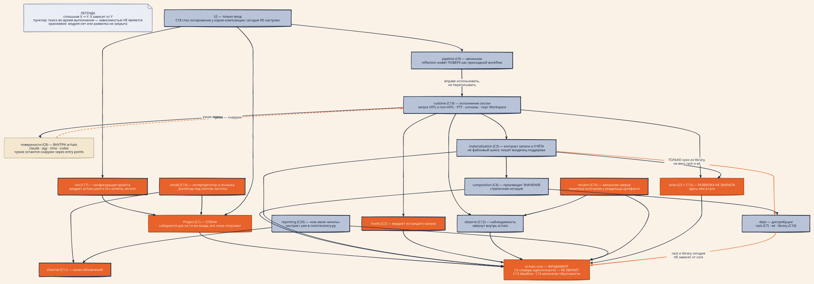
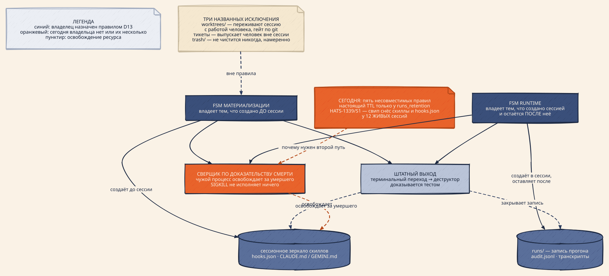

# ADR-0026: Владение способностями и значение `Project` — ось декомпозиции интегратора

## Статус

Предложен (HATS-1586, 2026-08-12; ревизии 2026-08-20 и 2026-08-21). Не реализован:
документ фиксирует ось, по которой предлагается резать интегратор, и не описывает
выполненную работу.

Здесь лежат **требования к целевому состоянию и мотивация выбора этой оси**.
Доказательная база — замеры, каталог обходов по каждой способности, состязательная
проверка размещений и три аудита — приложена к эпику как [13] и сюда не
переносится: она датирована и протухает быстрее, чем решение.

Уточняет [1] (ADR-0014) для всего, что затрагивает эпик HATS-1586: там модуль —
публикуемый пакет uv-workspace, здесь — подпакет `src/ai_hats/<module>/` под
import-lint. **D5 — текущий и единственный ответ на вопрос «что такое модуль»**;
[1] и [2] (ADR-0013 D9, «изоляция даёт ценность и без упаковки») остаются его
предшественниками. Доводит до общего правила частные подложки [3] (ADR-0020 D2,
единый примитив исполнения хуков) и [4] (ADR-0018 / ADR-0021, единая точка
материализации).

## Контекст

Интегратор — 38 720 строк в 175 модулях; покрытие 87.38%, 4553 unit-теста, ruff
чистый, старт `--help` 0.20 с (`HEAD` 2026-08-12). По привычным метрикам всё в
порядке — и именно поэтому проблему пришлось формулировать иначе.

AST-замер графа импортов (2026-08-20): **576 внутренних рёбер**, из них 240 только
отложенных и 20 в обоих видах — отложенные несут **45% графа**. Нетривиальных SCC
на модульном графе **ноль**, на объединённом — три (22, 21 и 2 модуля). **Каждый
цикл в этой базе существует исключительно через отложенные импорты:** видимый граф
— чистый DAG, настоящий — нет. Отсюда D8 и требование к линту D5 ходить по обоим
видам рёбер.

Первая итерация планирования упорядочила работу по стоимости разрезания ребра.
Супервизор отклонил эту ось словами «ты мне про механическую работу говоришь» и
потребовал выделять модули по сценариям («всю материализацию — в один модуль») и
проектировать связность прочь, а не разрезать её. Разбор по этой оси дал два
факта, которые и определяют решение.

**Первый: в системе нет объекта «проект».** `ai_hats.paths` импортируют 64 модуля
из 172 — 37% пакета; большинство уже держат `project_dir` и лишь перевыводят из
него то, что вызывающий мог передать готовым. Значение построено в репозитории
**четырежды, каждый раз со слишком узким охватом**: `RackRoot`, `TrackerPaths`
(только бэклог), `CompositionPayload` (только послекомпозиционная половина,
идентичности проекта не несёт), `_hook_env` (то же значение через границу
процесса, без обратного десериализатора).

**Второй: способности не имеют владельцев.** Матрица «сценарий × способность» по
17 сценариям дала **20 способностей**, которые в разных сценариях предоставляют
разные модули. Это не абстракция — за каждой из трёх верхних стоит воспроизводимый
дефект:

- **C1** — `_project_dir` не считает `ai-hats.yaml` маркером проекта, а
  `_marker_roots` в rack считает: один и тот же `cd` даёт два разных корня, внутри
  одного CLI.
- **C2** — `hook_exec.run_hook` объявлен в [3] единым примитивом, а владеет
  четырьмя каналами из восьми; в остальных «гейт не смог запуститься» неотличимо
  от «гейт прошёл».
- **C3** — `dry_run._detect_escapes` смотрит только под `cache_dir`, то есть
  `--dry-run` сообщает «чисто» про четыре корня записи из пяти.

Способность без владельца и есть то, что порождает и связность, и дефект. Полный
каталог обходов ведётся в [7] и сюда не переносится: ссылки `file:line` протухают
быстрее, чем решение.

**Требования супервизора (2026-08-20), ради которых заводятся модули:**

- **T1 — отложенная поставка.** При росте проекта уметь безболезненно вынести
  зависимость и поставлять её отдельно от ai-hats.
- **T2 — быстрый quality gate.** Несвязанные изменения не тестировать: не трогали
  модуль — не гоняем его тесты.
- **T3 — снизить связность кодовой базы.**
- **T4 — общие примитивы в общий скоуп** для переиспользования.

Требования не независимы, и порядок между ними — предмет D8. Форма «своя папка со
своими тестами» в репозитории уже работает (её делают дистрибутивы), но получить
её сегодня можно **только став дистрибутивом** — заплатив цену, которая по [8] и
порождает все инциденты установки в истории проекта. Отсюда D5 (форма без цены) и
D10 (цена платится только за ценность).

## Решение

### D1 — Ось декомпозиции: владение способностью, а не стоимость распила

Модуль выделяется потому, что становится **единственным владельцем способности**,
а не потому, что его дёшево отрезать. Кандидат на выделение описывается фразой
«кто отвечает за X во всех сценариях», а не «сколько рёбер придётся разрезать».

Целевой показатель — **число способностей ровно с одним владельцем** — из **20**.
На сегодня подтверждённо владеет собой **одна**: C7, у которой второй путь записи
опровергнут перепроверкой. Остальные девятнадцать этой проверки ещё не проходили,
поэтому «19 не владеют» — не замер, а невыполненная работа. Схлопывание сильно
связных компонент — производная величина, а не цель.

### D2 — `Project` — неизменяемое значение, собираемое один раз на точку входа

Точка входа процесса разрешает окружение и строит `Project`; всё, что ниже,
**получает** его. Ни одна функция глубже точки входа не читает `Path.cwd()`, не
разрешает корень проекта и не парсит `ai-hats.yaml` заново. Это тот же контракт
«скомпоновать один раз и передать вниз», что ратифицирован в [5], применённый к
недостающей первой половине значения.

Состав определяется тем, что реально спрашивают места вызова: `root`, `base`
(`ai_hats_dir`), `tasks_dir` / `state_md`, `runs` / `retros` / `handoffs` /
`traces`, `cache_root`, `library_paths`, `venv`, `config`.

Точками входа считаются: команда CLI, `python -m …`, скрипт git-хука, плагин по
entry-point, PreToolUse/PostToolUse-хук. Для тех из них, что не могут
импортировать Python интегратора (bash-лаунчер, диспетчер git-хуков), значение
воспроизводится по одной спецификации, и это фиксируется конформанс-тестом, а не
комментарием-обещанием.

Существующие узкие версии значения (`RackRoot`, `TrackerPaths`,
`CompositionPayload`) не отменяются: `Project` — недостающая первая половина, а
`CompositionPayload` остаётся второй, послекомпозиционной.

### D3 — Один владелец на способность; обход закрывается, а не документируется

Для каждой способности назначается модуль-владелец. Всякий путь, который делает ту
же работу мимо владельца, — обход, и он закрывается: либо проводится через
владельца, либо удаляется. Комментарий вида «это один из обходов, которые убирает
HATS-NNNN» обходом быть не перестаёт.

Если способность пересекает границу процесса и владелец физически не может
исполнить её сам (хуки инструментов исполняет внешний харнесс), владелец владеет
**контрактом вердикта**, а не исполнением.

Две способности выбиваются из общего правила, и обе оговорки — требования:

- **C5 — единственная без кандидата в владельцы.** Признак его отсутствия
  сегодня: `worktree_hooks.py` руками ассертит
  `WT_HOOK_TIMEOUT_S < LIFECYCLE_LOCK_TIMEOUT` **во время импорта** — дизайн,
  подменённый проверкой. Владельца придётся создавать.
- **C1 — единственная, где владелец не может быть один физически.** Bash-лаунчер
  и диспетчер git-хуков не могут импортировать Python интегратора, а копия в rack
  санкционирована [1]. Поэтому требование звучит иначе: **один владелец
  спецификации плюс конформанс-тест на зеркала**, а не один владелец исполнения.

#### Полная целевая таблица (to be) — гейт ратификации

Требование ревью, поставленное условием ратификации: у каждой способности должен
быть владелец контракта, реализации, целевой модуль, публичный фасад, разрешённые
зависимости, **владение состоянием** и проверяющий тест. «Не существует» —
честная запись, а не пробел. Колонка состояния подтверждает требование [1] «each
owns its schema + migrations», которое D14 **не** отменяет; `stateless` — явная
запись, а не умолчание.

Сокращения в колонке зависимостей: `core` = `ai-hats-core`; `project` = значение
`Project` (C1); `—` = только стандартная библиотека.

|         | Владелец контракта                                                                     | Реализации и адаптеры                                                                | Целевой модуль                                      | Публичный фасад                                                                                              | Разрешённые зависимости             | Состояние: схема, namespace, миграции                                                                          | Проверяющий тест                                                          |
| ------- | -------------------------------------------------------------------------------------- | ------------------------------------------------------------------------------------ | --------------------------------------------------- | ------------------------------------------------------------------------------------------------------------ | ----------------------------------- | -------------------------------------------------------------------------------------------------------------- | ------------------------------------------------------------------------- |
| **C1**  | значение `Project` + единый резолвер                                                   | два bash-зеркала; копия в rack санкционирована [1]                                   | `ai_hats/project/` — **не существует**              | `Project`, `resolve_project()`                                                                               | `core`                              | **stateless** — читает конфиг, не владеет им (владеет C17)                                                     | конформанс: оба bash-зеркала дают тот же корень                           |
| **C2**  | `hook_exec` + тип `HookVerdict`                                                        | внутрипроцессные исполняет владелец; claude, agy, codex **маршалят вердикт обратно** | `ai_hats/hooks/` — **не существует**                | `run_hook()`, `HookVerdict`                                                                                  | `core`, `project`                   | **stateless**; журнал срабатываний — у C12                                                                     | каждый канал возвращает вердикт; «не смог» ≠ «прошёл»                     |
| **C3**  | контракт записи и учёта **для того, что объявлено в `MaterializationPlan`**            | по писателю на корень (см. таблицу поддеревьев); порт владеет сессионным корнем      | `ai_hats/materialization/`                          | `Materializer`, `materialize()`                                                                              | `core`, `project`, `composition`    | владеет схемой плана материализации и его миграциями                                                           | каждая запись **учтена** и обратима; `--dry-run` диффает то, что заявил   |
| **C4**  | `composition_seam`, политика отказа — параметр                                         | `Composer`                                                                           | `ai_hats/composition/` — **отдельно от C3**         | `compose(..., policy=)`                                                                                      | `core`, `library`                   | владеет схемой `CompositionResult` и её миграциями                                                             | вне шва композиции нет                                                    |
| **C5**  | владелец бюджетов ярусов — **не назначен**                                             | `core.file_lock`, замки wt, замок ядра rack                                          | `ai_hats/locks/` или `core` — **решить**            | объявление ярусов и бюджетов                                                                                 | `core`                              | **stateless**; файлы замков — не схема                                                                         | соотношение бюджетов утверждает ТЕСТ, не ассерт на импорте                |
| **C6**  | словарь идентичности **в core**                                                        | чеканка в C19; читают rack, observe, library, поверхности, git-хуки                  | `ai_hats_core/session_identity` — **не существует** | константы + `to_env` / `from_env`                                                                            | — (пол)                             | владеет схемой конверта идентичности и её версией                                                              | литерала `AI_HATS_SESSION_ID` вне core нет                                |
| **C7**  | `Kernel.transition`                                                                    | ядро rack                                                                            | `ai-hats-rack` (дистрибуция)                        | публичный API rack                                                                                           | `core`                              | владеет схемой карточки и её миграциями — **уже так**                                                          | записи мимо ядра нет — **сегодня верно**                                  |
| **C8**  | реестр классов + узкие порты вместо одного `Provider`                                  | свои поверхности внутри ai-hats; чужие — через entry points                          | `ai_hats/providers/`                                | узкие порты: запуск, материализация, detection                                                               | `core`, `project`                   | **stateless**                                                                                                  | у поверхностей нет своих PyPI-зависимостей; реестр только из entry points |
| **C9**  | `pipeline/loader` + registry                                                           | пайплайны, объявленные в YAML                                                        | `ai_hats/pipeline/` — **пилот**                     | `run(pipeline_id)`                                                                                           | `core`, `project`, `runtime`        | владеет схемой YAML пайплайна и её миграциями                                                                  | диспетчер один; второго пути нет                                          |
| **C10** | движок консента в `library`; шов `consent_port`                                        | издающая половина — консольный `consent`; спрашивающая — порт                        | `ai-hats-library` + `ai_hats/consent_port.py`       | `check()`, `Verdict`                                                                                         | `core`                              | владеет схемой тикета и его сроком                                                                             | вердикт четырёхзначный, к bool не схлопывается                            |
| **C11** | `channel` / `update_policy`                                                            | bash-лаунчер при бутстрапе; шаг `check_update`                                       | `ai_hats/channel/` — **не существует**              | `resolve_channel()`                                                                                          | `core`                              | **stateless**; кеш проверки — у C12                                                                            | бутстрап и запуск дают один канал                                         |
| **C12** | `observe`, свёрнутый в ai-hats [8]                                                     | `Session`, `AuditWriter`, `SidecarTracer`                                            | `ai_hats/observe/`                                  | `Session`, `AuditWriter`                                                                                     | `core`                              | владеет схемами `runs/`, аудита и транскрипта + их миграциями                                                  | у каждой сессии есть запись; хранилища сверены схемой                     |
| **C13** | `core.deadline`                                                                        | wt чеканит верно; rack считает арифметику заново                                     | `core` (экспортировать)                             | `Deadline`                                                                                                   | — (пол)                             | **stateless**                                                                                                  | арифметики бюджета вне `Deadline` нет                                     |
| **C14** | модуль `install`                                                                       | лаунчер, `_bootstrap.py`, диспетчер — не могут разделить код                         | `ai_hats/install/` + `_bootstrap.py` на stdlib      | API починки и обеспечения                                                                                    | `core`; у `_bootstrap` — **ничего** | владеет схемой venv-метки и её миграциями                                                                      | e2e на реальном venv (`dev_rule_e2e_gate`)                                |
| **C15** | **механизм** сверки и удаления — общий; **политика** истечения — у владельца артефакта | пять правил сегодня; целевая раскладка — в таблице поддеревьев                       | `ai_hats/reclaim/` — **только механизм**            | `reconcile(subtree, owner_policy)`                                                                           | `core`, `project`                   | **stateless**; якорь живости — схема C19                                                                       | путь «доказательство смерти» покрыт; живая сессия по возрасту не сносится |
| **C16** | механизм обратимости — в `core`; **доменные имена и формат манифеста — вон из core**   | политический слой в интеграторе                                                      | механизм в `core`, домен в `ai_hats/reclaim/`       | `discard()`, `replace()`                                                                                     | — (пол)                             | формат манифеста корзины переезжает вместе с доменом                                                           | разрушающей операции без аннотации нет — **гейт есть**                    |
| **C17** | модуль `init`                                                                          | дельта-запись в `assembler`, RMW в `config/project`                                  | `ai_hats/init/` — **не существует**                 | размещение конфига и запись его **конверта**                                                                 | `core`, `project`                   | владеет **конвертом и `schema_version`** `ai-hats.yaml`; семантику своих секций владеют соответствующие модули | писатель конверта ровно один                                              |
| **C18** | корень композиции                                                                      | сегодня — **ни одной**                                                               | корень композиции в `ai_hats/cli`                   | `configure_logging()`                                                                                        | `core`                              | **stateless**                                                                                                  | `logger.info` доезжает до стока                                           |
| **C19** | **исполнение сессии** — запуск HITL и non-HITL, PTY, сигналы, жизненный цикл           | `wrap_runner`, `subagent_runner`, `pty_*`                                            | `ai_hats/runtime/`                                  | `launch()`, порт `Workspace`                                                                                 | `core`, `project`, `providers`      | владеет якорем живости сессии и его схемой                                                                     | сессия завершается по обоим терминальным путям (D13)                      |
| **C20** | **диагностика и починка**                                                              | `health`, `doctor` в rack, `env_drift`                                               | `ai_hats/reporting/`                                | типизированный контракт: находка, серьёзность, предлагаемое лечение, результат ремонта — **надо определить** | `core`, `channel`                   | **stateless**                                                                                                  | компонент объявляет починку, не завися от reporting                       |

**Как этой таблицей пользоваться.** Строка закрыта, когда её тест зелёный и
реализации-обходы удалены. Пока тест не написан, строка — намерение, а не
владение: это D4, применённый к таблице. Метрика D1 считается по числу строк с
зелёным тестом.

**Что таблица показывает сразу:** семь целевых модулей **не существуют**
(`project`, `hooks`, `channel`, `init`, `reclaim`, словарь идентичности в core,
`install`), у C5 владелец **не назначен**, и одна существующая опора —
`core.safe_delete` — сама нарушает критерий core (D9).

#### Каноническая adjacency-таблица: модуль → владеет → зависит от → реализует

**Это единственный источник истины по целевому графу.** Колонка зависимостей в
таблице C1–C20 и диаграмма — её проекции; при расхождении права эта таблица.

| Целевой модуль                    | Владеет                                        | Зависит от                                                                     | Реализует / предоставляет                                                      |
| --------------------------------- | ---------------------------------------------- | ------------------------------------------------------------------------------ | ------------------------------------------------------------------------------ |
| `ai_hats/project/`                | **C1**                                         | `core`                                                                         | `Project`, `resolve_project()`                                                 |
| `ai_hats/init/`                   | **C17**                                        | `core`, `project`                                                              | запись `ai-hats.yaml`: конверт и `schema_version`                              |
| `ai_hats/install/`                | **C14**                                        | `core`, `project`, `channel`                                                   | починка и обеспечение интерпретатора                                           |
| `ai_hats/channel/`                | **C11**                                        | `core`                                                                         | `resolve_channel()`                                                            |
| `ai_hats/composition/`            | **C4**                                         | `core`, `project`, `library`                                                   | `compose(..., policy=)`                                                        |
| `ai_hats/materialization/`        | **C3**                                         | `core`, `project`, `composition`, `library`                                    | `MaterializationPlan` и его исполнение                                         |
| `ai_hats/hooks/`                  | **C2**                                         | `core`, `project`                                                              | `run_hook()`, `HookVerdict`                                                    |
| `ai_hats/runtime/`                | **C19**                                        | `core`, `project`, `providers`, `materialization`, `hooks`, `observe`, `locks` | `launch()`, порт `Workspace`                                                   |
| `ai_hats/observe/`                | **C12**                                        | `core`, `project`                                                              | `Session`, `AuditWriter`; **объявляет политику хранения**                      |
| `ai_hats/providers/`              | **C8**                                         | `core`, `project`                                                              | узкие порты; реестр из entry points                                            |
| `ai_hats/pipeline/`               | **C9**                                         | `core`, `project`, `runtime`                                                   | `run(pipeline_id)`                                                             |
| `ai_hats/reclaim/`                | **C15**                                        | `core`, `project`                                                              | `reconcile(subtree, policy)` — политику **получает**, не импортирует           |
| `ai_hats/reporting/`              | **C20**                                        | `core`, `channel`                                                              | типизированный контракт диагностики — **надо определить**                      |
| `ai_hats/locks/`                  | **C5**                                         | `core`                                                                         | объявление ярусов и их бюджетов                                                |
| `core`                            | **C6**, **C13**, **C16**                       | —                                                                              | пол; доменные имена C16 из него уезжают                                        |
| `ai-hats-rack`                    | **C7**                                         | `core`                                                                         | публичный API rack                                                             |
| `ai-hats-wt`                      | worktree-движок — **способности в C1–C20 нет** | `core`                                                                         | создание и снос чекаутов; потребитель — C19 через порт `Workspace`             |
| `ai-hats-library`                 | **C10**                                        | —                                                                              | движок консента; данные ролей и скиллов                                        |
| корень композиции (`ai_hats/cli`) | **C18**                                        | `core`                                                                         | `configure_logging()`                                                          |
| **`reflection`**                  | **ничем**                                      | `pipeline`                                                                     | **прикладной workflow, а не модуль** — аудиторы, гипотезы, пропозалы поверх C9 |

**`reclaim` не зависит от `observe`.** Владелец артефакта **отдаёт** политику
истечения объектом, а механизм её исполняет. Иначе общий сборщик мусора
импортировал бы каждого владельца — то самое god-ребро, от которого уходим.

Диаграмма ниже — **проекция** этой таблицы: стрелка вниз читается как «зависит
от», оранжевым выделено то, чего сегодня не существует, или незакрытая развилка.

<p align="center">
  
</p>

<!-- Source: docs/assets/diagrams/module-layers.d2 — render: docs/assets/diagrams/render.sh -->

### D4 — Тест на владение пишется первым, и его падения — это список работ

Слайс начинается с теста, утверждающего единственность владельца, а не с переноса
кода. Список падений этого теста и есть перечень обходов, подлежащих закрытию;
слайс закрыт, когда тест зелёный.

Основание — записанный в самом репозитории урок: проверки на обходы были
**удалены** вместо того, чтобы быть перевёрнутыми в проверку отсутствия, и
закрытие обходов осталось непроверенным (summary HATS-1207). Именно так задача
получает статус `done`, расходящийся с кодом.

### D4a — Явная зависимость определяется через тестируемость, а не через глубину

Правило: **код можно протестировать, настраивая его зависимости, без монкипатча
того, что тестируем.** Если тест тянется к `monkeypatch.setattr` на модуль под
тестом — неправ код, а не тест: коллаборатор, который он сходил и взял, должен
был прийти параметром.

Так глубина инъекции перестаёт быть предметом спора и выводится из критерия: часы
инжектируются там, где тест иначе патчил бы `datetime`, и не инжектируются там,
где не патчил бы. Два исключения узкие: `setenv`, когда тестируется сам контракт
окружения точки входа, и патч чужой границы, которой мы не владеем.

Критерий выбран супервизором (2026-08-12) вместо трёх структурных вариантов
(«швы на границах модулей» / «только `Project`» / «полная инъекция») и реализован
в HATS-1599 как один гейт с храповиком (`scripts/check_test_isolation.py`): рост
запрещён, понижение идёт вместе с изменением кода.

### D5 — Модуль это папка с объявленной поверхностью и своими тестами внутри

Единственный действующий ответ на вопрос «что такое модуль». Уточняет [1] и
исполняет [2] D9.

```
src/ai_hats/<area>/
    __init__.py      # объявленная поверхность — единственный вход снаружи
    ...
    tests/
        conftest.py
        test_*.py
```

Не пакет `packages/*`: у модели отдельных uv-пакетов сработали одновременно все
четыре отказа (стоимость релизов и версий, хрупкость установки, отсутствие внешних
потребителей, связность не упала). **Тесты живут внутри папки**; отвергнуто
зеркало `tests/<area>/` (область остаётся в двух местах, переезд становится двумя
движениями) и новый верхний уровень `areas/` (третий корень рядом с `src/` и
`packages/`).

**Границу держит линт, а не соглашение.** Снаружи в область входят только имена из
её `__init__.py`, и линт обязан ходить по **обоим** видам импортов — иначе он слеп
к 45% графа. Ruff не годится: `TID251` глобален, а его скоупинг через
per-file-ignores инвертирует запрет по умолчанию. Без линта форма остаётся
косметикой: папка, в которую можно войти напрямую, связность не снижает. Это
прямой и единственный ответ на T3 — перекладывание файлов само по себе связность
не меняет.

### D6 — Порядок слайсов — по живому следствию, а не по цене

Ранжирование ведётся по тому, какой дефект способность порождает сегодня. Порядок
на момент принятия:

| # | Способность                                                      | Живое следствие                                                     |
| - | ---------------------------------------------------------------- | ------------------------------------------------------------------- |
| 1 | Разрешение проекта и конфига (`Project`)                         | два резолвера расходятся по маркерам и по политике чужого пина      |
| 2 | Исполнение хуков                                                 | «гейт не запустился» неотличимо от «гейт прошёл» в половине каналов |
| 3 | Материализация                                                   | `--dry-run` отчитывается о четырёх корнях, в которые не смотрел     |
| 4 | Композиция роли                                                  | fail-open и fail-closed композиция в одной команде                  |
| 5 | Ownership / блокировки                                           | соотношение бюджетов таймаутов держится assert'ом на импорте        |
| 6 | Идентичность сессии                                              | одна переменная окружения, четыре приватных читателя                |
| 7 | Эффекты бэклога, знание о провайдере, диспетчеризация пайплайнов | два пути записи в одно состояние                                    |

Слайсы 2 и 3 — **доведение уже ратифицированного** ([3] и [4]), а не новое
проектирование.

### D7 — Тест области против теста пересечения

В `<area>/tests/` живёт тест, которому нужна **только поверхность этой области**
плюс стандартная библиотека и тестовые утилиты. Тест, поднимающий две и более
области, остаётся в общем наборе.

Критерий проверяемый, а не вкусовой: если тест импортирует имена из чужой области
помимо её `__init__.py`, он либо не тест области, либо нарушает D5.

### D8 — T2 запрещён, пока граф врёт

**Модульный отбор тестов по изменённым файлам сегодня неисполним безопасно, и
включать его нельзя.** Отбор читает граф зависимостей, а граф этой базы на 45%
состоит из отложенных рёбер, и все циклы проходят только через них. Селектор,
построенный на модульном графе, увидит чистый DAG из 316 рёбер там, где рёбер
576, — то есть будет слеп к 240 связям и станет пропускать тесты, которые обязан
прогнать.

Отказ при этом **молчаливый**: пропущенный тест выглядит как зелёный прогон. Это
ровно тот класс, который вердикт судьи по эпику HATS-1252 назвал «иммунная
система скомпрометирована как целое» [9].

Отсюда порядок **T3 → T2**, а не параллельно. Предусловия включения отбора:

1. D5 действует и **enforcing** для участвующих областей;
2. селектор строит граф **по обоим видам импортов**, тем же обходом, что и линт;
3. отбор **аддитивен и fail-open**: неизвестная связь означает «прогнать», а не
   «пропустить». Селектор, который при сомнении молчит, запрещён;
4. полный набор всё равно гоняется на дороге в master — модульный отбор ускоряет
   внутренний цикл и **не** заменяет гейт перед слиянием [11].

Пока пункты 1–3 не выполнены для области, её тесты гоняются всегда.

### D9 — Общий примитив едет по потребителю, а не по общности

T4 отвечает двумя адресами, а не одним «вынести всё общее»:

- нужен **двум и более областям интегратора** и никому снаружи → общая область
  интегратора по форме D5, со своими тестами и своей поверхностью;
- нужен **дистрибутиву** (`wt`, `rack`, `library`) → `ai-hats-core`, который для
  этого и существует.

Признак примитива, а не «просто общего кода»: в сигнатуре нет типов конкретной
области, внутри нет решений о политике ввода-вывода, и у него **уже** два
потребителя. Один потребитель — преждевременное обобщение.

**Критерий состава core** (тот же, что в [1]): чистый механизм, слепой к домену,
≥2 потребителей. Два жильца его не проходят и обязаны уехать: `safe_delete` —
владеет доменным именем `AI_HATS_TRASH_DIR` и задаёт формат манифеста на диске,
то есть схему; `composition.py` — `ResolvedCheck` кодирует семантику гейтов
ADR-0019, а `ConsentPoint` — протокол консента. Требование действует и в обратную
сторону: **словарь идентичности сессии обязан быть в core** — литерал
`AI_HATS_SESSION_ID` живёт в восьми файлах пяти дистрибуций, и `test_vocab.py` в
observe утверждает его руками, то есть недостающий контракт core уже написан
вручную.

Правило существует, чтобы общая область не стала вторым безымянным блоком: на
2026-08-20 в интеграторе 61 модуль / 11 490 строк (27% LOC) не принадлежат ни
одному названному блоку. Структурный факт, который надо держать в уме при
переносе: `ai-hats-rack` и `ai-hats-library` **не зависят от core вовсе** —
поэтому C1, C5 и C13 расщеплены натрое, а не надвое.

### D10 — Дистрибутив не следует из модуля

T1 сформулирован как «уметь вынести», и это точная формулировка: **уметь**, а не
**вынести**. Форма D5 делает повышение механическим, но не автоматическим.

Модуль повышается до дистрибутива, только когда выполнено всё:

1. есть потребитель **вне** ai-hats — реальный, а не предполагаемый;
2. есть точка входа, которую набирает человек, **или** документированный API,
   который кто-то импортирует;
3. кто-то отвечает за его релизный цикл.

Ни одно не следует из того, что код лежит в папке. Где это уже нарушено: из восьми
дистрибутивов человеческий глагол есть у двух (`rack`, `consent`), остальные шесть
платят цену дистрибутива, не получая её ценности [8].

Цена повышения при форме D5 — два `git mv` (папка в `packages/<name>/src/`, её
`tests/` — на уровень выше, к корню пакета) плюс снятие exclude из D11. Это
честная цена выбранной формы: раскладка «тесты внутри пакета» не совпадает с
раскладкой существующих `packages/*`, где `tests/` лежит рядом с `src/`.

### D11 — Тесты не едут в wheel

`[tool.hatch.build.targets.wheel] packages = ["src/ai_hats"]` отгружает каталог
пакета целиком, поэтому `<area>/tests/` попадёт в колесо, если не исключить его
явно. Exclude обязателен и относится к внешнему контракту установки — значит
`dev_rule_e2e_gate` срабатывает, и тест обязан проверять **собранное колесо**:
модули области внутри, её `tests/` — нет.

Прогон: `testpaths` в `pyproject.toml` перечисляет пути явно; глоб там ненадёжен,
каждая область добавляется отдельной строкой.

### D12 — Пилот обязан породить измеренный шаблон, а не просто переехать

Переносить форму D5 на двадцать способностей вручную — значит принимать одни и те
же решения заново. Поэтому **первая область проходится как пилот**, и её выход —
не только переехавшая папка, но и **рецепт плюс числа**, по которым следующие
области переносятся полу-механически. **Пилот выбирается по покрытию проблем, а не
по лёгкости.** Пилот — `pipeline`:
самая широкая поверхность связывания (48 символов пересекают границу от 11 внешних
модулей), фасад есть и обходится (ни один production-модуль его не импортирует), и
это единственный кандидат, который прогоняет разбор тестов полностью — существующий
`tests/pipeline/` придётся не перенести, а **разобрать**. **Ограничение объёма:**
пилот работает по модульным рёбрам и **явно откладывает SCC** — иначе он молча
превращается в рефакторинг рантайма.

**Вторая область — `consent`**: только она прогоняет механику «область пересекает
границу дистрибуций» (D10) и случай неимпортного связывания через console-script и
подпроцесс, которого импортный линт не видит вовсе.

**Гейты пилота.** Не достигнуты — пилот не засчитан:

| Метрика                                           | Цель                                                  |
| ------------------------------------------------- | ----------------------------------------------------- |
| Глубокие входы в область (импорт мимо `__init__`) | **0** — иначе граница не держится; это её определение |
| Модули области в нетривиальном SCC                | **0** (для `pipeline` требует разреза цикла)          |
| Тесты области в собранном колесе                  | **отсутствуют** (D11)                                 |
| `python -m ai_hats --help`                        | **≤ 0.25 с** против базовой 0.20                      |

**Замеры пилота** — порога нет, записываются как шаблон, по которому следующая
область оценивается до начала работ: fan-in области; отложенная доля её входящих
рёбер (предусловие 2 из D8); сколько тестов уехало внутрь против оставшихся
межобластными (калибрует D7); и **время прогона тестов области отдельно против
полного набора** — единственный способ узнать, чего стоит T2, до того как его
строить.

**Письменный рецепт** — часть приёмки пилота, а не побочный продукт: что
переезжает, что остаётся, какие строки `pyproject.toml` трогаются, какой тест
добавляется.

### D13 — Артефакт принадлежит той фазе, что его создала; у обеих фаз есть FSM с доказуемым выходом

**Правило владения.** Материализация владеет тем, что создаётся **до** сессии.
Runtime владеет тем, что создаётся сессией и **остаётся персистом после** неё.
Граница проходит по моменту создания, а не по тому, кто последним потрогал файл.

**Правило доказуемости.** У обеих фаз вырастает небольшая FSM, чтобы выход было
**чем доказать**: терминальный переход вызывает деструктор, деструктор освобождает
ресурсы, а тест утверждает, что переход состоялся.

Ось «создано до / создано после сессии» при этом **недостаточна** для раскладки:
[4] (ADR-0021 S3) определяет корень хранения как «каталог верхнего уровня, у
которого один писатель-владелец и одно время жизни», и таких корней шесть.
Двухфазная ось схлопнула бы шесть времён жизни в два, и долгоживущая конфигурация
либо течёт, либо сносится вместе с сессией. Поэтому правило D13 верно **только для
строки «дерево сессии»**.

<p align="center">
  
</p>

<!-- Source: docs/assets/diagrams/session-artifacts-ownership.d2 — render: docs/assets/diagrams/render.sh -->

| Управляемое поддерево                                     | Физический корень                                                          | Писатель                                         | Время жизни                                  | Кто утилизирует                           |
| --------------------------------------------------------- | -------------------------------------------------------------------------- | ------------------------------------------------ | -------------------------------------------- | ----------------------------------------- |
| колёса, консольные скрипты                                | установленный пакет                                                        | C14 `install`                                    | версия пакета                                | менеджер пакетов, не ai-hats              |
| `ai-hats.yaml`, установленные git-хуки                    | корень проекта                                                             | **C17 `init`**                                   | жизнь репозитория                            | человек; ai-hats не удаляет               |
| бэклог, `STATE.md`, ретро, хендоффы                       | `<ai_hats_dir>` в проекте                                                  | владельцы способностей (C7 и др.), размещает C17 | жизнь проекта                                | владелец артефакта                        |
| `runs/`, аудит, транскрипты                               | `<ai_hats_dir>/sessions/`                                                  | **C12 `observe`**                                | политика хранения                            | политику задаёт C12, сверку исполняет C15 |
| метаданные worktree                                       | `<ai_hats_dir>/sessions/worktrees/`                                        | C19 через `wt`                                   | жизнь задачи                                 | C15 по состоянию git                      |
| **чекауты worktree**                                      | **`<cache_home>/<project-key>/worktrees/`**                                | `wt`                                             | до слияния или отказа                        | C15 по состоянию git — **НЕ по возрасту** |
| дерево сессии: зеркало скиллов, `hooks.json`, `CLAUDE.md` | `<cache_home>/<project-key>/sessions/<sid>/`                               | C3 (до) и C19 (после) — **правило D13**          | сессия                                       | FSM с двумя терминальными путями          |
| корзина                                                   | **`${TMPDIR}/ai-hats/trash-<ts>-<pid>/`**, переносится `AI_HATS_TRASH_DIR` | C16                                              | не истекает намеренно                        | никто — осознанное решение                |
| **консентные тикеты**                                     | **`<git-common-dir>/ai-hats/consent/`**                                    | C10 (движок в library)                           | привязан к argv, чувствителен к безопасности | собственный `sweep`, механизм C15         |
| кастомизации, пользовательская библиотека                 | `$HOME/.ai-hats/`                                                          | человек                                          | вне жизни проекта                            | **человек**                               |

Ответ на вопрос «кто отвечает за TTL» сегодня — **никто**: сборка мусора (C15) идёт
по пяти несовместимым правилам, и настоящий TTL есть ровно у одного хранилища
(`runs_retention`). Это и есть содержание строки C15 в целевой таблице.

**Что из этого следует для C3.** Универсальный файловый шлюз, через который обязана
пройти любая запись во все корни, стал бы новым god-модулем и противоречил бы этой
же таблице, где у каждого поддерева свой писатель. Поэтому C3 владеет **контрактом
записи и учёта**, а не самой записью везде, и контракт покрывает **каждую запись из
`MaterializationPlan`**, а не «каждый байт вообще»: менеджер пакетов, rack и
человек физически не могут зависеть от C3.

#### У FSM обязано быть ДВА терминальных пути, а не один

Деструктор на выходе доказывает только **штатный** путь. `SIGKILL`, падение ядра,
отключение питания не исполняют ничего — и это в проекте уже оплачено: TTL-свип
снёс скиллы и `hooks.json` у двенадцати живых maintainer-сессий на лету
(HATS-1339/S1), отчего `session_liveness` и жнёт каталог сессии только по
доказательству смерти, никогда по возрасту. Плюс инвариант HATS-086: «a second
Ctrl+C must not kill cleanup».

Поэтому каждая FSM обязана иметь:

1. **штатный терминальный переход** — деструктор освобождает ресурсы;
2. **сверщик по доказательству смерти** — другой процесс освобождает ресурсы за
   того, кто умер, не исполнив деструктор.

Тест обязан покрывать **оба**. Покрыть только первый значит доказать ту половину,
которая и так работала.

### D14 — Публичный контракт модуля; зависимости передаются явно через интерфейсы

Целевая схема рисует межобластные рёбра, а [1] (правило зависимостей) требует
`module → core` и **никогда** `module → module`. **Это правило [1] здесь
заменяется, и заменяется явно.**

Модуль вправе зависеть от другого модуля — но только от его **публичного
контракта**, и контракт этот получает пристальное ревью как отдельный артефакт, а
не как побочный результат рефакторинга. Зависимости передаются **явно, через
интерфейсы**: единица объявляет, что ей нужно, и получает это (конструктор,
фабрика, аргумент), а не тянется за модулем по имени.

Что это меняет по сравнению с [1]: там границу держал запрет на ребро, здесь —
**форма ребра**. Запрет был проще принуждать и дороже жить: он гнал общее в core,
отчего core и оброс тем, что там быть не должно (D9).

Следствия, которые надо принять вместе с решением:

- **Публичный контракт — рецензируемый артефакт.** Его изменение — событие ревью,
  а не деталь реализации. `__init__.py` области объявляет контракт; всё, что не в
  нём, снаружи не существует.
- **Явная передача — то же требование, что D4a**, только на границе областей.
  Прецедент в дереве уже есть: `CompositionPayload` несёт `session_factory`,
  `audit_writer_factory`, `transcript_resolver` — ровно затем, чтобы runtime не
  импортировал observe.
- **Требование [1] «each owns its schema + migrations» НЕ отменяется.** D14
  снимает только запрет `module → module`; владение схемой, namespace и миграциями
  остаётся обязанностью модуля и вынесено отдельной колонкой целевой таблицы.
- **Линт нужен, но сегодня его нет в нужной форме.** `tests/test_import_hygiene.py`
  запрещает циклы только на **модульном** графе, а `TYPE_CHECKING`-блоки и
  отложенные импорты объявляет исключением. Правило «вход только через `__init__`»
  надо писать, а не наследовать, и писать его **после** ответа на развилку
  `TYPE_CHECKING`.

**Четыре шва, которыми это решение снимает зависимость runtime от `wt` и `rack`** —
проверяемая форма правила: **A** — порт `Workspace`: runtime **получает** рабочий
каталог, а не создаёт его (`WorkspaceFactory` на `CompositionPayload`, который уже
несёт `session_factory` и `audit_writer_factory` ровно для этого); **B** —
`SurfaceGuard` принимает `must_be_isolated: bool` вместо `IsolationMode`; **C** —
порт `TicketContext`, отдающий готовые секции вместо карточки; **D** — путь реестра
владения в payload вместо вывода из расположения бэклога.

### D15 — T2 ограничен импортным замыканием; реестра неимпортных рёбер НЕ заводим

Полный AST не видит YAML step id, entry points, консольные скрипты, bash- и
git-хуки и resource lookup, и fail-open тут не спасает: он помогает, когда селектор
**знает, что не знает**, а здесь он не знает о существовании ребра вовсе.

Реестр неимпортных зависимостей **отклонён по существу, а не по цене.** Его
пришлось бы наполнять тем, как *мы* используем ai-hats: какие пайплайны заводим,
какие скиллы вешаем, какие хуки цепляем. А это ровно то, что продукт обязан
оставлять **открытым**. Реестр зашил бы «как мы используем ai-hats» в потроха «как
его можно использовать» и превратил бы точку расширения в перечисление.

Поэтому граница проводится иначе:

- **T2 звучит sound только внутри импортного замыкания области.** Там граф закрыт,
  и селектор имеет право пропускать.
- **Всё, что достигается неимпортным механизмом — entry point, id пайплайна,
  консольный скрипт, хук, поиск ресурса — не подлежит отбору вовсе.** Изменение в
  этих поверхностях гонит полный набор.
- **Отбор разрешён только областям, про которые ДОКАЗАНО, что они import-closed.**
  Доказывает это тест области, а не вера: он утверждает, что снаружи в область
  входят только имена из `__init__` и что сама область не достигается неимпортным
  механизмом. Область без такого доказательства не участвует в отборе — это не
  регресс, а нулевое значение по умолчанию.

Это не временное ограничение и не долг: открытость здесь — свойство продукта.

## Последствия

**Что становится проще.** Вопрос «куда положить новый код» получает
детерминированный ответ: к владельцу способности. Дефекты класса «гейт молча не
сработал» становятся выразимыми — вердикт есть у каждого канала. `--dry-run`
начинает отвечать за то, о чём отчитывается. Число импортёров `paths` падает
механически: значение приходит сверху.

**Что становится дороже.** Общий объём кода растёт: `Project`, порты и протянутые
параметры — аддитивны. Гарантированно вычитается только мёртвый
`src/ai_hats/skill_aggregate.py`. Ожидать уменьшения LOC от этой работы не следует.

**Риск регресса, который надо сторожить.** Старт CLI 0.20 с куплен отложенными
импортами: `import ai_hats.cli` стоит 165 мс, крупнейшие вклады — ровно ленивые
рёбра. Поэтому цель — **не** «отложенных импортов ноль», а «каждый отложенный
импорт объясняет причину» (на 2026-08-12 объясняли 4 из 249). Ленивость,
работающая на старт, сохраняется и документируется; ленивость, прячущая цикл,
снимается починкой цикла. Замер `--help` после каждого слайса, выход за 0.25 с —
повод остановиться.

**Что этот ADR не решает.** Дедлок `dependency-floor` × порядка публикации
(HATS-1555) живёт на `ai-hats-wt`, который остаётся дистрибутивом, и требует
отдельной работы. Расхождение резолверов интегратора и rack структурно разрешено
[1]: rack не имеет права импортировать интегратор — здесь фиксируется
обязательство **сверять поведение, а не устранять дублирование**.

**Цена принятой формы.** T3 получает механизм, а не намерение: связность снижает
линт D5, и его падения — это список работ. T4 получает правило адресации по
потребителю (D9), T1 — форму, из которой повышение стоит два перемещения (D10).
Взамен: раскладка D5 расходится с раскладкой `packages/*`, поэтому повышение — не
чистый `git mv`; `testpaths` растёт линейно по числу областей; **T2 не наступает
сразу** и, возможно, не наступит никогда для областей, чью границу не удастся
сделать enforcing — это заявленная цена честного отбора, а не отложенная функция.

Раскладка D5 противоречит строке «Tests in tests/ directory mirroring src/
structure» в универсальном трейте `usage/traits/dev/python/config.yaml`. Решено
переформулировать саму строку (обе раскладки легитимны, выбирается одна на
проект), а не заводить переопределение; изменение ведётся отдельной карточкой [12]
и не нарушает [10]. **До её приземления D5 и композированная роль противоречат
друг другу** — известный и принятый на время разрыв.

**Открытые развилки.** Считаются ли рёбра, видимые только под `TYPE_CHECKING` —
сегодня они невидимы для всех предложенных правил. Развилка влияет на D5: правило
границы, слепое к ним, зашивает необъявленное исключение.

**Обязательство при принятии.** `Project` — новое имя пользовательского уровня,
поэтому по правилу glossary-first оно фиксируется в `docs/glossary.md` до первого
кода. Каталог дефектов по каждой способности ведётся отдельно, в документах
карточки HATS-1587 [6], и намеренно не переносится сюда.

## Ссылки

- [1] `docs/adr/0014-composable-component-decomposition.md` — трёхуровневая модель
  `ai-hats → modules → ai-hats-core`, правило зависимостей и full-AST import-lint;
  её ответ «что такое модуль» уточняется D5, запрет `module → module` — D14.
- [2] `docs/adr/0013-wt-core-extraction-boundary.md` — изоляция на месте вместо
  отдельного репозитория; D9 — «упаковка не требуется, чтобы получить ценность».
- [3] `docs/adr/0020-hook-execution-and-materialization-substrate.md` — D2, единый
  примитив исполнения хуков; слайс 2 доводит его до всех каналов.
- [4] `docs/adr/0018-unified-artifact-builder.md` и
  `docs/adr/0021-surface-materialization.md` — единая точка материализации,
  диспетчеризация по категории и run-mode, карта корней записи; слайс 3 доводит их
  до закрытия обходов.
- [5] `docs/adr/0005-composition-and-pipeline-value-contract.md` — контракт
  «скомпоновать один раз и передать вниз», на который опирается D2.
- [6] `.agent/ai-hats/tracker/backlog/tasks/HATS-1587/research.md` — карта блоков,
  граф импортов, аудит явных зависимостей, модель стоимости извлечения.
- [7] `.agent/ai-hats/tracker/backlog/tasks/HATS-1586/plan.md` — канонический план
  эпика: матрица «сценарий × способность», замер структуры, каталог обходов.
- [8] `.agent/ai-hats/tracker/backlog/tasks/HATS-1765/task.yaml` — состав
  дистрибуций (девять сводятся к пяти) и свод инцидентов, порождённых самим фактом
  отдельной дистрибуции (HATS-966, HATS-1353, HATS-1230, HATS-1766, HATS-1768).
- [9] `.agent/ai-hats/tracker/backlog/tasks/HATS-1252/task.yaml` — вердикт судьи по
  эпику: молчащие слои обнаружения как системный отказ; основание D8.
- [10] `rule_core_vs_usage_split` — универсальное против проектного при размещении
  компонента библиотеки.
- [11] `docs/adr/0023-quality-gate.md` — контур гейтов, относительно которого D8
  определяет, что модульный отбор ускоряет, а что заменять не может.
- [12] `.agent/ai-hats/tracker/backlog/tasks/HATS-1773/task.yaml` —
  переформулировка строки о раскладке тестов в трейте `dev::python`.
- [13] `.agent/ai-hats/tracker/backlog/tasks/HATS-1586/adr-0026-before-cleanup.md`
  — полная редакция этого ADR до чистки (995 строк, 2026-08-21): замеры, каталог
  обходов C1–C20, состязательная проверка иерархии модулей и три аудита-приложения
  (runtime × rack/wt, состав core, артефакты сессии).
