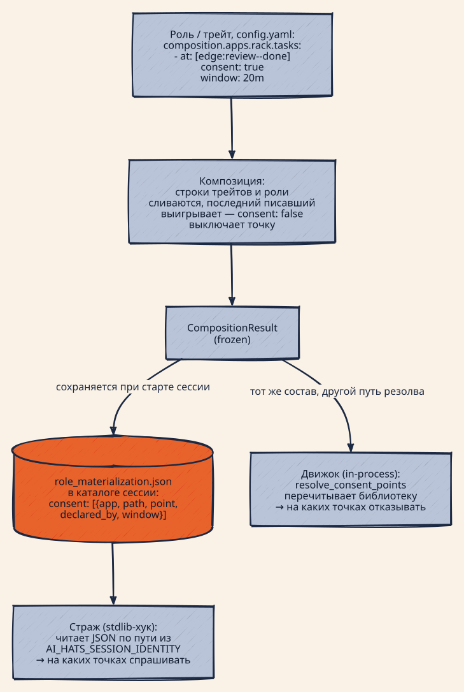
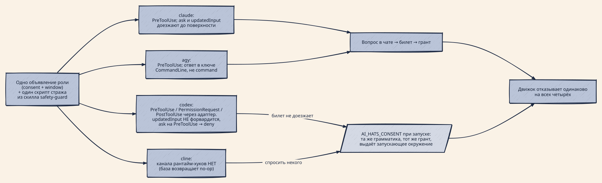
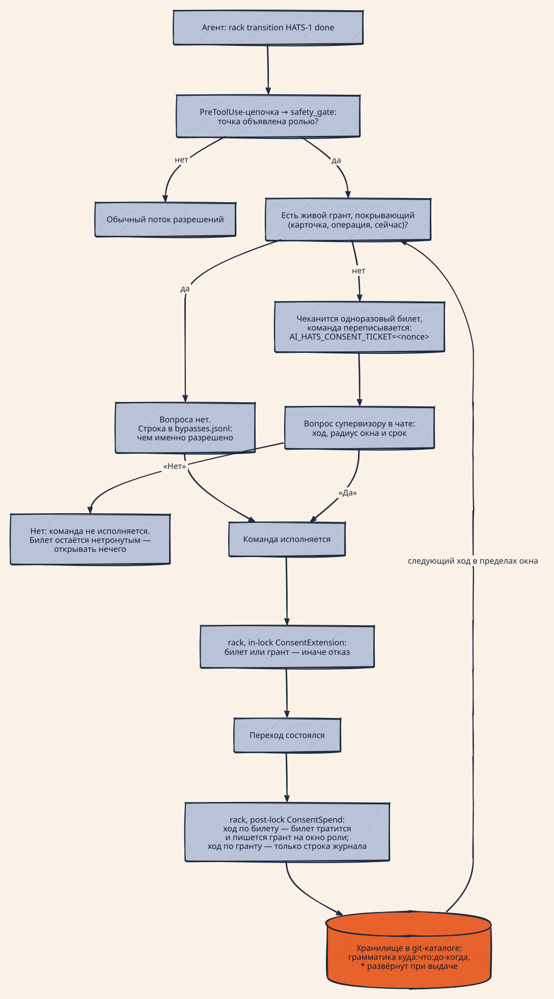

# ADR-0028: Согласие — это грант с радиусом и сроком, а не булев тумблер

## Статус

Принят (HATS-1728, 2026-08-18). Не реализован: механизм строится в HATS-1728,
продолжение — эпик HATS-1731 [7]. Решения **D7**, **D8** и **D10** записаны как
направление и осознанно отложены; принятыми к исполнению считаются **D1**–**D6**
и **D9**.

**Пересмотр 2026-08-18.** Ревью этого документа — шесть комментариев супервизора —
отменило часть принятого. Выдача и проверка согласия разделяются на **два разных
флоу**; объект консента становится **операцией с типом**, а не ребром FSM
карточки; объявление уезжает из строки `composition.apps` в **отдельный блок
роли**; `window` и прочие параметры из роли убираются — дефолт живёт в
обработчике, а «нужно надолго» агент выражает своим consent-скиллом; движок
проектируется **независимым от ai-hats**, и предметом становится интеграционный
слой. Поэтому **D2, D2a, D3 и D4 больше не описывают целевой механизм**, а
секция «Механика целевого состояния» верна лишь в той части, которая измерена на
сегодняшнем коде. Дизайн ведёт **HATS-1734** [7]; она же решит, правится этот
документ или замещается. HATS-1728 возвращена в `brainstorm`.

Продолжает [1] (ADR-0027): там решено, ГДЕ спрашивают — это объявление роли на
точке; здесь у ОТВЕТА появляются оси. Отменяет часть [1] **D4** в той мере, в
какой она описывает семейство булевых ACK-флагов (см. **D4** ниже). Опирается на
одноразовый билет, введённый в HATS-1642 [5].

## Контекст

### Измерено внутри: у гейта две настройки, и выигрывает «выключен»

В коде **20 булевых флагов обхода** (`AI_HATS_*_ACK` / `*_OFF` / `*_SKIP` /
`YOLO`; `AI_HATS_FORCE` не в счёт — он сообщает хуку про `--force`, а не гасит
гейт). Все устроены одинаково: сессионный тумблер, без радиуса, без срока, без
бюджета. Журнал `.git/ai-hats/bypasses.jsonl` за 18 дней (2026-07-31 →
2026-08-18) — **1923 обхода**, 10 разных флагов; лидер `AI_HATS_SHARED_STATE_ACK`
с 1007. `AI_HATS_CONSENT_ACK` даёт 15 обходов, и последние из них — на
`rack transition … done` в рабочих сессиях 2026-08-17 и 2026-08-18. Полные
цифры — в [3].

Тем самым прогноз карточки HATS-1728 («первое, чему научится агент, — просить
`AI_HATS_CONSENT_ACK`») уже исполнился, только на уровне человека: гейт выключают,
чтобы можно было работать.

### Измерено снаружи: это не наша местная болезнь

Anthropic по своим данным: одобряется **97 %** запросов; **62 %** пользователей
включали `bypassPermissions` или «don't ask again»; **25 %** интерактивных сессий
стартуют сразу в bypass [8]. Инженерный пост называет механизм своим именем —
approval fatigue [9]. UpGuard: из 18 470 публичных `.claude/settings.local.json`
22 % разрешают `Bash(rm:*)` [10]. В самом этом репозитории
`.claude/settings.local.json` содержит `Bash(ai-hats:*)`, что глушит паузу перед
слиянием в master, — тот же дефект, найденный на себе.

**Согласия с часами нет ни у кого.** Проверено 14 харнессов (Claude Code, Codex
CLI, Cursor, Aider, Copilot CLI и cloud-агент, Devin, Windsurf, Cline, Roo Code,
OpenHands, Gemini CLI, VS Code agent mode, спецификация MCP): везде ровно три
формы — **один вызов / эта сессия / навсегда**, ни одного поля длительности ни в
одной схеме конфигурации; телеметрия Claude Code называет свои две формы
`user_permanent` и `user_temporary`, где temporary значит «на сессию» [11].
Ровно наш сценарий просили в claude-code#33645 («`/trust 30m`») — закрыт
дубликатом [12].

### Готового движка нет

Проверено около тридцати кандидатов [3]. Отклонены все, и по двум разным
причинам. Первая — архитектурная: страж работает как **stdlib-only** подпроцесс
под системным питоном, а Cedar, oso, Biscuit, regopy, regorus — компилированные
Rust/C-колёса; единственная import-free форма, вызов бинарника `opa eval`, стоит
56–61 МБ и процесс на каждую проверку. Вторая существеннее: **примитива
истекающего гранта нет ни у одного из них** — у Cedar на него открыт RFC [13],
Casbin отвечает «пишите свою ABAC-функцию» [14], oso deprecated с 2023-12-18
[15]. Из библиотек для агентов батч есть у двоих (sticky `always_approve` у
OpenAI Agents SDK, standing approvals у Microsoft Agent Framework) — и ни у
одного нет часов; настоящее окно дают только движки долгоживущих исполнений
(Temporal, Inngest), ценой сервера-демона и сетевого вызова.

### Зато задача решена десятилетия назад

sudo хранит *time stamp record* (сессия, старт лидера сессии, монотонные часы) с
`timestamp_timeout`; polkit — *temporary authorization* с зашитыми пятью
минутами; Kerberos — renewable ticket с `endtime` и `renew-till`; OAuth — grant
со `scope` и `expires_in`; ssh-agent — `ssh-add -t lifetime` плюс `-c`
confirm-each-use. Двенадцать правил, каждое реализованное минимум двумя из этих
систем независимо, выписаны в [3] §4; ниже они приведены там, где обосновывают
решение.

## Механика целевого состояния

Секция описывает механизм ПОСЛЕ решений **D1**–**D6**; чем он отличается от
сегодняшнего — сказано в Контексте и в [4]. Четыре вопроса по порядку: как
консент навешивается на действие в роли, что с ним происходит при материализации,
как это выглядит на четырёх харнессах и как работает сам механизм.

### Как консент навешивается на действие в роли

Консент — свойство ТОЧКИ, и объявляется он строкой в `composition.apps` трейта
или роли (`trait-agent/config.yaml:44-51`):

```yaml
composition:
  apps:
    rack:
      tasks:
        - at: [edge:plan--execute, edge:review--done]
          consent: true
          window: 20m          # D2: ширину окна задаёт роль, а не проситель
    wt:
      - at: [pre-merge]
        consent: true
```

Строка несёт `run:`, `consent:` или оба сразу: гейт запускает скрипт, консент не
запускает ничего — поэтому объявление консента не может жить на строке гейта [1].
Ключ трёхзначный: отсутствие `consent:` — это не `false` (`models.py:176-181`);
`run:` разрешено опустить ТОЛЬКО на строке с `consent:` (`:182-184`), а `on_error:`
на консент-строке — жёсткая ошибка, потому что падать там нечему (`:185-193`).
Форму точки проверяют раньше всего остального (`_validate_point_form`,
`check_points.py:109`), и причина записана там же: опечатка в консент-точке — это
разоружённый гейт, который иначе никто бы не прочитал (`check_points.py:17-18`).

Роль, не композирующая трейт, не объявляет ничего и не получает ни вопроса, ни
отказа. Порядок накопления — сначала строки трейтов, потом собственные строки
роли (`composer.py:150,297`), а решает `_resolved_consent` (`composer.py:382-407`):
ключ — тройка `(app, path, point)`, позднее значение перетирает раннее (`:402`), а
в результат попадает только `true` (`:403-407`). Поэтому `consent: false` на точке
её выключает — и это единственное направление, о котором композиция предупреждает
вслух (`_warn_on_disarm`, `composer.py:409-435`).

`window:` — единственный ключ, который добавляет этот ADR. Его отсутствие
означает сегодняшнее поведение: один ответ на один вызов.

### Что происходит при материализации

<p align="center">
  
</p>

<!-- Source: docs/assets/diagrams/consent-declaration.d2 — render: docs/assets/diagrams/render.sh -->

Композиция сливает строки трейтов и роли в замороженный `CompositionResult`, а
старт сессии сохраняет его отчёт в `role_materialization.json` каталога сессии
(`wrap_runner.py:565`, `subagent_runner.py:310` → `session.py:357`). Ключ
`consent` там — список записей; форма измерена на живой сессии, а не выведена из
кода:

```json
{"app": "rack", "path": ["tasks"], "point": "edge:review--done", "declared_by": "trait-agent"}
```

`window` едет в той же записи: второй источник читателю не нужен.

Дальше одно объявление расходится к ДВУМ читателям разными путями, и это
свойство, а не дефект:

- **страж** — stdlib-хук; пакет импортировать он не может, поэтому читает готовый
  JSON по пути, который называет `AI_HATS_SESSION_IDENTITY`
  (`safety_gate.py:354-405`);
- **движок** — in-process; перечитывает библиотеку сам (`resolve_consent_points`,
  `check_resolve.py:459`; `ConsentExtension._points`, `rack_wiring.py:501`).

Страж судит по составу, зафиксированному НА СТАРТЕ сессии, — сессия живёт с тем,
с чем запущена (`safety_gate.py:354-362`), — а движок по библиотеке в момент
вызова, поэтому правка объявления посреди сессии разводит их до перезапуска. Но
расходятся они ещё в трёх местах, и все три наблюдаемы сегодня:

- **гранулярность.** Страж выбрасывает половину `from` и спрашивает по ЦЕЛЕВОМУ
  состоянию (`safety_gate.py:399-403`), а движок сравнивает целое ребро
  (`rack_wiring.py:515`). Объявленное `edge:plan--execute` заставляет стража
  спросить и на `review → execute`, где движок не откажет. Это тот самый перекос,
  ради которого живёт [6].
- **имя бэклога.** Страж фильтрует только по `app == "rack"`
  (`safety_gate.py:404`), поэтому строка, адресованная `apps.rack.blog`, поднимет
  вопрос и на переходе `tasks`. Движок путь учитывает (`rack_wiring.py:501`).
- **направление отказа.** Нечитаемый `role_materialization.json` внутри живой
  сессии оставляет стража без вопросов на всю сессию — fail-open со строкой в
  журнале (`safety_gate.py:373-380`); движок в той же ситуации fail-closed
  (`check_resolve.py:500-504`). Зато `backlog_owner is None` молча отключает уже
  движок (`rack_wiring.py:492-495`) — и тогда двое смотрят в противоположные
  стороны.

### Как это выглядит на четырёх харнессах

Скрипт стража один, и объявляет его СКИЛЛ, а не провайдер
(`safety-guard/SKILL.md:4-12`); поверхность лишь маршрутизирует к нему свои
события.

| харнесс   | канал рантайм-хуков                                                                                                                                | что происходит на гейтенной команде                                                                                                                     |
| --------- | -------------------------------------------------------------------------------------------------------------------------------------------------- | ------------------------------------------------------------------------------------------------------------------------------------------------------- |
| claude    | PreToolUse через посессионный settings-файл (`surfaces/claude/provider.py:255-273`; сам `ensure_runtime_hooks` — намеренный no-op, `:405-411`)     | `ask` и `updatedInput` доезжают: вопрос в чате → билет → грант                                                                                          |
| codex     | PreToolUse / PermissionRequest / PostToolUse (`runtime_hooks.py:22`), адаптер сворачивает первые два в PreToolUse (`claude_hook_adapter.py:53-57`) | **билетная дорога не доезжает**: `updatedInput` не форвардится (`hook_dispatcher.py:140-152`), а `ask` на PreToolUse превращается в `deny` (`:217-227`) |
| agy       | PreToolUse: глобальный диспетчер плюс посессионный манифест (`agy/global_hook.py:45-70`, `agy/provider.py:207-220`)                                | доезжает; ответ пишется в ключ `CommandLine`, а не `command` (`safety_gate.py:869-872`)                                                                 |
| **cline** | **нет** — провайдер не переопределяет базовый no-op (`src/ai_hats/providers.py:501-521`)                                                           | **вопроса нет вовсе**                                                                                                                                   |

<p align="center">
  
</p>

<!-- Source: docs/assets/diagrams/consent-harnesses.d2 — render: docs/assets/diagrams/render.sh -->

Отсюда видно, почему env-канал остаётся живым при «одной форме» (**D4**): он
обслуживает не один харнесс из четырёх, а ДВА — cline, где спрашивать некому, и
codex, где вопрос задать можно, но ответ не может донести билет. И почему
грамматика у него та же самая: иначе у одного механизма было бы два языка.

### Как работает сам механизм

<p align="center">
  
</p>

<!-- Source: docs/assets/diagrams/consent-runtime.d2 — render: docs/assets/diagrams/render.sh -->

Билет и грант — один тип с разными осями (**D1**), и оба лежат в git-каталоге
проекта. Билет: `<git-common-dir>/ai-hats/consent/<nonce>.json` с полями
`task_id`, `issued_at`, `session_id` и `command` — sha256 от argv, а не от
командной строки, чтобы кавычки и пробелы шелла не читались как другая команда
(`consent_ticket.py:131-166`). Грант — там же, с префиксом `grant-`, с полями
`scope`, `expires_at`, `issued_at`, `session_id`, `channel`.

Билет действителен по четырём осям (`consent_ticket.py:211-240`): карточка,
сессия, точный argv, одноразовость. Грант ослабляет ровно две из них — радиус
вместо argv, срок вместо одного использования — и сохраняет сессию.

Порядок внутри кернела несущий. `ConsentExtension` работает **in-lock** и
отказывает рано (`rack_wiring.py:504-523`), а трата — **post-lock**
(`ConsentSpend`, `rack_wiring.py:549-576`), потому что откат транзакции не должен
съедать клик супервизора. Грант записывается там же, где тратится билет:
состоявшееся исполнение — единственное доказательство, что ответ был «да»
(**D2a**).

Три свойства, которые читатель по докам не угадает. Хранилище **общее у чекаута
и всех его worktree**: путь разворачивается из `worktrees/…` в общий git-каталог
(`consent_ticket.py:66-68`), иначе билет, выданный в worktree, не нашёлся бы в
основном дереве. Ответ «нет» **не отзывает билет, а оставляет его нетратимым** —
обратного вызова не существует, файл лежит до уборки, и безопасен он ровно
четырьмя привязками; на этом и стоит **D2a**. И весь гейт целиком снимается одним
`AI_HATS_YOLO=1` раньше, чем дело доходит до консента (`safety_gate.py:843-845`):
грант этого не меняет, флаг остаётся предметом эпика [7].

Вторая дорога в master проходит по тому же механизму: `ai-hats wt merge`
спрашивает тем же стражем (`safety_gate.py:667-690`), берёт билет уже в CLI
(`cli/worktree.py:283-305`, `wt_effects.py:26-60`) и тратит его последним шагом
успешного слияния (`cli/worktree.py:586`). Слияние, вложенное в
`review → done`, смотрит ТОТ ЖЕ билет и не тратит его — трата post-lock, — поэтому
одно согласие покрывает и переход, и слияние внутри него; это работает уже
сегодня и в счёт «серии» не идёт.

## Решение

**D1. Грант — самостоятельный объект, у которого есть оси.** Грант
`{scope, expires_at, issued_at, session_id, channel}` привязан к паре **(сессия,
время)**. Сегодняшний одноразовый билет становится его частным случаем: радиус —
один точный argv, срок — одно использование. Ключ сессии не выбирается тем, кого
ограничивают: это правило 1 prior art (sudo `tty_tickets`, polkit, Chrome), и
CVE-2013-1776 [17] — цена его нарушения, когда ключ оказался управляемым
из-под пользователя.

**D2. Спрашиваем в контексте первой реальной операции — модель sudo.** У sudo нет
глагола «запросить окно»: первая настоящая команда поднимает вопрос, и ответ
открывает окно, ширину которого задаёт `sudoers`. У нас так же — ширина живёт в
объявлении роли (`consent: {window: …}` рядом с `consent: true`), а не в строке,
которую печатает тот, кого спрашивают. Основание — правило 9 (Android, Apple,
Google incremental authorization требуют спрашивать в контексте; Chromium прямо
называет запрос вне контекста причиной того, что люди перестают читать [16]).
Отвергнутая альтернатива — отдельная команда-реквест авансом.

**D2a. Окно открывает состоявшийся ход, а не заданный вопрос.** Билет чеканится
ДО ответа и переживает «No» — это записано в самом коде («a ticket always
outlives a "No"», `consent_ticket.py:154-157`), и сегодня от последствий спасает
только привязка к точному argv. Широкий грант, записанный в момент вопроса,
открыл бы следующий вызов после отказа. Поэтому грант пишется там, где билет
тратится, — после того как ход состоялся.

**D3. Грамматика `<куда>:<что>:<до-когда>`.** `<куда>` — id карточки или `all`;
`<что>` — целевое состояние, `merge` или `*`; `<до-когда>` — `HH-MM` UTC,
абсолютный срок. Словарь `<что>` — тот, которым говорит сам вопрос («→ done
needs your consent», «merging X into master needs your consent»), а не ключ
точки: в ключе `edge:review--done` есть двоеточие, и он всё равно переписывается
стрелками в HATS-1684 [6].

**D3a. `*` разворачивается при выдаче и хранится развёрнутым.** Правило 11: грант
привязывается к аргументам, а не к имени операции. polkit — задокументированный
контрпример: его удержанная авторизация совпадает по `action_id` и покрывает
вызов «even if the variables passed along with the check are different» [18].
Развёртка при выдаче даёт две вещи сразу: вопрос показывает конкретный список
точек, и последующая правка объявления роли не расширяет уже живой грант.

**D3b. Грант сообщает выданное, а не запрошенное.** Правило 5; OAuth RFC 6749
§3.3 обязывает сервер вернуть фактический `scope`, если он сузил запрошенный
[19]. У нас это журнал и `consent list`.

**D4. Одна форма.** `AI_HATS_CONSENT_ACK` и `AI_HATS_PLAN_ACK` уходят; их место
занимает `AI_HATS_CONSENT` с грамматикой **D3** — тот же объект гранта, второй
канал выдачи, нужный там, где вопрос задать некому (headless, cron, поверхность
без runtime-хуков). `AI_HATS_MERGE_ACK` этим решением НЕ снимается: это
внутренний люк движка `wt` (`manager.py:1226`) и предмет HATS-1718. В той мере, в
какой [1] **D4** описывает сосуществование трёх булевых флагов, оно заменяется
настоящим пунктом.

**D5. Журналируется каждое ИСПОЛЬЗОВАНИЕ, а не только выдача.** Правило 6: sudo
пишет строку на каждую команду, даже когда пароль не спрашивали, потому что
timestamp был жив. Контрпример — ssh-agent, который не пишет ничего. Молчаливого
согласия не должно быть ни в одной форме: и хук, и движок пишут строку в
`bypasses.jsonl`, а ходы внутри перехода — ещё и в work_log карточки.

**D6. Живые гранты перечислимы, и отзыв дешевле выдачи.** Правило 7: polkit умеет
`EnumerateTemporaryAuthorizations` и `RevokeTemporaryAuthorizationById`, а
`sudo -k` **не требует пароля** — специально, чтобы его можно было повесить в
`.logout`. Отзыв не задаёт вопросов и не требует согласия.

**D7. Потолок задаёт политика, а не проситель — направление принято, работа
отложена (HATS-1732).** Kerberos не даёт превысить `max_life`, sudo в
kernel-режиме запрещает бессрочность и ограничивает 60 минутами, OAuth разрешает
серверу сузить запрошенный scope. Контраргумент «вопрос показывает всё,
супервизор прочитает» ослаблен измерением: одобряется 97 % запросов [8], то есть
вопрос почти не работает как фильтр. Решение супервизора 2026-08-18 — пока не
делать; карточка держит основание, чтобы его не пришлось восстанавливать заново.

**D8. Ось бюджета (N операций) — не сейчас (HATS-1731).** Конвенция в индустрии
существует: `allowedMaxRequests` и `allowedMaxCost` у Roo Code,
`--max-autopilot-continues` у Copilot CLI, `max_consecutive_auto_reply` у
AutoGen, «3 отказа подряд или 20 всего» у Claude auto mode [9]. Контрданные тоже
есть: Cline свой счётчик удалил как «сложность без внятной пользы». В нашем
журнале нет ни одного случая, где дело было в ЧИСЛЕ операций, — потребителя нет,
ось ждёт.

**D9. Строим сами, дизайн заимствуем.** Adopt отклонён по kill-criteria (см.
Контекст): около ста строк stdlib против компилированного колеса, которое всё
равно не имеет нужного примитива. Дополнительный довод: любой внешний движок даёт
ДВА пути решения — свой в процессе и рукописный в страже, — и они обязаны
совпадать вечно; один общий stdlib-модуль, импортируемый обоими, — это один путь.

**D10. Вторая дорога — эскалация вместо запрета — зафиксирована как развилка;
решение НЕ принято.** Дорога 1 (эта ADR) не меняет список мест, где спрашивают, а
даёт ответу оси. Дорога 2 меняет сам список: агент идёт сам, а вопрос поднимается
только когда что-то выглядит не так — по классификатору риска, по счётчику
отказов, по нарушенному инварианту. В 2026-м туда ушли трое: Claude Code «auto
mode» (выкачен 2026-03-24, дефолт для Pro/Max/Team с 2026-08-14) [8][9], Cursor
Auto-review (2026-05-29, с оговоркой в собственной документации «Auto-review is
not a security boundary»), reviewer-агент в approvals у Codex. Обоснование у всех
одно — те же 97 % и 62 %. Дороги не конфликтуют: sudo — это дорога 1, auto mode —
дорога 2, и вторая может лежать поверх первой, потому что даже классификатору
нужно место, куда записать «одобрено, и на сколько». Что дорога 2 требует
отдельно: определить, что считается «не так», кто это вычисляет, откуда берётся
сигнал и сокращается ли при этом список объявленных точек. До этого решения
список точек остаётся тем, что объявила роль по [1].

## Следствия

**Что становится возможным.** Один ответ супервизора покрывает серию ходов до
названного срока; «следующие полчаса агент работает сам» перестаёт требовать
перезапуска сессии с бессрочным тумблером; широкий селектор HATS-1706 (`->done` —
восемь рёбер, `ANY->ANY` — 73 события) перестаёт означать клик-спам, из-за
которого этот срез и идёт раньше него.

**Чем платим.** Снятие двух ACK-флагов трогает семь модулей и четыре документа,
включая правку [1] **D4**. Появляется второй тип артефакта в том же каталоге
хранилища, и его уборка не может опираться на mtime, как уборка билетов
(`STALE_AFTER_SECONDS` сносит любой `*.json` старше 12 часов) — грант убирается
по собственному `expires_at`.

**Риски, названные заранее.**

- *Часы.* Срок абсолютный и берётся с тех же часов, к которым имеет доступ
  ограничиваемый (правило 8). sudo прошёл через это как через уязвимость
  (CVE-2013-1775, сброс часов воскрешал timestamp [20]) и ответил монотонными
  часами плюс отказом верить меткам из будущего. Наш паллиатив — хранить
  `issued_at` рядом с `expires_at` и считать порченым грант, чей срок разъезжается
  со стартом сессии больше чем на сутки.
- *Согласие-усталость никуда не денется сама.* Грант уменьшает число вопросов, но
  не делает оставшиеся более читаемыми. Это и есть предмет **D7** и **D10**.
- *Широкий грант — это тот же тумблер, только с часами.* Пока потолка нет (**D7**),
  единственная защита — дословный рендер радиуса в вопросе и строка журнала на
  каждое использование (**D5**).

**Что этим решением НЕ решается.** Где спрашивают — остаётся за [1] и за
HATS-1712 / HATS-1706. Перевод остальных 19 флагов на гранты — эпик HATS-1731 [7].
Половина консента на стороне движка `wt` — HATS-1718.

## References

1. `docs/adr/0027-consent-is-declared-by-the-role.md` — консент объявляется ролью на точке
2. `docs/adr/0019-declarative-lifecycle-extension-model.md` — декларативная модель привязок
3. `.agent/ai-hats/tracker/backlog/tasks/HATS-1728/research.md` — разведка: измерения, кандидаты, 12 правил prior art
4. `.agent/ai-hats/tracker/backlog/tasks/HATS-1728/plan.md` — план среза
5. `.agent/ai-hats/tracker/backlog/tasks/HATS-1642/plan.md` — одноразовый билет консента
6. `.agent/ai-hats/tracker/backlog/tasks/HATS-1684/design.md` — грамматика точек, §4.2.1 о двух пробелах консента
7. HATS-1731 — эпик «консент как грант»; HATS-1732 — отложенный потолок;
   HATS-1734 — дизайн разделения выдачи и проверки (пересмотр 2026-08-18)
8. https://claude.com/blog/auto-mode-default-in-claude-code
9. https://www.anthropic.com/engineering/claude-code-auto-mode
10. https://www.upguard.com/blog/yolo-mode-hidden-risks-in-claude-code-permissions
11. https://code.claude.com/docs/en/monitoring-usage
12. https://github.com/anthropics/claude-code/issues/33645
13. https://github.com/cedar-policy/rfcs/issues/112
14. https://github.com/casbin/casbin/issues/219
15. https://www.osohq.com/docs/oss/project/changelogs/2023-12-18.html
16. https://blog.chromium.org/2020/01/introducing-quieter-permission-ui-for.html
17. https://www.sudo.ws/security/advisories/tty_tickets/
18. https://polkit.pages.freedesktop.org/polkit/polkit.8.html
19. https://www.rfc-editor.org/rfc/rfc6749#section-3.3
20. https://www.sudo.ws/security/advisories/epoch_ticket/
