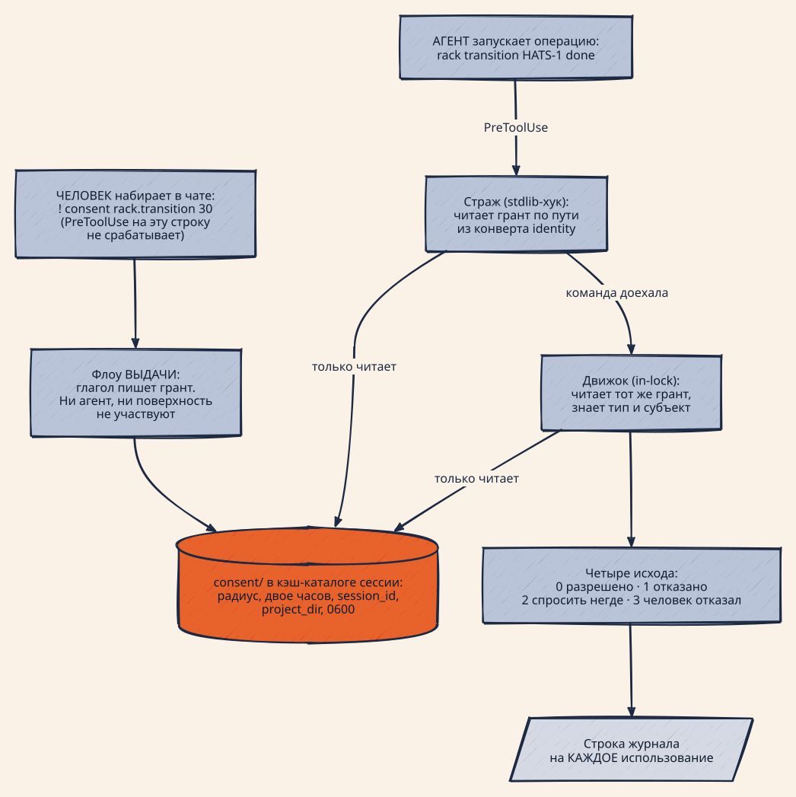

# ADR-0029: Согласие выдаёт человек отдельным глаголом, а проверяют его без человека

> **ЗАМЕНЁН ADR-0030** (HATS-1755, 2026-08-20) [10]. Разделение выдачи и
> проверки, грант с радиусом и сроком и запрет на self-grant остаются в силе.
> Отменена in-process половина механизма: `rack` и `wt` больше не проверяют
> согласие сами; проверка становится внешней middleware команд сессии.

## Статус

Принят (HATS-1734, 2026-08-18). **Не реализован**: механизм строится стримами
эпика HATS-1731, и какая карточка что делает — сказано в секции «Карта решений
по карточкам». Дизайн, на который опирается документ, — [3].

**Заменяет ADR-0028** [1]. Тот документ дал ответу на вопрос согласия оси —
радиус и срок — и это решение остаётся в силе. Но механизм он описал как
надстройку над сегодняшним одноразовым билетом: ширина окна объявляется в роли,
грант чеканится там же, где тратится билет, грамматика радиуса пишется через
двоеточия с абсолютным сроком UTC. Ревью 2026-08-18 отменило эту часть целиком.
Решения здесь нумеруются **заново**: это новый документ, а не редакция.

**Продолжает ADR-0027** [2]: там решено, ГДЕ спрашивают — консент объявляется
ролью на точке, и это остаётся. Здесь решено, КТО отвечает, каким артефактом
живёт ответ и почему проверяющий больше не обязан уметь спрашивать.

## Контекст

### Асимметрия двух участников — источник всего остального

В сегодняшнем механизме два участника, и каждый умеет ровно половину.

**Страж** — процесс хука, запускаемый поверхностью до команды. Он живёт вне
наших пакетов и обязан быть stdlib-only; он видит командную строку, но не
предметную область. Умеет три вещи: спросить, отказать, переписать команду. Не
умеет понять, ЧТО означает операция.

**Движок** — гейт внутри процесса, который операцию выполняет. Он работает под
замком, внутри транзакции, видит предметную область целиком — карточку, ребро,
актора. Умеет отказать. Спросить не умеет: человек в этот процесс не смотрит.

Всё, что механизм делает сегодня, — попытка склеить их одноразовым билетом,
привязанным к argv, чтобы ответ, полученный первым, дошёл до второго. Отсюда
три ограничения разом: ответ действует ровно на один точный вызов; он зависит
от способности поверхности переписать команду; серию выразить нечем.

### Измерено внутри: у гейта две настройки, и выигрывает «выключен»

В коде около двух десятков булевых флагов обхода (`AI_HATS_*_ACK` / `*_OFF` /
`*_SKIP` / `YOLO`; `AI_HATS_FORCE` не в счёт — он сообщает хуку про `--force`, а
не гасит гейт). Все устроены одинаково: сессионный тумблер, без радиуса, без
срока, без бюджета.

Журнал `.git/ai-hats/bypasses.jsonl` за 2026-07-31 → 2026-08-18 (перемеряно при
написании этого документа): **2492 записи, из них 1954 обхода**
десятью разными флагами; лидер `AI_HATS_SHARED_STATE_ACK` — 1025. У консента
своя строка: `AI_HATS_CONSENT_ACK` даёт **16 обходов**, и все они — на
`rack transition … execute|done` в рабочих сессиях 16–18 августа. То есть гейт
консента выключают не в эксперименте, а чтобы можно было работать. Полные
измерения и разбор кандидатов — в разведке [4].

### Измерено снаружи: согласия с часами нет ни у кого

Anthropic по своим данным: одобряется 97 % запросов; 62 % пользователей включали
`bypassPermissions` или «don't ask again»; 25 % интерактивных сессий стартуют
сразу в bypass [5]. Инженерный пост называет механизм своим именем — approval
fatigue [6]. UpGuard: из 18 470 публичных `.claude/settings.local.json` 22 %
разрешают `Bash(rm:*)` [7].

Проверено 14 харнессов: везде ровно три формы — **один вызов / эта сессия /
навсегда**, ни одного поля длительности ни в одной схеме конфигурации [4].

### Зато раскол выдачи и проверки решён восемь раз

Разведка по восьми системам [8] дала одно и то же устройство: **выдача — это
отдельный глагол, у которого нет другой работы** (`sudo -v`, `ssh-add`, `kinit`,
`vault login`, `op signin` — пять систем, пять глаголов), а проверяющий кредитив
не выдаёт и вопросов не задаёт. Оттуда же взято, что у проверки **четыре**
исхода: `pkcheck` возвращает 0 разрешено, 1 не разрешено, 2 нет подходящего
агента, 3 человек закрыл диалог; `ssh-add` отдельно кодирует «не смог связаться
с агентом». Обе системы отказываются схлопывать «я не смог спросить» в
«ответили нет».

## Механика — саммари

Полный разбор с измерениями и номерами строк — в дизайне [3]; здесь ровно
столько, чтобы понять решения ниже, не открывая его.

  

<!-- Source: docs/assets/diagrams/consent-two-flows.d2 — render: docs/assets/diagrams/render.sh -->

Три диаграммы, приехавшие с ADR-0028, описывают отменённый механизм — `window`
в строке роли, чеканку гранта при трате билета, хранилище в git-каталоге — и
остаются при том документе как история.

**Появляется третья роль — выдающий.** Это человек, набравший глагол выдачи. Он
не участвует в исполнении команды вообще, и именно его появление разъединяет
двух прежних участников: стражу больше не нужно уметь спрашивать, а движку — не
нужно ждать ответа.

**Флоу выдачи:** человек печатает `consent …`; глагол пишет грант в известное
место. Ни агент, ни поверхность в этом не участвуют — требование к поверхности
падает до «человек может напечатать команду».

**Флоу проверки:** и страж, и движок становятся чистыми проверяющими. Они
вычисляют путь, читают файл и отвечают одним из четырёх исходов. Проверка
одинакова на всех поверхностях ровно потому, что никуда не ходит.

**Дискриминатор человека и агента механический, а не декларативный:** PreToolUse
срабатывает на командах агента и не срабатывает на `!`-строке человека. По
окружению их не различить — измерено, что оба получают один и тот же конверт
`AI_HATS_SESSION_IDENTITY`. Отсюда прямое следствие: где стража нет, там нет и
дискриминатора, и выдача не поддерживается вовсе.

**Артефакт** — файл в каталоге `consent/` кэш-каталога сессии, рядом с
материализованным `plugin/`; права `0600`, каталог `0700`. Он несёт радиус
(типы операций и субъекты), двое часов (сдвижные и абсолютные), сессию,
`project_dir` из конверта и метку, каким каналом выдан. У гранта нет привязки к
argv по построению: ключ выдаётся ДО появления команды.

| поверхность | выдача                              | проверка           | что деградирует                              |
| ----------- | ----------------------------------- | ------------------ | -------------------------------------------- |
| claude      | `!` в чате либо терминал            | работает           | ничего                                       |
| codex       | `!` в чате (заявлено) либо терминал | работает           | вопроса в чате нет, остаётся голый отказ     |
| agy         | `!` в чате (заявлено) либо терминал | работает           | ничего измеренного                           |
| cline       | **не поддерживается** — стража нет  | работает полностью | вопроса нет; отказ грубый, стоит всей задачи |

Файловая база выравнивает то, что раньше расходилось: cline, у которого нет ни
одного рантайм-хука, получает полноценную ПРОВЕРКУ. Это главный довод против
схемы «согласие едет в переписанной команде», при которой cline и codex не
обслуживаются вовсе.

## Решение

**D1. Выдача и проверка — два разных флоу.** Сегодня они слиты: один хук и
спрашивает, и проверяет. Разделение снимает три ограничения разом — привязку к
argv, зависимость от способности поверхности переписывать команду и
невозможность выразить серию.

**D2. Объект согласия — операция с типом, а не ребро FSM карточки.** Операция
это `type` (`rack.transition`, `wt.merge`, `cmd.<метка>`), `subject`, непрозрачные
`params` и человекочитаемая метка. Третий тип обязан добавляться без правки
ядра; значит реестр типов — данные, а вывод операции из командной строки —
работа адаптера хоста, у которого argv есть.

**D3. Глагол выдачи называется `consent`, без префикса.** Имя без префикса и
есть вынос консента из ai-hats; короткая форма продиктована `!`-режимом, где нет
ни подсказок, ни автодополнения. Агенту глагол **не запрещён**: его попытка
падает вопросом в харнессе, поэтому один и тот же глагол работает двумя
способами — набранный человеком это выдача, запущенный агентом это запрос.
Второго механизма для «агент просит согласия» не нужно.

**D4. Грамматика позиционная, последний аргумент — минуты.** `consent all`,
`consent rack.transition 30`, `consent HATS-1734 30`, `consent list`. Отменяет
абсолютный срок `HH-MM` UTC из ADR-0028 D3: в `!`-режиме считать часовой пояс в
голове нечем. **Окно по умолчанию — 120 минут, вынесенные отдельной константой
в начало файла**, чтобы правиться руками без чтения кода. Величина взята из
состава реального сеанса — полчаса на обсуждение, час на имплементацию, полчаса
на quality gate, — а не из прецедента: у polkit `auth_admin_keep` дефолт пять
минут, но там единица работы — одна административная команда.

**D5. Форма гранта только оконная.** Оси бюджета (N операций) нет: «одно
согласие на N операций» выражается временем. Конвенция в индустрии существует
(`allowedMaxRequests` у Roo Code, `--max-autopilot-continues` у Copilot CLI), но
Cline свой счётчик удалил как сложность без внятной пользы, а в нашем журнале
нет ни одного случая, где дело было в ЧИСЛЕ операций.

**D5a. Гранты АДДИТИВНЫ, и это заявленное свойство, а не недосмотр.** Выдача
пишет новый файл и не трогает живые: проверка берёт объединение всех
неистёкших. Следствие, которое надо знать заранее: радиус и срок можно только
РАСШИРИТЬ — `consent rack.transition 1` поверх действующего тридцатиминутного
окна не укорачивает его, а добавляет второе, более узкое, поверх более
широкого. Сузить или закрыть окно досрочно нечем: отзыва нет по D9
(«перезапуск сессии и есть отзыв»), а удалять файл руками агенту запрещено by
design. Основание держать это свойство, а не чинить: единственный писатель —
человек (D10), и монотонность делает выдачу коммутативной — порядок двух
набранных подряд команд не меняет результата, поэтому «я выдал не то, наберу
ещё раз» никогда не сужает права молча. Цена названа замером живой приёмки
HATS-1735: чтобы проверить истечение, понадобилось удалить файл руками.
Сужение — вход в дизайн отзыва, и живёт оно вместе с `consent list` в
HATS-1736, а не здесь.

**D5b. Оси СУБЪЕКТА у радиуса нет** (HATS-1735). Привязать грант к одной
карточке значило бы читать её идентификатор из командной строки, которую страж
видит ДО раскрытия шеллом — измерено на живой сессии: цикл по `$id` отдаёт
гейту литеральный токен, и такой радиус не покрыл бы ничего. Понадобится
сужение по операции — оно придёт селектором, тем же механизмом, которым
`apps.rack` уже пишет `plan->execute`.

**D6. У проверки четыре исхода, и они закрытое множество:** разрешено (0),
отказано (1), спросить было негде (2), человек отказался отвечать (3). Сегодня
третий и четвёртый неотличимы от второго, и агент получает отказ там, где
вопрос просто не был задан. Различение обязано доезжать до кода возврата, а не
только до текста. Правило взято у `pkcheck` и `ssh-add` [8].

**D7. Движок не знает про ai-hats: ноль импортов.** Обоснование механическое:
половина проверки обязана быть достижимой из stdlib-only хука, и любой наш
импорт делает это невозможным. Движок не знает, что такое карточка, состояние,
ребро, ветка, worktree, бэклог, роль, трейт, провайдер. Обратно ai-hats знает о
движке три ребра: литерал имени в реестре приложений, адаптер объявления и точки
вызова вердикта. Шов лежит в листовом модуле — иначе `wt_effects` не сможет им
пользоваться, там цикл импорта.

**D8. Объявление — отдельный блок роли, без параметров.** Новый гейт объявляется
блоком `apps.consent_gate`, где сказано только ЧТО требует согласия; `at:`
называет **типы операций**, а не рёбра FSM. Ширины окна в объявлении нет:
отменяет ADR-0028 D2, где роль задавала `window:`. Дефолт живёт в обработчике, а
«нужно надолго» человек выражает при выдаче.

**D9. Хранилище — кэш-каталог сессии; отзыв это перезапуск сессии.** Новая
сессия не видит старый грант по изоляции пути, а не по смерти каталога.
Отдельного глагола отзыва нет — это следствие модели, а не компромисс; `list`
остаётся для отладки. Обязательная добавка: грант несёт `project_dir` из
конверта, и проверка сверяет его с каталогом, где команда реально выполнится, —
иначе `cd /other/repo && …` прошёл бы под широким грантом.

**D10. Грант чеканит только человек — ни одна точка ai-hats не выписывает его
автоматически.** Билет чеканится ДО ответа и переживает «нет»; сегодня от
последствий спасает привязка к точному argv. Широкий грант, записанный в момент
вопроса, открыл бы следующий вызов ПОСЛЕ отказа. ADR-0028 D2a решал это записью
гранта в момент траты билета — здесь решение другое и более простое:
автоматической чеканки нет вовсе.

**D11. Журналируется каждое ИСПОЛЬЗОВАНИЕ, а не только выдача,** ровно одной
строкой на операцию: страж свою проверку пишет как peek и использованием не
считает. Прецедент — sudo, который пишет строку на каждую команду, даже когда
пароль не спрашивали. Проверка вне объявленной политики не пишет ничего, иначе
PreToolUse на каждый Bash сделает журнал нечитаемым.

**D12. Граница применимости названа честно.** Выдача поддерживается только там,
где есть страж, потому что только там существует дискриминатор человека и
агента; на поверхности без рантайм-хуков единственный канал — запускающее
окружение. MCP не рассматривается ни как основа, ни как слой эргономики:
зависимостей от MCP не хотим, и это снимает заодно измеренный риск — элицитацию
у claude можно авто-ответить хуком, и тогда роль согласуется сама с собой.

**D13. Старый механизм снимается отдельным треком, а не попутно.** Env-ACK и
одноразовый билет живут рядом с грантом ровно до трека D. Это осознанное
отступление от ADR-0028 D4 («одна форма»): флаги обслуживают два харнесса из
четырёх, а снятие трогает семь модулей и четыре документа. Правило
сосуществования: грант отвечает первым, билет — фолбэк, отказ — последним; и
точка либо целиком новая, либо целиком старая — иначе человек удовлетворит новый
механизм и упрётся в старый.

## Карта решений по карточкам

Что и где будет сделано. Дерево живёт в эпике HATS-1731; зависимости —
`depends_on` в трекере.

| карточка      | что делает                                                                                                                                                                                                            | исполняет     |
| ------------- | --------------------------------------------------------------------------------------------------------------------------------------------------------------------------------------------------------------------- | ------------- |
| **HATS-1735** | MVP движка, сразу впаянный в ai-hats: артефакт, глагол `consent`, поле `session_cache_dir` в конверте, лист-шов и три точки вызова, новый текст отказа, глагол в линте allow-правил, e2e через реальную цепочку хуков | D1–D4, D7–D11 |
| **HATS-1736** | доводка контракта: коды возврата четырёх исходов в headless, двое часов, отказ по правам файла, подметание по сроку, журнал с политикой, `consent list`, тип `cmd.<метка>`                                            | D5, D6, D11   |
| **HATS-1737** | прямой `ai-hats wt merge` уходит на грант; поверхность без стража отказывает честно                                                                                                                                   | D12, D13      |
| **HATS-1738** | флаги `AI_HATS_CONSENT_ACK` и `AI_HATS_PLAN_ACK` снимаются, их место занимает env-канал гранта с той же грамматикой                                                                                                   | D13           |
| **HATS-1741** | одноразовый билет снимается — один артефакт согласия вместо двух                                                                                                                                                      | D13           |
| **HATS-1742** | объявления `apps.rack` / `apps.wt` переезжают в блок `apps.consent_gate`                                                                                                                                              | D8            |
| **HATS-1739** | права сабагента: канала «не громче родителя» не существует, env-ACK наследуется целиком                                                                                                                               | граница D9    |
| **HATS-1740** | движок выезжает отдельным репозиторием — нулевая связность из декларации становится проверяемой                                                                                                                       | D7            |

Первая ценность доезжает на **HATS-1735** целиком: человек печатает
`!consent rack.transition 30`, и следующие тридцать минут переходы идут без
вопроса, включая слияние, вложенное в `review → done`. Ни один срез до неё не
меняет рабочий поток — именно поэтому нарезка «сначала проверка, потом выдача,
потом шов» была отвергнута.

## Следствия

**Что становится возможным.** Один ответ супервизора покрывает серию ходов до
названного срока. «Следующие два часа агент работает сам» перестаёт требовать
перезапуска сессии с бессрочным тумблером. Широкий селектор (HATS-1706)
перестаёт означать клик-спам. Cline — поверхность без единого рантайм-хука —
впервые получает полноценную проверку согласия.

**Чем платим.** В каталоге хранилища появляется второй тип артефакта, и его
уборка не может опираться на mtime, как уборка билетов, — грант убирается по
собственному сроку. Пока трек D не пройден, у согласия три формы вместо одной, и
каждая точка обязана спрашивать их по порядку. Ai-hats получает три ребра
зависимости от внешнего движка и обязана их не наращивать.

**Риски, названные заранее.**

- *Часы.* Срок абсолютный и берётся с тех же часов, к которым имеет доступ
  ограничиваемый. sudo прошло это как уязвимость (CVE-2013-1775 [9]) и ответило
  монотонными часами плюс отказом верить меткам из будущего. Наш паллиатив —
  хранить `issued_at` рядом со сроком и считать порченым грант, чей срок
  разъезжается со стартом сессии больше чем на сутки.
- *Сдвижной TTL без потолка не истекает никогда* под активным потребителем.
  Отсюда двое часов, а не одни, — правило, реализованное независимо gpg-agent,
  Vault, 1Password и STS [8].
- *Широкий грант — это тот же тумблер, только с часами.* Пока потолка,
  задаваемого политикой, нет (HATS-1732), единственная защита — дословный рендер
  радиуса при выдаче и строка журнала на каждое использование (D11).
- *Allow-правило обезоруживает дискриминатор.* Под правилом вида
  `Bash(ai-hats:*)` в локальных настройках агент выпишет себе грант молча, а
  грант шире билета. Поэтому глагол добавляется в список охраняемых команд линта
  тем же коммитом, что и сам глагол; сами правила — предмет HATS-1685.
- *Согласие-усталость не исчезает сама.* Грант уменьшает число вопросов, но не
  делает оставшиеся более читаемыми.

## Что этим решением НЕ решается

- **Где спрашивают** — гранулярность стража против движка (HATS-1712) и консент
  на широком выходе из состояния (HATS-1706).
- **Потолок радиуса и срока, задаваемый политикой** — HATS-1732, отложено с
  записанным основанием.
- **`AI_HATS_YOLO`**, снимающий страж целиком раньше консента, и перевод
  остальных булевых флагов на гранты — эпик HATS-1731.
- **Собственный люк движка `wt`** — HATS-1718.
- **Эскалация вместо запрета** (агент идёт сам, вопрос поднимается только когда
  что-то выглядит не так). Дороги не конфликтуют: эта ADR не меняет список мест,
  где спрашивают, а даёт ответу оси; вторая дорога может лечь поверх, потому что
  даже классификатору риска нужно место, куда записать «одобрено, и на сколько».

## References

1. `docs/adr/0028-consent-is-a-grant-with-radius-and-deadline.md` — заменяемый документ: оси согласия приняты, механизм отменён
2. `docs/adr/0027-consent-is-declared-by-the-role.md` — консент объявляется ролью на точке
3. `.agent/ai-hats/tracker/backlog/tasks/HATS-1734/design.md` — дизайн: три роли, два флоу, контракт движка, шов, правила сосуществования
4. `.agent/ai-hats/tracker/backlog/tasks/HATS-1728/research.md` — разведка: измерения, около тридцати кандидатов, двенадцать правил prior art
5. https://claude.com/blog/auto-mode-default-in-claude-code
6. https://www.anthropic.com/engineering/claude-code-auto-mode
7. https://www.upguard.com/blog/yolo-mode-hidden-risks-in-claude-code-permissions
8. `.agent/ai-hats/tracker/backlog/tasks/HATS-1734/prior-art-issue-check.md` — восемь систем, разделивших выдачу и проверку
9. https://www.sudo.ws/security/advisories/epoch_ticket/
10. `docs/adr/0030-consent-is-session-command-middleware.md` — заменяющий документ: внешний wrapper и ассимиляция инструментов
