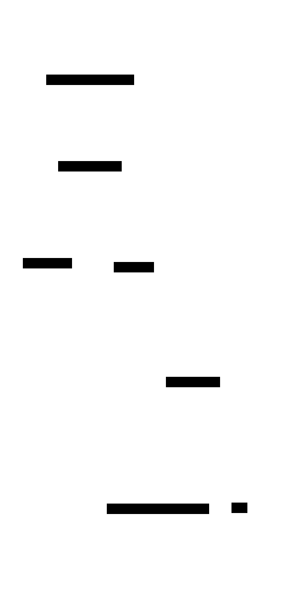

# Custom palette preview (d2 + Source Code Pro + sketch)

Six custom palettes on the same [`session-lifecycle.d2`](session-lifecycle.d2). All built through `vars.d2-config.theme-overrides` (16 color slots: N1-N7 neutrals, B1-B6 primary, AA2/AA4/AA5 secondary, AB4/AB5 tertiary). Font — Source Code Pro (variable TTF from `~/Library/Fonts`). Mode — `--sketch`.

Command:
```bash
d2 --sketch --pad=20 \
   --font-regular "$HOME/Library/Fonts/SourceCodePro[wght].ttf" \
   --font-italic  "$HOME/Library/Fonts/SourceCodePro-Italic[wght].ttf" \
   --font-bold    "$HOME/Library/Fonts/SourceCodePro[wght].ttf" \
   pN.d2 pN.svg
```

---

<table>
<tr>
  <td align="center"><b>P1 — Brand Dark</b><br><sub>navy/orange/cream, warm dark</sub><br></td>
  <td align="center"><b>P2 — Brand Light</b><br><sub>cream bg, navy text, orange accent</sub><br></td>
</tr>
<tr>
  <td align="center"><b>P3 — Dracula</b><br><sub>#282a36 / mauve / pink / cyan</sub><br></td>
  <td align="center"><b>P4 — Tokyo Night</b><br><sub>#1a1b26 / blue / purple</sub><br></td>
</tr>
<tr>
  <td align="center"><b>P5 — Nord</b><br><sub>#2e3440 / frost / aurora</sub><br></td>
  <td align="center"><b>P6 — Gruvbox Dark</b><br><sub>#282828 / orange / green</sub><br></td>
</tr>
</table>

---

## What the slots mean

| Slot | Purpose | Where it shows up |
|---|---|---|
| N7 → N5 | Backgrounds (dark → mid) | Diagram canvas |
| N4 → N3 | Borders / dividers | Outlines |
| N2 → N1 | Foreground text | Labels |
| B1 → B6 | Primary accent (light → dark) | Most shapes |
| AA2, AA4, AA5 | Secondary accent | Highlighted nodes |
| AB4, AB5 | Tertiary accent | Edges / hints |

How brand-dark is filled: N7 ≈ `#1c1810` (dark jam), B1 = `#e8632b` (brand orange), N1-N2 — cream `#faf2e6 / #e8d8b8`. Meaning: the "logo book cover" = primary, the "book pages" = neutrals, and the "hat" becomes the dark surface.

## How to build your own

1. Take any palette (e.g. from [coolors.co](https://coolors.co/) or your brand book) — you need 5–7 neutrals (dark to light) and 1–3 accents.
2. Map them to the slots per the table above.
3. Drop them into `vars.d2-config.theme-overrides` of any `.d2` file.
4. Render.

`theme-id` (the number next to it) is a starter base; overrides rewrite what you set, the rest is inherited from it. It's convenient to start from a tonally close theme (200 for dark, 0 for light).
