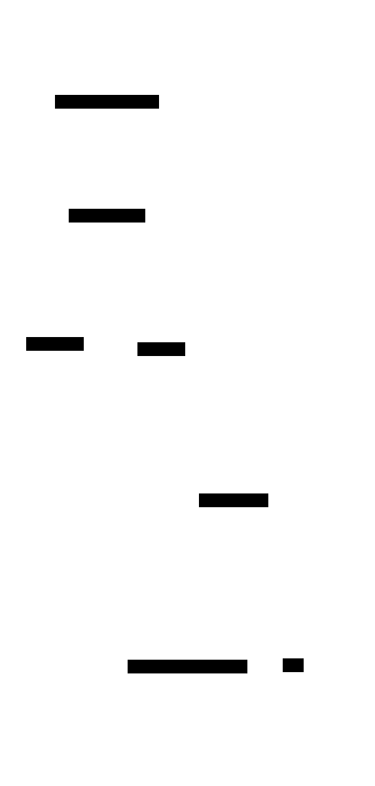
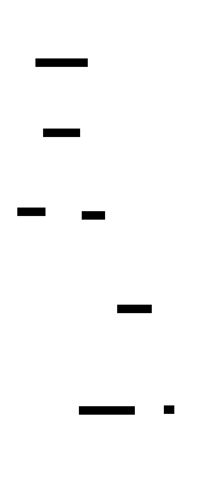

# d2 theme & font preview

Один и тот же исходник [`session-lifecycle.d2`](session-lifecycle.d2) во всех штатных темах d2, в двух режимах: **sketch** (hand-drawn) и **flat** (стандартная отрисовка). Используем для выбора финального стиля HATS-348.

Команда: `d2 [--sketch] --theme=<id> in.d2 out.svg`

> Текущий выбор для `session-lifecycle.svg` — **200 Dark Mauve + sketch**.

---

## Light themes

<table>
<tr><th>Theme</th><th>Sketch</th><th>Flat</th></tr>
<tr><td><b>0 — Neutral Default</b></td><td></td><td></td></tr>
<tr><td><b>1 — Neutral Grey</b></td><td></td><td></td></tr>
<tr><td><b>3 — Flagship Terrastruct</b></td><td></td><td></td></tr>
<tr><td><b>4 — Cool Classics</b></td><td></td><td></td></tr>
<tr><td><b>5 — Mixed Berry Blue</b></td><td></td><td></td></tr>
<tr><td><b>6 — Grape Soda</b></td><td></td><td></td></tr>
<tr><td><b>7 — Aubergine</b></td><td></td><td></td></tr>
<tr><td><b>8 — Colorblind Clear</b></td><td></td><td></td></tr>
<tr><td><b>100 — Vanilla Nitro Cola</b></td><td></td><td></td></tr>
<tr><td><b>101 — Orange Creamsicle</b></td><td></td><td></td></tr>
<tr><td><b>102 — Shirley Temple</b></td><td></td><td></td></tr>
<tr><td><b>103 — Earth Tones</b></td><td></td><td></td></tr>
<tr><td><b>104 — Everglade Green</b></td><td></td><td></td></tr>
<tr><td><b>105 — Buttered Toast</b></td><td></td><td></td></tr>
<tr><td><b>300 — Terminal</b></td><td></td><td></td></tr>
<tr><td><b>301 — Terminal Grayscale</b></td><td></td><td></td></tr>
<tr><td><b>302 — Origami</b></td><td></td><td></td></tr>
<tr><td><b>303 — C4</b></td><td></td><td></td></tr>
</table>

## Dark themes

<table>
<tr><th>Theme</th><th>Sketch</th><th>Flat</th></tr>
<tr><td><b>200 — Dark Mauve</b> (current)</td><td></td><td></td></tr>
<tr><td><b>201 — Dark Flagship Terrastruct</b></td><td></td><td></td></tr>
</table>

---

## Fonts

d2 не имеет «именованных» fonts типа dracula — это либо встроенный sketch font (рукописный, при `--sketch`), либо системный sans-serif (без флага). Кастомизация — TTF-файлами:

```bash
d2 --font-regular MyFont-Regular.ttf \
   --font-bold    MyFont-Bold.ttf \
   --font-italic  MyFont-Italic.ttf \
   --sketch --theme=200 \
   in.d2 out.svg
```

Полный список флагов: `d2 --help | grep font`. Шрифт можно зашить в SVG (default) или ссылаться внешне.

## Online preview

- **Playground (живая правка):** https://play.d2lang.com/
- **Гид по темам:** https://d2lang.com/tour/themes
- **Sketch mode:** https://d2lang.com/tour/sketch
- **Кастомные шрифты:** https://d2lang.com/tour/fonts
